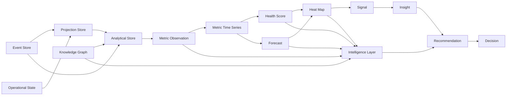

# Analytics Architecture - Enterprise Delivery Intelligence Platform (EDIP)

## 1. Objetivo da Analytics Architecture

A Analytics Architecture define como a EDIP transforma eventos, estados operacionais, projeções, evidências e relações de conhecimento em produtos analíticos governados, explicáveis e acionáveis.

A cadeia analítica conceitual da EDIP é:

```text
Events -> Metric Observations -> Time Series -> Health Scores -> Forecasts -> Heat Maps -> Signals -> Insights -> Recommendations -> Decisions
```

Analytics na EDIP não é reporting passivo. A camada analítica existe para apoiar decisão, investigação, priorização, escalonamento, governança, value realization, alert closure, case management e aprendizado organizacional.

Uma métrica, score, forecast, heat map ou recomendação só é aceitável quando preserva:

- owner;
- fórmula ou regra conceitual;
- fonte;
- lineage;
- confidence;
- evidência quando aplicável;
- caminho de drill-down e drill-up;
- uso decisório permitido;
- limitação conhecida.

A EDIP deve permitir que uma decisão executiva seja reconstruída a partir dos eventos, métricas, scores, forecasts, heat maps, sinais, recomendações, evidências e premissas que a sustentaram.

Esta arquitetura é conceitual e lógica. Ela não define código, SQL, DDL, pipelines físicos, infraestrutura cloud, tecnologia específica, dashboards finais, modelos estatísticos detalhados ou modelos proprietários de machine learning.

## 2. Analytics Principles

| Princípio | Definição | Implicação Arquitetural |
| --- | --- | --- |
| Metrics as Governed Data Products | Métricas são produtos de dados com owner, steward, fórmula, fonte, qualidade, uso e ciclo de vida. | Métrica sem owner, fórmula ou fonte confiável não entra em decisão crítica sem ressalva explícita. |
| Event-to-Metric Traceability | Toda observação analítica deve apontar eventos, estado operacional, projeção ou fonte que a originou. | Dashboards, Copilot e auditoria devem conseguir reconstruir a origem do valor apresentado. |
| Explainability First | Analytics deve explicar antes de recomendar. | Scores, forecasts, heat maps e recomendações devem expor componentes, drivers, premissas e limitações. |
| Decision Grade Metrics | Métricas usadas em decisão executiva exigem padrão superior de governança. | Devem possuir confidence alto ou ressalva formal, lineage suficiente e versão preservada. |
| Confidence Everywhere | Toda saída analítica deve expor confiança. | Confidence afeta visualização, uso decisório, recomendações, narrativas e respostas do Copilot. |
| Forecasts With Assumptions | Forecast é projeção explicável baseada em premissas, drivers, horizonte e cenário. | Forecast não pode ser apresentado como promessa ou compromisso operacional. |
| Heat Maps With Drill-Down | Heat maps são instrumentos de investigação, não apenas sinalização visual. | Cada célula deve permitir navegar até métricas, scores, eventos, owners e entidades causadoras. |
| Health Scores With Components | Health score é composto, decomponível e interpretável. | Score sem componentes, peso, threshold e fórmula aprovada não deve orientar decisão crítica. |
| No Metric Without Owner | Nenhuma métrica governável existe sem responsável. | Falta de owner gera lacuna de governança e reduz confidence. |
| No Score Without Formula | Nenhum score pode ser opaco. | Fórmula, pesos, thresholds, componentes e interpretação devem ser versionados. |
| No Forecast Without Scenario | Forecast deve declarar cenário. | Cenários mínimos: optimistic, likely, pessimistic e risk-adjusted quando aplicável. |
| No Recommendation Without Evidence | Recomendação deve apontar evidência, impacto e risco da inação. | Recomendação sem evidência vira hipótese não governada. |
| No Insight Without Lineage | Insight deve apontar cadeia de dados e eventos. | Insights sem lineage não devem sustentar decisão, auditoria ou closure de alerta/case. |
| Analytics Does Not Mutate Domain State | Engines analíticas não alteram estado transacional diretamente. | Engines publicam analytical events, signals, insights ou recommendation signals; services de domínio executam comandos. |

## 3. Analytics Layer Overview

A Analytics Layer é composta por engines lógicas. Engines processam dados, calculam métricas, detectam padrões, projetam tendências, produzem sinais e alimentam intelligence. Services continuam responsáveis por estado de domínio, comandos, autorização e lifecycle transacional.

| Engine | Responsabilidade | Inputs | Outputs | Consumidores | Eventos Consumidos | Eventos Publicados | Data Products Produzidos |
| --- | --- | --- | --- | --- | --- | --- | --- |
| Metrics Engine | Calcular observações métricas governadas, séries históricas, agregações e snapshots. | Eventos, Projection Store, estado operacional autorizado, MetricDefinition, Evidence, quality signals. | MetricObservation, MetricTimeSeries, metric snapshots, confidence, lineage. | Health Score Engine, Forecast Engine, Heat Map Engine, UX, Copilot, Governance. | Eventos de todos os domínios, EvidenceAttached, DataFreshnessBreached, SourceDivergenceDetected. | MetricObservationRecorded, MetricBecameStale, MetricConfidenceChanged. | MetricDataProduct, MetricTimeSeriesDataProduct. |
| Health Score Engine | Calcular scores compostos e decomponíveis por entidade, dimensão e período. | Métricas, eventos críticos, componentes, pesos, thresholds, rules, confidence. | HealthScore, score components, explanations, trend. | Heat Map Engine, Alert Intelligence, UX, Copilot, Governance. | MetricObservationRecorded, BottleneckDetected, ValueLeakageDetected, DataConfidenceDegraded. | HealthScoreCalculated, HealthScoreChanged, CapabilityHealthDegraded, DataConfidenceDegraded. | HealthScoreDataProduct. |
| Forecast Engine | Produzir projeções explicáveis por horizonte, cenário, premissa, driver e confidence. | Séries históricas, flow, capacity, aging, riscos, dependências, value, quality, assumptions. | Forecast, scenarios, drivers, assumptions, accuracy history. | Heat Map Engine, Value Intelligence, Portfolio, UX, Copilot. | MetricObservationRecorded, HealthScoreCalculated, CapacityChanged, ForecastAccuracyMeasured. | ForecastGenerated, ForecastUpdated, ForecastAccuracyDegraded, ForecastConfidenceChanged. | ForecastDataProduct. |
| Heat Map Engine | Agregar métricas, scores e forecasts em mapas de severidade por dimensão. | Scores, métricas, forecasts, thresholds, ownership, dimensions, confidence. | HeatMap, HeatMapCell, severity, drill paths. | Cockpits, workspaces, Copilot, Alert Intelligence, Case Intelligence. | HealthScoreCalculated, ForecastUpdated, BottleneckDetected, DataConfidenceDegraded. | HeatMapGenerated, HeatMapSeverityChanged. | HeatMapDataProduct. |
| Flow Intelligence Engine | Analisar o fluxo Need-to-Value, filas, esperas, gargalos, WIP e desperdícios. | Queue events, flow stage events, delivery events, blockers, capacity, economics. | Flow metrics, bottleneck signals, flow health drivers, queue analysis. | Delivery, PMO, Portfolio, Case, Alert, Copilot. | QueueEntered, QueueExited, WIPThresholdBreached, FeatureBlocked, DependencyRaised, BlockerCreated. | BottleneckDetected, QueueThresholdBreached, FlowHealthDegraded. | FlowIntelligenceDataProduct. |
| Bottleneck Detection Engine | Detectar restrições persistentes, recorrentes ou economicamente relevantes. | Queue time, wait time, WIP, throughput, blocked time, dependency aging, cost metrics. | Bottleneck candidates, bottleneck severity, recurring bottleneck patterns. | Flow Intelligence, Case Intelligence, Alert Intelligence, Recommendation Signal Engine. | QueueThresholdBreached, WIPThresholdBreached, DependencyRaised, BlockerCreated. | BottleneckDetected, BottleneckSeverityIncreased. | BottleneckDataProduct. |
| Case Intelligence Engine | Medir saúde, aging, SLA, evidência, recorrência, impacto e qualidade de closure de cases. | Case events, alerts, investigations, decisions, action plans, evidence, validations, learnings. | Case insights, case heat map, recurrence signals, escalation signals. | Case Cockpit, Governance, PMO, Copilot, Recommendation Signal Engine. | CaseCreated, CaseTriaged, CaseAssigned, CaseEvidenceAttached, CaseResolved, CaseClosed, CaseReopened, CaseSLAExceeded. | CaseSLAExceeded, CaseRecurrenceDetected, CaseClosureQualityDegraded. | CaseIntelligenceDataProduct. |
| Alert Intelligence Engine | Analisar detecção, deduplicação, severidade, aging, evidência, validação e elegibilidade de closure. | Alert events, alert conditions, actions, evidence, validations, metric thresholds. | Alert insights, closure eligibility, false closure signals, reopen candidates. | Alert Cockpit, Governance, Case Management, Copilot. | AlertDetected, AlertActionRegistered, AlertEvidenceAttached, AlertConditionValidated, AlertResolved, AlertReopened. | AlertFalseClosureDetected, AlertResolutionFailed, AlertRecurrenceDetected. | AlertIntelligenceDataProduct. |
| Value Intelligence Engine | Medir valor planejado, forecast, realizado, validado, rejeitado, leakage, ROI e value at risk. | Value cases, benefits, validations, portfolio, delivery, KPI, forecast, evidence. | Value insights, leakage signals, attribution confidence, value narrative inputs. | Executive Overview, Value Realization, Portfolio, Copilot. | ValueCaseCreated, BenefitObserved, BenefitValidated, BenefitRejected, ReleasePublished, KPIUpdated. | ValueLeakageDetected, ValueAtRiskIncreased, BenefitValidationRiskDetected. | ValueIntelligenceDataProduct. |
| Capability Intelligence Engine | Analisar Architecture Elevator, capability health, service risk, offer risk, debt e modernization. | Architecture events, assessments, debt, exceptions, product-offer composition, delivery, value. | Capability insights, service/offer risk, modernization signals, strategic impact. | Architecture Cockpit, Modernization Cockpit, Portfolio, Copilot. | CapabilityCreated, CapabilityUpdated, CapabilityRetired, ArchitectureDebtRegistered, ArchitectureExceptionExpired, ProductOfferAssociated. | CapabilityHealthDegraded, ArchitectureDebtCritical, ModernizationRiskIncreased. | CapabilityIntelligenceDataProduct. |
| Data Quality Engine | Calcular qualidade, confidence, freshness, consistency, lineage completeness e source divergence. | Source signals, event metadata, projections, metric calculation logs, lineage metadata. | Data confidence, quality scores, divergence signals, freshness status. | Todas as engines, Governance, UX, Copilot. | DataFreshnessBreached, SourceDivergenceDetected, CalculationErrorDetected, LineageUpdated. | DataConfidenceDegraded, DataQualityIssueDetected. | DataQualityDataProduct. |
| Semantic Layer Engine | Garantir consistência semântica de métricas, scores, forecasts, heat maps, narrativas e comparações. | Semantic definitions, MetricDefinition, ScoreDefinition, dimensions, units, approved formulas, lifecycle metadata. | SemanticMetricDefinition, approved dimensions, approved aggregations, semantic validation results. | Metrics, Health Score, Forecast, Heat Map, UX, Copilot, Narrative, Benchmark. | MetricDefinitionCreated, FormulaApproved, ThresholdChanged, OwnerChanged. | SemanticDefinitionApproved, SemanticDefinitionChanged, SemanticConsistencyIssueDetected. | SemanticMetricDefinitionDataProduct. |
| Benchmark Intelligence Engine | Comparar desempenho contra baselines internos, históricos, portfolios, produtos, capabilities, teams, services e offers. | Metric time series, health scores, semantic dimensions, comparison groups, baselines, confidence. | BenchmarkDataProduct, benchmark variance, benchmark trend, relative performance score. | Executive Cockpit, Portfolio Cockpit, Product Cockpit, Capability Cockpit, Copilot. | MetricObservationRecorded, HealthScoreCalculated, ForecastUpdated, SemanticDefinitionChanged. | BenchmarkCalculated, BenchmarkVarianceDetected, BenchmarkConfidenceChanged. | BenchmarkDataProduct. |
| Recommendation Signal Engine | Converter padrões analíticos em sinais de recomendação com ação, owner, evidência e risco da inação. | Insights, root causes, scores, forecasts, heat maps, policies, ownership, knowledge graph. | RecommendationSignal, action suggestion, urgency, evidence needs. | Intelligence Layer, Copilot, Decision Service, Case Management. | BottleneckDetected, CaseSLAExceeded, ValueLeakageDetected, CapabilityHealthDegraded, ForecastAccuracyDegraded. | RecommendationSignalGenerated. | RecommendationSignalDataProduct. |
| Analytics Governance Engine | Governar definições, fórmulas, versões, owners, thresholds, cenários, confidence e lifecycle analítico. | Metric definitions, score definitions, forecast definitions, heat map definitions, approvals. | Approved definitions, governance alerts, deprecation status, audit trails. | Metrics, Health Score, Forecast, Heat Map, Governance. | MetricDefinitionCreated, FormulaApproved, ThresholdChanged, OwnerChanged. | MetricGovernanceIssueDetected, FormulaVersionApproved, MetricDeprecated. | AnalyticsGovernanceDataProduct. |

## Analytics Semantic Layer

A Analytics Semantic Layer garante que toda métrica, score, forecast, heat map, benchmark, narrativa e resposta do Copilot utilize definições canônicas. Ela é a fonte oficial para definições de métricas, definições de scores, unidades, agregações, períodos, dimensões, comparabilidade e terminologia corporativa.

Sem camada semântica, a EDIP correria o risco de múltiplas versões da verdade: o mesmo indicador com fórmulas diferentes, períodos incompatíveis, dimensões divergentes ou narrativas que reinterpretam o significado original. A Semantic Layer evita esse risco ao centralizar significado, fórmula aprovada, unidades, dimensões e regras de agregação.

### Semantic Metric Definition

| Atributo | Definição |
| --- | --- |
| semanticMetricId | Identificador estável da definição semântica. |
| businessName | Nome de negócio aprovado e reutilizável em dashboards, narrativas e Copilot. |
| canonicalDefinition | Definição canônica, interpretação e limites de uso. |
| approvedFormula | Fórmula aprovada e versionada. |
| approvedDimensions | Dimensões permitidas para filtro, agrupamento e comparação. |
| approvedAggregations | Agregações permitidas, como soma, média, mediana, percentil, taxa ou composição. |
| approvedTimeGrains | Grãos temporais permitidos, como diário, semanal, mensal, ciclo, trimestre ou ano. |
| owner | Responsável pelo significado e uso decisório. |
| steward | Responsável por qualidade semântica, documentação e governança. |
| version | Versão da definição semântica. |
| lifecycle | Proposed, Approved, Active, Deprecated, Retired ou Superseded. |

### Semantic Layer Engine

| Responsabilidade | Explicação |
| --- | --- |
| Garantir consistência analítica | Valida se métricas, scores, forecasts, heat maps e benchmarks usam definições aprovadas. |
| Evitar múltiplas versões da verdade | Bloqueia ou sinaliza fórmulas, unidades, dimensões e agregações divergentes. |
| Alimentar dashboards | Fornece nomes, definições, unidades, dimensões e regras de comparação para UX. |
| Alimentar Copilot | Garante que respostas em linguagem natural usem terminologia e interpretação canônicas. |
| Alimentar narrativas | Impede que narrativas executivas reinterpretam métricas fora da definição aprovada. |
| Alimentar comparações | Define quando portfolios, produtos, capabilities, teams, services ou offers são comparáveis. |

Regras obrigatórias:

- nenhuma métrica pode existir fora da camada semântica;
- nenhuma fórmula pode divergir da definição semântica aprovada;
- nenhuma narrativa pode reinterpretar métricas;
- nenhuma comparação pode ignorar unidade, período, população, grain, baseline e dimensão aprovados;
- mudança semântica deve gerar versão, justificativa, impacto em consumidores e evento de governança.

## 4. Analytics Data Flow

O fluxo analítico combina fatos consumados, estado operacional autorizado, projeções reconstruíveis e relações do knowledge graph.



Eventos fornecem fatos imutáveis: criação, aprovação, bloqueio, conclusão, validação, decisão, evidência, alerta, case, score calculado, forecast gerado e outros fatos concluídos.

Estado operacional fornece o retrato corrente autorizado de entidades como initiative, feature, alert, case, capability, value case e decision. Esse estado não é substituído por analytics; ele é usado para contexto e escopo.

Projeções fornecem leituras reconstruíveis para consulta, agregação e cálculo. Projection Store não é fonte primária da verdade; deve preservar freshness, lineage e política de rebuild.

Knowledge graph fornece relações semânticas: supports, measures, impacts, causedBy, evidencedBy, validates, realizes, dependsOn, contains e outras relações necessárias para explanation, drill-up, drill-down e Copilot.

Analytics devolve para Intelligence métricas, scores, forecasts, heat maps, signals, insights e recommendation signals. Quando uma decisão ou ação é necessária, a alteração de estado ocorre apenas por comando aceito pelo service responsável.

## 5. Metric Data Products

MetricDataProduct é o produto analítico governado que representa uma métrica em seu ciclo de vida completo.

| Atributo | Definição |
| --- | --- |
| metricId | Identificador único e estável da métrica. |
| name | Nome de negócio claro e não ambíguo. |
| description | Definição semântica, escopo e interpretação. |
| owner | Responsável pelo significado, uso e decisão associada. |
| steward | Responsável por qualidade, documentação, lineage e governança operacional. |
| formula | Fórmula conceitual aprovada e compreensível sem implementação técnica. |
| unit | Unidade de medida, escala ou categoria. |
| periodicity | Frequência esperada de atualização ou observação. |
| grain | Granularidade mínima governada, como entidade, período, portfolio, product, capability ou flow stage. |
| source events | Eventos que alimentam direta ou indiretamente a métrica. |
| source entities | Entidades de domínio medidas ou usadas como contexto. |
| lineage | Cadeia de origem, transformação conceitual, projeção, cálculo e consumo. |
| confidence | Nível de confiança: alta, média, baixa ou desconhecida, com motivo. |
| freshness expectation | Janela máxima aceitável entre origem, projeção e disponibilidade. |
| quality rules | Regras de completude, consistência, validade, unicidade, frescor e reconciliação. |
| consumers | Dashboards, engines, Copilot, governance, APIs futuras e processos decisórios. |
| decision usage | Decisões suportadas e restrições de uso. |
| drill-down path | Caminho até entidades, eventos, owners e evidências causadoras. |
| sensitivity classification | Classificação de confidencialidade, risco, privacidade e finalidade. |
| lifecycle | Proposed, Approved, Active, Deprecated, Retired ou Superseded. |

### Classificação de Métricas

| Classe | Escopo | Exemplos |
| --- | --- | --- |
| Strategic Metrics | Estratégia, objetivos, OKRs, KRs, outcomes e KPIs. | Strategic Health Score, Strategic Alignment Coverage, OKR Achievement Forecast, KPI Target Deviation. |
| Portfolio Metrics | Funding, investimento, capacidade, dependência e risco de portfólio. | Portfolio Health Score, Funding Variance, Investment At Risk, Capacity Allocation Fit. |
| Discovery Metrics | Business discovery, product discovery, hipóteses e evidência inicial. | Discovery Quality Score, Discovery Rework Rate, Business Discovery Lead Time. |
| Requirements Metrics | Requisitos, critérios, revisão, aprovação e fila. | Requirements Health, Requirements Queue Time. |
| Solution Metrics | Solution design, reviews, approvals, riscos e evidências. | Solution Health, Solution Time, Review Time, Approval Time. |
| Delivery Metrics | Iniciativas, épicos, features, stories, releases e compromissos. | Lead Time, Cycle Time, Release Lead Time, Commitment Reliability. |
| Validation Metrics | Validações de aceite, outcome, benefício e valor. | Validation Health, Validation Time, Benefit Validation Time. |
| Value Metrics | Value cases, benefícios, ROI, leakage e valor em risco. | Planned Value, Forecast Value, Realized Benefit, Validated Benefit, Value Leakage, ROI. |
| Architecture Metrics | Architecture Elevator, dívida, exceções, modernização e rastreabilidade. | Capability Health Score, Service Health Score, Offer Health Score, Architecture Debt Score. |
| Governance Metrics | Decisões, gates, evidências, controles e exceções. | Decision Latency, Evidence Coverage, Control Adherence Rate, Governance Health Score. |
| Case Metrics | Volume, aging, SLA, evidência, ação, validação, recorrência e impacto. | Open Case Count, Case Aging, Case SLA Compliance, Case Value at Risk. |
| Alert Metrics | Aging, resolução, reabertura, evidência e validação. | Alert Aging, Alert Resolution Time, Alert Resolution Health. |
| Flow Metrics | Filas, espera, toque, WIP, bloqueio, gargalo e economia do fluxo. | Queue Time, Wait Time, Blocked Time, Flow Efficiency, Cost of Queue. |
| Data Quality Metrics | Qualidade, frescor, divergência, lineage e confidence. | Data Freshness, Source Divergence, Lineage Completeness, Data Confidence Score. |
| Intelligence Metrics | Explicabilidade, actionability, confiança de resposta e aprendizagem. | Recommendation Actionability, Search Result Explainability, Natural Language Answer Confidence. |

## 6. Health Score Architecture

HealthScore é um sinal composto de saúde, calculado para uma entidade ou dimensão, sempre decomponível em componentes explicáveis.

| Atributo | Definição |
| --- | --- |
| scoreId | Identificador do score e sua versão lógica. |
| scoreType | Tipo de score, como Portfolio Health, Capability Health ou Alert Resolution Health. |
| owner | Responsável por interpretação e ação. |
| purpose | Decisão ou investigação que o score suporta. |
| target entity | Entidade medida, como objetivo, portfolio, product, capability, case ou alert. |
| components | Componentes explicáveis que contribuem para o score. |
| weights | Pesos aprovados e versionados por componente. |
| thresholds | Faixas e limites de severidade. |
| formula | Fórmula conceitual, interpretação e limitações. |
| confidence | Confiança do score conforme dados, lineage e completude. |
| explanation | Texto ou estrutura que explica principais drivers. |
| lineage | Eventos, métricas, observações, fontes e projeções usadas. |
| drill-down | Caminho até componentes e entidades causadoras. |
| lifecycle | Proposed, Approved, Active, Deprecated, Retired ou Superseded. |
| recalculation trigger | Evento, mudança de métrica, threshold, owner, período ou demanda de refresh. |

### Health Scores Obrigatórios

| Health Score | Composição Conceitual | Uso Decisório |
| --- | --- | --- |
| Strategic Health Score | OKR progress, KPI trend, value realization, risk, traceability, decision latency. | Repriorizar objetivo, ajustar target, escalar decisão ou revisar investimento. |
| Portfolio Health Score | Alignment, expected value, capacity, dependencies, funding, flow health, forecast confidence, governance. | Rebalancear funding, capacidade e prioridade. |
| Product Health Score | Outcome progress, adoption, roadmap confidence, offer composition, delivery, value and risk. | Rever roadmap, composição de offers, adoção e hipótese de valor. |
| Discovery Health | Owner, evidence, hypothesis clarity, opportunity readiness, rework. | Evitar compromisso prematuro de capacidade. |
| Requirements Health | Traceability, completeness, criteria, review, approval, rejections, queue. | Corrigir requisitos antes de solution design. |
| Solution Health | Requirement coverage, completed reviews, approvals, evidence, risk, rejection. | Destravar solução, registrar exceção ou reduzir escopo. |
| Readiness Health | DoR, capacity, dependencies, risks, blockers, approval aging. | Impedir entrada em execução sem prontidão. |
| Delivery Health | Progress, milestones, blockers, commitment reliability, readiness and delivery risks. | Replanejar execução e remover impedimentos. |
| Validation Health | Criteria, evidence, acceptance, outcome validation and rejection. | Acelerar validação ou corrigir entrega. |
| Value Realization Health | Benefit validated, evidence, confidence, forecast accuracy, leakage and time to value. | Revisar value case, captura de benefício ou continuidade. |
| Capability Health Score | Coverage, traceability, modernization, service health, debt, exceptions, risk. | Priorizar modernização, remediação ou aceite formal de risco. |
| Service Health Score | Modernization, adoption, traceability, debt, exception and operational risk. | Mitigar risco de serviço ou racionalizar tecnologia. |
| Offer Health Score | Adoption, product traceability, service health, retirement risk and value support. | Rever composição de produto e plano de transição. |
| Architecture Debt Score | Severity, criticality, aging and impact on product, offer, capability and value. | Priorizar remediação ou registrar exceção governada. |
| Governance Health Score | Decision latency, approval aging, evidence coverage, control adherence, exception aging, alert resolution. | Escalar gates, controles e decisões críticas. |
| Case Governance Health | Owner, accountable, SLA, evidence, closure decision, escalation, audit trail. | Manter case crítico governado até closure válido. |
| Case Resolution Health | Action completion, validation success, evidence, learning, aging, reopen and recurrence. | Avaliar efetividade de resolução e recorrência sistêmica. |
| Alert Resolution Health | Action, evidence, validation of original condition, aging, resolution and reopening. | Impedir encerramento indevido de alerta. |
| Blocker Resolution Health | Blocked time, owner, severity, evidence, SLA and reopening. | Priorizar remoção de bloqueadores. |
| Data Confidence Score | Completeness, freshness, lineage, integration success, divergence and calculation errors. | Restringir uso decisório quando confidence é baixo. |
| Intelligence Health Score | Explainability, answer confidence, recommendation actionability, lineage and learning reuse. | Governar qualidade da inteligência e do Copilot. |

Health score não é julgamento final. Ele prioriza investigação e decisão. Mudança relevante deve gerar evento analítico, histórico, justificativa e explicação dos componentes que mudaram.

## 7. Forecast Architecture

Forecast é uma projeção explicável, versionada e governada. Forecast não é promessa; é leitura prospectiva baseada em dados, premissas, drivers, cenário e nível de confiança.

| Atributo | Definição |
| --- | --- |
| forecastId | Identificador único e versionado. |
| target entity | Entidade ou métrica projetada. |
| horizon | Janela temporal da projeção. |
| scenario | optimistic, likely, pessimistic ou risk-adjusted. |
| assumptions | Premissas explícitas usadas na projeção. |
| drivers | Fatores causadores ou explicativos. |
| confidence | Confiança prospectiva do forecast. |
| last updated | Data de atualização da versão. |
| version | Versão preservada para auditoria e comparação. |
| accuracy history | Histórico de aderência entre previsões anteriores e resultados observados. |
| decision usage | Decisões suportadas e restrições de uso. |
| evidence references | Evidências, séries, eventos e fontes usadas. |

### Forecasts Obrigatórios

| Forecast | Alvo | Drivers Conceituais | Uso Decisório |
| --- | --- | --- | --- |
| OKR Achievement Forecast | OKR e Key Results. | Progresso, KPI trends, iniciativas associadas, riscos, value realization. | Ajustar prioridade, investimento ou target. |
| KPI Forecast | KPI. | Série histórica, target, eventos de produto, releases, qualidade de dados. | Antecipar desvio e acionar owner. |
| Portfolio Delivery Forecast | Portfolio, investimento e conjunto de iniciativas. | Capacity, WIP, dependencies, bottlenecks, funding, risks. | Rebalancear portfólio. |
| Initiative Completion Forecast | Initiative. | Feature progress, blockers, flow health, dependencies, scope stability. | Replanejar iniciativa. |
| Feature Completion Forecast | Feature. | Cycle time, blocked time, readiness, owner load, dependencies. | Ajustar compromisso e remover bloqueios. |
| Release Forecast | Release. | Feature readiness, validation, defects, dependency risk, capacity. | Decidir release, descopo ou adiamento. |
| Value Realization Forecast | ValueCase e Outcome. | Release evidence, adoption, KPI trend, benefit observation, validation confidence. | Revisar value case e plano de captura. |
| Benefit Forecast | BenefitHypothesis ou RealizedBenefit esperado. | Baseline, target, adoption, finance signal, evidence quality. | Antecipar variação de benefício. |
| Capacity Forecast | Team, squad, portfolio ou flow stage. | Demand, WIP, throughput, queue time, availability. | Rebalancear capacidade. |
| Dependency Risk Forecast | Dependency. | Aging, owner, criticality, recurrence, impacted value. | Escalar dependência. |
| Case Resolution Forecast | Case. | Severity, SLA, actions, evidence, validations, recurrence, owner load. | Escalar case e ajustar plano. |
| Alert Resolution Forecast | Alert. | Aging, owner, action, evidence, validation, recurrence. | Impedir falso closure e priorizar tratamento. |
| Capability Modernization Forecast | Capability ou ModernizationPlan. | Debt, exceptions, service modernization, initiatives, funding. | Priorizar modernização. |
| Architecture Debt Remediation Forecast | ArchitectureDebt. | Severity, owner, remediation plan, dependency, impact, capacity. | Planejar remediação ou aceite de risco. |

Forecasts devem preservar cenários optimistic, likely, pessimistic e risk-adjusted quando aplicável. A ausência de cenário reduz confidence e impede uso como evidência isolada em decisão crítica.

## 8. Heat Map Architecture

HeatMap é uma projeção analítica por dimensão, célula, severidade e confidence. Cada célula deve ser investigável.

| Atributo | Definição |
| --- | --- |
| dimensão | Eixo analítico principal: flow, value, risk, governance, architecture, data quality, case ou alert. |
| célula | Unidade de análise: portfolio, initiative, capability, case, alert, owner, flow stage, product ou value case. |
| métrica base | Métrica que sustenta a célula. |
| score base | Score que consolida severidade ou saúde. |
| threshold | Limite governado que define severidade. |
| severity | Low, Medium, High, Critical ou escala equivalente. |
| confidence | Confiança da célula e motivos de redução. |
| drill-down | Navegação até eventos, entidades, owners, métricas e evidências causadoras. |
| drill-up | Navegação para objetivo, portfolio, product, capability, value case ou enterprise. |
| owner | Responsável por ação. |
| action recommendation | Ação sugerida, evidência necessária e risco da inação. |

### Heat Maps Obrigatórios

| Heat Map | Dimensão | Célula | Base Analítica | Ação Suportada |
| --- | --- | --- | --- | --- |
| Portfolio Heat Map | Portfolio, funding, capacity, risk and value. | Portfolio, investment, initiative, dependency. | Portfolio Health, Flow Health, Cost of Queue, Capacity Forecast Risk. | Rebalancear capacidade, funding e prioridade. |
| Business Discovery Heat Map | Need, pain, journey and process. | Business need, pain point, owner, process. | Business Discovery Health, Evidence Coverage, Lead Time. | Qualificar necessidade ou descartar demanda sem evidência. |
| Requirements Heat Map | Requirements quality and queue. | Requirement, reviewer, owner, initiative. | Requirements Health, Queue Time, Review Time. | Corrigir requisito e destravar revisão. |
| Solution Heat Map | Solution design, reviews and approvals. | Solution design, review, approver, capability. | Solution Health, Review Time, Approval Time. | Resolver pendência, exceção ou escopo. |
| Architecture Heat Map | Architecture risk, debt and exception. | Capability, service, offer, application service. | Architecture Debt Score, Exception Rate, Capability Health. | Priorizar remediação ou aceite formal. |
| Capability Heat Map | Architecture Elevator and strategic support. | Domain, subdomain, business layer, capability. | Capability Health, Coverage, Traceability Health. | Corrigir rastreabilidade e modernização. |
| Delivery Heat Map | Execution flow and commitment. | Initiative, epic, feature, release. | Delivery Health, Lead Time, Blocked Time, Forecast Accuracy. | Remover bloqueio e replanejar entrega. |
| Validation Heat Map | Validation and acceptance. | Validation, criterion, outcome, value case. | Validation Health, Validation Time, Evidence Coverage. | Completar validação e evidência. |
| Value Realization Heat Map | Value capture and leakage. | Outcome, value case, benefit, product. | Value Realization Health, Benefit Variance, Value Leakage. | Rever value case, atribuição ou captura de benefício. |
| Alert Heat Map | Alert treatment. | Alert, condition, owner, action. | Alert Resolution Health, Alert Aging, Evidence Coverage. | Manter aberto até ação, evidência e validação. |
| Blocker Heat Map | Blocker resolution. | Blocker, owner, cause, affected entity. | Blocker Resolution Health, Blocked Time, Bottleneck Severity. | Escalar e remover impedimento. |
| Case Heat Map | Case governance and impact. | Case, type, owner, affected entity, value case. | Case Governance Health, Case Resolution Health, Case Value at Risk. | Priorizar case crítico e closure governado. |
| Data Quality Heat Map | Quality and confidence. | Source, metric, projection, dashboard. | Data Confidence Score, Freshness, Divergence, Lineage Completeness. | Corrigir fonte ou restringir decisão. |
| Governance Heat Map | Decisions, controls, evidence and exceptions. | Decision, gate, control, exception, owner. | Governance Health, Decision Latency, Evidence Coverage. | Escalar decisão e regularizar evidência. |

## 9. Flow Intelligence Architecture

Flow Intelligence mede o fluxo Need-to-Value:

```text
Business Need -> Pain Point -> Journey -> Process -> Discovery -> Hypothesis -> Opportunity -> Requirement -> Solution Design -> Readiness -> Feature -> Story -> Validation -> Outcome -> Value Case -> Value Realization
```

### Métricas de Flow

| Métrica | Definição Conceitual |
| --- | --- |
| Lead Time | Tempo total entre entrada no fluxo e conclusão da etapa ou entrega. |
| Cycle Time | Tempo ativo de execução em uma etapa ou item. |
| Queue Time | Tempo aguardando início, revisão, aprovação, owner ou capacidade. |
| Wait Time | Tempo parado sem avanço por dependência, decisão, disponibilidade ou handoff. |
| Blocked Time | Tempo com blocker formal ativo. |
| Review Time | Tempo entre solicitação e conclusão de review. |
| Approval Time | Tempo entre solicitação e decisão de aprovação ou rejeição. |
| Discovery Time | Tempo de discovery até conclusão, descarte ou avanço. |
| Solution Time | Tempo de solution design até aprovação, rejeição ou retorno. |
| Readiness Time | Tempo de assessment até readiness aprovado ou rejeitado. |
| Validation Time | Tempo de validação até aceite, rejeição ou retorno. |
| Value Realization Time | Tempo entre entrega/release e benefício observado ou validado. |
| Flow Efficiency | Touch time dividido por lead time, com interpretação por contexto. |
| WIP by Flow Stage | Quantidade de itens ativos por estágio do fluxo. |
| Bottleneck Severity | Severidade de restrição ponderada por duração, impacto, recorrência e escopo. |
| Cost of Queue | Custo econômico ou estratégico de itens aguardando em fila. |
| Cost of Bottleneck | Custo causado por restrição persistente ou recorrente. |
| Cost of Delay | Valor ou impacto perdido por atraso. |

### Detecção de Problemas de Fluxo

| Padrão | Critério Conceitual | Sinal |
| --- | --- | --- |
| Gargalos | Queue time, blocked time, WIP, throughput ou dependency aging deterioram de forma persistente. | BottleneckDetected ou BottleneckSeverityIncreased. |
| Filas envelhecidas | Itens excedem threshold de idade por estágio, owner ou severidade. | QueueThresholdBreached. |
| WIP excessivo | Volume ativo excede capacidade ou limite governado por stage. | WIPThresholdBreached. |
| Dependências recorrentes | Dependência se repete por owner, capability, service, team ou portfolio. | RecurringDependencySignal. |
| Handoffs ineficientes | Wait time elevado entre etapas, com owner ou próximo evento ausente. | HandoffInefficiencyDetected. |
| Reviews lentos | Review time excede SLA por especialidade ou reviewer. | ReviewAgingBreached. |
| Approvals vencidos | Approval time ou decision latency excede SLA ou impacto econômico. | ApprovalAgingBreached ou DecisionLatencyCritical. |

Flow Intelligence deve sempre indicar etapa parada, owner esperado, aging, próximo evento necessário, evidência ausente e impacto estratégico ou econômico.

## 10. Case Intelligence Architecture

Case Intelligence mede a capacidade da organização de coordenar problemas corporativos que envolvem alertas, investigações, decisões, planos de ação, evidências, validações e aprendizados.

Case agrupa:

- alerts;
- investigations;
- decisions;
- action plans;
- evidence;
- validations;
- learnings;
- affected entities;
- root causes;
- recommendations.

### Métricas de Case

| Métrica | Definição |
| --- | --- |
| Open Case Count | Quantidade de cases abertos por tipo, severidade, owner e escopo. |
| Critical Case Count | Quantidade de cases críticos ou regulatory critical. |
| Case Aging | Tempo desde abertura ou última transição relevante. |
| Case SLA Compliance | Aderência a SLA por tipo, severidade e valor em risco. |
| Case Resolution Time | Tempo até resolução conforme critérios definidos. |
| Case Reopen Rate | Percentual de cases reabertos por retorno de condição, evidência invalidada ou validação falha. |
| Case Evidence Coverage | Cobertura de evidência esperada para resolução ou closure. |
| Case Action Completion Rate | Percentual de ações concluídas no prazo. |
| Case Validation Success Rate | Percentual de validações favoráveis. |
| Case Recurrence Rate | Recorrência por causa, tipo, owner, capability ou entidade afetada. |
| Case Business Impact | Impacto de negócio ponderado por severidade, criticidade e duração. |
| Case Value at Risk | Valor em risco associado a cases abertos. |
| Case Governance Health | Saúde de owner, accountable, SLA, evidência, closure decision e audit trail. |
| Case Resolution Health | Efetividade de ação, evidência, validação, learning, aging e recorrência. |

### Capacidades Analíticas de Case

| Capacidade | Definição | Uso |
| --- | --- | --- |
| Case Heat Map | Mapa por tipo, owner, entidade afetada, severidade, valor em risco e aging. | Priorizar cases críticos e escalonamento. |
| Case Timeline Analytics | Reconstrói eventos, decisões, ações, evidências, validações e reaberturas. | Explicar por que o case continua aberto ou foi reaberto. |
| Case Recurrence Analytics | Detecta padrões por causa, owner, capability, portfolio, product ou control. | Abrir investigação sistêmica e consolidar learning. |
| Case Similarity Signals | Identifica cases semelhantes por causa, sintomas, entidades e evidências. | Reutilizar aprendizado e acelerar resolução. |
| Case Escalation Signals | Identifica SLA excedido, valor em risco, owner sobrecarregado ou decisão bloqueante. | Escalar para PMO, governance ou executivo. |
| Case Closure Quality | Avalia owner, closure criteria, evidence, decision, validation and learning. | Impedir closure frágil ou não auditável. |

### Relação com Investigation e Closure

Case Intelligence deve preservar a cadeia:

```text
Case -> Investigation -> Evidence -> Root Cause -> Recommendation -> Decision -> Validation -> Learning
```

Analytics auxilia closure de cases ao verificar se o case possui owner, accountable, closure criteria, evidência suficiente, decisão de closure quando aplicável, validação da condição original e learning capturado. Para cases críticos, Case Closure Quality deve considerar Investigation Health, Evidence Confidence, Root Cause classification, Recommendation actionability e Validation Success antes de permitir que o closure seja tratado como efetivo em métricas executivas.

## 11. Alert Intelligence Architecture

Alert Intelligence mede e governa o ciclo:

```text
Alert -> AlertCondition -> AlertAction -> AlertEvidence -> AlertValidation -> AlertResolution
```

### Métricas de Alertas

| Métrica | Definição |
| --- | --- |
| Alert Aging | Tempo desde detecção até resolução válida. |
| Alert Resolution Time | Tempo entre alerta detectado e AlertResolution válido. |
| Alert Reopen Rate | Percentual de alertas reabertos por retorno de condição ou evidência insuficiente. |
| Alert Evidence Coverage | Cobertura de evidência necessária para tratamento e closure. |
| Alert Validation Success Rate | Percentual de validações que confirmam remoção, mitigação ou aceite formal. |
| Alert False Closure Rate | Percentual de alertas encerrados sem condição original resolvida ou evidência válida. |
| Alert Recurrence Rate | Recorrência por condição, owner, entidade, métrica ou causa. |
| Alert Owner Load | Carga de alertas por owner, severidade e prazo. |
| Alert SLA Compliance | Aderência a SLA de tratamento por tipo e severidade. |

### Funções Analíticas

| Função | Definição |
| --- | --- |
| Detecção | Identifica thresholds, tendências, eventos críticos ou padrões que exigem ação. |
| Deduplicação | Agrupa alertas equivalentes por condição, entidade, causa e janela temporal. |
| Severidade | Classifica impacto por criticidade, valor em risco, risco regulatório, aging e escopo. |
| Priorização | Ordena tratamento por severidade, valor, SLA, confidence e risco da inação. |
| Aging | Expõe tempo aberto, etapa parada e owner responsável. |
| Action Tracking | Verifica se ação existe, está atrasada ou é insuficiente. |
| Evidence Validation | Confere se evidência sustenta ação, mitigação ou decisão formal. |
| Closure Eligibility | Determina se resolução é elegível conforme ação, evidência e validação da condição original. |
| Reabertura | Detecta retorno da condição, evidência invalidada ou validação falha. |

Alerta crítico não pode ser encerrado apenas por comentário, mudança manual de status ou ausência temporária de dado.

## 12. Value Intelligence Architecture

Value Intelligence mede a cadeia:

```text
Value Case -> Planned Value -> Forecast Value -> Observed Benefit -> Validated Benefit -> Rejected Benefit -> Value Realization
```

### Métricas de Valor

| Métrica | Definição |
| --- | --- |
| Planned Value | Valor esperado declarado no value case. |
| Forecast Value | Valor projetado por cenário e confiança. |
| Realized Benefit | Benefício medido em período com evidência associada. |
| Validated Benefit | Benefício validado por autoridade definida. |
| Rejected Benefit | Benefício rejeitado por falta de evidência, método inválido ou resultado insuficiente. |
| Benefit Variance | Diferença entre planejado, forecast e validado. |
| Value Leakage | Valor esperado não capturado por atraso, baixa adoção, escopo, rejeição ou hipótese inválida. |
| ROI | Relação entre benefício validado e investimento associado. |
| Cost of Delay | Valor perdido ou impacto causado por atraso. |
| Cost of Queue | Valor exposto por espera em fila. |
| Cost of Bottleneck | Valor afetado por restrição persistente. |
| Value at Risk | Valor exposto por risco, atraso, case, alerta, debt ou dependency. |
| Benefit Validation Time | Tempo entre observação e validação ou rejeição do benefício. |

### Capacidades de Valor

| Capacidade | Definição |
| --- | --- |
| Value Forecast | Projeta valor por horizonte, cenário, drivers, evidence confidence e adoption. |
| Benefit Validation | Verifica método, evidência, fonte, período, validador e regra de atribuição. |
| Value Leakage Detection | Detecta desvio material entre planejado, forecast, observado e validado. |
| Attribution Confidence | Mede confiança de que benefício pode ser atribuído a iniciativa, produto, release ou outcome. |
| Value Realization Timeline | Reconstrói eventos de value case, delivery, release, outcome, benefício, validação e decisão. |
| Value Narrative | Produz explicação executiva de hipótese, baseline, target, realizado, validado, rejeitado e leakage. |

## 13. Capability and Architecture Intelligence

Capability and Architecture Intelligence aplica analytics ao Architecture Elevator:

```text
Domain -> SubDomain -> BusinessLayer -> Capability -> BusinessService / TechnologyService -> Offer -> ApplicationService
```

Product continua sendo composição flexível de offers. Product não é capability, service ou offer.

### Métricas de Architecture Elevator

| Métrica | Definição |
| --- | --- |
| Capability Health Score | Saúde de capability por criticidade, rastreabilidade, dívida, modernização, risco e valor. |
| Capability Coverage | Cobertura de capabilities com owner, propósito e criticidade. |
| Capability Traceability Health | Integridade de vínculos com objetivos, produtos, iniciativas, KPIs e value cases. |
| Service Health Score | Saúde de BusinessService ou TechnologyService. |
| Offer Health Score | Saúde de offer por adoção, services, produtos, risco e valor. |
| Offer Adoption Score | Adoção da offer por produtos e valor associado. |
| Architecture Debt Score | Severidade e exposição da dívida arquitetural. |
| Architecture Exception Rate | Frequência, aging e criticidade de exceções. |
| Capability Modernization Score | Progresso e efetividade da modernização. |
| Technology Rationalization Score | Aderência a padrões, redução de redundância e exposição a legado. |
| Product-Offer Composition Health | Saúde da composição de produto por offers, services, valor, risco e rastreabilidade. |

### Inteligência Arquitetural

| Sinal | Explicação |
| --- | --- |
| Capability degradation | Capability crítica degrada por dívida, exceção, baixa cobertura, serviço frágil ou impacto em valor. |
| Service risk | Service possui dívida, modernization delay, baixa rastreabilidade ou exposição operacional. |
| Offer risk | Offer tem baixa adoção, retirement risk, service health degradado ou impacto em produto. |
| Modernization risk | Modernização atrasada ameaça capability, product, portfolio ou value case. |
| Debt impact | Dívida afeta iniciativa, release, KPI, value case ou risco regulatório. |
| Product impact | Mudança de capability, service ou offer afeta composição, roadmap, outcome ou valor. |
| Strategic impact | Lacuna de capability afeta objetivo, portfolio, funding ou realização de valor. |

## 14. Data Quality and Confidence Architecture

Data Quality and Confidence Architecture define como qualidade e confiança impactam toda saída analítica.

| Métrica | Definição |
| --- | --- |
| completeness | Presença dos campos, relações, owners e evidências necessários. |
| freshness | Atualidade frente à periodicidade esperada. |
| consistency | Coerência entre fontes, projeções, relações e regras. |
| accuracy | Aderência do dado ao fato governado ou fonte autorizada. |
| timeliness | Disponibilidade no tempo necessário para decisão. |
| uniqueness | Ausência de duplicidade indevida de eventos, entidades ou observações. |
| validity | Conformidade com formato, domínio de valores e regra semântica. |
| lineage completeness | Completude da cadeia de origem, transformação e consumo. |
| data confidence | Score composto de confiança. |
| source divergence | Divergência entre fonte, estado operacional, projeção e métrica. |
| mapping confidence | Confiança do mapeamento externo para canônico. |

Baixa confiança deve impactar:

- dashboards, com marcação explícita e restrição de interpretação;
- forecasts, reduzindo confidence e exigindo premissas de qualidade;
- heat maps, marcando células como baixa confiança;
- recommendations, reduzindo urgência automatizada ou exigindo validação humana;
- Copilot answers, declarando limitações e evitando afirmações categóricas;
- executive decisions, exigindo ressalva formal ou suspensão de uso decisório quando crítico.

## 15. Recommendation Signal Architecture

RecommendationSignal é um sinal analítico estruturado que sugere ação, owner, evidência necessária e risco da inação. Ele não executa a decisão.

| Sinal de Origem | Condição | Dados Necessários | Confidence | Owner Sugerido | Ação Recomendada | Risco da Inação | Evidência Necessária |
| --- | --- | --- | --- | --- | --- | --- | --- |
| BottleneckDetected | Queue time, WIP, blocked time ou throughput indicam restrição persistente. | Flow metrics, queue history, impacted work, owner, value at risk. | Conforme freshness, lineage e estabilidade do padrão. | Flow Owner, Scrum Master, PMO. | Rebalancear capacidade, limitar WIP ou resolver dependência. | Atraso, cost of delay e degradação de portfolio. | Queue history, impacted entities, blocker/dependency evidence. |
| CaseSLAExceeded | Case excede SLA por tipo, severidade ou valor em risco. | Case timeline, SLA, actions, evidence, owner, value at risk. | Alta se timeline e SLA estão completos. | Case Owner, PMO, Governance. | Escalar case e atualizar plano de ação. | Risco operacional, perda de valor e falha de auditabilidade. | Ações abertas, decisão pendente, evidência de impedimento. |
| CapabilityHealthDegraded | Capability crítica cruza threshold negativo. | Capability score, debt, exceptions, affected products, value cases. | Média/alta conforme coverage e lineage. | Capability Owner, Arquiteto Corporativo. | Abrir investigation ou modernization plan. | Impacto em produto, delivery, valor e estratégia. | Assessment, debt record, exception, affected product map. |
| ValueLeakageDetected | Benefício planejado ou forecast não é capturado materialmente. | Value case, benefits, KPI, forecast, adoption, validation. | Conforme attribution confidence. | Sponsor de valor, Product Manager. | Revisar hipótese, adoção, escopo ou continuidade. | Perda econômica e investimento subperforming. | Baseline, target, benefit evidence, validation. |
| ForecastAccuracyDegraded | Forecasts anteriores divergem materialmente de resultados observados. | Forecast versions, actuals, drivers, data quality. | Alta quando versões e resultados são completos. | Forecast Owner, Analytics Steward. | Revisar premissas, drivers e confiança de dados. | Decisões futuras baseadas em projeções frágeis. | Accuracy history, assumption changes, source quality evidence. |
| AlertFalseClosureDetected | Alerta foi encerrado sem ação, evidência ou validação da condição original. | Alert condition, action, evidence, validation, recurrence. | Alta se cadeia de closure está incompleta. | Alert Owner, PMO, Governance. | Reabrir alerta ou revisar evidência. | Condição crítica permanece sem tratamento. | AlertCondition, action log, validation result, evidence. |

Todo recommendation signal deve declarar condição, dados necessários, confidence, owner sugerido, ação recomendada, risco da inação e evidência necessária.

## 16. Analytics Governance

Analytics Governance define ownership, aprovação, ciclo de vida e auditabilidade de produtos analíticos.

| Papel | Responsabilidade |
| --- | --- |
| metric owner | Define significado, interpretação, uso decisório e accountability da métrica. |
| score owner | Aprova componentes, pesos, thresholds e ações esperadas. |
| forecast owner | Aprova horizonte, cenário, premissas, drivers e uso permitido. |
| heat map owner | Define dimensão, célula, severidade, actionability e drill paths. |
| analytics steward | Mantém documentação, lineage, qualidade, lifecycle e compliance analítico. |
| data product owner | Responde pelo produto analítico como ativo governado. |

### Governança Obrigatória

| Tema | Regra |
| --- | --- |
| formula approval | Fórmula conceitual deve ser aprovada antes de uso executivo. |
| metric lifecycle | Métrica passa por Proposed, Approved, Active, Deprecated, Retired ou Superseded. |
| metric deprecation | Depreciação exige replacement, impacto em consumidores e data de retirada. |
| formula versioning | Alteração de fórmula preserva versão, data, justificativa e impacto histórico. |
| threshold governance | Thresholds críticos exigem owner, rationale, versão e revisão periódica. |
| scenario governance | Cenários de forecast devem ter definição, premissas e uso permitido. |
| confidence governance | Confidence deve ser calculada, explicada e considerada no consumo. |
| auditability | Métricas, scores, forecasts e heat maps usados em comitê devem preservar snapshot decisório. |

### Processo de Aprovação

1. Proposta registra objetivo, owner, steward, fórmula, fonte, grain, periodicidade e consumidores.
2. Steward valida lineage, source events, source entities, quality rules e sensitivity.
3. Owner aprova interpretação, uso decisório, thresholds e drill paths.
4. Governance valida segregação, evidência, auditabilidade e impacto em dashboards.
5. Produto analítico entra como Active com versão inicial.
6. Revisões futuras preservam histórico, motivo, impacto e consumidores afetados.

## 17. Analytics Explainability

Toda análise deve permitir navegação explicável:

```text
Metric -> Formula -> Source Events -> Source Entities -> Observations -> Score Components -> Forecast Assumptions -> Heat Map Cell -> Insight -> Recommendation -> Decision
```

### Componentes de Explainability

| Componente | Requisito |
| --- | --- |
| causalidade | Distinguir causa direta, fator contribuinte, dependência e consequência. |
| correlação | Indicar relação estatística ou temporal sem declarar causalidade indevida. |
| inferência | Declarar quando conclusão depende de regra, threshold, heurística ou hipótese. |
| confidence | Expor nível de confiança e motivos de redução. |
| limitations | Explicitar dados ausentes, fontes parciais, baixa qualidade ou limitação de cenário. |
| evidence | Apontar evidências que sustentam status, decisão, valor, alerta ou closure. |
| lineage | Preservar origem, transformação, versão, cálculo e consumo. |

Explicabilidade deve ser consumível por UX, Copilot, auditoria, governance, case management e comitês executivos.

## 18. Analytics to UX Mapping

| UX | Métricas | Scores | Forecasts | Heat Maps | Signals | Recommendations |
| --- | --- | --- | --- | --- | --- | --- |
| Persona Landing Pages | Métricas críticas da persona e exceções. | Scores dominantes por responsabilidade. | Forecasts relevantes ao papel. | Heat maps resumidos. | Alertas, cases, blockers e decisions. | Próximas ações por owner e impacto. |
| Cockpits | Métricas executivas, táticas ou operacionais. | Strategic, Portfolio, Governance, Capability, Value. | OKR, KPI, delivery, capacity, value. | Portfolio, Governance, Capability, Value. | Severidade, aging, confidence. | Escalar, repriorizar, revisar premissa. |
| Workspaces | Métricas do escopo de trabalho. | Initiative, Delivery, Requirements, Solution, Readiness. | Initiative, feature, release. | Delivery, Readiness, Requirements. | Blocker, queue, review, approval. | Remover impedimento, corrigir requisito, completar evidência. |
| Entity Workspaces | Série histórica e métricas da entidade. | Score da entidade e componentes. | Forecasts da entidade. | Células onde a entidade aparece. | Eventos relevantes e anomalias. | Ações por owner. |
| Case Workspace | Case aging, SLA, evidence, actions, validation. | Case Governance Health, Case Resolution Health. | Case Resolution Forecast. | Case Heat Map. | Recurrence, escalation, closure quality. | Escalar, exigir evidência, reabrir, consolidar learning. |
| Alert Cockpit | Alert aging, resolution time, evidence coverage. | Alert Resolution Health. | Alert Resolution Forecast. | Alert Heat Map. | False closure, recurrence, owner load. | Registrar ação, anexar evidência, validar condição. |
| Heat Maps | Métricas base por célula. | Scores base e componentes. | Forecasts que alteram severidade. | Mapas por dimensão. | Severity changes. | Ação recomendada por célula. |
| Timelines | Métricas em snapshots temporais. | Evolução de score. | Versões de forecast. | Mudanças de severidade. | Eventos correlacionados. | Decisões sugeridas em cada ponto. |
| Comparative Analysis | Métricas comparáveis por período, escopo e população. | Scores normalizados e limitações. | Accuracy e cenários. | Comparação de heat maps. | Outliers e divergências. | Revisar comparação injusta ou ajustar baseline. |
| Investigation Workspace | Métricas causadoras e evidências. | Score components. | Assumptions and drivers. | Células afetadas. | Root cause candidates. | Próxima investigação ou decisão. |
| Narrative Workspace | Métricas selecionadas e snapshot. | Scores citados com explicação. | Forecasts e cenários. | Heat maps como contexto. | Insights e signals. | Recomendação, impacto e risco da inação. |
| Copilot Experience | Métricas com lineage e confidence. | Scores decomponíveis. | Forecasts com premissas. | Heat map cells investigáveis. | Signals e causal chains. | Resposta com evidência, owner e ação. |

## 19. Analytics Events

| Evento | Origem | Payload Conceitual | Consumidores | Métricas Afetadas | Inteligência Afetada |
| --- | --- | --- | --- | --- | --- |
| MetricObservationRecorded | Metrics Engine | metricId, targetEntity, period, value, confidence, lineage, sourceEvents. | Health Score, Forecast, UX, Copilot. | Todas conforme metricId. | Metric explanation, time series. |
| HealthScoreCalculated | Health Score Engine | scoreId, scoreType, targetEntity, value, components, confidence, version. | Heat Map, Alert, UX, Copilot. | Score metrics. | Score explanation, health trends. |
| ForecastGenerated | Forecast Engine | forecastId, targetEntity, horizon, scenario, assumptions, drivers, confidence. | Heat Map, UX, Copilot, Governance. | Forecast confidence, forecast metrics. | Forecast narratives. |
| ForecastUpdated | Forecast Engine | forecastId, previousVersion, newVersion, driver changes, confidence change. | Portfolio, Value, Heat Map, Copilot. | Forecast accuracy/confidence. | Trend and scenario explanation. |
| ForecastAccuracyDegraded | Forecast Engine | forecastId, targetEntity, accuracy delta, affected decisions, causes. | Governance, Recommendation, Copilot. | Forecast Accuracy metrics. | Premise review recommendation. |
| HeatMapGenerated | Heat Map Engine | heatMapId, dimension, period, cells, severity, confidence. | UX, Copilot, Governance. | Heat map base metrics. | Investigation and prioritization. |
| BottleneckDetected | Bottleneck Detection Engine | bottleneckId, scope, stage, severity, drivers, affectedEntities, valueAtRisk. | Flow, Alert, Case, Recommendation. | Bottleneck Severity, Queue Time, Cost of Bottleneck. | FlowInsight, recommendation. |
| QueueThresholdBreached | Flow Intelligence Engine | queueId, stage, age, volume, threshold, owner, affectedEntities. | Alert, Case, UX. | Queue Time, WIP by Flow Stage. | QueueInsight. |
| CaseSLAExceeded | Case Intelligence Engine or Case Management Service | caseId, type, severity, SLA, aging, valueAtRisk, owner. | Case Cockpit, Governance, Recommendation. | Case SLA Compliance, Case Aging. | Case escalation insight. |
| CaseReopened | Case Management Service | caseId, previousClosureId, reason, triggeringEventId, owner. | Case Intelligence, Governance, Copilot. | Case Reopen Rate, Case Resolution Health. | Recurrence and closure quality. |
| AlertFalseClosureDetected | Alert Intelligence Engine | alertId, missingAction, missingEvidence, validationFailure, conditionStatus. | Alert Service, Governance, Case, Recommendation. | Alert False Closure Rate, Alert Resolution Health. | AlertResolutionInsight. |
| ValueLeakageDetected | Value Intelligence Engine | valueCaseId, plannedValue, forecastValue, validatedValue, leakage, drivers. | Portfolio, Value, Recommendation, Copilot. | Value Leakage, Benefit Variance, ROI. | ValueInsight. |
| CapabilityHealthDegraded | Capability Intelligence Engine | capabilityId, score, drivers, affectedProducts, affectedValueCases. | Architecture, Portfolio, Case, Recommendation. | Capability Health, Architecture Debt Score. | CapabilityInsight. |
| DataConfidenceDegraded | Data Quality Engine | dataProductId, affectedMetrics, qualityDimensions, confidence, source. | All engines, UX, Copilot, Governance. | Data Confidence, Source Divergence, Freshness. | Limitation and decision warning. |
| RecommendationSignalGenerated | Recommendation Signal Engine | signalId, trigger, condition, suggestedOwner, action, riskOfInaction, evidenceNeeded, confidence. | Intelligence, Copilot, Decision, Case. | Recommendation Actionability. | Recommendation and narrative. |

Analytics events são analytical events ou derived events. Eles não substituem eventos de domínio, mas podem iniciar investigação, alerta, case ou decisão por meio dos services responsáveis.

## Analytics Domains

A Analytics Architecture é organizada em domínios especializados para preservar clareza semântica, ownership e consumo por persona. Esses domínios não criam novos bounded contexts transacionais; eles agrupam produtos analíticos, métricas, scores, forecasts, heat maps e sinais.

```mermaid
flowchart TB
  Analytics[Analytics Architecture]
  Analytics --> Strategic[Strategic Analytics]
  Analytics --> Portfolio[Portfolio Analytics]
  Analytics --> Discovery[Discovery Analytics]
  Analytics --> Requirements[Requirements Analytics]
  Analytics --> Solution[Solution Analytics]
  Analytics --> Readiness[Readiness Analytics]
  Analytics --> Delivery[Delivery Analytics]
  Analytics --> Validation[Validation Analytics]
  Analytics --> Value[Value Analytics]
  Analytics --> Architecture[Architecture Analytics]
  Analytics --> Governance[Governance Analytics]
  Analytics --> Case[Case Analytics]
  Analytics --> Alert[Alert Analytics]
  Analytics --> Flow[Flow Analytics]
  Analytics --> DataQuality[Data Quality Analytics]
  Analytics --> Intelligence[Intelligence Analytics]
```



### Strategic Analytics

Analisa estratégia, objetivos, OKRs, KRs, outcomes e KPIs.

### Portfolio Analytics

Analisa portfolios, funding, investimentos, capacidade, prioridades e dependências.

### Discovery Analytics

Analisa business needs, pain points, discovery, hipóteses, oportunidades e evidências iniciais.

### Requirements Analytics

Analisa requisitos, critérios, regras, rastreabilidade, filas, reviews e aprovações.

### Solution Analytics

Analisa solution design, reviews, aprovações, riscos, pendências e evidências.

### Readiness Analytics

Analisa prontidão, DoR, capacidade, dependências, blockers e riscos antes de delivery.

### Delivery Analytics

Analisa iniciativas, épicos, features, stories, tasks, releases e previsibilidade.

### Validation Analytics

Analisa validações, critérios de aceite, evidências, outcomes e benefícios.

### Value Analytics

Analisa value cases, benefícios, ROI, value leakage, value at risk e realização de valor.

### Architecture Analytics

Analisa Architecture Elevator, capabilities, services, offers, debt, exceptions e modernization.

### Governance Analytics

Analisa decisões, gates, approvals, controles, evidências, exceções e auditabilidade.

### Case Analytics

Analisa cases, investigations, evidence, root causes, decisions, validations e learnings.

### Alert Analytics

Analisa alertas, condições, ações, evidências, validações, resoluções e recorrência.

### Flow Analytics

Analisa filas, WIP, wait time, blocked time, gargalos e economics of flow.

### Data Quality Analytics

Analisa completeness, freshness, consistency, lineage, source divergence e confidence.

### Intelligence Analytics

Analisa signals, insights, explanations, recommendations, narratives, Copilot e learning reuse.

| Domínio | Propósito | Entidades Analisadas | Métricas Principais | Scores Principais | Forecasts Principais | Heat Maps Principais | Consumidores |
| --- | --- | --- | --- | --- | --- | --- | --- |
| Strategic Analytics | Explicar saúde da estratégia, OKRs, outcomes e KPIs. | Strategy, Objective, OKR, KR, Outcome, KPI. | Strategic Alignment Coverage, Key Result Progress, KPI Target Deviation. | Strategic Health Score. | OKR Achievement Forecast, KPI Forecast. | Portfolio Heat Map, Governance Heat Map. | Executive, Director, Copilot. |
| Portfolio Analytics | Otimizar funding, capacidade, prioridades e risco. | Portfolio, Investment, Funding, Initiative, Dependency. | Funding Variance, Investment At Risk, Capacity Allocation Fit. | Portfolio Health Score. | Portfolio Delivery Forecast, Capacity Forecast. | Portfolio Heat Map. | Executive, Superintendent, PMO. |
| Discovery Analytics | Avaliar qualidade de needs, pains, hipóteses e oportunidades. | BusinessNeed, PainPoint, Discovery, Hypothesis, Opportunity. | Discovery Quality Score, Business Discovery Lead Time. | Discovery Health. | Future Value Leakage Risk. | Business Discovery Heat Map. | Product Manager, Product Owner, PMO. |
| Requirements Analytics | Medir completude, rastreabilidade e fila de requisitos. | Requirement, AcceptanceCriterion, BusinessRule, NFR. | Requirements Queue Time, Review Time, Approval Time. | Requirements Health. | Future SLA Breach Risk. | Requirements Heat Map. | Product Manager, Manager, Architect. |
| Solution Analytics | Avaliar solution design, reviews e aprovações. | SolutionDesign, Review, Approval, SolutionEvidence. | Solution Time, Review Time, Approval Time. | Solution Health. | Future Governance Risk. | Solution Heat Map. | Architect, Governance, Manager. |
| Readiness Analytics | Verificar prontidão antes de execução. | ReadinessAssessment, Feature, Story, Dependency, Blocker. | Readiness Time, Queue Time, Blocker Resolution Health. | Readiness Health. | Future Capacity Saturation Risk. | Readiness Heat Map. | Coordinator, Scrum Master, Manager. |
| Delivery Analytics | Medir execução, previsibilidade, release e compromisso. | Initiative, Epic, Feature, Story, Task, Release. | Lead Time, Cycle Time, Release Lead Time, Commitment Reliability. | Delivery Health. | Initiative Completion Forecast, Release Forecast. | Delivery Heat Map. | Manager, Coordinator, Engineer. |
| Validation Analytics | Medir aceite, evidência, outcome e validação pós-entrega. | Validation, Criterion, Outcome, BenefitValidation. | Validation Time, Evidence Coverage, Benefit Validation Time. | Validation Health. | Value Realization Forecast. | Validation Heat Map. | Product Manager, Governance, Value Owner. |
| Value Analytics | Explicar valor planejado, forecast, realizado, validado e vazamento. | ValueCase, Benefit, Investment, Outcome, KPI. | Planned Value, Forecast Value, Validated Benefit, ROI, Value Leakage. | Value Realization Health. | Value Realization Forecast, Benefit Forecast. | Value Realization Heat Map. | Executive, Director, Sponsor. |
| Architecture Analytics | Avaliar Architecture Elevator, debt, exceptions e modernization. | Capability, Service, Offer, ApplicationService, Debt, Exception. | Capability Coverage, Architecture Debt Score, Offer Adoption Score. | Capability Health, Service Health, Offer Health. | Capability Modernization Forecast, Architecture Debt Remediation Forecast. | Architecture Heat Map, Capability Heat Map. | Architect, Executive, Product Manager. |
| Governance Analytics | Medir decisões, controles, evidências, gates e exceções. | Decision, Gate, Approval, Control, Evidence, Exception. | Decision Latency, Evidence Coverage, Control Adherence Rate. | Governance Health Score. | Future Governance Risk. | Governance Heat Map. | Governance, Risk, Auditor, PMO. |
| Case Analytics | Coordenar problemas corporativos complexos. | Case, Investigation, Evidence, RootCause, ActionPlan, Learning. | Case Aging, Case SLA Compliance, Case Value at Risk. | Case Governance Health, Case Resolution Health. | Case Resolution Forecast. | Case Heat Map. | Case Owner, Governance, Executive. |
| Alert Analytics | Medir tratamento efetivo de alertas. | Alert, AlertCondition, AlertAction, AlertEvidence, AlertValidation. | Alert Aging, Alert Resolution Time, Alert False Closure Rate. | Alert Resolution Health. | Alert Resolution Forecast. | Alert Heat Map. | PMO, Governance, Alert Owner. |
| Flow Analytics | Medir filas, esperas, WIP, gargalos e economics of flow. | Queue, FlowStage, WorkItem, Blocker, Dependency. | Queue Time, Wait Time, WIP by Flow Stage, Cost of Queue. | Flow Health Score, Blocker Resolution Health. | Future Bottleneck Risk, Future Dependency Risk. | Blocker Heat Map, Delivery Heat Map. | Coordinator, Scrum Master, Portfolio. |
| Data Quality Analytics | Medir qualidade, freshness, confidence, lineage e divergência. | Source, Projection, Metric, DataProduct, Mapping. | Completeness, Freshness, Source Divergence, Lineage Completeness. | Data Confidence Score. | Future Governance Risk. | Data Quality Heat Map. | Data Steward, Auditor, Copilot. |
| Intelligence Analytics | Medir explicabilidade, actionability, confiança e learning. | Signal, Insight, Explanation, Recommendation, Narrative, Learning. | Recommendation Actionability, Answer Confidence, Learning Reuse. | Intelligence Health Score, Investigation Health Score. | Future Case Escalation Risk. | Investigation Quality Heat Map. | Copilot, Knowledge Steward, Executive. |

## Benchmark Intelligence Engine

Benchmark Intelligence permite responder:

- Estamos bem?
- Estamos melhorando?
- Estamos piorando?
- Estamos acima ou abaixo do esperado?

Benchmark não deve ser ranking simplista. Ele compara entidades apenas quando semântica, grain, período, população, baseline, contexto e confidence tornam a comparação defensável.

### Benchmark Types

| Tipo | Definição |
| --- | --- |
| Internal Benchmark | Compara entidade contra padrão interno governado. |
| Historical Benchmark | Compara desempenho atual contra histórico da própria entidade. |
| Portfolio Benchmark | Compara portfolios com recortes, estratégia e funding comparáveis. |
| Product Benchmark | Compara produtos por outcome, value, adoption ou delivery quando a população é comparável. |
| Capability Benchmark | Compara capabilities por health, coverage, debt, modernization e traceability. |
| Team Benchmark | Compara times apenas quando WIP, escopo, tipo de trabalho e capacidade são comparáveis. |
| Service Benchmark | Compara services por health, modernization, debt, adoption e risk. |
| Offer Benchmark | Compara offers por adoção, rastreabilidade, valor e risco. |
| Industry Benchmark (futuro) | Compara contra referências externas, sujeito a validação de fonte, contexto e permissões. |

### Benchmark Data Product

| Atributo | Definição |
| --- | --- |
| benchmarkId | Identificador único do benchmark. |
| benchmarkType | Tipo de benchmark utilizado. |
| baseline | Valor, período ou população de referência. |
| comparisonGroup | Grupo comparado e critérios de inclusão. |
| period | Período da comparação. |
| confidence | Confiança da comparação. |
| interpretation | Interpretação permitida, limitações e riscos de leitura indevida. |

### Métricas de Benchmark

| Métrica | Definição |
| --- | --- |
| Benchmark Variance | Diferença entre entidade analisada e baseline comparável. |
| Benchmark Trend | Tendência de melhora, estabilidade ou piora contra baseline. |
| Relative Performance Score | Score relativo ponderado por contexto, confiança e comparabilidade. |
| Benchmark Confidence | Confiança de que a comparação é justa, completa e semanticamente válida. |

Benchmark Intelligence alimenta Executive Cockpit, Portfolio Cockpit, Capability Cockpit e Product Cockpit. O uso em comitê deve sempre exibir confidence, comparison group, baseline e limitações.

## Predictive Risk Analytics

Predictive Risk Analytics detecta problemas antes que eles se materializem. Reactive Signals indicam fatos já ocorridos, como `BottleneckDetected`, `CaseSLAExceeded` ou `ValueLeakageDetected`. Predictive Signals indicam risco futuro com base em tendência, forecast, deterioração de score, aging, recorrência, capacidade e qualidade de dados.

### Future Bottleneck Risk

Risco de gargalo futuro por deterioração de fluxo, capacidade, WIP ou dependências.

### Future SLA Breach Risk

Risco de violação futura de SLA em case, alert, review, approval ou investigação.

### Future Value Leakage Risk

Risco de perda futura de valor por atraso, baixa adoção, validação frágil ou benefício abaixo do esperado.

### Future Dependency Risk

Risco de dependência futura bloquear delivery, release, value realization ou decisão.

### Future Capacity Saturation Risk

Risco de saturação de capacidade por demanda prevista, WIP, filas e disponibilidade.

### Future Governance Risk

Risco futuro de decisão, aprovação, evidência, controle ou exceção não atender governança.

### Future Architecture Risk

Risco futuro causado por debt, exception, baixa health de capability ou fragilidade de service/offer.

### Future Modernization Risk

Risco futuro de plano de modernização não reduzir dívida, risco ou exposição no horizonte esperado.

### Future Case Escalation Risk

Risco futuro de case exigir escalonamento por SLA, valor em risco, evidência ausente ou recorrência.

### Future Alert Recurrence Risk

Risco futuro de alerta recorrer por falso closure, validação frágil ou causa raiz não tratada.

| Sinal Preditivo | Drivers | Métricas Utilizadas | Forecasts Utilizados | Confidence | Owner Sugerido | Ação Preventiva |
| --- | --- | --- | --- | --- | --- | --- |
| Future Bottleneck Risk | WIP crescente, queue time acelerando, throughput caindo, dependency aging. | Queue Time, WIP by Flow Stage, Throughput, Bottleneck Severity. | Capacity Forecast, Initiative Completion Forecast. | Depende de histórico de fluxo e freshness. | Flow Owner, Coordinator. | Reduzir WIP, redistribuir capacidade e resolver dependência antes de threshold. |
| Future SLA Breach Risk | Aging próximo do SLA, owner load alto, action incompleta, review atrasado. | Case Aging, Alert Aging, Review Time, Approval Time. | Case Resolution Forecast, Alert Resolution Forecast. | Alta quando SLA e timeline são completos. | Case Owner, Alert Owner, PMO. | Escalar owner e completar ação/evidência antes do vencimento. |
| Future Value Leakage Risk | Benefit variance crescente, adoção abaixo do esperado, validation atrasada. | Forecast Value, Benefit Variance, Adoption Trend, Time to Value. | Value Realization Forecast, Benefit Forecast. | Depende de attribution confidence. | Sponsor de valor, Product Manager. | Revisar hipótese, adoção, target e plano de captura. |
| Future Dependency Risk | Dependências recorrentes, aging e criticidade alta. | Dependency Aging, Blocked Time, Cost of Delay. | Dependency Risk Forecast, Release Forecast. | Média/alta conforme owner e eventos. | Dependency Owner, PMO. | Escalar decisão, renegociar escopo ou remover dependência. |
| Future Capacity Saturation Risk | Demanda prevista excede capacidade e WIP atual. | Capacity Allocation Fit, WIP, Flow Efficiency, Cost of Queue. | Capacity Forecast, Portfolio Delivery Forecast. | Depende de dados de capacidade e demanda. | Superintendent, PMO. | Rebalancear capacidade e limitar entrada. |
| Future Governance Risk | Decision latency, approval aging, evidence gaps e controls fracos. | Decision Latency, Approval Time, Evidence Coverage, Control Adherence Rate. | Portfolio Delivery Forecast, Future SLA Breach Risk. | Alta quando gates e evidências têm lineage. | Governance Owner, PMO. | Antecipar comitê, completar evidência e definir autoridade. |
| Future Architecture Risk | Debt aging, exception expiry, capability health degradando. | Architecture Debt Score, Exception Rate, Capability Health. | Architecture Debt Remediation Forecast. | Média/alta conforme assessment recente. | Arquiteto Corporativo, Capability Owner. | Priorizar assessment, exceção ou remediação. |
| Future Modernization Risk | Modernization atrasada, debt não reduzido, service risk crescente. | Capability Modernization Score, Service Health Score, Technology Rationalization Score. | Capability Modernization Forecast. | Depende de plano e marcos. | Capability Owner, Service Owner. | Replanejar modernização e associar iniciativa. |
| Future Case Escalation Risk | Aging, SLA proximity, value at risk, evidence gap, recurrence. | Case Aging, Case Value at Risk, Case Evidence Coverage, Case Recurrence Rate. | Case Resolution Forecast. | Alta quando case timeline é completa. | Case Owner, Governance. | Escalar antes de breach e reforçar investigação. |
| Future Alert Recurrence Risk | Reaberturas, closure frágil, condição recorrente, owner load. | Alert Reopen Rate, Alert False Closure Rate, Alert Recurrence Rate. | Alert Resolution Forecast. | Média/alta conforme validações. | Alert Owner, PMO. | Revisar causa raiz, evidência e validação da condição original. |

## Analytics Consumer Model

Analytics Consumer Model explicita quem consome analytics, qual decisão suporta e qual granularidade é esperada. Nenhuma persona deve operar com verdade de dados alternativa; a diferença está no recorte, profundidade e linguagem.

### Executive Consumer

Consome analytics para prioridade estratégica, funding, risco aceito e intervenção executiva.

### Director Consumer

Consome analytics para trade-offs de portfolio, valor, capacidade e risco.

### Superintendent Consumer

Consome analytics para orquestração de portfolios, dependências, capacidade e escalonamentos.

### Manager Consumer

Consome analytics para escopo, iniciativa, delivery, risco e comunicação tática.

### Coordinator Consumer

Consome analytics para fluxo operacional, blockers, aging, owners e previsibilidade.

### Product Manager Consumer

Consome analytics para outcome, roadmap, discovery, adoção e valor.

### Architect Consumer

Consome analytics para capability, service, offer, debt, exception e modernization.

### Engineer Consumer

Consome analytics para risco técnico, readiness, release, dependencies e blockers.

### Governance Consumer

Consome analytics para decisões, evidências, controles, exceções e closure governado.

### Risk Consumer

Consome analytics para risco operacional, compliance, valor em risco e recorrência.

### Auditor Consumer

Consome analytics para reconstrução de decisão, evidência, lineage e compliance.

### Copilot Consumer

Consome analytics para responder perguntas com evidência, explicação, confidence e recomendação.

| Consumer | Decisões Suportadas | Métricas Consumidas | Scores Consumidos | Forecasts Consumidos | Heat Maps Consumidos | Narrativas Consumidas | Detalhamento Esperado |
| --- | --- | --- | --- | --- | --- | --- | --- |
| Executive Consumer | Prioridade estratégica, funding, risco aceito, continuidade e intervenção executiva. | Investment At Risk, Value Leakage, KPI Target Deviation, Decision Latency. | Strategic, Portfolio, Governance, Value. | OKR, KPI, Value, Portfolio. | Portfolio, Value, Governance, Data Quality. | Executive Narrative, Value Narrative. | Síntese com drill-down auditável. |
| Director Consumer | Trade-offs de portfolio, valor, capacidade e risco. | Funding Variance, Capacity Fit, Benefit Variance, Cost of Delay. | Portfolio, Value, Capability. | Portfolio Delivery, Capacity, Benefit. | Portfolio, Capability, Value. | Portfolio Narrative. | Tático-executivo por portfolio/produto. |
| Superintendent Consumer | Orquestração de portfolios, dependências e capacidade. | Dependency Aging, WIP, Cost of Queue, Case Value at Risk. | Portfolio, Flow, Case Governance. | Capacity, Dependency Risk, Case Resolution. | Portfolio, Flow, Case. | Risk and Flow Narrative. | Causas, owners e ações. |
| Manager Consumer | Escopo, iniciativa, delivery, risco e comunicação tática. | Lead Time, Release Lead Time, Approval Time, Blocked Time. | Initiative, Delivery, Readiness. | Initiative Completion, Release. | Delivery, Readiness, Requirements. | Initiative Narrative. | Entidade, owner e próximo evento. |
| Coordinator Consumer | Fluxo operacional, blockers, aging e previsibilidade. | Queue Time, Wait Time, Blocked Time, WIP. | Flow, Blocker Resolution, Alert Resolution. | Feature Completion, Alert Resolution. | Blocker, Alert, Delivery. | Flow Narrative. | Operacional detalhado. |
| Product Manager Consumer | Outcome, roadmap, discovery, adoção e valor. | Product Outcome Progress, Adoption Trend, Discovery Quality, Time to Outcome. | Product, Discovery, Value. | KPI, Value, Benefit. | Product, Value, Discovery. | Product and Value Narrative. | Produto, outcome e hipótese. |
| Architect Consumer | Capability, service, offer, debt, exception e modernization. | Capability Coverage, Architecture Debt Score, Exception Rate. | Capability, Service, Offer, Architecture Debt. | Modernization, Debt Remediation. | Architecture, Capability. | Architecture Narrative. | Architecture Elevator com impacto. |
| Engineer Consumer | Risco técnico, readiness, release e blockers. | Technical Debt Exposure, Integration Risk, Review Time, Release Readiness. | Technical Delivery, Service, Delivery. | Release, Feature. | Engineering, Readiness, Delivery. | Technical Narrative. | Feature, service, dependency. |
| Governance Consumer | Decisões, evidências, controles, exceções e closure. | Evidence Coverage, Control Adherence, Decision SLA, Approval Aging. | Governance, Alert Resolution, Case Governance. | Governance Risk, SLA Breach. | Governance, Alert, Case. | Governance Narrative. | Auditoria e segregação. |
| Risk Consumer | Risco operacional, compliance, valor em risco e recorrência. | Case Business Impact, Value at Risk, Source Divergence, Reopen Rate. | Governance, Data Confidence, Case Resolution. | Case Escalation, Value Leakage. | Case, Data Quality, Governance. | Risk Narrative. | Causa, impacto e controle. |
| Auditor Consumer | Reconstrução de decisão, evidência, lineage e compliance. | Lineage Completeness, Evidence Coverage, Control Adherence. | Governance, Data Confidence. | Não usa forecast como evidência isolada. | Governance, Data Quality. | Audit Narrative. | Máximo detalhe e trilha completa. |
| Copilot Consumer | Responder perguntas com evidência, explicação e recomendação. | Todas autorizadas por escopo e permissão. | Scores decomponíveis. | Forecasts com premissas. | Heat maps investigáveis. | Narrativas com lineage. | Adaptativo, sempre com confidence. |

## Investigation Analytics Architecture

Investigation Analytics transforma analytics em suporte ativo à investigação:

```text
Signal -> Evidence -> Hypothesis -> Root Cause Candidate -> Confirmed Root Cause -> Recommendation
```

Investigation Analytics não decide sozinha. Ela organiza sinais, evidências, hipóteses, causas prováveis, causas confirmadas e recomendações para que Decision Service, Governance, Case Management ou owners responsáveis executem comandos formais.

### Investigation Signals

| Sinal | Definição |
| --- | --- |
| Similar Cases | Cases parecidos por tipo, causa, entidade, owner, evidência ou resultado. |
| Similar Alerts | Alertas parecidos por condição, métrica, threshold, owner ou recorrência. |
| Similar Decisions | Decisões similares por gate, contexto, impacto, evidência e outcome. |
| Similar Learnings | Aprendizados aplicáveis ao contexto atual. |
| Similar Root Causes | Causas raiz similares por categoria, relação causal e evidência. |
| Related Evidence | Evidências relacionadas por entidade, decisão, case, alerta, capability ou value case. |
| Missing Evidence | Evidência esperada ausente para explicar, decidir ou fechar. |
| Weak Evidence | Evidência presente, mas fraca por validade, fonte, atualidade ou relevância. |
| Contradictory Evidence | Evidências conflitantes entre fontes, períodos ou interpretações. |

### Evidence Analytics

| Métrica | Definição |
| --- | --- |
| Evidence Completeness | Evidências obrigatórias presentes / evidências esperadas. |
| Evidence Freshness | Atualidade da evidência frente ao período decisório. |
| Evidence Confidence | Confiança composta por fonte, validade, owner, lineage e aprovação. |
| Evidence Coverage | Cobertura de evidência por entidade, decisão, case, alerta ou validação. |
| Evidence Relevance | Aderência da evidência à pergunta, hipótese ou condição original. |
| Evidence Validation Rate | Evidências validadas / evidências submetidas. |

### Root Cause Analytics

| Tipo | Critério de Classificação |
| --- | --- |
| Direct Cause | Evento ou condição suficiente e próxima que explica o desvio observado. |
| Contributing Cause | Fator que agravou ou aumentou probabilidade do problema, mas não explica sozinho. |
| Systemic Cause | Padrão estrutural recorrente em processo, governance, architecture, capacity ou data quality. |
| Recurrent Cause | Causa repetida em múltiplos cases, alerts, blockers, portfolios ou períodos. |

Root cause classification deve preservar confidence, evidências aceitas, evidências descartadas, limitações e distinção entre causalidade, correlação e inferência.

### Investigation Health

| Métrica | Definição |
| --- | --- |
| Investigation Aging | Tempo desde abertura da investigação ou último avanço relevante. |
| Investigation SLA Compliance | Aderência ao SLA por tipo, severidade e impacto. |
| Investigation Coverage | Cobertura de sinais, entidades, evidências e hipóteses relevantes. |
| Investigation Confidence | Confiança na explicação atual da investigação. |
| Investigation Closure Quality | Qualidade do fechamento por causa confirmada, recomendação, decisão, evidência e learning. |
| Investigation Learning Reuse | Reuso de learnings anteriores aplicáveis. |

### Investigation Health Score

Investigation Health Score combina aging, SLA, coverage, evidence confidence, root cause confidence, recommendation actionability, decision linkage e learning reuse. O score deve ser usado para priorizar investigações frágeis, antigas ou sem evidência suficiente.

### Investigation Heat Map

| Heat Map | Uso |
| --- | --- |
| Investigation Aging Heat Map | Identificar investigações antigas por owner, domínio e severidade. |
| Root Cause Concentration Heat Map | Identificar concentração de causas por capability, process, portfolio, service ou control. |
| Evidence Gap Heat Map | Identificar lacunas de evidência por entidade, owner, fonte ou etapa. |
| Investigation Quality Heat Map | Identificar investigações com baixa confidence, baixa cobertura ou closure frágil. |

## Analytics-to-Intelligence Integration

Analytics alimenta Intelligence, mas não substitui a camada de inteligência.

```text
Metrics -> Scores -> Forecasts -> Signals -> Insights -> Explanations -> Root Causes -> Recommendations -> Decisions -> Outcomes -> Learnings
```

| Camada | Responsabilidade |
| --- | --- |
| Analytics Layer | Calcula métricas, scores, forecasts, heat maps, benchmarks, confidence, sinais preditivos e sinais analíticos. |
| Intelligence Layer | Interpreta sinais, organiza insights, explica causalidade, propõe root causes, recomenda ações, produz narrativas e registra aprendizado. |

Analytics responde "o que está acontecendo, qual tendência existe, qual risco emerge e qual evidência analítica sustenta o sinal". Intelligence responde "por que isso importa, qual causa provável, qual decisão é necessária, qual ação faz sentido e o que a organização deve aprender".

## Analytics Knowledge Readiness

Analytics deve preparar ativos para a próxima etapa de `KNOWLEDGE_ARCHITECTURE.md`. Cada ativo analítico relevante deve poder alimentar Knowledge Graph, Decision Graph, Case Graph, Evidence Graph, Learning Graph e Recommendation Graph.

| Grafo | Nós Necessários | Relações Necessárias | Lineage Necessário | Confidence Necessário |
| --- | --- | --- | --- | --- |
| Knowledge Graph | Metric, Score, Forecast, HeatMapCell, Signal, Insight, Entity, Owner. | measures, impacts, supports, causedBy, dependsOn, relatesTo. | Evento, projeção, métrica, score, insight e decisão. | Confidence por nó e relação. |
| Decision Graph | Decision, Recommendation, Forecast, Score, Evidence, Owner, Outcome. | recommendedBy, decidedBy, evidencedBy, affectedBy, resultedIn. | Snapshot analítico usado na decisão. | Confidence do suporte decisório. |
| Case Graph | Case, Investigation, Alert, Evidence, RootCause, ActionPlan, Validation, Learning. | contains, investigates, evidencedBy, causedBy, resolvedBy, validatedBy, learnedFrom. | Timeline completa do case. | Confidence de relação e closure. |
| Evidence Graph | Evidence, Source, Entity, Metric, Decision, Validation. | evidences, validates, contradicts, supports, expiresAt. | Fonte, owner, validade e classificação. | Evidence Confidence e relevance. |
| Learning Graph | Learning, Case, DecisionOutcome, RootCause, Recommendation. | learnedFrom, appliesTo, reusedBy, supersedes. | Origem do aprendizado e contexto de validade. | Learning Confidence. |
| Recommendation Graph | RecommendationSignal, Recommendation, Action, Owner, Risk, Evidence. | triggeredBy, recommends, assignedTo, mitigates, requiresEvidence. | Sinal, métrica, score, forecast e insight originador. | Recommendation confidence e actionability. |

Ativos analíticos devem preservar nós, relações, lineage e confidence suficientes para que knowledge architecture suporte explainability, Copilot, investigation, auditabilidade, reuso de learning e recomendação governada.

## 20. Analytics Readiness Assessment

| Próxima Etapa | Readiness | Justificativa |
| --- | --- | --- |
| KNOWLEDGE_ARCHITECTURE.md | YES | A arquitetura agora explicita Analytics Knowledge Readiness, nós, relações, lineage e confidence para Knowledge Graph, Decision Graph, Case Graph, Evidence Graph, Learning Graph e Recommendation Graph. |
| API_CONTRACTS.md | YES WITH ADJUSTMENTS | Data products, semantic definitions, benchmark products, investigation products e eventos analíticos estão definidos, mas contratos devem decidir escopos de consulta, autorização, versionamento, filtros, snapshots e modelos de erro. |
| FRONTEND_ARCHITECTURE.md | YES | O mapeamento analytics-to-UX, consumer model, semantic layer, benchmarks, predictive risks e investigation analytics dão base suficiente para cockpits, workspaces, heat maps, timelines, narratives e Copilot. |
| SECURITY_ARCHITECTURE.md | YES WITH ADJUSTMENTS | O documento define sensitivity, personas, evidence, lineage e consumers, mas segurança deve detalhar autorização por persona, masking, segregação, acesso a evidências, uso de Copilot e retenção de snapshots analíticos. |
| IMPLEMENTATION | YES WITH ADJUSTMENTS | A base conceitual está enterprise-grade para orientar implementação futura, mas antes de codificar devem existir API_CONTRACTS.md, SECURITY_ARCHITECTURE.md, FRONTEND_ARCHITECTURE.md, KNOWLEDGE_ARCHITECTURE.md e priorização MVP. |

## 21. Risks and Mitigations

| Risco | Impacto | Mitigação |
| --- | --- | --- |
| Métricas sem owner | Indicadores não governáveis e decisões sem accountability. | Owner obrigatório, Metric Ownership Coverage e alerta de governança. |
| Fórmula opaca | Score ou métrica não auditável. | Formula approval, versioning e explicação de componentes. |
| Forecast tratado como promessa | Compromissos indevidos e decisões frágeis. | Declaração obrigatória de cenário, premissas, confidence e limitações. |
| Heat map sem drill-down | Sinalização sem investigação acionável. | HeatMapCell deve preservar métrica base, score, eventos, owner e entidades causadoras. |
| Score sem componentes | Julgamento opaco e contestável. | ScoreDefinition exige components, weights, thresholds e formula. |
| Recomendação sem evidência | Automação não confiável e risco de ação indevida. | RecommendationSignal exige evidenceNeeded, lineage, confidence e riskOfInaction. |
| Case metrics sem governança | Cases fechados sem critério, evidência ou decisão. | Case Governance Health e regras de closure para owner, criteria, evidence e decision. |
| Baixa confiança de dados ocultada | Decisões executivas baseadas em dado frágil. | Data Confidence Score visível em dashboards, forecasts, heat maps, Copilot e snapshots decisórios. |
| Comparações injustas | Ranking indevido entre times, portfolios ou produtos. | Definir grain, população, período, baseline, target e limitações de comparabilidade. |
| Analytics mutando estado de domínio | Quebra de governança e auditabilidade. | Engines publicam events/signals; services executam comandos. |
| Dashboards divergindo da verdade canônica | Perda de confiança e decisões conflitantes. | Projection freshness, lineage, canonical source, rebuild policy e DataConfidenceDegraded. |

## 22. Change Log

### Resumo Executivo das Mudanças Incrementais

Esta revisão adiciona capacidades enterprise-grade sem reescrever a arquitetura existente: camada semântica para verdade canônica, benchmark intelligence para comparação governada, sinais preditivos para antecipação de risco, domínios analíticos especializados, modelo explícito de consumidores, analytics de investigação, integração reforçada com Case Management, fronteira clara entre Analytics e Intelligence, e readiness explícito para Knowledge Architecture.

### Engines Analíticas

- Metrics Engine.
- Health Score Engine.
- Forecast Engine.
- Heat Map Engine.
- Flow Intelligence Engine.
- Bottleneck Detection Engine.
- Case Intelligence Engine.
- Alert Intelligence Engine.
- Value Intelligence Engine.
- Capability Intelligence Engine.
- Data Quality Engine.
- Semantic Layer Engine.
- Benchmark Intelligence Engine.
- Recommendation Signal Engine.
- Analytics Governance Engine.

### Data Products Analíticos

- SemanticMetricDefinitionDataProduct.
- MetricDataProduct.
- MetricTimeSeriesDataProduct.
- HealthScoreDataProduct.
- ForecastDataProduct.
- HeatMapDataProduct.
- BenchmarkDataProduct.
- FlowIntelligenceDataProduct.
- BottleneckDataProduct.
- CaseIntelligenceDataProduct.
- AlertIntelligenceDataProduct.
- ValueIntelligenceDataProduct.
- CapabilityIntelligenceDataProduct.
- DataQualityDataProduct.
- InvestigationAnalyticsDataProduct.
- RecommendationSignalDataProduct.
- AnalyticsGovernanceDataProduct.

### Health Scores

- Strategic Health Score.
- Portfolio Health Score.
- Product Health Score.
- Discovery Health.
- Requirements Health.
- Solution Health.
- Readiness Health.
- Delivery Health.
- Validation Health.
- Value Realization Health.
- Capability Health Score.
- Service Health Score.
- Offer Health Score.
- Architecture Debt Score.
- Governance Health Score.
- Case Governance Health.
- Case Resolution Health.
- Alert Resolution Health.
- Blocker Resolution Health.
- Data Confidence Score.
- Intelligence Health Score.
- Investigation Health Score.

### Forecasts

- OKR Achievement Forecast.
- KPI Forecast.
- Portfolio Delivery Forecast.
- Initiative Completion Forecast.
- Feature Completion Forecast.
- Release Forecast.
- Value Realization Forecast.
- Benefit Forecast.
- Capacity Forecast.
- Dependency Risk Forecast.
- Case Resolution Forecast.
- Alert Resolution Forecast.
- Capability Modernization Forecast.
- Architecture Debt Remediation Forecast.
- Future Bottleneck Risk.
- Future SLA Breach Risk.
- Future Value Leakage Risk.
- Future Dependency Risk.
- Future Capacity Saturation Risk.
- Future Governance Risk.
- Future Architecture Risk.
- Future Modernization Risk.
- Future Case Escalation Risk.
- Future Alert Recurrence Risk.

### Heat Maps

- Portfolio Heat Map.
- Business Discovery Heat Map.
- Requirements Heat Map.
- Solution Heat Map.
- Architecture Heat Map.
- Capability Heat Map.
- Delivery Heat Map.
- Validation Heat Map.
- Value Realization Heat Map.
- Alert Heat Map.
- Blocker Heat Map.
- Case Heat Map.
- Data Quality Heat Map.
- Governance Heat Map.
- Investigation Aging Heat Map.
- Root Cause Concentration Heat Map.
- Evidence Gap Heat Map.
- Investigation Quality Heat Map.

### Inteligências Especializadas

- Semantic Layer para definições canônicas, fórmulas aprovadas, dimensões, unidades, períodos, agregações, comparabilidade e terminologia corporativa.
- Benchmark Intelligence para internal, historical, portfolio, product, capability, team, service, offer e future industry benchmarks.
- Predictive Risk Analytics para antecipar gargalos, breaches de SLA, value leakage, dependências, saturação de capacidade, governança, arquitetura, modernização, escalonamento de case e recorrência de alertas.
- Analytics Domains para classificar Strategic, Portfolio, Discovery, Requirements, Solution, Readiness, Delivery, Validation, Value, Architecture, Governance, Case, Alert, Flow, Data Quality e Intelligence Analytics.
- Analytics Consumer Model para explicitar Executive, Director, Superintendent, Manager, Coordinator, Product Manager, Architect, Engineer, Governance, Risk, Auditor e Copilot consumers.
- Investigation Analytics para conectar Signal, Evidence, Hypothesis, Root Cause Candidate, Confirmed Root Cause e Recommendation.
- Flow Intelligence para filas, WIP, wait time, blocked time, bottlenecks e economics of flow.
- Case Intelligence para aging, SLA, evidence, recurrence, escalation e closure quality.
- Alert Intelligence para action, evidence, validation, false closure, recurrence e owner load.
- Value Intelligence para planned, forecast, realized, validated, rejected, leakage, ROI e value at risk.
- Capability Intelligence para Architecture Elevator, debt, exceptions, modernization, service risk e offer risk.

### Recommendation Signals

- BottleneckDetected -> recomendação de rebalanceamento de capacidade, redução de WIP ou remoção de dependência.
- CaseSLAExceeded -> recomendação de escalonamento e atualização de action plan.
- CapabilityHealthDegraded -> recomendação de investigation ou modernization plan.
- ValueLeakageDetected -> recomendação de revisão de hipótese, adoção, escopo ou continuidade.
- ForecastAccuracyDegraded -> recomendação de revisão de premissas, drivers e qualidade de dados.
- AlertFalseClosureDetected -> recomendação de reabertura ou revisão de evidência.
- FutureRiskDetected -> recomendação preventiva conforme risco, owner, confidence e evidência.
- BenchmarkVarianceDetected -> recomendação de investigação quando variação relativa é material e comparável.
- MissingEvidence -> recomendação de completar evidência antes de decisão, closure ou narrativa.

### Governança Analítica

- Definidos metric owner, score owner, forecast owner, heat map owner, analytics steward e data product owner.
- Definidos formula approval, lifecycle, deprecation, formula versioning, threshold governance, scenario governance, confidence governance e auditability.
- Definido processo conceitual de aprovação de métricas e scores.
- Definida governança semântica para impedir métricas fora da Semantic Layer, fórmulas divergentes e narrativas reinterpretando métricas.
- Definida governança de benchmark para baseline, comparison group, confidence e interpretação permitida.

### Eventos Analíticos

- SemanticDefinitionApproved.
- SemanticDefinitionChanged.
- SemanticConsistencyIssueDetected.
- MetricObservationRecorded.
- HealthScoreCalculated.
- ForecastGenerated.
- ForecastUpdated.
- ForecastAccuracyDegraded.
- HeatMapGenerated.
- BenchmarkCalculated.
- BenchmarkVarianceDetected.
- BenchmarkConfidenceChanged.
- BottleneckDetected.
- QueueThresholdBreached.
- CaseSLAExceeded.
- CaseReopened.
- AlertFalseClosureDetected.
- ValueLeakageDetected.
- CapabilityHealthDegraded.
- DataConfidenceDegraded.
- FutureRiskDetected.
- InvestigationHealthCalculated.
- EvidenceGapDetected.
- RootCauseCandidateIdentified.
- RecommendationSignalGenerated.

### Knowledge Readiness

- Definidos ativos analíticos para Knowledge Graph, Decision Graph, Case Graph, Evidence Graph, Learning Graph e Recommendation Graph.
- Definidos nós, relações, lineage e confidence necessários para explicar métricas, scores, forecasts, heat maps, signals, investigations, recommendations, decisions, outcomes e learnings.
