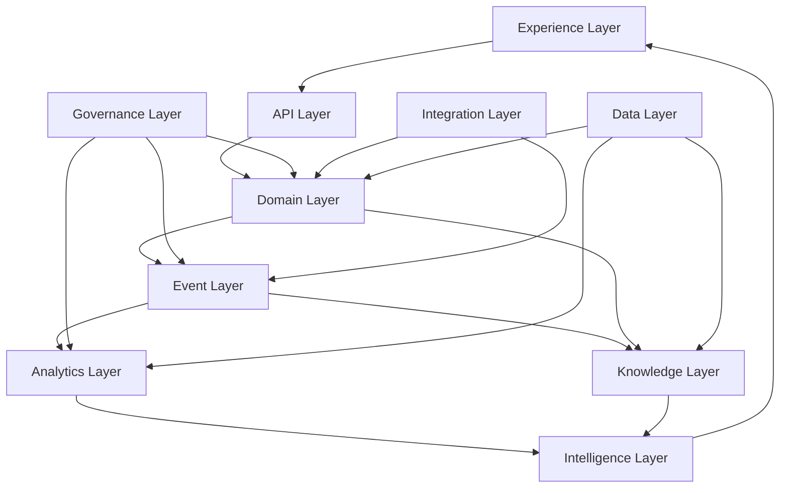
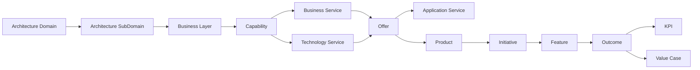
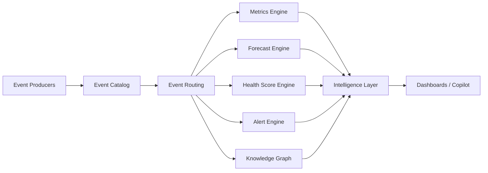
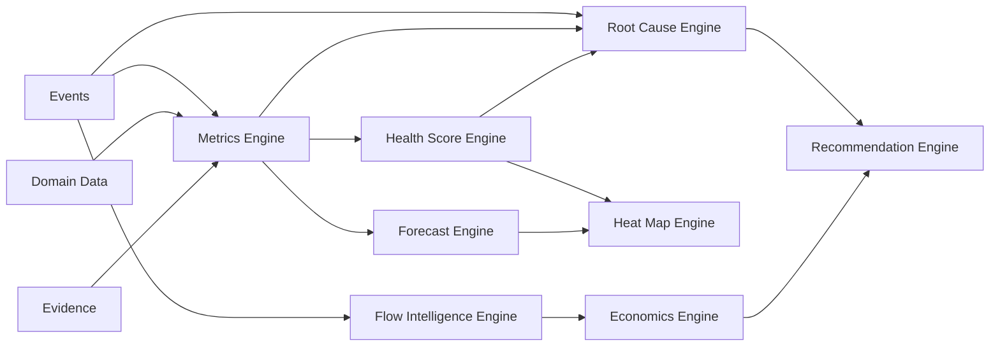
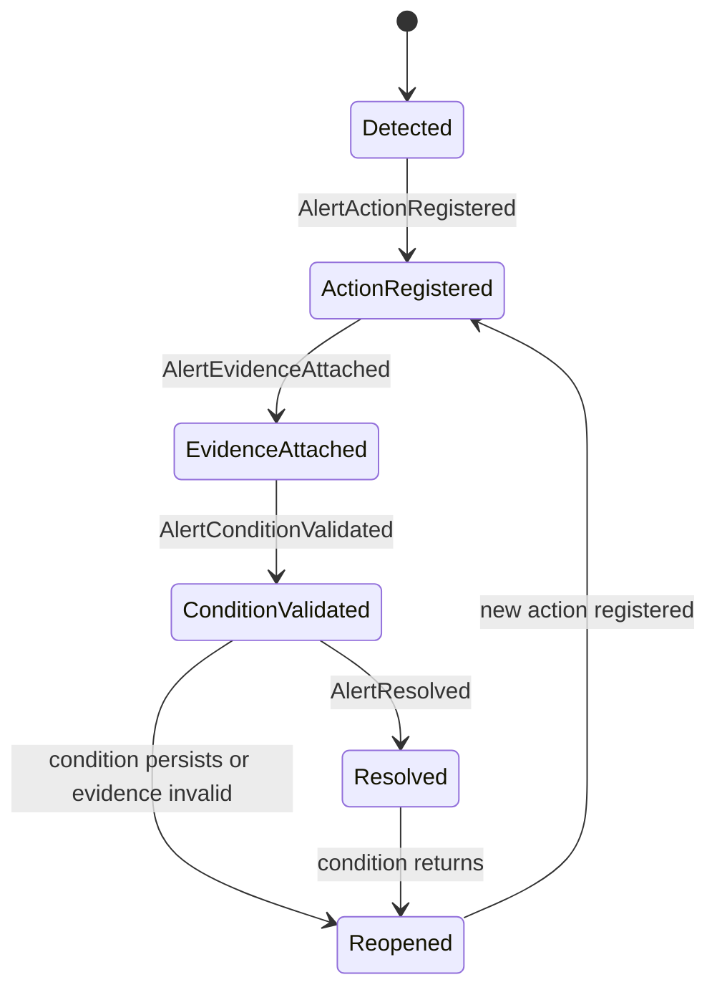

# EDIP Architecture

## 1. Objetivo da Arquitetura

Este documento define a arquitetura conceitual e lógica da Enterprise Delivery Intelligence Platform, EDIP.

A arquitetura da EDIP existe para transformar modelos de estratégia, portfólio, produto, arquitetura, discovery, requisitos, solução, delivery, validação, métricas, eventos, inteligência e valor em uma plataforma corporativa coerente, governável e evolutiva.

A EDIP não é um sistema de gestão de projetos. Ela não substitui ferramentas operacionais como Jira, Azure DevOps, ServiceNow, GitHub, repositórios de arquitetura, ERPs, ferramentas de OKR, data lakes ou plataformas de BI. A EDIP atua acima e entre esses sistemas como uma camada corporativa de:

- observabilidade corporativa;
- governança;
- rastreabilidade;
- inteligência;
- coordenação do fluxo Need-to-Value;
- explicabilidade;
- suporte à decisão.

A arquitetura está alinhada ao `AGENTS.md` porque preserva as regras permanentes da plataforma: estratégia dirige execução, execução produz evidência, evidência sustenta decisão e decisão deve ser auditável.

A arquitetura está alinhada a Domain Driven Design ao tratar cada grande área de negócio como bounded context com linguagem, ownership, eventos, regras e dependências explícitas.

A arquitetura está alinhada a Event Driven Architecture ao tratar eventos como fatos consumados, imutáveis, auditáveis e fundamentais para métricas, alertas, forecasts, health scores, heat maps, explainability e learning.

A arquitetura está alinhada a Decision Intelligence ao garantir que sinais, métricas, eventos, evidências e explicações conduzam a decisões, planos de ação e aprendizado organizacional.

## 2. Architectural Principles

| Princípio | Definição | Implicação Arquitetural |
| --- | --- | --- |
| Domain First | O domínio de negócio define os limites da arquitetura. | Serviços, dados, eventos e experiências seguem bounded contexts, não organogramas ou telas. |
| Event First | Fatos relevantes devem ser representados como eventos. | Métricas, alertas, forecasts e explicações devem ser reconstruíveis a partir de eventos e evidências. |
| Traceability First | Toda informação relevante deve ser navegável em cadeia. | Strategy, portfolio, product, capability, delivery, metric, event, decision e value devem possuir vínculos explícitos. |
| Explainability First | Nenhum score, forecast, alerta ou recomendação crítica pode ser opaco. | A arquitetura deve preservar drivers, eventos causadores, evidências e premissas. |
| Evidence First | Status, decisão, valor e auditoria exigem evidência verificável. | Evidence é entidade de primeira classe e não anexo informal. |
| API First | Contratos lógicos devem ser explícitos entre contextos. | APIs representam comandos e consultas governadas, sem expor acoplamento interno. |
| Analytics Native | A plataforma nasce preparada para métricas, séries históricas, scores, forecasts e heat maps. | Métricas são produtos de dados governados e não apenas campos de dashboard. |
| Governance by Design | Governança é parte do fluxo normal. | Gates, approvals, controls, exceptions, reviews e audit trails são capacidades centrais. |
| Security by Design | Segurança, autorização e segregação de funções orientam o desenho. | Acesso depende de papel, ownership, escopo, sensibilidade, decisão e evidência. |
| Auditability by Design | Auditoria deve ser consequência natural do uso da plataforma. | Eventos, decisões, evidências, métricas e alterações críticas preservam trilha. |
| Human Decision Authority | Recomendações não substituem autoridade humana em decisões críticas. | Copilot e engines sugerem, explicam e priorizam; humanos aprovam, rejeitam ou aceitam risco. |
| Loose Coupling | Contextos devem evoluir com baixo acoplamento. | Integração preferencial por contratos e eventos, não por acesso direto a estruturas internas. |
| Autonomous Domains | Cada domínio possui owner, regras e linguagem próprios. | A plataforma evita modelos centrais gigantes que concentram toda responsabilidade. |

## 3. Architecture Drivers

### Functional Drivers

| Driver | Necessidade Arquitetural |
| --- | --- |
| Rastreabilidade | Navegação top-down e bottom-up entre Strategy, Need, Product, Capability, Delivery, Outcome, KPI, ValueCase e Decision. |
| Governança | Gates, approvals, reviews, controls, exceptions, evidence, auditability e segregation of duties. |
| Dashboards | Visões por persona, portfólio, produto, capability, fluxo, valor, risco, dados e governança. |
| Explainability | Explicações baseadas em eventos, métricas, scores, forecasts, heat maps e evidências. |
| Forecasting | Projeções de prazo, capacidade, KPI, KR, valor e modernização com premissas explícitas. |
| Heat Maps | Mapas executivos e operacionais por Flow, Capacity, Value, Risk, Governance, Data Quality e Architecture. |
| Copilots | Respostas em linguagem natural sustentadas por knowledge graph, evidência e causalidade. |

### Non-Functional Drivers

| Driver | Necessidade Arquitetural |
| --- | --- |
| Escalabilidade | Suportar milhares de usuários, centenas de produtos, centenas de capabilities e grande volume histórico de eventos. |
| Auditabilidade | Preservar histórico de decisões, eventos, evidências, métricas, forecasts e versões conceituais. |
| Observabilidade | Diagnosticar origem, atraso, falha, divergência, cálculo, integração e impacto. |
| Resiliência | Tolerar indisponibilidade temporária de fontes sem perder rastreabilidade ou explicabilidade. |
| Extensibilidade | Permitir novos domínios, métricas, eventos, dashboards e engines sem reescrever o core conceitual. |
| Segurança | Proteger dados sensíveis, evidências, decisões, controles, riscos e informações executivas. |
| Segregação de Funções | Separar quem solicita, aprova, executa, valida, audita e aceita risco. |

## 4. Enterprise Architecture Overview

A EDIP é organizada em camadas lógicas. As camadas não representam infraestrutura física; representam responsabilidades arquiteturais.

| Camada | Responsabilidade |
| --- | --- |
| Experience Layer | Dashboards, workspaces, navigation, drill-down, drill-up, cockpit, heat maps e Copilot experience. |
| API Layer | Contratos lógicos de comando, consulta e composição entre experiências, domínios e integrações. |
| Domain Layer | Bounded contexts, entidades, agregados, regras de negócio, ownership e state machines. |
| Event Layer | Catálogo, publicação, consumo, roteamento, versionamento, retenção e governança de eventos. |
| Analytics Layer | Métricas, health scores, forecasts, heat maps, flow intelligence, economics e root cause analytics. |
| Knowledge Layer | Knowledge Graph, Decision Graph, Evidence Graph, Capability Graph, Value Graph e Learning Graph. |
| Intelligence Layer | Signals, insights, explanations, root causes, recommendations, narratives, action plans e learnings. |
| Governance Layer | Gates, approvals, reviews, controls, exceptions, auditability, policies e segregation of duties. |
| Integration Layer | Integração conceitual com sistemas de origem e consumidores corporativos. |
| Data Layer | Dados operacionais, analíticos, de conhecimento, evidência, métricas e forecasts. |

## 5. Bounded Context Architecture

Os bounded contexts do `DOMAIN_MODEL.md` tornam-se domínios arquiteturais lógicos. Cada domínio possui regras, eventos, dependências permitidas e dependências proibidas.

### Strategy

| Aspecto | Definição |
| --- | --- |
| Responsabilidade | Estratégia corporativa, temas, objetivos, OKRs, KRs, outcomes e KPIs estratégicos. |
| Owners | Diretores, estratégia corporativa, PMO estratégico. |
| Entidades Principais | CorporateStrategy, StrategicTheme, StrategicObjective, OKR, KeyResult, Outcome, KPI. |
| Eventos Principais | StrategyCreated, StrategyUpdated, ObjectiveCreated, ObjectiveRetired, OKRCreated, KRTargetChanged, OutcomeDefined. |
| APIs Expostas | Comandos e consultas lógicas para estratégia, objetivos, OKRs, outcomes e vínculos estratégicos. |
| APIs Consumidas | Portfolio, Metrics, Intelligence, Governance, Architecture Capability. |
| Dependências Permitidas | Metrics para medição, Governance para decisão, Architecture Capability para capabilities suportadas. |
| Dependências Proibidas | Depender diretamente de stories, tasks ou ferramentas operacionais como fonte primária de estratégia. |

### Portfolio

| Aspecto | Definição |
| --- | --- |
| Responsabilidade | Portfólios, investimentos, funding, ideias, oportunidades, priorização, capacidade e riscos de portfólio. |
| Owners | Superintendentes, PMO, portfolio managers, sponsors. |
| Entidades Principais | Portfolio, Investment, Funding, Idea, Opportunity, Initiative, PrioritizationDecision. |
| Eventos Principais | IdeaSubmitted, IdeaQualified, OpportunityCreated, OpportunityApproved, InvestmentApproved, FundingAllocated, PortfolioReprioritized. |
| APIs Expostas | Comandos e consultas lógicas para portfólio, funding, oportunidades, investimentos e decisões de priorização. |
| APIs Consumidas | Strategy, Product Discovery, Governance, Metrics, Value Realization. |
| Dependências Permitidas | Strategy para alinhamento, Governance para gates, Metrics para health e economics. |
| Dependências Proibidas | Usar backlog operacional como substituto de decisão de funding. |

### Architecture Capability

| Aspecto | Definição |
| --- | --- |
| Responsabilidade | Architecture Elevator, capabilities, services, offers, application services, assessments, architecture debt, exceptions e modernization plans. |
| Owners | Arquiteto Corporativo, capability owners, service owners, architecture governance. |
| Entidades Principais | ArchitectureDomain, ArchitectureSubDomain, BusinessLayer, Capability, BusinessService, TechnologyService, Offer, ApplicationService, ProductOfferAssociation, ArchitectureAssessment, ArchitectureDebt, ArchitectureException, ModernizationPlan. |
| Eventos Principais | DomainCreated, SubDomainCreated, CapabilityCreated, CapabilityUpdated, CapabilityRetired, BusinessServiceCreated, TechnologyServiceCreated, OfferCreated, OfferRetired, ProductOfferAssociated, ArchitectureAssessmentCompleted, ArchitectureDebtRegistered, ArchitectureExceptionGranted. |
| APIs Expostas | Comandos e consultas lógicas para architecture elevator, product-offer composition, assessments, debt, exceptions e modernization. |
| APIs Consumidas | Strategy, Product, Delivery, Engineering, Governance, Metrics, Intelligence. |
| Dependências Permitidas | Product consome offers; Delivery moderniza capabilities e services; Governance audita exceções. |
| Dependências Proibidas | Tratar Product como Capability, Service ou Offer. |

### Business Discovery

| Aspecto | Definição |
| --- | --- |
| Responsabilidade | Necessidades, dores, jornadas, processos, problemas, constraints e evidências de negócio. |
| Owners | Business teams, product managers, stakeholders de negócio. |
| Entidades Principais | BusinessNeed, PainPoint, StakeholderNeed, CustomerNeed, BusinessProblem, BusinessConstraint, BusinessEvidence, CustomerJourney, OperationalJourney, BusinessProcess, BusinessObjective. |
| Eventos Principais | BusinessNeedCaptured, PainPointRegistered, BusinessEvidenceAttached, BusinessProblemDefined. |
| APIs Expostas | Comandos e consultas lógicas para need, pain, evidence, journey e process analysis. |
| APIs Consumidas | Product Discovery, Governance, Metrics, Intelligence. |
| Dependências Permitidas | Product Discovery para hipóteses; Governance para evidência; Metrics para discovery health. |
| Dependências Proibidas | Criar feature ou requisito sem origem rastreável. |

### Product Discovery

| Aspecto | Definição |
| --- | --- |
| Responsabilidade | Discovery, hipóteses, experimentos, findings, outcomes, problem statements, opportunity assessments e decisões de priorização. |
| Owners | Product managers, product owners, business owners. |
| Entidades Principais | Discovery, DiscoveryHypothesis, DiscoveryExperiment, DiscoveryFinding, DiscoveryOutcome, ProblemStatement, OpportunityAssessment, PrioritizationDecision, Assumption. |
| Eventos Principais | DiscoveryStarted, HypothesisDefined, HypothesisValidated, DiscoveryCompleted, OpportunityAssessed. |
| APIs Expostas | Comandos e consultas lógicas para discovery, experimentação, hipóteses e assessment. |
| APIs Consumidas | Business Discovery, Portfolio, Product, Metrics, Governance. |
| Dependências Permitidas | Business Discovery como origem; Portfolio para funding; Product para roadmap. |
| Dependências Proibidas | Aprovar oportunidade sem hipótese, evidência ou decisão registrada. |

### Requirements

| Aspecto | Definição |
| --- | --- |
| Responsabilidade | Requisitos funcionais, não funcionais, regras de negócio, acceptance criteria, DoR, DoD, constraints, dependencies e risks. |
| Owners | Product owner, business analyst, engineering, architecture, security, data e compliance reviewers. |
| Entidades Principais | FunctionalRequirement, NonFunctionalRequirement, BusinessRule, AcceptanceCriterion, DefinitionOfReady, DefinitionOfDone, Constraint, Dependency, Risk, Assumption. |
| Eventos Principais | RequirementCreated, RequirementReviewed, RequirementApproved, RequirementRejected, DefinitionOfReadyUpdated. |
| APIs Expostas | Comandos e consultas lógicas para requisitos, critérios, regras, dependencies, risks e readiness. |
| APIs Consumidas | Product Discovery, Solution Design, Governance, Metrics. |
| Dependências Permitidas | Solution Design consome requisitos aprovados. |
| Dependências Proibidas | Criar solution design sem origem rastreável em need, discovery ou opportunity. |

### Solution Design

| Aspecto | Definição |
| --- | --- |
| Responsabilidade | Desenho de solução, decisões de solução, architecture review, engineering review, security review, data review, compliance review, approvals e evidências. |
| Owners | Solution architects, enterprise architects, tech leads, security, data, compliance. |
| Entidades Principais | SolutionDesign, SolutionRecord, SolutionDecision, ArchitectureReview, EngineeringReview, SecurityReview, DataReview, ComplianceReview, SolutionApproval, SolutionEvidence. |
| Eventos Principais | SolutionDesignCreated, SolutionReviewRequested, ArchitectureReviewCompleted, EngineeringReviewCompleted, SecurityReviewCompleted, DataReviewCompleted, SolutionApproved, SolutionRejected. |
| APIs Expostas | Comandos e consultas lógicas para designs, reviews, decisions, approvals e evidences. |
| APIs Consumidas | Requirements, Architecture Capability, Engineering, Governance, Metrics. |
| Dependências Permitidas | Architecture Capability para capabilities/services/offers; Governance para approvals. |
| Dependências Proibidas | Aprovar solução sem reviews obrigatórias aplicáveis. |

### Delivery Readiness

| Aspecto | Definição |
| --- | --- |
| Responsabilidade | Readiness assessment, checklists, dependency assessment, risk assessment, capacity assessment e bloqueadores antes da execução. |
| Owners | PMO, product owner, engineering manager, scrum master, architecture reviewers. |
| Entidades Principais | ReadinessAssessment, ReadinessChecklist, DependencyAssessment, RiskAssessment, CapacityAssessment, Blocker. |
| Eventos Principais | ReadinessAssessmentStarted, ReadinessBlocked, ReadinessApproved, DependencyRaised, BlockerCreated, BlockerResolved. |
| APIs Expostas | Comandos e consultas lógicas para readiness, dependency, risk, capacity e blocker. |
| APIs Consumidas | Requirements, Solution Design, Delivery, Metrics, Alert. |
| Dependências Permitidas | Delivery consome readiness aprovado. |
| Dependências Proibidas | Iniciar execução sem readiness ou exceção formal. |

### Delivery

| Aspecto | Definição |
| --- | --- |
| Responsabilidade | Iniciativas, épicos, features, stories, tasks, releases, execução e fluxo operacional. |
| Owners | Gerentes, coordenadores, product owners, tech leads, squads. |
| Entidades Principais | Initiative, Epic, Feature, Story, Task, Release. |
| Eventos Principais | InitiativeCreated, InitiativeStarted, InitiativePaused, InitiativeCompleted, EpicCreated, FeatureCreated, FeatureStarted, FeatureBlocked, FeatureCompleted, StoryCompleted, ReleasePublished. |
| APIs Expostas | Comandos e consultas lógicas para execution work items, estados, dependências e releases. |
| APIs Consumidas | Portfolio, Product, Delivery Readiness, Engineering, Metrics, Flow Intelligence. |
| Dependências Permitidas | Delivery publica eventos para flow, metrics, validation e value realization. |
| Dependências Proibidas | Usar delivery status como substituto de outcome ou benefício validado. |

### Validation

| Aspecto | Definição |
| --- | --- |
| Responsabilidade | Validação de aceite, negócio, técnica, outcome, benefício e valor. |
| Owners | Business owners, product owners, quality, engineering, value realization owners. |
| Entidades Principais | Validation, AcceptanceValidation, BusinessValidation, TechnicalValidation, OutcomeValidation, BenefitValidation, ValueValidation. |
| Eventos Principais | ValidationStarted, ValidationCompleted, ValidationRejected, BenefitValidationStarted, BenefitValidated, BenefitRejected. |
| APIs Expostas | Comandos e consultas lógicas para validações, evidências e resultados. |
| APIs Consumidas | Delivery, Value Realization, Governance, Metrics. |
| Dependências Permitidas | Value Realization consome validação de outcome e benefício. |
| Dependências Proibidas | Declarar valor realizado sem validação ou evidência. |

### Engineering

| Aspecto | Definição |
| --- | --- |
| Responsabilidade | Riscos técnicos, technical debt, integração, release readiness e exceções técnicas. |
| Owners | Líder técnico, desenvolvedores, engineering managers, architecture reviewers. |
| Entidades Principais | TechnicalRisk, TechnicalDebt, IntegrationRisk, ReleaseReadiness, EngineeringEvidence. |
| Eventos Principais | TechnicalRiskCreated, TechnicalDebtRegistered, TechnicalDebtResolved, IntegrationRiskDetected, ReleaseReadinessApproved, ArchitectureExceptionGranted. |
| APIs Expostas | Comandos e consultas lógicas para risco técnico, debt, integração e readiness técnico. |
| APIs Consumidas | Solution Design, Delivery, Architecture Capability, Metrics, Governance. |
| Dependências Permitidas | Engineering suporta ApplicationServices e delivery execution. |
| Dependências Proibidas | Confundir TechnicalDebt com ArchitectureDebt sem relação explícita. |

### Metrics and Intelligence

| Aspecto | Definição |
| --- | --- |
| Responsabilidade | Métricas, KPIs, health scores, forecasts, heat maps, alertas, signals, insights e inteligência derivada. |
| Owners | Metric owners, data stewards, PMO, analytics owners, intelligence stewards. |
| Entidades Principais | MetricDefinition, KPI, HealthScore, Forecast, HeatMap, Alert, AlertCondition, AlertAction, AlertEvidence, AlertValidation, AlertResolution, Signal, Insight, Explanation, Recommendation. |
| Eventos Principais | KPICreated, KPIUpdated, TargetChanged, HealthScoreCalculated, ForecastGenerated, HeatMapGenerated, AlertDetected, AlertActionRegistered, AlertConditionValidated, AlertResolved. |
| APIs Expostas | Comandos e consultas lógicas para métricas, scores, forecasts, heat maps, alerts e intelligence. |
| APIs Consumidas | Todos os domínios produtores de eventos e dados governados. |
| Dependências Permitidas | Consumo transversal de eventos, métricas e evidências. |
| Dependências Proibidas | Alterar estados transacionais dos domínios sem comando explícito do domínio owner. |

### Value Realization

| Aspecto | Definição |
| --- | --- |
| Responsabilidade | Value cases, benefícios esperados, forecast, observados, validados, rejeitados, ROI e leakage. |
| Owners | Value realization owner, sponsor, product manager, portfolio manager. |
| Entidades Principais | ValueCase, PlannedValue, ForecastValue, ObservedBenefit, ValidatedBenefit, RejectedBenefit, ValueLeakage. |
| Eventos Principais | ValueCaseCreated, BenefitObserved, BenefitValidated, BenefitRejected, ValueLeakageDetected. |
| APIs Expostas | Comandos e consultas lógicas para value cases, benefícios, validação e realization. |
| APIs Consumidas | Strategy, Portfolio, Product, Delivery, Validation, Metrics. |
| Dependências Permitidas | Validation como evidência; Metrics para score; Forecast para projeções. |
| Dependências Proibidas | Calcular benefício sem baseline, período, método, owner e evidência. |

### Governance and Audit

| Aspecto | Definição |
| --- | --- |
| Responsabilidade | Decisões, gates, approvals, controls, exceptions, evidence, audits, policies e segregation of duties. |
| Owners | Governance, audit, compliance, PMO, risk, architecture governance. |
| Entidades Principais | Decision, GovernanceGate, DecisionGate, Approval, Control, Exception, Evidence, AuditRecord, Policy. |
| Eventos Principais | DecisionCreated, DecisionApproved, DecisionRejected, DecisionSLAExceeded, GateApproved, GateRejected, EvidenceAttached, ExceptionGranted, ExceptionExpired. |
| APIs Expostas | Comandos e consultas lógicas para decisions, gates, approvals, controls, exceptions, evidence e audits. |
| APIs Consumidas | Todos os domínios que exigem decisão, aprovação, evidência ou controle. |
| Dependências Permitidas | Relacionamento transversal com todos os contextos críticos. |
| Dependências Proibidas | Encerrar decisão crítica sem owner, justificativa e evidência. |

## 6. Architecture Elevator Model

O Architecture Elevator da EDIP modela a arquitetura corporativa como uma cadeia navegável:

Architecture Domain -> Architecture SubDomain -> Business Layer -> Capability -> Business Service / Technology Service -> Offer -> Application Service.

### Ownership

- ArchitectureDomain possui owner executivo ou arquitetura corporativa.
- ArchitectureSubDomain possui owner de domínio.
- BusinessLayer possui owner de negócio ou arquitetura de negócio.
- Capability possui owner, propósito e criticidade.
- BusinessService e TechnologyService possuem service owners.
- Offer possui owner responsável por composição e consumo.
- ApplicationService possui owner técnico/operacional.
- Product possui product owner e representa composição flexível de N Offers.

### Governança

- Capabilities críticas exigem rastreabilidade até estratégia, produto, iniciativa, métrica ou justificativa formal.
- Offers aposentadas exigem análise de impacto em produtos.
- Services críticos exigem avaliação de modernização, debt e risco.
- ArchitectureDebt e ArchitectureException são governados e auditáveis.

### Produto e Offers

Product não é Capability.

Product não é Service.

Product não é Offer.

Product representa empacotamento, experiência, jornada, canal, solução ou proposição de valor formada por uma composição flexível de N Offers.

### Iniciativas e Capabilities

Iniciativas podem criar, alterar, modernizar, aposentar ou mitigar risco de capabilities, services, offers e application services.

### Métricas e Capabilities

Capabilities podem ser medidas por Capability Health Score, Capability Coverage, Capability Modernization Score, Architecture Debt Score, Capability Traceability Health e Objective to Capability Coverage.

## 7. Operational Architecture

A arquitetura operacional coordena o fluxo:

Need -> Discovery -> Requirements -> Solution -> Readiness -> Delivery -> Validation -> Value Realization.

| Etapa | Responsabilidades | Handoffs | Eventos | Evidências | Alertas |
| --- | --- | --- | --- | --- | --- |
| Need | Capturar necessidade, dor, jornada, processo e evidência. | Para discovery quando problema é claro. | BusinessNeedCaptured, PainPointRegistered. | BusinessEvidence. | Evidence Missing, Business Queue Aging. |
| Discovery | Validar hipóteses, experimentos, findings e oportunidade. | Para requirements quando oportunidade é aprovada. | DiscoveryStarted, HypothesisValidated, DiscoveryCompleted. | DiscoveryFinding, DiscoveryOutcome. | Discovery Quality Degraded. |
| Requirements | Formalizar requisitos, regras, critérios, DoR, DoD e riscos. | Para solution design quando requisitos são aprovados. | RequirementCreated, RequirementApproved. | AcceptanceCriterion, BusinessRule. | Requirements Quality Alert. |
| Solution | Revisar arquitetura, engenharia, segurança, dados e compliance. | Para readiness quando solução é aprovada. | SolutionDesignCreated, ReviewCompleted, SolutionApproved. | SolutionEvidence, review evidence. | Review Pending, Approval Aging. |
| Readiness | Validar capacidade, dependências, riscos e checklist. | Para delivery quando pronto. | ReadinessAssessmentStarted, ReadinessApproved. | ReadinessChecklist. | Readiness Blocked. |
| Delivery | Executar features, stories, tasks e releases. | Para validation quando entregue. | FeatureStarted, FeatureCompleted, StoryCompleted, ReleasePublished. | Delivery evidence. | FeatureBlocked, BottleneckDetected. |
| Validation | Validar aceite, outcome, benefício e valor. | Para value realization quando evidência é aceita. | ValidationStarted, ValidationCompleted, BenefitValidated. | Validation evidence. | Validation Pending, Benefit Rejected. |
| Value Realization | Medir e validar valor, ROI, leakage e aprendizado. | Para strategy/portfolio learning. | ValueCaseCreated, BenefitObserved, BenefitValidated, ValueLeakageDetected. | Value evidence. | Value Leakage Detected. |

## 8. Service Architecture

Serviços são componentes lógicos de responsabilidade. Esta seção não define endpoints, tecnologias ou deployables físicos.

| Serviço Lógico | Responsabilidade | Comandos Conceituais | Consultas Conceituais | Eventos Publicados | Eventos Consumidos |
| --- | --- | --- | --- | --- | --- |
| Strategy Service | Gerir estratégia, objetivos, OKRs, KRs, outcomes e KPIs estratégicos. | Criar objetivo, atualizar KR, definir outcome. | Consultar estratégia, OKRs, outcomes e alinhamento. | StrategyCreated, ObjectiveCreated, KRTargetChanged, OutcomeDefined. | KPIUpdated, BenefitValidated, ForecastUpdated. |
| Portfolio Service | Gerir portfólios, investimentos, funding, ideias, oportunidades e iniciativas. | Qualificar ideia, aprovar oportunidade, alocar funding, repriorizar portfólio. | Consultar portfólio, funding, risco e valor em risco. | IdeaQualified, OpportunityApproved, FundingAllocated, PortfolioReprioritized. | StrategicObjectiveUpdated, ValueAtRiskIncreased, BottleneckDetected. |
| Discovery Service | Gerir need, pain, discovery, hipóteses, experimentos e findings. | Capturar need, registrar pain, iniciar discovery, validar hipótese. | Consultar discovery, evidências, findings e readiness de oportunidade. | BusinessNeedCaptured, PainPointRegistered, DiscoveryStarted, HypothesisValidated. | StrategyUpdated, PortfolioReprioritized. |
| Requirements Service | Gerir requisitos, regras, acceptance criteria, DoR, DoD, constraints e dependencies. | Criar requisito, revisar requisito, aprovar requisito. | Consultar requisitos por origem, status, owner e readiness. | RequirementCreated, RequirementApproved, RequirementRejected. | DiscoveryCompleted, OpportunityApproved. |
| Solution Design Service | Gerir solution designs, reviews, decisões e approvals. | Criar design, solicitar review, aprovar solução, rejeitar solução. | Consultar design, pendências, decisões e evidências. | SolutionDesignCreated, ReviewRequested, SolutionApproved, SolutionRejected. | RequirementApproved, ArchitectureDebtRegistered. |
| Readiness Service | Gerir readiness, dependency, risk e capacity assessment. | Iniciar assessment, registrar blocker, aprovar readiness. | Consultar readiness, blockers, dependencies e capacity fit. | ReadinessAssessmentStarted, ReadinessBlocked, ReadinessApproved. | SolutionApproved, CapacityChanged. |
| Delivery Service | Gerir iniciativas, épicos, features, stories, tasks e releases. | Criar iniciativa, iniciar feature, bloquear feature, concluir story, publicar release. | Consultar execução, fluxo, dependências e releases. | InitiativeStarted, FeatureStarted, FeatureBlocked, StoryCompleted, ReleasePublished. | ReadinessApproved, ProductRoadmapUpdated. |
| Validation Service | Gerir validações de aceite, negócio, técnica, outcome, benefício e valor. | Iniciar validação, aprovar aceite, rejeitar validação, validar benefício. | Consultar validações, critérios e evidências. | ValidationStarted, ValidationCompleted, BenefitValidated, BenefitRejected. | ReleasePublished, FeatureCompleted. |
| Architecture Capability Service | Gerir Architecture Elevator, product-offer composition, assessments, debt, exceptions e modernization. | Criar capability, associar offer ao produto, registrar debt, conceder exceção, iniciar modernização. | Consultar domain landscape, capability landscape, service/offer landscape e modernization. | CapabilityCreated, ProductOfferAssociated, ArchitectureDebtRegistered, ArchitectureExceptionGranted, CapabilityModernizationStarted. | StrategyUpdated, InitiativeCreated, ServiceModernizationCompleted. |
| Metrics Service | Gerir definições de métricas, KPIs, scores e cálculo governado. | Criar métrica, alterar target, calcular score. | Consultar métricas, lineage, confidence e histórico. | KPICreated, KPIUpdated, HealthScoreCalculated. | Eventos de todos os domínios. |
| Forecast Service | Gerir forecasts de prazo, capacidade, KPI, KR, valor e modernização. | Gerar forecast, atualizar forecast, medir accuracy. | Consultar forecasts, drivers, confidence e accuracy. | ForecastGenerated, ForecastUpdated, ForecastAccuracyMeasured. | Events, metrics, health scores, capacity changes. |
| Heat Map Service | Gerar heat maps por flow, value, risk, governance, data quality, architecture e operating model. | Gerar heat map, atualizar dimensão. | Consultar heat maps por escopo, dimensão e período. | HeatMapGenerated. | HealthScoreCalculated, BottleneckDetected, DataConfidenceDegraded. |
| Alert Service | Gerir alertas, condições, ações, evidências, validações, resoluções e reaberturas. | Detectar alerta, registrar ação, anexar evidência, validar condição, resolver ou reabrir. | Consultar alertas abertos, aging, owner e evidências faltantes. | AlertDetected, AlertActionRegistered, AlertEvidenceAttached, AlertConditionValidated, AlertResolved, AlertReopened. | HealthScoreDegraded, BottleneckDetected, ForecastAccuracyDegraded. |
| Blocker Service | Gerir bloqueadores, severidade, owner, evidência e resolução. | Criar blocker, escalar blocker, resolver blocker. | Consultar blockers por aging, owner, fila e impacto. | BlockerCreated, BlockerEscalated, BlockerResolved. | FeatureBlocked, DependencyRaised. |
| Governance Service | Gerir gates, approvals, controls, exceptions, evidence e audit records. | Criar decisão, aprovar, rejeitar, anexar evidência, conceder exceção. | Consultar decisões, controles, exceções, evidências e trilha auditável. | DecisionCreated, DecisionApproved, GateApproved, EvidenceAttached, ExceptionGranted. | Todos os eventos críticos. |
| Decision Service | Orquestrar decisões, decisão pendente, decision latency e consequências da inação. | Registrar decisão, escalar decisão, aceitar risco. | Consultar decisões abertas, bloqueantes, atrasadas e impacto econômico. | DecisionCreated, DecisionSLAExceeded, RiskAccepted. | AlertDetected, ValueAtRiskIncreased, BottleneckDetected. |
| Knowledge Service | Gerir knowledge graph, decision graph, evidence graph, capability graph, value graph e learning graph. | Registrar knowledge asset, consolidar learning, conectar evidência. | Consultar caminhos, relações, evidências e aprendizados. | KnowledgeAssetCreated, LearningCaptured. | Eventos, decisões, métricas, insights e evidências. |
| Copilot Service | Responder perguntas corporativas com evidência, explicação e recomendação. | Solicitar investigação, gerar narrativa, propor recomendação. | Consultar resposta explicável, cadeia causal e evidências. | NarrativeGenerated, RootCauseIdentified, RemediationPlanCreated. | Events, metrics, forecasts, insights, knowledge graph. |
| Value Realization Service | Gerir value cases, benefícios, value leakage e ROI. | Criar value case, observar benefício, validar benefício, registrar leakage. | Consultar valor esperado, forecast, observado, validado e rejeitado. | ValueCaseCreated, BenefitObserved, BenefitValidated, ValueLeakageDetected. | ValidationCompleted, ReleasePublished, KPIUpdated. |

## 9. Event Architecture

A EDIP usa eventos para representar fatos consumados que sustentam rastreabilidade, analytics, auditabilidade, governança e inteligência.

### Event Producers

- Sistemas de origem corporativos.
- Serviços lógicos da EDIP.
- Engines analíticas.
- Serviços de governança.
- Integrações de delivery, engenharia, arquitetura, risco e dados.

### Event Consumers

- Metrics Engine.
- Forecast Engine.
- Flow Intelligence Engine.
- Health Score Engine.
- Heat Map Engine.
- Governance Engine.
- Alert Engine.
- Knowledge Service.
- Copilot Service.
- Dashboards executivos, táticos e operacionais.

### Event Routing

Eventos devem ser roteados por contexto, entidade afetada, severidade, criticidade, owner, correlação e impacto. O roteamento conceitual deve permitir:

- atualização de projeções;
- cálculo de métricas;
- geração de alertas;
- atualização de health scores;
- acionamento de governance gates;
- registro em knowledge graph;
- explicações e narrativas.

### Event Ownership

Cada evento possui owner conceitual. O owner é responsável por definição, significado, condições de geração, payload conceitual, retenção, compatibilidade e impacto em métricas, alertas e auditoria.

### Event Versioning

Eventos devem evoluir com eventVersion, schemaVersion, replacementEvent, deprecatedAt, compatibilityPolicy, breakingChangePolicy, ownershipPolicy e stewardshipPolicy.

### Event Retention

Retenção conceitual segue criticidade:

- Regulatory Critical: decisões, funding, aprovações, benefícios validados e controles críticos.
- Governance Critical: gates, exceções, assessments e evidências.
- Operational: features, stories, filas, blockers e delivery events.
- Analytical: health score, heat map, forecast e derived events.

### Event Classification

| Classe | Definição | Exemplos |
| --- | --- | --- |
| Source Events | Eventos originados em sistemas externos reconhecidos pela EDIP. | FeatureCompleted, StoryCompleted, ReleasePublished. |
| Domain Events | Eventos nativos dos bounded contexts. | InitiativeCreated, OpportunityApproved, DecisionApproved. |
| Governance Events | Eventos relacionados a decisão, gate, approval, evidence, exception e control. | GateApproved, EvidenceAttached, ExceptionGranted. |
| Derived Events | Eventos derivados por regra, threshold, correlação ou inferência governada. | BottleneckDetected, ValueLeakageDetected, ForecastAccuracyDegraded. |
| Analytical Events | Eventos gerados por engines analíticas. | HealthScoreCalculated, FlowHealthCalculated, HeatMapGenerated. |

## 10. Analytics Architecture

A Analytics Architecture transforma eventos e dados governados em métricas, scores, forecasts, heat maps, economics, root causes e recommendations.

| Engine | Entradas | Saídas | Dependências |
| --- | --- | --- | --- |
| Metrics Engine | Eventos, dados de domínio, evidências, definições de métricas. | Métricas governadas, séries históricas, confidence, lineage. | Metric definitions, event catalog, data quality. |
| Health Score Engine | Métricas, eventos críticos, rules, weights, thresholds. | Strategic, Portfolio, Initiative, Flow, Product, Capability, Governance, Value e Data Confidence scores. | Metrics Engine, Governance, domain ownership. |
| Forecast Engine | Histórico, flow, capacity, aging, dependencies, risks, value, quality. | Forecast de prazo, KR, KPI, valor, capacidade e modernização. | Metrics Engine, events, assumptions, confidence. |
| Heat Map Engine | Scores, metrics, events, thresholds, dimensions. | Heat maps por flow, capacity, value, risk, governance, data quality, architecture e operating model. | Health Score Engine, Metrics Engine. |
| Flow Intelligence Engine | QueueEntered, QueueExited, WIP, blocked time, wait time, touch time. | Queue analysis, bottleneck detection, flow efficiency, flow health. | Delivery, Readiness, Metrics, Alert. |
| Economics Engine | Cost of delay, cost of queue, cost of bottleneck, value at risk, investment at risk. | Delay impact, value leakage, economic prioritization. | Portfolio, Value Realization, Flow Intelligence. |
| Root Cause Engine | Events, causal chains, evidence chains, metrics, alerts. | RootCauseIdentified, contributing factors, investigation paths. | Knowledge Graph, Event Catalog, Intelligence Layer. |
| Recommendation Engine | Root causes, policies, metrics, risk, value, ownership, constraints. | Recommendations, action plans, urgency, owner suggested, risk of inaction. | Root Cause Engine, Governance, Knowledge Graph. |

## 11. Intelligence Architecture

A Intelligence Architecture transforma observabilidade em decisão.

Fluxo conceitual:

Data -> Events -> Metrics -> Health Scores -> Forecasts -> Heat Maps -> Signals -> Insights -> Explanations -> Root Causes -> Recommendations -> Decisions -> Action Plans -> Outcomes -> Learnings.

```mermaid
flowchart LR
  Data[Data]
  Events[Events]
  Metrics[Metrics]
  Scores[Health Scores]
  Forecasts[Forecasts]
  HeatMaps[Heat Maps]
  Signals[Signals]
  Insights[Insights]
  Explanations[Explanations]
  RootCauses[Root Causes]
  Recommendations[Recommendations]
  Decisions[Decisions]
  ActionPlans[Action Plans]
  Outcomes[Outcomes]
  Learnings[Learnings]

  Data --> Events
  Events --> Metrics
  Metrics --> Scores
  Scores --> Forecasts
  Forecasts --> HeatMaps
  HeatMaps --> Signals
  Signals --> Insights
  Insights --> Explanations
  Explanations --> RootCauses
  RootCauses --> Recommendations
  Recommendations --> Decisions
  Decisions --> ActionPlans
  ActionPlans --> Outcomes
  Outcomes --> Learnings
```

| Elemento | Responsabilidade |
| --- | --- |
| Signal | Observação básica derivada de evento, métrica, score, forecast ou heat map. |
| Insight | Descoberta relevante e contextualizada. |
| Explanation | Explicação estruturada baseada em eventos, métricas, scores, forecasts, evidências e causalidade. |
| Root Cause | Causa direta, contribuinte, sistêmica, arquitetural, econômica ou organizacional. |
| Recommendation | Ação sugerida com impacto, urgência, owner, horizonte, risco de inação e evidência necessária. |
| Action Plan | Plano executável derivado de decisão ou recomendação. |
| Decision Outcome | Resultado observado após decisão. |
| Learning | Aprendizado organizacional reutilizável. |
| Narrative | Explicação executiva estruturada. |
| Knowledge Asset | Conhecimento governado e reutilizável. |

## 12. Knowledge Architecture

A Knowledge Architecture organiza relações navegáveis entre entidades, decisões, eventos, métricas, evidências, insights e aprendizados.

| Grafo | Nós Principais | Relacionamentos | Usos |
| --- | --- | --- | --- |
| Knowledge Graph | Strategy, Portfolio, Product, Capability, Offer, Initiative, Feature, KPI, Event, Metric, Insight, Decision, Learning. | supports, impacts, measures, explains, causedBy, evidencedBy. | Busca corporativa, Copilot, explainability, investigação. |
| Decision Graph | Decision, Gate, Approval, Exception, RiskAccepted, ActionPlan, Outcome. | approvedBy, rejectedBy, escalatedTo, caused, resolved. | Auditoria, decisão bloqueante, decision latency, governança. |
| Evidence Graph | Evidence, Metric, Event, Decision, Validation, Control, Benefit. | supports, validates, contradicts, expires, attachedTo. | Auditoria, validação, alert closure, value realization. |
| Capability Graph | Domain, SubDomain, BusinessLayer, Capability, Service, Offer, ApplicationService, Product. | contains, exposes, offers, implements, composes, supports. | Architecture elevator, impact analysis, modernization. |
| Value Graph | Objective, Outcome, KPI, ValueCase, Benefit, Product, Initiative, Release. | expects, forecasts, realizes, validates, leaks. | Value realization, ROI, value at risk. |
| Learning Graph | Lesson, Pattern, AntiPattern, DecisionPattern, DeliveryPattern, ArchitecturePattern. | derivedFrom, reusedBy, prevents, recommends. | Organizational learning, recommendations, maturity evolution. |

## 13. Governance Architecture

Governance Architecture garante que decisões críticas sejam rastreáveis, evidenciadas, auditáveis e compatíveis com instituições financeiras.

| Componente | Responsabilidade |
| --- | --- |
| Decision Gates | Pontos formais de decisão que condicionam avanço de entidade ou processo. |
| Approvals | Aprovações com solicitante, aprovador, escopo, decisão, justificativa, data e evidência. |
| Reviews | Revisões de arquitetura, engenharia, segurança, dados, compliance, readiness e validação. |
| Evidence | Artefatos verificáveis que sustentam status, decisão, métrica, controle ou valor. |
| Controls | Obrigações verificáveis derivadas de política, risco, arquitetura, segurança, compliance ou auditoria. |
| Exceptions | Desvios formalmente aceitos com owner, prazo, motivo, controles e plano de encerramento. |
| Audits | Trilhas de eventos, decisões, evidências, versões e cálculos. |
| Policies | Regras corporativas que governam decisão, acesso, retenção, evidência e segregação. |
| Segregation of Duties | Separação entre quem propõe, aprova, executa, valida, audita e aceita risco. |

A arquitetura suporta auditoria bancária ao preservar:

- trilha de eventos e alterações;
- versões de forecast e health score;
- evidências de decisão e validação;
- owner, accountable, reviewer e approver;
- contexto de exceção e aceite de risco;
- origem e qualidade de dados usados em decisão.

## 14. Alert Architecture

Alertas são objetos governados. Um alerta representa uma condição acionável que exige owner, ação, evidência, validação e resolução.

| Elemento | Definição |
| --- | --- |
| Alert | Sinal acionável de exceção, risco ou desvio. |
| AlertCondition | Condição objetiva que disparou o alerta. |
| AlertAction | Ação registrada para remover, mitigar ou aceitar formalmente a condição. |
| AlertEvidence | Evidência de execução, decisão ou mitigação. |
| AlertValidation | Validação da condição original. |
| AlertResolution | Encerramento auditável. |
| AlertReopen | Reabertura quando condição retorna ou evidência é invalidada. |

Uma alerta não pode ser encerrada sem:

- ação registrada;
- evidência registrada;
- validação de que a condição original desapareceu, foi mitigada ou foi aceita formalmente por autoridade definida.

## 15. Heat Map Architecture

Heat maps tornam gargalos, riscos, filas, valor, governança e arquitetura visíveis em múltiplos níveis.

| Heat Map | Fontes | Métricas / Scores | Eventos | Uso Executivo |
| --- | --- | --- | --- | --- |
| Business Discovery Heat Map | Needs, pains, journeys, processes. | Business Discovery Health, Discovery Lead Time, Evidence Coverage. | BusinessNeedCaptured, PainPointRegistered. | Identificar necessidades sem evidência ou dores não qualificadas. |
| Requirements Heat Map | Requirements, criteria, DoR, risks. | Requirements Health, Requirements Queue Time. | RequirementCreated, RequirementApproved, RequirementRejected. | Expor requisitos incompletos ou parados. |
| Solution Heat Map | SolutionDesign, reviews, approvals. | Solution Health, Review Time, Approval Time. | SolutionDesignCreated, ReviewRequested, SolutionApproved. | Ver gargalos em arquitetura, engenharia, segurança, dados ou compliance. |
| Architecture Heat Map | Capabilities, services, offers, application services, debt, exceptions. | Capability Health Score, Service Health Score, Offer Health Score, Architecture Debt Score. | CapabilityHealthDegraded, ArchitectureDebtRegistered, ArchitectureExceptionExpired. | Priorizar modernização e risco arquitetural. |
| Delivery Heat Map | Initiatives, epics, features, stories, blockers. | Delivery Health, Lead Time, Cycle Time, Blocked Time. | FeatureBlocked, FeatureCompleted, StoryCompleted. | Identificar squads, iniciativas e filas críticas. |
| Validation Heat Map | Validation, acceptance, outcome, benefit. | Validation Health, Validation Time, Benefit Variance. | ValidationStarted, ValidationRejected, BenefitValidated. | Identificar valor não comprovado ou validação pendente. |
| Value Heat Map | Value cases, benefits, leakage, ROI. | Value Realization Score, Value Leakage, ROI, Time to Value. | BenefitObserved, BenefitValidated, ValueLeakageDetected. | Mostrar valor em risco e investimento sem retorno. |
| Alert Heat Map | Alerts, conditions, actions, evidence, validation. | Alert Aging, Alert Resolution Health. | AlertDetected, AlertActionRegistered, AlertConditionValidated, AlertReopened. | Expor alertas abertos, sem owner, sem evidência ou reabertos. |
| Blocker Heat Map | Blockers, dependencies, severity, owners. | Blocked Time, Blocker Resolution Health. | BlockerCreated, BlockerEscalated, BlockerResolved. | Mostrar quem bloqueia valor e há quanto tempo. |
| Capability Heat Map | Domains, subdomains, capabilities, offers, products. | Capability Health Score, Capability Traceability Health, Objective to Capability Coverage. | CapabilityCreated, CapabilityUpdated, ProductOfferAssociated. | Entender capabilities críticas e impacto estratégico. |

## 16. Copilot Architecture

O futuro Copilot da EDIP deve responder perguntas corporativas usando entidades, eventos, métricas, inteligência, evidências e knowledge graph. Ele não deve apresentar conclusões sem declarar confiança, fontes, lacunas e limitações.

| Pergunta | Entidades | Eventos | Métricas | Inteligência | Conhecimento |
| --- | --- | --- | --- | --- | --- |
| Onde estamos parados? | Queue, WorkItem, Owner, State, Alert. | QueueEntered, StateChanged, AlertDetected. | Queue Time, Aging, WIP. | QueueInsight, FlowInsight. | Queue path no Knowledge Graph. |
| Por que estamos atrasados? | Initiative, Feature, Dependency, Blocker, Decision. | FeatureBlocked, DependencyRaised, DecisionSLAExceeded, ForecastUpdated. | Lead Time, Blocked Time, Schedule Forecast Accuracy, Cost of Delay. | Explanation, RootCause, Recommendation. | Causal chain e Evidence Graph. |
| Quem deveria agir? | Owner, Accountable, Reviewer, Approver, Escalation. | OwnerAssigned, EscalationTriggered, DecisionSLAExceeded. | SLA breach, Alert Aging. | Decision Intelligence. | Decision Graph e RACI. |
| Onde está o maior gargalo? | FlowStage, Queue, Bottleneck, Squad, Portfolio. | QueueThresholdBreached, BottleneckDetected. | Queue Time, Flow Efficiency, Bottleneck Severity. | FlowInsight, HeatMapInsight. | Flow path e heat map dimension. |
| Qual capability está degradada? | Capability, Service, Offer, Product, Initiative. | CapabilityHealthDegraded, ArchitectureDebtRegistered, ArchitectureExceptionExpired. | Capability Health Score, Architecture Debt Score. | CapabilityInsight, ArchitectureInsight. | Capability Graph. |
| Qual valor está em risco? | ValueCase, Benefit, Investment, Initiative, KPI. | ValueAtRiskIncreased, BenefitRejected, ValueLeakageDetected. | Investment At Risk, Value Leakage, Benefit Variance. | ValueInsight, EconomicInsight. | Value Graph e Decision Graph. |

## 17. Security and Authorization Model

Esta seção define princípios conceituais de segurança e autorização, sem implementação.

| Modelo | Definição |
| --- | --- |
| RBAC | Acesso baseado em papéis como Diretor, PMO, Product Owner, Arquiteto, Auditor, Líder Técnico, Security Specialist e Data Specialist. |
| ABAC | Acesso baseado em atributos como unidade, portfólio, produto, capability, criticidade, sensibilidade, owner, decisão e evidência. |
| Ownership | Owners podem manter entidades dentro de seu escopo, mas não devem aprovar controles conflitantes. |
| Segregation of Duties | Quem executa não deve ser o único aprovador ou auditor de decisão crítica. |
| Approval Rights | Direitos de aprovação dependem de papel, autoridade, escopo, valor, risco e política. |
| Evidence Access | Evidências podem ter restrição adicional por sensibilidade, privacidade, auditoria, risco ou confidencialidade. |
| Audit Access | Auditores acessam trilhas, decisões, evidências e lineage conforme escopo governado. |
| Executive Access | Executivos acessam visões agregadas, valor, risco, decisões críticas e evidências de suporte. |
| Architecture Access | Arquitetos acessam capability, service, offer, application service, debt, exception, modernization e assessments. |

## 18. Data Architecture Principles

Esta arquitetura não define tabelas, bancos físicos ou infraestrutura. Ela define categorias conceituais de dados e ownership.

| Categoria | Definição | Owner Conceitual |
| --- | --- | --- |
| Systems of Record | Fontes responsáveis por registrar fatos originais de um domínio operacional ou corporativo. | Owner do sistema de origem. |
| Systems of Truth | Visões governadas e reconciliadas que a EDIP usa para decisão corporativa. | Data steward / domain owner. |
| Operational Data | Estados, owners, filas, work items, decisões e entidades transacionais. | Domain owner. |
| Analytical Data | Métricas, séries, scores, forecasts, heat maps e agregações. | Metrics owner / analytics owner. |
| Knowledge Data | Relações, grafos, insights, explanations, recommendations e learnings. | Knowledge steward / intelligence owner. |
| Evidence Data | Evidências que sustentam decisão, validação, controle, alerta ou valor. | Evidence owner / governance owner. |
| Metric Data | Definições, cálculos, lineage, confidence, baseline e target. | Metric owner. |
| Forecast Data | Forecasts, premissas, versões, drivers, confidence e accuracy. | Forecast owner / analytics owner. |

Princípios:

- dado apresentado deve declarar origem ou permitir navegação até origem;
- métrica usada em decisão deve possuir owner, fórmula, fonte, periodicidade, baseline, target e confidence;
- forecast usado em decisão deve preservar versão, premissas e drivers;
- evidência deve preservar entidade, decisão ou controle que sustenta;
- dados sensíveis devem seguir minimização, finalidade, necessidade e proteção adequada.

## 19. Architectural Decisions

### ADR-001: Domain Driven Design

Decisão: modelar a EDIP por bounded contexts.

Racional: a plataforma cobre estratégia, portfólio, produto, arquitetura, operating model, delivery, métricas, eventos, valor, governança e inteligência. Um modelo único centralizado criaria ambiguidade semântica e baixo ownership.

### ADR-002: Event Driven Architecture

Decisão: representar fatos relevantes como eventos de domínio, governança, analytics e inteligência.

Racional: eventos sustentam auditoria, métricas, forecasts, heat maps, explainability, causalidade e integration readiness.

### ADR-003: Metrics as Data Products

Decisão: métricas, KPIs, scores e forecasts são produtos de dados governados.

Racional: decisões executivas não devem depender de indicadores sem owner, fórmula, fonte, periodicidade, lineage, target e confidence.

### ADR-004: Explainability First

Decisão: todo score, forecast, alerta, narrativa e recomendação crítica deve ser explicável.

Racional: instituições financeiras exigem rastreabilidade, auditabilidade, contestabilidade e responsabilidade humana.

### ADR-005: Product != Capability

Decisão: Product não é Capability.

Racional: Capability representa capacidade corporativa; Product representa composição flexível de ofertas para entregar experiência, jornada, canal, solução ou proposição de valor.

### ADR-006: Product != Service

Decisão: Product não é BusinessService nem TechnologyService.

Racional: Services expõem ou habilitam offers; products consomem offers em composições flexíveis.

### ADR-007: Product != Offer

Decisão: Product não é Offer.

Racional: Offer é unidade ofertável derivada de serviços; Product pode ser composto por N Offers e Offer pode compor N Products.

### ADR-008: Alerts Require Evidence-Based Closure

Decisão: alertas não podem ser encerrados sem ação, evidência e validação da condição original.

Racional: alertas críticos representam risco, desvio ou exceção; encerramento sem evidência prejudica governança, auditoria e confiança operacional.

### ADR-009: Knowledge Graph as Explainability Backbone

Decisão: a EDIP deve preparar um Knowledge Graph conceitual como base de explainability, Copilot e investigação.

Racional: perguntas executivas exigem caminhos entre estratégia, produto, capability, delivery, métrica, evento, decisão, evidência e valor.

### ADR-010: Human Decision Authority

Decisão: engines e Copilot podem recomendar, mas decisões críticas permanecem humanas e auditáveis.

Racional: funding, risco, exceção, auditoria, compliance e priorização crítica exigem autoridade formal.

## 20. Architecture Readiness Assessment

| Critério | Avaliação | Observação |
| --- | --- | --- |
| Aderência ao Domain Model | Alta | Bounded contexts, entidades, agregados, regras, ownership e auditabilidade foram refletidos em domínios e serviços lógicos. |
| Aderência ao Event Catalog | Alta | Event architecture incorpora produtores, consumidores, classificação, ownership, versioning, retenção e governança. |
| Aderência ao Metrics Catalog | Alta | Analytics architecture contempla metrics, health scores, forecasts, flow, economics e heat maps. |
| Aderência ao Intelligence Model | Alta | Intelligence architecture cobre signals, insights, explanations, root causes, recommendations, narratives e learnings. |
| Aderência ao Operating Model | Alta | Operational architecture cobre Need, Discovery, Requirements, Solution, Readiness, Delivery, Validation e Value Realization. |

### Riscos Arquiteturais Remanescentes

| Risco | Impacto | Mitigação Recomendada |
| --- | --- | --- |
| Escopo conceitual amplo | Risco de implementação tentar cobrir tudo de uma vez. | Definir arquitetura incremental por vertical slice. |
| Volume de eventos e métricas | Risco de complexidade analítica. | Priorizar eventos e métricas por decisões críticas. |
| Qualidade de sistemas de origem | Risco de baixa confiança em dashboards e forecasts. | Modelar data confidence, source divergence e freshness desde o início. |
| Governança excessiva | Risco de burocracia e baixa adoção. | Aplicar governança proporcional ao risco e criticidade. |
| Copilot sem evidência suficiente | Risco de respostas não confiáveis. | Exigir evidence chain, confidence e limites declarados. |
| Autorização granular | Risco de complexidade de acesso. | Definir RBAC/ABAC conceitual antes de contratos e implementação. |

## 21. Architecture Roadmap

| Versão | Objetivo |
| --- | --- |
| v0.3 Architecture Baseline | Aprovar arquitetura lógica, domínios, serviços, eventos, analytics, conhecimento, governança e decisões arquiteturais. |
| v0.4 Data Model | Definir modelo conceitual e lógico de dados, ownership, lineage, qualidade, evidência e histórico. |
| v0.5 Analytics Architecture | Detalhar engines de métricas, health scores, forecasts, heat maps, flow, economics e root cause. |
| v0.6 Knowledge Architecture | Detalhar knowledge graph, decision graph, evidence graph, capability graph, value graph e learning graph. |
| v0.7 API Contracts | Definir contratos lógicos de comandos, consultas e eventos entre contextos, sem acoplamento indevido. |
| v0.8 UX Information Architecture | Definir navegação, workspaces, dashboards, filtros, drill-down, drill-up e Copilot experience. |
| v1.0 Implementation | Iniciar implementação apenas após aprovação da arquitetura, dados, analytics, knowledge, APIs e UX information architecture. |

## 22. Change Log

### Serviços Criados

- Strategy Service.
- Portfolio Service.
- Discovery Service.
- Requirements Service.
- Solution Design Service.
- Readiness Service.
- Delivery Service.
- Validation Service.
- Architecture Capability Service.
- Metrics Service.
- Forecast Service.
- Heat Map Service.
- Alert Service.
- Blocker Service.
- Governance Service.
- Decision Service.
- Knowledge Service.
- Copilot Service.
- Value Realization Service.

### Domínios Arquiteturais

- Strategy.
- Portfolio.
- Architecture Capability.
- Business Discovery.
- Product Discovery.
- Requirements.
- Solution Design.
- Delivery Readiness.
- Delivery.
- Validation.
- Engineering.
- Metrics and Intelligence.
- Value Realization.
- Governance and Audit.

### Engines

- Metrics Engine.
- Health Score Engine.
- Forecast Engine.
- Heat Map Engine.
- Flow Intelligence Engine.
- Economics Engine.
- Root Cause Engine.
- Recommendation Engine.

### Componentes

- Experience Layer.
- API Layer.
- Domain Layer.
- Event Layer.
- Analytics Layer.
- Knowledge Layer.
- Intelligence Layer.
- Governance Layer.
- Integration Layer.
- Data Layer.

### Modelos de Governança

- Decision Gates.
- Approvals.
- Reviews.
- Evidence.
- Controls.
- Exceptions.
- Audits.
- Policies.
- Segregation of Duties.
- Evidence-based alert closure.

### Modelos de Inteligência

- Signals.
- Insights.
- Explanations.
- Root Causes.
- Recommendations.
- Action Plans.
- Decision Outcomes.
- Learnings.
- Narratives.
- Knowledge Assets.

### Modelos de Conhecimento

- Knowledge Graph.
- Decision Graph.
- Evidence Graph.
- Capability Graph.
- Value Graph.
- Learning Graph.

### Decisões Arquiteturais

- Domain Driven Design.
- Event Driven Architecture.
- Metrics as Data Products.
- Explainability First.
- Product != Capability.
- Product != Service.
- Product != Offer.
- Alerts Require Evidence-Based Closure.
- Knowledge Graph as Explainability Backbone.
- Human Decision Authority.
