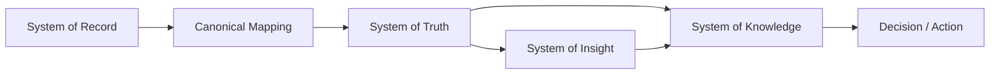
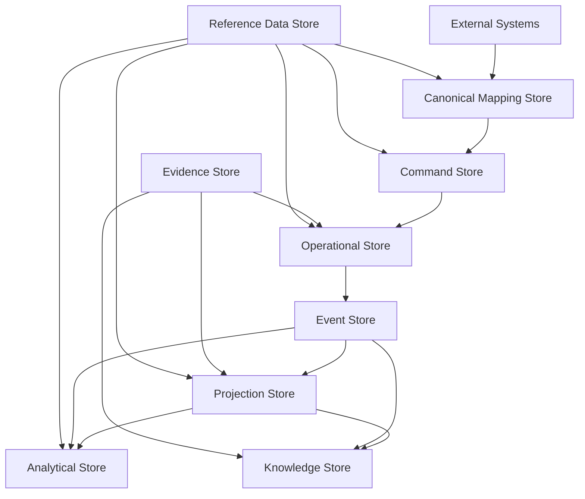
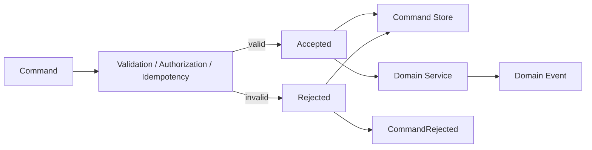
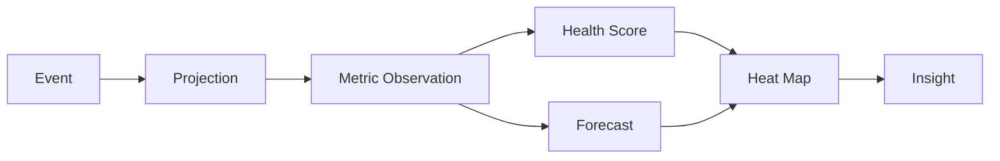
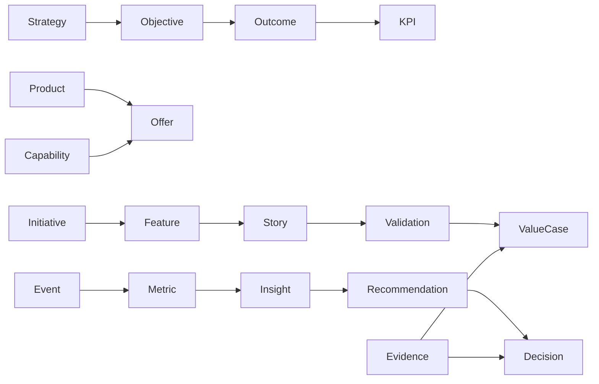
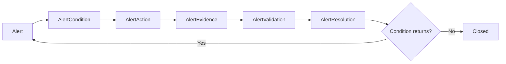

# EDIP Data Model

## 1. Objetivo do Data Model

Este documento define o modelo conceitual e lógico de dados da Enterprise Delivery Intelligence Platform, EDIP.

O objetivo é estabelecer como a EDIP organiza dados para sustentar:

- rastreabilidade;
- governança;
- auditoria;
- métricas;
- forecasts;
- heat maps;
- knowledge graph;
- explainability;
- copilots;
- value realization;
- alert closure;
- Need-to-Value flow.

Este documento não define DDL, SQL, tabelas físicas, índices físicos, particionamento físico, tecnologia específica, infraestrutura, pipelines ou código.

A EDIP não deve virar um banco central monolítico. Ela deve preservar ownership por domínio, respeitar sistemas de origem, criar contratos canônicos governados, separar dados operacionais de projeções analíticas e manter knowledge graph como camada própria de relações, evidências, decisões e aprendizado.

## 2. Data Modeling Principles

| Princípio | Definição | Implicação |
| --- | --- | --- |
| Domain-Owned Data | Dados pertencem a domínios com owner claro. | Cada entidade canônica deve ter domínio responsável e steward quando aplicável. |
| Canonical Data Contracts | A EDIP possui linguagem canônica própria. | Sistemas externos passam por contratos canônicos antes de afetar domínios internos. |
| Source System Respect | Sistemas de origem não devem ser apagados conceitualmente. | Origem, externalId, timestamp e qualidade da fonte devem ser preservados. |
| System of Record Preservation | O fato original permanece associado ao system of record. | A EDIP registra referência e lineage, não substitui automaticamente a fonte original. |
| System of Truth Governance | Visões reconciliadas para decisão precisam de governança. | Verdades corporativas exigem owner, regra, confiança e validade. |
| Evidence First | Decisões, validações, alertas e valor exigem evidência. | Evidence é entidade governada com classificação, validade, owner e política de acesso. |
| Event History First | Eventos são histórico de fatos consumados. | Estado atual deve ser explicável por eventos, correlações e causação. |
| Analytical Projection Separation | Projeções analíticas são separadas do estado operacional. | Métricas, scores, forecasts e heat maps não devem alterar estado de domínio diretamente. |
| Knowledge Graph Separation | Relações, causalidade e aprendizado ficam em camada própria. | Knowledge graph não substitui stores operacionais nem analíticos. |
| Metrics as Data Products | Métricas são produtos de dados governados. | Toda métrica possui owner, fórmula, fonte, periodicidade, target, lineage e confidence. |
| Auditability by Design | Auditoria deve ser consequência natural do modelo. | Decisões, eventos, evidências, mappings, forecasts e scores preservam histórico. |
| Security by Design | Classificação e autorização são parte do dado. | Dados sensíveis exigem escopo, finalidade, masking conceitual e trilha de acesso. |
| Lineage by Design | Origem e transformação devem ser rastreáveis. | Todo dado crítico deve responder de onde veio, como foi transformado e por quem é governado. |
| Temporal Modeling by Design | O tempo é dimensão central. | Modelo deve preservar validade, vigência, observação, ocorrência, registro e versão. |

## 3. Logical Data Stores

Os stores abaixo são separações lógicas de responsabilidade. Eles não representam bancos físicos, tecnologias ou deployables.

Ordem conceitual recomendada:

External Systems -> Canonical Mapping Store -> Command Store -> Operational Store -> Event Store -> Projection Store -> Analytical Store -> Knowledge Store -> Evidence Store -> Reference Data Store.

Esta ordem é conceitual, não física. Ela descreve responsabilidade lógica e fluxo de governança do dado, não topologia de implementação.

### Command Store

Também chamado de Command Log, registra comandos canônicos emitidos contra a EDIP.

Comandos são intenções, não fatos consumados. Comandos aceitos podem gerar eventos. Comandos rejeitados devem ser preservados quando forem relevantes para auditoria, rastreabilidade, segurança, troubleshooting, governança ou integração com adapters.

Modelo conceitual:

| Campo | Propósito |
| --- | --- |
| commandId | Identidade única do comando. |
| commandType | Tipo canônico do comando. |
| issuedBy | Ator, sistema ou adapter que emitiu o comando. |
| issuedAt | Momento de emissão. |
| source | Origem do comando, canal ou sistema externo. |
| targetEntity | Entidade ou escopo alvo. |
| payload conceitual | Intenção e dados necessários para avaliação. |
| validationStatus | Resultado de validação de regras de domínio. |
| authorizationStatus | Resultado de autorização, escopo e segregação. |
| executionStatus | Pending, Accepted, Executed, Rejected, Failed ou Superseded. |
| idempotencyKey | Chave para evitar reprocessamento indevido. |
| correlationId | Correlação com fluxo, integração, decisão, alerta ou investigação. |
| causationId | Comando, evento ou decisão que originou a intenção. |
| rejectionReason | Motivo de rejeição quando aplicável. |
| expectedEvent | Evento esperado se aceito e executado. |
| producedEvent | Evento produzido quando aplicável. |

### Operational Store

Armazena estado operacional canônico dos bounded contexts.

Domínios cobertos:

- Strategy;
- Portfolio;
- Business Discovery;
- Product Discovery;
- Requirements;
- Solution Design;
- Readiness;
- Delivery;
- Validation;
- Architecture Capability;
- Product;
- Governance;
- Value Realization.

Responsabilidades:

- preservar estado atual e versões relevantes;
- manter ownership, status, lifecycle e vínculos explícitos;
- suportar comandos e consultas operacionais;
- manter separação entre estado governado e projeções analíticas.

### Event Store

Armazena eventos externos canonicalizados, eventos canônicos, eventos de domínio, eventos de governança, eventos analíticos e eventos derivados.

Envelope mínimo conceitual:

| Campo | Propósito |
| --- | --- |
| eventId | Identidade única do evento. |
| eventName | Nome canônico do fato. |
| eventVersion | Versão do evento. |
| schemaVersion | Versão do contrato conceitual. |
| occurredAt | Momento em que o fato ocorreu. |
| recordedAt | Momento em que foi registrado pela EDIP. |
| sourceSystem | Sistema ou domínio de origem. |
| correlationId | Correlação de fluxo, iniciativa, alerta, decisão ou investigação. |
| causationId | Evento, comando ou decisão que causou este evento. |
| owner | Owner conceitual do evento. |
| evidenceReference | Referência opcional ou obrigatória à evidência. |

### Analytical Store

Armazena:

- métricas;
- observações;
- séries históricas;
- health scores;
- score components;
- forecasts;
- forecast scenarios;
- heat maps;
- economics metrics;
- agregações;
- data confidence.

Responsabilidades:

- preservar histórico analítico;
- separar cálculo de estado de domínio;
- suportar dashboards, heat maps, forecasts e alertas;
- permitir drill-down e drill-up com lineage.

### Knowledge Store

Armazena:

- knowledge graph;
- decision graph;
- evidence graph;
- capability graph;
- value graph;
- learning graph;
- causalidade;
- explicações;
- recomendações;
- narrativas;
- learnings;
- knowledge assets.

Responsabilidades:

- preservar relações entre entidades, eventos, métricas, evidências, decisões e aprendizado;
- sustentar Copilot, explainability, root cause analysis e busca corporativa;
- manter separação entre relação semântica e estado operacional.

### Evidence Store

Armazena referências e metadados de evidências. A EDIP não pressupõe que sempre armazena o conteúdo bruto da evidência.

Modelo conceitual:

| Elemento | Propósito |
| --- | --- |
| evidence metadata | Descrição, tipo, origem, entidade relacionada, data, autor e finalidade. |
| evidence classification | Sensibilidade, confidencialidade, privacidade, auditoria e uso permitido. |
| evidence owner | Responsável pela evidência e sua validade. |
| evidence validity | Período, expiração, status e critério de aceitação. |
| evidence source | Sistema, documento, evento, decisão ou fonte externa. |
| evidence pointer | Ponteiro conceitual para conteúdo bruto quando existir fora da EDIP. |
| evidence content | Conteúdo bruto, armazenado somente quando permitido e justificado. |
| evidence access policy | Regras de acesso, masking, auditoria e segregação de funções. |
| evidence retention policy | Regra de retenção conforme classificação e entidade suportada. |

### Canonical Mapping Store

Armazena mapeamentos entre modelos externos e conceitos canônicos EDIP.

Modelo conceitual:

| Elemento | Propósito |
| --- | --- |
| externalSystem | Sistema externo de origem. |
| externalEntityType | Tipo externo, como Jira Epic ou ServiceNow Change. |
| externalEntityId | Identificador externo. |
| canonicalEntityType | Tipo canônico EDIP. |
| canonicalEntityId | Identificador canônico EDIP. |
| mappingRule | Regra de mapeamento aplicada. |
| confidence | Confiança no mapeamento. |
| validityPeriod | Período de vigência do mapeamento. |
| mappingOwner | Responsável pela regra e qualidade do mapping. |

### Projection Store

Armazena views derivadas otimizadas para consulta, dashboards, drill-down, drill-up, heat maps, workspaces e Copilot retrieval.

Projection Store não é fonte de verdade primária. Projeções devem ser reconstruíveis a partir de Operational Store, Event Store, Analytical Store e Knowledge Store conforme o caso.

Diferenças conceituais:

| Store | Papel |
| --- | --- |
| Operational Store | Estado canônico governado dos bounded contexts. |
| Event Store | Histórico de fatos consumados e eventos derivados. |
| Projection Store | Read models e views derivadas para consumo eficiente e experiência. |
| Analytical Store | Métricas, séries, scores, forecasts, economics e agregações analíticas. |
| Knowledge Store | Relações, grafos, causalidade, explicações, decisões e aprendizado. |

Conteúdos típicos:

- operational projections;
- read models;
- dashboard projections;
- traceability projections;
- alert projections;
- queue projections;
- persona-specific projections.

### Reference Data Store

Armazena taxonomias governadas.

Taxonomias obrigatórias:

- status;
- severidade;
- criticidade;
- tipos de eventos;
- tipos de entidades;
- tipos de review;
- tipos de evidência;
- tipos de owner;
- tipos de decisão;
- tipos de health score;
- tipos de heat map;
- capability classifications.

## 4. System of Record, Truth, Insight and Knowledge

### System of Record

System of Record é a fonte original do fato. Ele preserva o registro primário conforme responsabilidade do sistema de origem.

Exemplos:

- plataforma de OKR para progresso de KR;
- ferramenta de delivery para mudanças de work item;
- ERP para funding ou custo;
- repositório de arquitetura para capability;
- EDIP para decisões, canonical mappings, intelligence e alert closure governado.

### System of Truth

System of Truth é a visão reconciliada, governada e aceita para decisão corporativa. Pode ser derivado de múltiplos systems of record e precisa declarar regras, owner, confidence e validade.

### System of Insight

System of Insight é a camada que produz interpretação analítica: métricas, scores, forecasts, heat maps, insights, root causes e recomendações.

### System of Knowledge

System of Knowledge preserva relações, causalidade, evidência, decisões, narrativas e aprendizado organizacional.

### Relação Entre Camadas

## 5. Canonical Entity Model

### Atributos Canônicos Comuns

Toda entidade canônica relevante deve possuir, quando aplicável:

- canonicalId;
- canonicalEntityType;
- displayName;
- description;
- ownerId;
- accountableId;
- status;
- lifecycleState;
- sensitivityClassification;
- sourceSystem;
- sourceId;
- systemOfRecord;
- systemOfTruth;
- createdAt;
- updatedAt;
- effectiveFrom;
- effectiveTo;
- validFrom;
- validTo;
- version;
- confidence;
- lineageReference;
- evidenceReferences.

### Strategy

| Entidade | Identidade Canônica | Atributos Principais | Owner | Lifecycle | Fonte / SoR / Truth | Eventos | Métricas / Evidências | Sensibilidade / Temporalidade |
| --- | --- | --- | --- | --- | --- | --- | --- | --- |
| CorporateStrategy | corporateStrategyId | name, cycle, strategicHorizon, status. | Diretor / Estratégia. | Draft, Active, Superseded, Retired. | Estratégia / OKR Platform / EDIP truth. | StrategyCreated, StrategyUpdated. | Strategic Health Score, strategic evidence. | Alta; histórico por ciclo. |
| StrategicTheme | strategicThemeId | themeName, priority, strategyId. | Estratégia. | Proposed, Active, Retired. | Estratégia / EDIP truth. | ThemeCreated, ThemeUpdated. | Strategic Alignment Coverage. | Média; vigência temporal. |
| StrategicObjective | strategicObjectiveId | objectiveStatement, targetState, themeId. | Diretor. | Proposed, Active, AtRisk, Achieved, Retired. | OKR Platform / EDIP truth. | ObjectiveCreated, ObjectiveRetired. | Strategic Health Score, KPI Target Deviation. | Alta; histórico obrigatório. |
| OKR | okrId | cycle, objectiveId, owner, status. | Diretor / PMO. | Draft, Active, Closed. | OKR Platform / EDIP truth. | OKRCreated, OKRClosed. | OKR Achievement Forecast. | Alta; por ciclo. |
| KeyResult | keyResultId | target, actual, unit, confidence. | KR Owner. | Proposed, Active, Achieved, Missed, Retired. | OKR Platform / EDIP truth. | KRTargetChanged, KeyResultProgressUpdated. | KR Forecast Probability. | Alta; série temporal. |
| Outcome | outcomeId | outcomeType, expectedChange, measurementApproach. | Product / Strategy Owner. | Defined, Measuring, Achieved, Degraded, Retired. | EDIP / Product sources. | OutcomeDefined, OutcomeAssigned. | Product Outcome Progress, Value Realization Score. | Alta; evidência por medição. |

### Portfolio

| Entidade | Identidade Canônica | Atributos Principais | Owner | Lifecycle | Fonte / SoR / Truth | Eventos | Métricas / Evidências | Sensibilidade / Temporalidade |
| --- | --- | --- | --- | --- | --- | --- | --- | --- |
| Portfolio | portfolioId | name, strategyLinks, capacityEnvelope, riskProfile. | Superintendente / PMO. | Proposed, Active, Rebalanced, Closed. | Portfolio tool / EDIP truth. | PortfolioCreated, PortfolioReprioritized. | Portfolio Health Score, Investment At Risk. | Alta; histórico de priorização. |
| Investment | investmentId | amount, category, approvedValue, consumedValue. | Sponsor / Financeiro. | Proposed, Approved, Active, Paused, Closed. | ERP / Portfolio / EDIP truth. | InvestmentProposed, InvestmentApproved. | Funding Variance, Cost of Delay. | Restrita; histórico financeiro. |
| FundingCycle | fundingCycleId | cycleName, period, budgetEnvelope. | Financeiro / PMO. | Planned, Open, Locked, Closed. | ERP / EDIP truth. | FundingAllocated, FundingChanged. | Funding Variance. | Restrita; por ciclo. |
| Idea | ideaId | summary, submitter, problemHint, source. | Business / Product. | Submitted, Qualified, Rejected, Converted. | EDIP / intake tools. | IdeaSubmitted, IdeaQualified, IdeaRejected. | Opportunity Conversion Rate. | Média; histórico leve. |
| Opportunity | opportunityId | valueHypothesis, strategicFit, assessmentScore. | Product / Portfolio. | Identified, Assessing, Approved, Rejected, Converted. | EDIP truth. | OpportunityCreated, OpportunityApproved, OpportunityRejected. | Opportunity Conversion Rate, Delay Impact Score. | Alta; decisão auditável. |
| Initiative | initiativeId | objectiveLinks, scope, owner, risk, targetDate. | Gerente / PMO. | Proposed, Approved, Started, Paused, Completed, Cancelled. | Portfolio / Delivery / EDIP truth. | InitiativeCreated, InitiativeStarted, InitiativeCompleted. | Initiative Health Score, Cost of Delay. | Alta; histórico obrigatório. |

### Business Discovery

| Entidade | Identidade Canônica | Atributos Principais | Owner | Lifecycle | Fonte / SoR / Truth | Eventos | Métricas / Evidências | Sensibilidade / Temporalidade |
| --- | --- | --- | --- | --- | --- | --- | --- | --- |
| BusinessNeed | businessNeedId | needStatement, originator, sourceChannel. | Business Owner. | Proposed, UnderAnalysis, Accepted, Rejected. | EDIP / intake. | BusinessNeedCaptured. | Business Discovery Health. | Média; vigência até conversão. |
| PainPoint | painPointId | painDescription, affectedJourney, severity. | Business Owner. | Hypothesized, Evidenced, Accepted, Rejected. | EDIP truth. | PainPointRegistered. | Evidence Coverage. | Média/Alta; exige evidência. |
| CustomerJourney | customerJourneyId | journeyName, persona, stages, painLinks. | Business / Product. | Draft, Active, Updated, Retired. | Journey tools / EDIP truth. | JourneyMapped. | Traceability Health Score. | Média; versionado. |
| OperationalJourney | operationalJourneyId | processActors, operationalSteps, handoffs. | Operations Owner. | Draft, Active, Updated, Retired. | Process tools / EDIP truth. | OperationalJourneyMapped. | Business Discovery Health. | Média; versionado. |
| BusinessProcess | businessProcessId | processName, scope, controls, owner. | Process Owner. | Active, Changing, Retired. | BPM tools / EDIP truth. | ProcessLinked. | Control Adherence Rate. | Média; vigência temporal. |
| BusinessProblem | businessProblemId | problemStatement, impact, rootSignals. | Business Owner. | Draft, Validated, Solved, Archived. | EDIP truth. | BusinessProblemDefined. | Discovery Quality Score. | Alta quando impacta decisão. |
| BusinessEvidence | businessEvidenceId | evidenceType, source, validity, classification. | Evidence Owner. | Attached, Validated, Expired, Rejected. | Evidence source / Evidence Store. | BusinessEvidenceAttached. | Evidence Coverage, Data Confidence. | Classificada; validade obrigatória. |

### Product Discovery

| Entidade | Identidade Canônica | Atributos Principais | Owner | Lifecycle | Fonte / SoR / Truth | Eventos | Métricas / Evidências | Sensibilidade / Temporalidade |
| --- | --- | --- | --- | --- | --- | --- | --- | --- |
| Discovery | discoveryId | scope, needLinks, owner, startDate. | Product Manager. | Planned, Running, Completed, Cancelled. | EDIP truth. | DiscoveryStarted, DiscoveryCompleted. | Discovery Lead Time, Discovery Quality Score. | Média; histórico obrigatório. |
| DiscoveryHypothesis | hypothesisId | hypothesisStatement, expectedBenefit, validationMethod. | Product Owner. | Draft, Testing, Validated, Invalidated, Archived. | EDIP truth. | HypothesisDefined, HypothesisValidated. | Hypothesis Validation Accuracy. | Alta quando usada em funding. |
| DiscoveryExperiment | experimentId | method, sample, result, confidence. | Product / Research. | Planned, Running, Completed, Inconclusive. | Research tools / EDIP truth. | ExperimentStarted, ExperimentCompleted. | Discovery Quality Score. | Pode conter dado sensível. |
| DiscoveryFinding | findingId | observation, evidenceLinks, implication. | Product Manager. | Captured, Reviewed, Accepted, Rejected. | EDIP truth. | FindingCaptured. | Evidence Coverage. | Média; evidenciação. |
| DiscoveryOutcome | discoveryOutcomeId | outcomeSummary, decision, nextStep. | Product Manager. | Draft, Approved, Rejected, Superseded. | EDIP truth. | DiscoveryOutcomeDefined. | Discovery Rework Rate. | Alta quando suporta decisão. |
| ProblemStatement | problemStatementId | statement, affectedUsers, impact. | Product / Business. | Draft, Validated, Superseded. | EDIP truth. | ProblemStatementDefined. | Traceability Health Score. | Média; versionado. |
| OpportunityAssessment | opportunityAssessmentId | value, risk, effort, confidence. | Product / Portfolio. | Draft, Reviewed, Approved, Rejected. | EDIP truth. | OpportunityAssessed. | Delay Impact Score. | Alta; decisão auditável. |

### Requirements

| Entidade | Identidade Canônica | Atributos Principais | Owner | Lifecycle | Fonte / SoR / Truth | Eventos | Métricas / Evidências | Sensibilidade / Temporalidade |
| --- | --- | --- | --- | --- | --- | --- | --- | --- |
| FunctionalRequirement | functionalRequirementId | requirementText, origin, priority, acceptanceLinks. | Product Owner. | Draft, Reviewed, Approved, Implemented, Retired. | EDIP / ALM tools. | RequirementCreated, RequirementApproved. | Requirements Health. | Média; versionado. |
| NonFunctionalRequirement | nonFunctionalRequirementId | qualityAttribute, threshold, rationale. | Architect / Specialist. | Draft, Reviewed, Approved, Implemented. | EDIP truth. | RequirementCreated, RequirementApproved. | Architecture Review Health. | Alta quando regulatório. |
| BusinessRule | businessRuleId | ruleStatement, policyLink, exceptionAllowed. | Business / Compliance. | Draft, Active, Superseded, Retired. | Policy / EDIP truth. | BusinessRuleDefined. | Control Adherence Rate. | Alta; histórico obrigatório. |
| AcceptanceCriterion | acceptanceCriterionId | criterion, validationMethod, expectedResult. | Product Owner. | Draft, Approved, Validated, Failed. | EDIP / ALM tools. | AcceptanceCriterionDefined. | Validation Health. | Média; por versão. |
| DefinitionOfReady | dorId | checklist, requiredEvidence, approver. | PO / Scrum Master. | Draft, Active, Superseded. | EDIP truth. | DefinitionOfReadyUpdated. | Readiness Health. | Média; versionado. |
| DefinitionOfDone | dodId | checklist, validationRules, approver. | Engineering / Product. | Draft, Active, Superseded. | EDIP truth. | DefinitionOfDoneUpdated. | Delivery Health. | Média; versionado. |
| Constraint | constraintId | constraintType, description, impact. | Domain Owner. | Identified, Active, Mitigated, Removed. | EDIP truth. | ConstraintRegistered. | Initiative Risk Exposure. | Variável; temporal. |
| Dependency | dependencyId | depender, dependee, dueDate, owner. | PMO / Delivery Owner. | Raised, Active, Blocked, Resolved, Cancelled. | Delivery / EDIP truth. | DependencyRaised, DependencyResolved. | Dependency Aging, Blocked Time. | Alta; histórico. |
| Risk | riskId | riskType, probability, impact, mitigation. | Risk Owner. | Identified, Assessed, Mitigating, Accepted, Closed. | Risk tools / EDIP truth. | RiskCreated, RiskAccepted. | Initiative Risk Exposure. | Restrita quando material. |
| Assumption | assumptionId | assumptionStatement, validationPlan, confidence. | Domain Owner. | Stated, Validating, Confirmed, Invalidated. | EDIP truth. | AssumptionRegistered. | Discovery Quality Score. | Média; temporal. |

### Solution Design

| Entidade | Identidade Canônica | Atributos Principais | Owner | Lifecycle | Fonte / SoR / Truth | Eventos | Métricas / Evidências | Sensibilidade / Temporalidade |
| --- | --- | --- | --- | --- | --- | --- | --- | --- |
| SolutionDesign | solutionDesignId | scope, requirementLinks, architectureLinks, decisionStatus. | Solution Architect. | Draft, UnderReview, Approved, Rejected, Superseded. | EDIP truth. | SolutionDesignCreated, SolutionApproved. | Solution Health. | Alta; versionado. |
| SolutionRecord | solutionRecordId | designSummary, alternatives, rationale. | Solution Architect. | Draft, Approved, Superseded. | EDIP / architecture repo. | SolutionRecordCreated. | Architecture Review Health. | Alta; histórico. |
| SolutionDecision | solutionDecisionId | decision, options, rationale, authority. | Decision Owner. | Proposed, Approved, Rejected, Superseded. | EDIP / Governance. | SolutionDecisionRecorded. | Decision Latency. | Alta; auditável. |
| ArchitectureReview | architectureReviewId | reviewOutcome, findings, debtLinks. | Arquiteto. | Requested, InReview, Approved, Rejected. | EDIP / architecture repo. | ArchitectureReviewCompleted. | Architecture Review Health. | Alta; evidência. |
| EngineeringReview | engineeringReviewId | feasibility, risks, technicalNotes. | Líder Técnico. | Requested, InReview, Approved, Rejected. | EDIP / engineering tools. | EngineeringReviewCompleted. | Engineering Review Health. | Média/Alta. |
| SecurityReview | securityReviewId | securityFindings, controls, approval. | Security Specialist. | Requested, InReview, Approved, Rejected. | Security tools / EDIP truth. | SecurityReviewCompleted. | Control Adherence Rate. | Restrita. |
| DataReview | dataReviewId | lineage, privacy, quality, sourceUse. | Data Specialist. | Requested, InReview, Approved, Rejected. | Data governance / EDIP truth. | DataReviewCompleted. | Data Confidence Score. | Restrita. |
| ComplianceReview | complianceReviewId | regulatoryScope, findings, controls. | Compliance Specialist. | Requested, InReview, Approved, Rejected. | Compliance tools / EDIP truth. | ComplianceReviewCompleted. | Compliance Issue Count. | Restrita. |
| SolutionApproval | solutionApprovalId | approver, decision, date, evidence. | Governance / Approver. | Pending, Approved, Rejected, Expired. | EDIP Governance. | SolutionApproved, SolutionRejected. | Approval Aging. | Alta; auditável. |
| SolutionEvidence | solutionEvidenceId | evidenceType, source, validity. | Evidence Owner. | Attached, Validated, Expired, Rejected. | Evidence Store. | SolutionEvidenceAttached. | Evidence Coverage. | Classificada. |

### Readiness

| Entidade | Identidade Canônica | Atributos Principais | Owner | Lifecycle | Fonte / SoR / Truth | Eventos | Métricas / Evidências | Sensibilidade / Temporalidade |
| --- | --- | --- | --- | --- | --- | --- | --- | --- |
| ReadinessAssessment | readinessAssessmentId | scope, status, blockers, approval. | PMO / Delivery Owner. | Started, Blocked, Approved, Rejected. | EDIP truth. | ReadinessAssessmentStarted, ReadinessApproved. | Readiness Health. | Alta; histórico. |
| ReadinessChecklist | readinessChecklistId | items, completion, missingEvidence. | Scrum Master / PMO. | Draft, Active, Completed. | EDIP truth. | ReadinessChecklistUpdated. | Readiness Health. | Média. |
| DependencyAssessment | dependencyAssessmentId | dependencyLinks, severity, dueDate. | PMO. | Draft, Reviewed, Approved. | EDIP truth. | DependencyAssessmentCompleted. | Dependency Aging. | Média/Alta. |
| RiskAssessment | riskAssessmentId | risks, exposure, mitigation. | Risk Owner. | Draft, Reviewed, Accepted, Closed. | Risk / EDIP truth. | RiskAssessmentCompleted. | Initiative Risk Exposure. | Restrita quando material. |
| CapacityAssessment | capacityAssessmentId | teamCapacity, demand, constraints. | Manager / Coordinator. | Draft, Reviewed, Approved. | Planning tools / EDIP truth. | CapacityAssessed. | Capacity Allocation Fit. | Média. |
| Blocker | blockerId | blockerType, severity, owner, evidence, resolution. | Blocker Owner. | Created, Active, Escalated, Resolved, Reopened. | EDIP truth. | BlockerCreated, BlockerResolved. | Blocked Time, Blocker Resolution Health. | Alta; histórico. |

### Delivery

| Entidade | Identidade Canônica | Atributos Principais | Owner | Lifecycle | Fonte / SoR / Truth | Eventos | Métricas / Evidências | Sensibilidade / Temporalidade |
| --- | --- | --- | --- | --- | --- | --- | --- | --- |
| Epic | epicId | title, initiativeId, scope, status. | Product / Delivery Owner. | Proposed, Ready, InProgress, Done, Cancelled. | Jira / Azure DevOps / EDIP truth. | EpicCreated, EpicCompleted. | Epic Completion Rate. | Média; workflow histórico. |
| Feature | featureId | title, epicId, requirements, status, owner. | Product Owner. | Proposed, Ready, InDevelopment, Validating, Completed, Cancelled. | ALM tools / EDIP truth. | FeatureCreated, FeatureStarted, FeatureBlocked, FeatureCompleted. | Feature Value Score, Lead Time. | Média; histórico. |
| Story | storyId | featureId, acceptanceCriteria, status. | Squad / PO. | Proposed, Ready, InProgress, Done, Rejected. | ALM tools / EDIP truth. | StoryCreated, StoryCompleted. | Cycle Time, Throughput. | Baixa/Média. |
| Task | taskId | storyId, workType, assignee, status. | Squad. | ToDo, InProgress, Done, Cancelled. | ALM tools / EDIP truth. | TaskCreated, TaskCompleted. | WIP by Flow Stage. | Baixa/Média. |
| Release | releaseId | releaseName, scope, releaseDate, readiness. | Release Owner. | Planned, Candidate, Approved, Published, RolledBack. | Release tools / EDIP truth. | ReleaseCandidateCreated, ReleasePublished. | Release Lead Time, Release Readiness. | Alta quando crítico. |

### Architecture Capability

| Entidade | Identidade Canônica | Atributos Principais | Owner | Lifecycle | Fonte / SoR / Truth | Eventos | Métricas / Evidências | Sensibilidade / Temporalidade |
| --- | --- | --- | --- | --- | --- | --- | --- | --- |
| ArchitectureDomain | architectureDomainId | name, owner, scope. | Arquiteto Corporativo. | Active, Retired. | Architecture repo / EDIP truth. | DomainCreated. | Capability Coverage. | Média; histórico. |
| ArchitectureSubDomain | architectureSubDomainId | domainId, name, owner. | Domain Architect. | Active, Retired. | Architecture repo / EDIP truth. | SubDomainCreated. | Capability Coverage. | Média. |
| BusinessLayer | businessLayerId | subDomainId, layerName. | Business Architect. | Active, Retired. | Architecture repo / EDIP truth. | BusinessLayerCreated. | Capability Coverage. | Média. |
| Capability | capabilityId | layerId, purpose, criticality, owner. | Capability Owner. | Proposed, Active, Degraded, Modernizing, Retired. | Architecture repo / EDIP truth. | CapabilityCreated, CapabilityUpdated, CapabilityRetired, CapabilityHealthDegraded. | Capability Health Score, Capability Traceability Health. | Alta para capability crítica. |
| BusinessService | businessServiceId | capabilityId, serviceName, owner. | Business Service Owner. | Active, Deprecated, Retired. | Architecture repo / EDIP truth. | BusinessServiceCreated. | Service Health Score. | Média/Alta. |
| TechnologyService | technologyServiceId | capabilityId, technologyScope, owner. | Technology Service Owner. | Active, Deprecated, Retired. | Architecture repo / EDIP truth. | TechnologyServiceCreated. | Service Modernization Score. | Média/Alta. |
| Offer | offerId | serviceLinks, offerName, productUsage. | Offer Owner. | Proposed, Active, Deprecated, Retired. | Architecture repo / EDIP truth. | OfferCreated, OfferRetired. | Offer Health Score, Offer Adoption Score. | Alta quando product-critical. |
| ApplicationService | applicationServiceId | offerId, applicationName, runtimeCriticality. | App Owner. | Active, Modernizing, Retired. | CMDB / architecture repo / EDIP truth. | ApplicationServiceLinked. | Architecture Debt Score. | Restrita quando crítica. |
| ProductOfferAssociation | productOfferAssociationId | productId, offerId, reason, validity. | Product Owner / Offer Owner. | Proposed, Active, Superseded, Removed. | EDIP truth. | ProductOfferAssociated, ProductOfferRemoved. | Offer Traceability Health. | Alta; histórico obrigatório. |
| ArchitectureDebt | architectureDebtId | affectedEntity, severity, cause, remediation. | Architect / Entity Owner. | Registered, Accepted, Remediating, Resolved. | EDIP / architecture repo. | ArchitectureDebtRegistered, ArchitectureDebtResolved. | Architecture Debt Score. | Alta; auditável. |
| ArchitectureException | architectureExceptionId | scope, rationale, expiry, controls. | Architecture Governance. | Requested, Granted, Expired, Closed. | EDIP Governance. | ArchitectureExceptionGranted, ArchitectureExceptionExpired. | Architecture Exception Rate. | Alta; auditável. |
| ModernizationPlan | modernizationPlanId | targetEntity, scope, milestones, decision. | Architecture / PMO. | Proposed, Approved, InProgress, Completed, Delayed. | EDIP truth. | CapabilityModernizationStarted, ServiceModernizationDelayed. | Capability Modernization Score. | Alta; histórico. |

### Product

| Entidade | Identidade Canônica | Atributos Principais | Owner | Lifecycle | Fonte / SoR / Truth | Eventos | Métricas / Evidências | Sensibilidade / Temporalidade |
| --- | --- | --- | --- | --- | --- | --- | --- | --- |
| Product | productId | name, owner, offerComposition, valueProposition. | Product Owner. | Proposed, Active, Evolving, Retired. | Product tools / EDIP truth. | ProductCreated, ProductOfferAssociated. | Product Health Score. | Alta; composição histórica. |
| ProductOutcome | productOutcomeId | productId, outcomeId, measurementPlan. | Product Manager. | Defined, Measuring, Achieved, Degraded. | EDIP truth. | OutcomeAssigned. | Product Outcome Progress. | Alta; temporal. |
| Roadmap | roadmapId | productId, horizon, version, owner. | Product Owner. | Draft, Committed, Replanned, Archived. | Product tools / EDIP truth. | RoadmapCommitted. | Roadmap Confidence. | Média/Alta; versionado. |
| RoadmapItem | roadmapItemId | roadmapId, itemType, targetPeriod, status. | Product Owner. | Proposed, Committed, Delivered, Deferred, Cancelled. | Product tools / EDIP truth. | RoadmapItemCreated. | Backlog Strategic Alignment. | Média; histórico. |

### Validation

| Entidade | Identidade Canônica | Atributos Principais | Owner | Lifecycle | Fonte / SoR / Truth | Eventos | Métricas / Evidências | Sensibilidade / Temporalidade |
| --- | --- | --- | --- | --- | --- | --- | --- | --- |
| Validation | validationId | targetEntity, criteria, result, owner. | Validation Owner. | Planned, Running, Passed, Failed, Reopened. | EDIP truth. | ValidationStarted, ValidationCompleted, ValidationRejected. | Validation Health. | Alta; auditável. |
| AcceptanceValidation | acceptanceValidationId | acceptanceCriteria, result. | Product Owner. | Pending, Passed, Failed. | EDIP truth. | AcceptanceValidationCompleted. | Validation Time. | Média. |
| BusinessValidation | businessValidationId | businessOutcome, validator, result. | Business Owner. | Pending, Passed, Failed. | EDIP truth. | BusinessValidationCompleted. | Value Realization Score. | Alta. |
| TechnicalValidation | technicalValidationId | technicalCriteria, evidence, result. | Líder Técnico. | Pending, Passed, Failed. | Engineering tools / EDIP truth. | TechnicalValidationCompleted. | Technical Delivery Health. | Média/Alta. |
| OutcomeValidation | outcomeValidationId | outcomeId, measurementResult, confidence. | Outcome Owner. | Pending, Validated, Rejected. | EDIP truth. | OutcomeValidated, OutcomeRejected. | Product Outcome Progress. | Alta; histórico. |
| BenefitValidation | benefitValidationId | benefitId, method, validator, result. | Value Owner. | Started, Validated, Rejected. | EDIP truth. | BenefitValidationStarted, BenefitValidated, BenefitRejected. | Validated Benefit. | Alta; auditável. |
| ValueValidation | valueValidationId | valueCaseId, valueResult, evidence. | Sponsor / Financeiro. | Pending, Validated, Rejected. | EDIP truth. | ValueRealizationValidated. | Value Realization Score. | Restrita. |

### Value Realization

| Entidade | Identidade Canônica | Atributos Principais | Owner | Lifecycle | Fonte / SoR / Truth | Eventos | Métricas / Evidências | Sensibilidade / Temporalidade |
| --- | --- | --- | --- | --- | --- | --- | --- | --- |
| ValueCase | valueCaseId | hypothesis, baseline, target, method, owner. | Sponsor / Product Manager. | Draft, Approved, Measuring, Realized, Rejected, Closed. | EDIP truth. | ValueCaseCreated. | Planned Value, Value Realization Score. | Restrita; histórico. |
| BenefitHypothesis | benefitHypothesisId | expectedBenefit, assumptions, KPI links. | Product / Sponsor. | Proposed, Validating, Confirmed, Invalidated. | EDIP truth. | BenefitHypothesisDefined. | Value Forecast Confidence. | Alta. |
| ObservedBenefit | observedBenefitId | observedValue, period, source, confidence. | Value Owner. | Observed, UnderValidation, Superseded. | ERP / analytics / EDIP truth. | BenefitObserved. | Realized Benefit. | Restrita. |
| ValidatedBenefit | validatedBenefitId | validatedValue, validator, evidence. | Sponsor / Financeiro. | Validated, Adjusted, Reversed. | EDIP truth. | BenefitValidated. | Validated Benefit, ROI. | Restrita; auditável. |
| RejectedBenefit | rejectedBenefitId | rejectedValue, reason, evidence. | Value Owner. | Rejected, Appealed, Closed. | EDIP truth. | BenefitRejected. | Benefit Variance, Value Leakage. | Restrita. |
| ValueLeakage | valueLeakageId | amount, cause, affectedValueCase, owner. | Sponsor / PMO. | Detected, Investigating, Mitigating, Closed. | EDIP insight/truth. | ValueLeakageDetected. | Value Leakage. | Restrita; histórico. |

### Governance

| Entidade | Identidade Canônica | Atributos Principais | Owner | Lifecycle | Fonte / SoR / Truth | Eventos | Métricas / Evidências | Sensibilidade / Temporalidade |
| --- | --- | --- | --- | --- | --- | --- | --- | --- |
| Decision | decisionId | decisionType, authority, rationale, impact. | Decision Owner. | Created, Pending, Approved, Rejected, Superseded. | EDIP Governance. | DecisionCreated, DecisionApproved, DecisionRejected. | Decision Latency. | Alta; auditável. |
| DecisionGate | decisionGateId | gateType, criteria, authority, status. | PMO / Governance. | Open, UnderReview, Approved, Rejected, Expired. | EDIP Governance. | DecisionGateOpened, GateApproved, GateRejected. | Approval Aging. | Alta. |
| Approval | approvalId | approver, request, outcome, timestamp. | Approver. | Requested, Approved, Rejected, Expired. | EDIP Governance. | ApprovalRequested, ApprovalGranted. | Approval Cycle Time. | Alta; auditável. |
| Evidence | evidenceId | metadata, classification, source, validity. | Evidence Owner. | Registered, Validated, Expired, Rejected. | Evidence Store. | EvidenceAttached. | Evidence Coverage. | Classificada. |
| Control | controlId | controlType, policy, evidenceRequired, owner. | Risk / Compliance. | Active, Assessed, Failed, Retired. | GRC / EDIP truth. | ControlAssessmentCompleted. | Control Adherence Rate. | Restrita. |
| Exception | exceptionId | exceptionType, scope, expiry, riskAccepted. | Governance Owner. | Requested, Granted, Expired, Closed. | EDIP Governance. | ExceptionGranted, ExceptionExpired. | Standard Exception Aging. | Alta. |
| AuditTrailEntry | auditTrailEntryId | actor, action, entity, timestamp, evidence. | Audit / Platform. | Recorded, Archived. | EDIP. | AuditTrailRecorded. | Auditability indicators. | Restrita; retenção longa. |

### Metrics and Intelligence

| Entidade | Identidade Canônica | Atributos Principais | Owner | Lifecycle | Fonte / SoR / Truth | Eventos | Métricas / Evidências | Sensibilidade / Temporalidade |
| --- | --- | --- | --- | --- | --- | --- | --- | --- |
| KPI | kpiId | name, formula, owner, target, confidence. | KPI Owner. | Draft, Approved, Active, Retired. | EDIP Metrics. | KPICreated, KPIUpdated. | KPI Target Deviation. | Alta; série temporal. |
| MetricDefinition | metricDefinitionId | formula, source, periodicity, unit, owner. | Metric Owner. | Draft, Approved, Active, Retired. | EDIP Metrics. | MetricDefinitionCreated, MetricDefinitionApproved. | Metric Ownership Coverage. | Alta; versionada. |
| MeasurementTarget | measurementTargetId | targetEntityType, targetEntityId, metricLinks. | Metric Owner. | Active, Superseded, Retired. | EDIP Metrics. | MeasurementTargetAssigned. | Traceability Health Score. | Média/Alta. |
| HealthScore | healthScoreId | scoreType, value, components, confidence. | Score Owner. | Calculated, Published, Superseded. | Analytical Store. | HealthScoreCalculated. | Health score catalog. | Alta; histórico. |
| Forecast | forecastId | forecastType, scenario, confidence, assumptions. | Forecast Owner. | Generated, Updated, Superseded, Archived. | Analytical Store. | ForecastGenerated, ForecastUpdated. | Forecast Confidence, Forecast Accuracy. | Alta; versionado. |
| HeatMap | heatMapId | dimension, scope, period, cells. | Analytics Owner. | Generated, Published, Superseded. | Analytical Store. | HeatMapGenerated. | Heat map metrics. | Média/Alta. |
| Alert | alertId | alertType, severity, owner, status. | Alert Owner. | Detected, ActionRequired, EvidenceRequired, ValidationRequired, Resolved, Reopened. | EDIP Alert. | AlertDetected, AlertReopened. | Alert Aging, Alert Resolution Health. | Alta; auditável. |
| AlertCondition | alertConditionId | triggerRule, threshold, originalCondition. | Alert Owner / Metric Owner. | Active, Validated, Accepted, Superseded. | EDIP Alert. | AlertConditionValidated. | Alert Resolution Health. | Alta. |
| AlertAction | alertActionId | action, owner, dueDate, expectedOutcome. | Action Owner. | Registered, InProgress, Completed, Cancelled. | EDIP Alert. | AlertActionRegistered. | Alert Resolution Time. | Alta. |
| AlertEvidence | alertEvidenceId | evidenceId, actionId, proofType. | Evidence Owner. | Attached, Validated, Rejected. | Evidence Store. | AlertEvidenceAttached. | Evidence Coverage. | Classificada. |
| AlertValidation | alertValidationId | validator, outcome, conditionStatus. | Reviewer / Authority. | Pending, Validated, Failed, AcceptedRisk. | EDIP Alert. | AlertConditionValidated. | Alert Resolution Health. | Alta; auditável. |
| AlertResolution | alertResolutionId | closureDecision, reason, evidenceIds. | Alert Owner / Accountable. | Proposed, Valid, Invalid, Reopened. | EDIP Alert. | AlertResolved. | Alert Resolution Health. | Alta; auditável. |
| Signal | signalId | signalType, source, observedValue, confidence. | Intelligence Owner. | Detected, Accepted, Ignored, Superseded. | System of Insight. | SignalDetected. | Recommendation Actionability. | Média. |
| Insight | insightId | insightType, summary, evidenceChain, confidence. | Domain / Intelligence Owner. | Detected, Investigating, Actioned, Learned. | Knowledge Store. | InsightGenerated. | Insight Accuracy. | Média/Alta. |
| Explanation | explanationId | question, answer, causalChain, limitations. | Explanation Owner. | Drafted, Reviewed, Approved, Superseded. | Knowledge Store. | ExplanationGenerated. | Explainability Coverage. | Alta quando decisória. |
| RootCause | rootCauseId | category, causalType, confidence, evidence. | Investigation Owner. | Proposed, Validated, Rejected, Resolved. | Knowledge Store. | RootCauseIdentified. | Root Cause Accuracy. | Alta. |
| Recommendation | recommendationId | action, urgency, owner, riskOfInaction. | Recommendation Owner. | Proposed, Accepted, Rejected, Expired. | Knowledge Store. | RecommendationGenerated. | Recommendation Acceptance Rate. | Média/Alta. |
| ActionPlan | actionPlanId | actions, owners, dueDates, successCriteria. | Action Plan Owner. | Draft, Approved, InProgress, Completed, Cancelled. | EDIP / Governance. | RemediationPlanCreated, RemediationPlanCompleted. | Action Aging. | Alta quando crítico. |
| Learning | learningId | lesson, context, applicability, evidence. | Knowledge Steward. | Proposed, Validated, Published, Reused, Retired. | Knowledge Store. | LearningCaptured. | Knowledge Reuse Rate. | Média; versionado. |

## 6. Canonical Identity Model

| Elemento | Definição |
| --- | --- |
| canonicalId | Identidade primária da EDIP para uma entidade canônica. |
| sourceId | Identificador fornecido pela fonte original. |
| sourceSystem | Sistema de origem do registro ou evento. |
| externalId | Identificador externo preservado para rastreabilidade. |
| naturalKey | Chave de negócio estável quando existir. |
| surrogate identity | Identidade técnica conceitual usada quando não há chave natural confiável. |
| correlation identity | Identidade usada para agrupar eventos, comandos, investigação, fluxo ou transação. |
| entity version | Versão da entidade canônica. |
| validity period | Intervalo em que a entidade ou relação é válida. |
| merge policy | Regra para consolidar duplicidades ou representações conflitantes. |
| duplicate detection | Processo de identificação de registros duplicados por chave, similaridade, fonte e contexto. |
| identity confidence | Confiança na correspondência entre fonte externa e entidade canônica. |

### Política de Duplicidade

A EDIP evita duplicidade por:

- preservação de externalId e sourceSystem;
- canonical mapping governado;
- validação de naturalKey;
- matching por contexto, owner, tipo, período e relações;
- identity confidence explícito;
- merge policy auditável;
- histórico de split e merge quando necessário.

## 7. Canonical Mapping Model

Dados externos são traduzidos para contratos canônicos antes de impactar domínio, evento, métrica ou knowledge graph.

| Mapping Externo | Contrato Canônico | Regra Conceitual |
| --- | --- | --- |
| Jira Epic | Canonical Feature ou Epic | Depende do workflow, hierarquia local e regra de mapping aprovada. |
| Azure DevOps Feature | Canonical Feature | Preserva area path, iteration, state e parent links como lineage. |
| GitHub Issue | Canonical Story ou Task | Depende do tipo, labels, vínculo com feature e granularidade. |
| ServiceNow Change | Canonical Decision, Review ou Governance Event | Depende de change type, approval flow e impacto de governança. |
| Confluence Page | Evidence ou KnowledgeAsset | Depende de finalidade, owner, validade e classificação. |
| ERP Investment Record | Investment ou FundingCycle | Depende de ciclo financeiro, centro de custo e decisão de funding. |
| Architecture Repository Capability | Capability | Preserva domínio, subdomínio, owner, criticidade e vigência. |

Cada mapping deve declarar:

- mappingRule;
- mappingOwner;
- transformationRationale;
- confidence;
- validationStatus;
- effectiveDate;
- expirationDate;
- sourceSystem;
- canonicalEntityType;
- canonicalEntityId.

## 8. Command Data Model

Comandos representam intenção. Eles não são eventos. Um evento só existe após comando aceito e executado pelo domínio.

### Command Envelope

| Campo | Propósito |
| --- | --- |
| commandId | Identidade única do comando. |
| commandType | Tipo canônico do comando. |
| issuedBy | Usuário, sistema ou serviço que emitiu o comando. |
| issuedAt | Momento de emissão. |
| source | Canal, sistema ou adapter de origem. |
| targetEntity | Entidade alvo ou escopo. |
| payload conceitual | Dados necessários à intenção. |
| validation rules | Regras aplicáveis antes da execução. |
| expected event | Evento esperado se aceito. |
| authorization requirements | Permissões, escopos e segregação necessários. |
| idempotency key | Chave para evitar duplicação. |
| correlationId | Correlação com fluxo, decisão, alerta ou integração. |

| Comando | Payload Conceitual | Regras de Validação | Evento Esperado | Autorização |
| --- | --- | --- | --- | --- |
| CreateNeedCommand | needStatement, owner, sourceChannel, initialEvidence. | Owner obrigatório; origem registrada. | BusinessNeedCaptured. | Business scope. |
| RegisterPainPointCommand | businessNeedId, painDescription, severity, evidence. | Need válido; evidência ou hipótese explícita. | PainPointRegistered. | Business/Product scope. |
| CreateOpportunityCommand | problemStatement, valueHypothesis, assessment. | Discovery ou justificativa formal. | OpportunityCreated. | Product/Portfolio scope. |
| ApproveOpportunityCommand | opportunityId, decision, authority, evidence. | Decision gate e evidência. | OpportunityApproved. | Portfolio approval rights. |
| CreateRequirementCommand | originId, requirementText, requirementType, owner. | Origem rastreável. | RequirementCreated. | Product/Requirements scope. |
| ApproveRequirementCommand | requirementId, reviewer, evidence. | Review completo. | RequirementApproved. | Reviewer/approver rights. |
| CreateSolutionDesignCommand | requirementLinks, designSummary, reviewNeeds. | Requisitos aprovados ou exceção. | SolutionDesignCreated. | Solution design scope. |
| ApproveSolutionCommand | solutionDesignId, approvals, evidence. | Reviews obrigatórias concluídas. | SolutionApproved. | Architecture/Governance rights. |
| CreateFeatureCommand | initiativeId, requirementLinks, readinessStatus. | Readiness ou exceção formal. | FeatureCreated. | Delivery/Product scope. |
| ValidateOutcomeCommand | outcomeId, validationMethod, evidence. | Critério e evidência. | ValidationCompleted ou ValidationRejected. | Validation owner. |
| ResolveAlertCommand | alertId, actionId, evidenceId, validationId, closureDecision. | Action, evidence e validation válidos. | AlertResolved. | Alert owner + authority. |

### Command Rejection Model

Rejeições de comando são parte do modelo lógico porque explicam por que uma intenção não virou fato consumado.

Elas são essenciais para:

- auditoria;
- troubleshooting;
- segurança;
- governança;
- explicabilidade;
- integração com adapters.

| Elemento | Definição |
| --- | --- |
| CommandRejected | Registro lógico de comando rejeitado. |
| rejectionReason | Motivo principal da rejeição. |
| violatedRule | Regra de domínio, autorização, estado ou evidência violada. |
| rejectedBy | Serviço, domínio, validador ou política que rejeitou. |
| rejectedAt | Momento da rejeição. |
| actor | Ator, sistema ou adapter que tentou emitir o comando. |
| authorizationFailure | Falha de permissão, escopo ou segregação de funções. |
| validationFailure | Falha de regra, formato, completude ou consistência. |
| idempotencyConflict | Comando duplicado ou conflito com idempotencyKey existente. |
| missingEvidence | Evidência obrigatória ausente, expirada ou inválida. |
| invalidStateTransition | Transição de estado não permitida. |
| duplicateCommand | Comando semanticamente duplicado. |

Exemplo:

`ResolveAlertCommand` deve ser rejeitado quando não existe `AlertEvidence` válida ou `AlertValidation` concluída. A rejeição deve registrar `CommandRejected`, `missingEvidence` ou `validationFailure`, `violatedRule`, actor, rejectedAt, correlationId e alertId.

## 9. Event Data Model

### Event Envelope

| Campo | Propósito |
| --- | --- |
| eventId | Identidade do evento. |
| eventName | Nome do evento. |
| eventClassification | External, Canonical, Domain, Governance, Analytical ou Derived. |
| eventVersion | Versão do evento. |
| schemaVersion | Versão do contrato. |
| occurredAt | Quando ocorreu na fonte ou domínio. |
| recordedAt | Quando foi registrado na EDIP. |
| sourceSystem | Sistema ou domínio de origem. |
| sourceReference | Referência externa. |
| correlationId | Agrupamento investigativo, operacional ou transacional. |
| causationId | Comando, evento ou decisão causadora. |
| entityReferences | Entidades afetadas. |
| evidenceReferences | Evidências associadas. |
| dataQualityMetadata | Freshness, completeness, confidence, divergence e validation status. |

### Payload Conceitual

Payload deve conter apenas dados necessários para compreender o fato, correlacioná-lo e alimentar governança, analytics e knowledge graph.

### Classificações

| Tipo | Definição |
| --- | --- |
| External Event | Fato bruto observado em sistema externo. |
| Canonical Event | Fato externo traduzido para linguagem canônica. |
| Domain Event | Fato consumado aceito por bounded context. |
| Governance Event | Fato de decisão, gate, approval, evidence, control ou exception. |
| Analytical Event | Fato produzido por engine analítica. |
| Derived Event | Fato inferido por regra, threshold, correlação ou modelo explicável. |

### Retenção e Versionamento

Eventos regulatórios, de governança, funding, decisão, evidência e benefício validado possuem retenção conceitual longa. Eventos operacionais possuem retenção proporcional ao uso analítico e auditável. Eventos analíticos preservam versão de cálculo e premissas quando usados em decisão.

## 10. Metric and Analytics Data Model

### Data Product Model

DataProduct é uma unidade governada de consumo de dados. Métricas são data products, mas nem todo data product é métrica.

| Entidade | Propósito |
| --- | --- |
| DataProduct | Produto lógico de dados com owner, contrato, consumidores, qualidade, lineage e política de acesso. |
| MetricDataProduct | Data product que entrega métricas, KPIs e observações. |
| ForecastDataProduct | Data product que entrega forecasts, cenários, premissas e accuracy. |
| HealthScoreDataProduct | Data product que entrega scores e componentes explicáveis. |
| HeatMapDataProduct | Data product que entrega heat maps, células, drivers e dimensões. |
| EvidenceDataProduct | Data product que entrega metadados, referências, validade e classificação de evidências. |
| KnowledgeDataProduct | Data product que entrega relações, grafos, explicações, recomendações e learnings. |

Campos conceituais de todo DataProduct:

- dataProductId;
- name;
- domain;
- owner;
- steward;
- purpose;
- consumers;
- contract;
- freshness expectation;
- quality rules;
- lineage;
- access policy;
- SLA / SLO conceitual;
- sensitivity classification;
- lifecycle.

Lifecycle típico:

Proposed -> Designed -> Approved -> Active -> Deprecated -> Retired.

| Entidade Analítica | Propósito | Identidade | Periodicidade | Owner | Fonte | Lineage / Confiança | Drill |
| --- | --- | --- | --- | --- | --- | --- | --- |
| MetricDefinition | Definir fórmula, fonte, unidade, target e interpretação; pertence a MetricDataProduct. | metricDefinitionId. | Conforme métrica. | Metric Owner. | Metrics catalog. | Obrigatório. | Down para fonte; up para dashboard. |
| KPI | Medir objetivo, outcome, KR, produto, iniciativa ou value case; pode ser exposto por MetricDataProduct. | kpiId. | Diário a mensal. | KPI Owner. | Metrics / source systems. | Obrigatório. | Down para target; up para objetivo. |
| MeasurementTarget | Relacionar métrica a entidade medida; governado pelo contrato do MetricDataProduct. | measurementTargetId. | Na alteração. | Metric Owner. | EDIP. | Relação auditável. | Down para entidade; up para domínio. |
| MetricObservation | Registrar valor observado; produzido por MetricDataProduct. | metricObservationId. | Conforme periodicidade. | Metric Owner. | Source / Analytical Store. | Confidence por observação. | Down para source event. |
| MetricTimeSeries | Organizar série histórica. | metricTimeSeriesId. | Contínua. | Analytics Owner. | Observations. | Completeness e freshness. | Tendência e comparação. |
| HealthScore | Sintetizar saúde explicável; pertence a HealthScoreDataProduct. | healthScoreId. | Periódica ou por evento. | Score Owner. | Metrics/events. | Component confidence. | Down para componentes; up para heat map. |
| HealthScoreComponent | Explicar score. | componentId. | Junto ao score. | Score Owner. | Metrics/events. | Peso, regra e confiança. | Down para métrica. |
| Forecast | Projetar prazo, valor, KPI, KR, capacidade ou modernização; pertence a ForecastDataProduct. | forecastId. | Periódica/event-driven. | Forecast Owner. | Metrics/history/events. | Premissas e confidence. | Down para drivers; up para decisão. |
| ForecastScenario | Representar cenários. | scenarioId. | Por forecast. | Forecast Owner. | Forecast. | Otimista/provável/pessimista. | Comparação. |
| ForecastAssumption | Declarar premissa. | assumptionId. | Por forecast/version. | Forecast Owner. | Domain/analytics. | Validade e impacto. | Down para evidência. |
| HeatMap | Visualizar dimensão agregada; pertence a HeatMapDataProduct. | heatMapId. | Periódica/event-driven. | Analytics Owner. | Scores/metrics/events. | Data confidence por célula. | Down para célula; up para dimensão. |
| HeatMapCell | Representar ponto do heat map. | heatMapCellId. | Por geração. | Analytics Owner. | Aggregations. | Threshold e drivers. | Down para entidade. |
| EconomicsMetric | Medir impacto econômico. | economicsMetricId. | Semanal/mensal. | Sponsor/Financeiro. | Portfolio/value/flow. | Alta exigência de lineage. | Down para value case. |
| DataConfidence | Medir confiança do dado. | dataConfidenceId. | Contínua. | Data Steward. | Data quality checks. | Score de qualidade. | Down para source/mapping. |

## 11. Knowledge Graph Data Model

### Nós Obrigatórios

- Strategy;
- Objective;
- OKR;
- Outcome;
- Portfolio;
- Initiative;
- Product;
- Offer;
- Capability;
- Service;
- ApplicationService;
- Need;
- PainPoint;
- Requirement;
- SolutionDesign;
- Review;
- Feature;
- Story;
- Validation;
- ValueCase;
- KPI;
- Event;
- Metric;
- Evidence;
- Decision;
- Alert;
- RootCause;
- Recommendation;
- Learning.

### Relações Obrigatórias

| Relação | Uso |
| --- | --- |
| supports | Capability supports Objective; Initiative supports Outcome. |
| derivesFrom | Requirement derivesFrom Need; Opportunity derivesFrom Discovery. |
| implements | ApplicationService implements Offer; Feature implements Requirement. |
| measures | KPI measures Outcome; Metric measures ValueCase. |
| impacts | ArchitectureDebt impacts Capability; Delay impacts ValueCase. |
| blocks | Blocker blocks Feature; Decision blocks Initiative. |
| causedBy | Alert causedBy Event; RootCause causedBy CausalChain. |
| evidencedBy | Decision evidencedBy Evidence; Benefit evidencedBy Evidence. |
| approvedBy | Decision approvedBy Approver; Gate approvedBy Authority. |
| validates | Validation validates Outcome; AlertValidation validates AlertCondition. |
| realizes | Benefit realizes ValueCase; Release realizes Feature. |
| explains | Explanation explains KPI drop or Flow degradation. |
| recommends | Recommendation recommends ActionPlan. |
| resolvedBy | Alert resolvedBy AlertResolution; Blocker resolvedBy Action. |
| composes | Product composes Offer; Offer composes ApplicationService. |
| dependsOn | Feature dependsOn Dependency; Capability dependsOn Service. |

## 12. Evidence Data Model

| Elemento | Definição |
| --- | --- |
| Evidence | Artefato verificável ou referência a artefato que sustenta decisão, status, métrica, controle, validação ou valor. |
| EvidenceReference | Referência à localização, fonte ou identificador externo da evidência. |
| EvidenceMetadata | Tipo, descrição, origem, autor, data, entidade relacionada e finalidade. |
| EvidenceContentPointer | Ponteiro para o conteúdo bruto em fonte externa, repositório autorizado ou sistema de origem. |
| EvidenceContent | Conteúdo bruto da evidência, quando armazenamento pela EDIP for permitido e justificado. |
| EvidenceStoragePolicy | Política que define se conteúdo bruto pode ser armazenado, referenciado, mascarado ou proibido. |
| EvidenceClassification | Sensibilidade, confidencialidade, privacidade, auditoria, risco e uso permitido. |
| EvidenceValidity | Status de validade, período, expiração, critério de aceitação e validador. |
| EvidenceOwner | Responsável por manutenção, qualidade e disponibilidade da evidência. |
| EvidenceAccessPolicy | Regras de acesso, masking, auditoria, propósito e segregação. |

### Evidence Reference vs Evidence Content

A EDIP deve sempre armazenar metadata e referência de evidência quando uma evidência for necessária.

A EDIP só deve armazenar o conteúdo bruto da evidência quando:

- permitido por política;
- necessário para auditoria;
- compatível com classificação de dados;
- autorizado pelo owner;
- justificado por finalidade.

Conteúdo de evidência pode permanecer em fonte externa. Nesse caso, a EDIP deve preservar `EvidenceReference`, `EvidenceMetadata`, `EvidenceContentPointer`, `EvidenceClassification`, `EvidenceValidity`, `EvidenceAccessPolicy` e `EvidenceRetentionPolicy`.

Tipos de evidência:

- BusinessEvidence;
- SolutionEvidence;
- ReviewEvidence;
- ValidationEvidence;
- AlertEvidence;
- ValueEvidence;
- AuditEvidence.

## 13. Alert Closure Data Model

Modelo obrigatório:

Alert -> AlertCondition -> AlertAction -> AlertEvidence -> AlertValidation -> AlertResolution.

| Entidade | Dados Conceituais Obrigatórios |
| --- | --- |
| Alert | alertId, alertType, severity, owner, detectedAt, affectedEntity, status. |
| AlertCondition | alertConditionId, triggerRule, metric/event source, threshold, originalCondition, expectedResolutionState. |
| AlertAction | alertActionId, actionOwner, actionDescription, dueDate, expectedOutcome, status. |
| AlertEvidence | alertEvidenceId, evidenceOwner, source, evidenceType, attachedAt, validity. |
| AlertValidation | alertValidationId, validationOwner, validationOutcome, conditionStatus, validatedAt. |
| AlertResolution | alertResolutionId, resolutionStatus, closureDecision, resolvedAt, resolvedBy, evidenceIds. |

Regra obrigatória:

AlertResolution só é válido se:

- AlertAction existe;
- AlertEvidence existe;
- AlertValidation confirma que condição original desapareceu, foi mitigada ou foi aceita formalmente por autoridade definida.

Campos adicionais:

- reopenReason;
- resolutionStatus;
- validationOwner;
- actionOwner;
- evidenceOwner;
- closureDecision.

## 14. Temporal and Historical Model

| Elemento Temporal | Uso |
| --- | --- |
| createdAt | Momento de criação da entidade na EDIP. |
| updatedAt | Última atualização registrada. |
| effectiveFrom | Início de vigência de negócio. |
| effectiveTo | Fim de vigência de negócio. |
| validFrom | Início de validade lógica do dado. |
| validTo | Fim de validade lógica do dado. |
| observedAt | Momento em que valor foi observado. |
| occurredAt | Momento em que evento ocorreu. |
| recordedAt | Momento em que evento foi registrado. |
| supersededBy | Entidade ou versão substituta. |
| version | Versão lógica. |
| snapshot | Visão congelada em período, decisão ou cálculo. |
| slowly changing dimensions conceituais | Histórico de mudanças de atributos de negócio relevantes. |
| temporal queries | Consultas "como estava em" ou "qual era a verdade em". |

Histórico obrigatório:

- decisões;
- métricas;
- forecasts;
- health scores;
- ownership;
- evidências;
- requirements;
- solution designs;
- product-offer associations;
- capability changes;
- alert resolution.

## 15. Lineage Model

Lineage deve existir para:

- dados externos;
- comandos;
- eventos;
- métricas;
- forecasts;
- health scores;
- heat maps;
- insights;
- decisions;
- evidence.

Cadeia canônica:

External Source -> Adapter -> Canonical Mapping -> Command -> Command Store -> Domain Service -> Domain State -> Domain Event -> Projection -> Metric -> Insight -> Recommendation -> Decision -> Action -> Evidence -> Validation -> Learning.

Nem todo fluxo terá todos os nós. Qualquer decisão crítica, entretanto, deve preservar lineage suficiente para explicar origem, transformação, comando, evento, projeção, métrica, insight, recomendação, decisão, ação, evidência, validação e aprendizado quando aplicável.

## 16. Data Quality Model

| Dimensão | Definição | Aplicação |
| --- | --- | --- |
| completeness | Grau de preenchimento dos campos e relações obrigatórias. | Entidades, eventos, evidências, mappings. |
| freshness | Atualidade do dado em relação à fonte. | Métricas, eventos, dashboards, forecasts. |
| consistency | Coerência entre fontes, regras e relações. | Mappings, systems of truth, métricas. |
| accuracy | Proximidade do dado com o fato real. | Métricas, forecasts, benefícios. |
| timeliness | Dado disponível no tempo necessário para decisão. | Eventos, alertas, dashboards. |
| uniqueness | Ausência de duplicidade indevida. | Entidades canônicas, mappings. |
| validity | Aderência a regras, taxonomias e períodos válidos. | Status, owners, evidence, decisions. |
| lineage completeness | Capacidade de reconstruir origem e transformação. | Métricas, forecasts, insights. |
| confidence | Grau composto de confiança. | Entidades, eventos, métricas, forecasts, evidence, mappings. |

Data quality deve ser associada a:

- entidades;
- eventos;
- métricas;
- forecasts;
- evidence;
- mappings.

## 17. Security and Privacy Data Model

| Elemento | Definição |
| --- | --- |
| data classification | Classificação geral do dado por sensibilidade, confidencialidade e criticidade. |
| evidence classification | Classificação específica de evidência por risco, auditoria, privacidade e acesso. |
| decision classification | Classificação de decisão por impacto financeiro, risco, compliance, arquitetura e autoridade. |
| role scope | Escopo de acesso por papel. |
| ownership scope | Escopo de acesso por owner, accountable, reviewer ou approver. |
| portfolio scope | Escopo por portfólio, investimento ou funding cycle. |
| product scope | Escopo por produto, offer, roadmap e outcome. |
| capability scope | Escopo por domain, subdomain, capability, service, offer ou application service. |
| business unit scope | Escopo organizacional. |
| field-level sensitivity | Sensibilidade de campo específico. |
| audit access | Permissão para reconstrução de trilha, evidência e decisão. |
| masking requirements conceituais | Regras conceituais para ocultar, resumir ou restringir campos sensíveis. |

## 18. Data Ownership and Stewardship

| Papel | Responsabilidade |
| --- | --- |
| domain data owner | Qualidade, semântica e lifecycle dos dados do domínio. |
| metric owner | Fórmula, fonte, interpretação, target, periodicidade e confiança. |
| evidence owner | Validade, classificação, disponibilidade e acesso à evidência. |
| mapping owner | Regra, confiança, validade e revisão de canonical mappings. |
| knowledge steward | Qualidade de relações, learnings, knowledge assets e graph semantics. |
| governance owner | Decisões, controls, exceptions, approvals e auditability. |
| data steward | Data quality, lineage, reference data e system of truth. |
| source system owner | Fato original, availability, external identifiers e source quality. |

### Ownership por Store Lógico

| Store | Owner Primário | Stewards |
| --- | --- | --- |
| Operational Store | Domain Data Owner. | Data Steward, Governance Owner. |
| Event Store | Event Owner / Domain Owner. | Data Steward, Audit. |
| Analytical Store | Analytics Owner. | Metric Owner, Data Steward. |
| Knowledge Store | Knowledge Steward. | Intelligence Owner, Governance Owner. |
| Evidence Store | Evidence Owner. | Governance, Audit, Compliance. |
| Canonical Mapping Store | Mapping Owner. | Integration Architect, Data Steward. |
| Reference Data Store | Data Governance. | Domain Owners, Architecture Owners. |

## 19. Data Retention and Auditability

| Categoria | Retenção Conceitual | Auditabilidade |
| --- | --- | --- |
| regulatory critical | 10 anos ou conforme política regulatória. | Obrigatória, completa e reconstruível. |
| governance critical | 5 a 10 anos. | Obrigatória para decisão, approval, exception e evidence. |
| operational | 2 a 5 anos conforme uso e risco. | Necessária para fluxo, blockers, delivery e validation. |
| analytical | Conforme política analítica e uso decisório. | Obrigatória quando usada em decisão crítica. |
| knowledge | Enquanto aprendizado for válido ou reutilizável. | Histórico de validação e supersession. |
| evidence | Conforme classificação e entidade suportada. | Obrigatória, com access audit quando sensível. |
| temporary integration data | Curta e minimizada. | Suficiente para diagnóstico, replay conceitual e reconciliação. |

Auditabilidade obrigatória deve cobrir:

- quem alterou;
- quando alterou;
- o que mudou;
- por que mudou;
- evidência;
- decisão associada;
- versão anterior;
- owner e autoridade.

## 20. Data Access Patterns

| Padrão | Propósito |
| --- | --- |
| command read | Validar comando antes de execução. |
| command audit query | Consultar comando, validação, autorização, execução, evento produzido ou rejeição. |
| rejected command investigation | Investigar rejeições por regra violada, autorização, idempotência, evidência ou estado inválido. |
| operational query | Consultar estado canônico atual e lifecycle. |
| projection query | Consultar projeções derivadas para experiência, dashboard, workspace ou Copilot retrieval. |
| read model query | Consultar read model otimizado sem tratar projeção como fonte de verdade. |
| analytical query | Consultar métricas, scores, forecasts, heat maps e séries. |
| data product consumption | Consumir data product com contrato, owner, freshness, qualidade, lineage e access policy. |
| traceability query | Navegar top-down e bottom-up entre entidades. |
| evidence query | Obter evidências, validade, classificação e access policy. |
| evidence metadata query | Consultar metadados, classificação, validade e referência sem acessar conteúdo bruto. |
| evidence content access request | Solicitar acesso ao conteúdo bruto conforme política, owner e classificação. |
| knowledge graph traversal | Explorar relações, causalidade, decisão e aprendizado. |
| copilot retrieval | Recuperar fatos, evidências, métricas e relações para resposta explicável. |
| audit reconstruction | Reconstruir decisão, evento, métrica, evidência e alteração histórica. |
| heat map exploration | Navegar de célula agregada até causa, entidade e owner. |
| dashboard aggregation | Agregar dados governados por persona, escopo, período e filtro. |

## 21. Data Model Diagrams

### Logical Store Architecture

### Canonical Data Flow

```mermaid
flowchart LR
  Source[Source System]
  Connector[Connector / Adapter]
  Mapper[Mapper]
  Validator[Validator]
  Contract[Canonical Contract]
  Command[Command]
  CommandStore[Command Store]
  DomainService[Domain Service]
  Operational[Operational Store]
  Event[Domain Event]
  Projection[Projection Store]
  Analytical[Analytical Store]
  Knowledge[Knowledge Store]

  Source --> Connector
  Connector --> Mapper
  Mapper --> Validator
  Validator --> Contract
  Contract --> Command
  Command --> CommandStore
  CommandStore --> DomainService
  DomainService --> Operational
  Operational --> Event
  Event --> Projection
  Projection --> Analytical
  Projection --> Knowledge
```

### Command Rejection Flow

### Event-to-Analytics Flow

### Knowledge Graph High-Level Model

### Alert Closure Data Model

### Need-to-Value Traceability Data Model

## 22. Data Model Risks

| Risco | Impacto | Mitigação |
| --- | --- | --- |
| Centralização excessiva | EDIP vira banco monolítico e reduz ownership por domínio. | Separar stores lógicos, preservar SoR e ownership. |
| Duplicidade de entidades | Rastreabilidade e métricas inconsistentes. | Canonical identity, mapping owner, duplicate detection e merge policy. |
| Baixa qualidade de fonte | Dashboards, forecasts e decisões frágeis. | Data confidence, freshness, divergence e source quality monitoring. |
| Perda de lineage | Auditoria e explainability comprometidas. | Lineage by design em mappings, eventos, métricas e insights. |
| Acoplamento com modelo externo | Domínios internos herdam ambiguidade de ferramentas. | Canonicalization Layer e canonical contracts obrigatórios. |
| Evidência inacessível | Decisão e alerta não auditáveis. | Evidence metadata, classification, access policy e validity. |
| Dados sensíveis em analytics | Exposição indevida por agregações ou dashboards. | Data classification, masking conceitual, access scope e audit access. |
| Knowledge graph inconsistente | Copilot e explainability geram respostas conflitantes. | Knowledge stewardship, graph validation e confidence por relação. |
| Métricas sem owner | Indicadores não governáveis. | Metric owner obrigatório e Metric Ownership Coverage. |
| Mappings ambíguos | Entidades canônicas incorretas. | Mapping rule, mapping owner, confidence e validation status. |
| Command rejection sem auditabilidade | Integrações e usuários não conseguem explicar por que intenção foi recusada. | Command Store, CommandRejected, rejectionReason, violatedRule e rejectedAt obrigatórios para rejeições relevantes. |
| Projection confundida com source of truth | Dashboards passam a ser tratados como verdade primária. | Projection Store explicitamente reconstruível e não primário; queries críticas devem apontar lineage. |
| Evidence content armazenado indevidamente | Risco de exposição, retenção excessiva ou violação de política. | EvidenceStoragePolicy, classification, owner authorization e content pointer por padrão. |
| Data product sem owner | Consumidores usam dados sem responsabilidade clara. | DataProduct owner e steward obrigatórios. |
| Data product sem contrato | Consumo inconsistente entre dashboards, analytics e Copilot. | Contract, freshness expectation, quality rules e access policy obrigatórios. |
| Projection desatualizada | Experiência apresenta estado divergente. | Freshness, rebuild policy, source lineage e data confidence por projection. |
| Command replay sem idempotência | Duplicação de eventos, estado ou ações. | idempotencyKey obrigatório para comandos integrados e replay auditável. |

## 23. Data Readiness Assessment

| Próximo Documento / Etapa | Prontidão | Justificativa |
| --- | --- | --- |
| API_CONTRACTS.md | YES WITH ADJUSTMENTS | O modelo define comandos, rejeições, eventos, contratos canônicos, stores, identidades e idempotência; contratos detalhados ainda precisam granularidade por domínio e payload. |
| ANALYTICS_ARCHITECTURE.md | YES | Métricas, observations, time series, scores, forecasts, heat maps, economics, data products, projections e data confidence estão modelados conceitualmente. |
| KNOWLEDGE_ARCHITECTURE.md | YES | Nós, relações, evidence graph, decision graph, value graph, learning graph, projection inputs e evidence reference/content boundaries possuem base suficiente. |
| UX_INFORMATION_ARCHITECTURE.md | YES WITH ADJUSTMENTS | Projection Store, read models, traceability, drill-down, heat maps, evidence metadata query e content access request estão definidos; UX precisa transformar em navegação e permissões. |
| Implementation | NO | Ainda faltam API contracts, arquitetura analítica detalhada, knowledge architecture, políticas concretas de segurança e decisões de implementação física. |

## 24. Change Log

### Stores Lógicos Criados

- Operational Store.
- Command Store.
- Event Store.
- Projection Store.
- Analytical Store.
- Knowledge Store.
- Evidence Store.
- Canonical Mapping Store.
- Reference Data Store.

### Entidades Canônicas Modeladas

- Strategy, Portfolio, Business Discovery, Product Discovery, Requirements, Solution Design, Readiness, Delivery, Architecture Capability, Product, Validation, Value Realization, Governance, Metrics and Intelligence.

### Modelos de Identidade

- canonicalId.
- sourceId.
- sourceSystem.
- externalId.
- naturalKey.
- surrogate identity.
- correlation identity.
- entity version.
- validity period.
- merge policy.
- duplicate detection.
- identity confidence.

### Modelos de Mapping

- Canonical Mapping Store.
- Mapping rule.
- Mapping owner.
- Transformation rationale.
- Confidence.
- Validation status.
- Effective date.
- Expiration date.

### Modelos de Comando

- Command Store.
- Command Log.
- Command envelope.
- Command rejection.
- CommandRejected.
- rejectionReason.
- violatedRule.
- authorizationFailure.
- validationFailure.
- idempotencyConflict.
- missingEvidence.
- invalidStateTransition.
- duplicateCommand.
- CreateNeedCommand.
- RegisterPainPointCommand.
- CreateOpportunityCommand.
- ApproveOpportunityCommand.
- CreateRequirementCommand.
- ApproveRequirementCommand.
- CreateSolutionDesignCommand.
- ApproveSolutionCommand.
- CreateFeatureCommand.
- ValidateOutcomeCommand.
- ResolveAlertCommand.

### Modelos de Evento

- Event envelope.
- External Event.
- Canonical Event.
- Domain Event.
- Governance Event.
- Analytical Event.
- Derived Event.
- Event versioning.
- Event retention.
- Event correlation.
- Causation.

### Modelos Analíticos

- DataProduct.
- MetricDataProduct.
- ForecastDataProduct.
- HealthScoreDataProduct.
- HeatMapDataProduct.
- EvidenceDataProduct.
- KnowledgeDataProduct.
- MetricDefinition.
- KPI.
- MeasurementTarget.
- MetricObservation.
- MetricTimeSeries.
- HealthScore.
- HealthScoreComponent.
- Forecast.
- ForecastScenario.
- ForecastAssumption.
- HeatMap.
- HeatMapCell.
- EconomicsMetric.
- DataConfidence.

### Modelos de Conhecimento

- Knowledge Graph.
- Decision Graph.
- Evidence Graph.
- Capability Graph.
- Value Graph.
- Learning Graph.
- Nós e relações obrigatórias.

### Modelos de Evidência

- Evidence.
- EvidenceReference.
- EvidenceMetadata.
- EvidenceContentPointer.
- EvidenceContent.
- EvidenceStoragePolicy.
- EvidenceClassification.
- EvidenceValidity.
- EvidenceOwner.
- EvidenceAccessPolicy.
- BusinessEvidence.
- SolutionEvidence.
- ReviewEvidence.
- ValidationEvidence.
- AlertEvidence.
- ValueEvidence.
- AuditEvidence.

### Modelos de Alert Closure

- Alert.
- AlertCondition.
- AlertAction.
- AlertEvidence.
- AlertValidation.
- AlertResolution.
- Reopen reason.
- Closure decision.

### Modelos de Lineage

- External Source -> Adapter -> Canonical Mapping -> Command -> Command Store -> Domain Service -> Domain State -> Domain Event -> Projection -> Metric -> Insight -> Recommendation -> Decision -> Action -> Evidence -> Validation -> Learning.

### Modelos de Segurança

- Data classification.
- Evidence classification.
- Decision classification.
- Role scope.
- Ownership scope.
- Portfolio scope.
- Product scope.
- Capability scope.
- Business unit scope.
- Field-level sensitivity.
- Audit access.
- Masking requirements conceituais.

### Modelos de Retenção

- Regulatory critical.
- Governance critical.
- Operational.
- Analytical.
- Knowledge.
- Evidence.
- Temporary integration data.

### Diagramas Atualizados

- Logical Store Architecture com Command Store e Projection Store.
- Canonical Data Flow com Command Store, Domain Service, Operational Store, Event Store, Projection Store, Analytical Store e Knowledge Store.
- Command Rejection Flow.

### Riscos Adicionados

- Command rejection sem auditabilidade.
- Projection confundida com source of truth.
- Evidence content armazenado indevidamente.
- Data product sem owner.
- Data product sem contrato.
- Projection desatualizada.
- Command replay sem idempotência.
