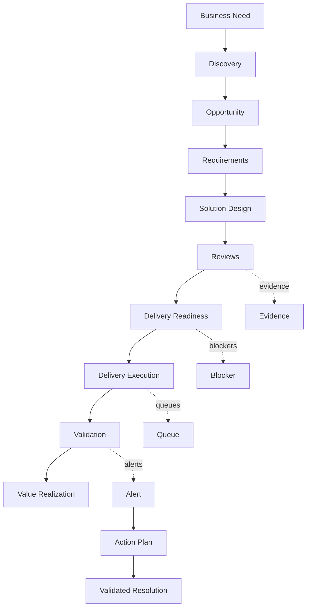
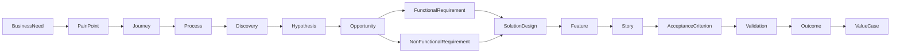
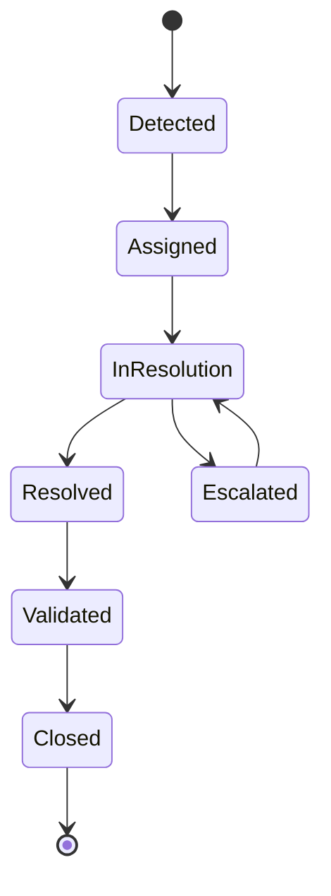
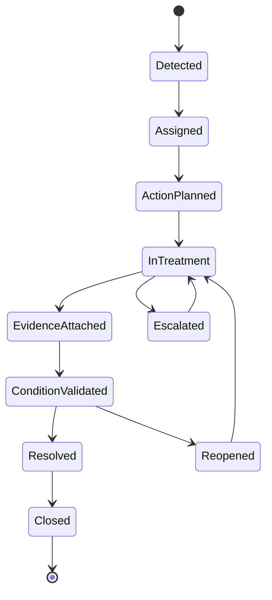

# Discovery and Delivery Operating Model - EDIP

## 1. Propósito

A EDIP não é apenas uma plataforma de monitoramento.

A EDIP é uma plataforma de coordenação do fluxo corporativo de transformação de necessidades em valor realizado. Ela deve tornar visível, rastreável, mensurável e governável o caminho pelo qual uma necessidade de negócio, cliente, operação, risco ou tecnologia se transforma em descoberta, solução, entrega, validação, outcome e valor realizado.

O operating model define como a organização deve observar e governar o fluxo:

Need -> Discovery -> Solution -> Delivery -> Validation -> Value Realization.

Esse fluxo não substitui os modelos de Strategy, Portfolio, Product, Architecture Capability, Delivery, Metrics, Events, Intelligence, Value Realization ou Governance. Ele conecta esses modelos em uma visão operacional de ponta a ponta.

O modelo deve permitir responder:

- Onde estamos parados?
- Por que estamos parados?
- Quem deveria agir?
- Qual fila está congestionada?
- Qual etapa está envelhecendo?
- Qual decisão está atrasada?
- Qual evidência falta?
- Qual ação precisa acontecer para avançar?
- Qual é o impacto estratégico, econômico, operacional e arquitetural do atraso?

## 2. Operating Principles

Princípios obrigatórios:

- Toda necessidade deve possuir owner.
- Toda dor deve possuir evidência.
- Toda hipótese deve ser validável.
- Todo requisito deve possuir origem rastreável.
- Toda solução deve possuir revisão.
- Toda entrega deve possuir critérios de aceite.
- Toda alerta deve possuir owner.
- Toda alerta deve possuir plano de ação.
- Toda ação deve possuir evidência.
- Nenhuma alerta pode ser encerrada sem validação da causa original.
- Toda fila deve possuir owner, SLA, aging e capacidade conceitual.
- Todo blocker deve possuir owner, evidência, severidade e resolução esperada.
- Todo handoff relevante deve ser rastreável.
- Toda aprovação crítica deve preservar decisão, evidência, data, owner e justificativa.
- Todo item que entra em delivery deve atender Definition of Ready.
- Todo item concluído deve atender Definition of Done ou possuir exceção formal.
- Toda validação deve declarar critério, evidência, resultado e responsável.
- Toda realização de valor deve distinguir valor esperado, forecast, observado, validado e rejeitado.

## 3. End-to-End Value Flow

Fluxo canônico:

Business Need -> Pain Point -> Journey -> Process -> Discovery -> Hypothesis -> Opportunity -> Requirement -> Solution Design -> Readiness -> Feature -> Story -> Validation -> Outcome -> Value Case -> Value Realization.

Fluxo detalhado:

Business Need -> Pain Point -> Journey Analysis -> Process Analysis -> Discovery -> Hypothesis -> Opportunity -> Prioritization -> Functional Requirements -> Non Functional Requirements -> Solution Design -> Architecture Review -> Engineering Review -> Security Review -> Data Review -> Readiness -> Feature -> Story -> Delivery -> Validation -> Outcome -> Value Realization.

```mermaid
flowchart LR
  BusinessNeed[Business Need] --> PainPoint[Pain Point]
  PainPoint --> Journey[Journey Analysis]
  Journey --> Process[Process Analysis]
  Process --> Discovery[Discovery]
  Discovery --> Hypothesis[Hypothesis]
  Hypothesis --> Opportunity[Opportunity]
  Opportunity --> Prioritization[Prioritization]
  Prioritization --> FR[Functional Requirements]
  Prioritization --> NFR[Non Functional Requirements]
  FR --> SolutionDesign[Solution Design]
  NFR --> SolutionDesign
  SolutionDesign --> ArchitectureReview[Architecture Review]
  SolutionDesign --> EngineeringReview[Engineering Review]
  SolutionDesign --> SecurityReview[Security Review]
  SolutionDesign --> DataReview[Data Review]
  ArchitectureReview --> Readiness[Readiness]
  EngineeringReview --> Readiness
  SecurityReview --> Readiness
  DataReview --> Readiness
  Readiness --> Feature[Feature]
  Feature --> Story[Story]
  Story --> Delivery[Delivery]
  Delivery --> Validation[Validation]
  Validation --> Outcome[Outcome]
  Outcome --> ValueCase[Value Case]
  ValueCase --> ValueRealization[Value Realization]
```



### Fluxo Com Governança



## 4. Business Discovery Domain

Responsável por necessidades, dores, stakeholders, jornadas, processos, problemas, constraints, objetivos e evidências de negócio.

| Entidade | Propósito | Ownership | Estados | Relações | Evidências |
| --- | --- | --- | --- | --- | --- |
| BusinessNeed | Representar necessidade inicial. | Business Owner. | Proposed, UnderAnalysis, Accepted, Rejected, ConvertedToProblem. | Origina PainPoint, StakeholderNeed, CustomerNeed. | Registro da necessidade, contexto, solicitante. |
| PainPoint | Representar dor observável. | Business Owner / Journey Owner. | Identified, Evidenced, Prioritized, Rejected, ConvertedToProblem. | Relaciona Need, Journey e Process. | Dados operacionais, reclamações, incidentes, métricas. |
| StakeholderNeed | Necessidade de stakeholder interno ou externo. | Stakeholder Owner. | Captured, Validated, Rejected, Linked. | Relaciona BusinessNeed e BusinessObjective. | Entrevistas, solicitações, decisões. |
| CustomerNeed | Necessidade de cliente ou usuário final. | Product Manager / Journey Owner. | Captured, Validated, Quantified, Linked. | Relaciona CustomerJourney e Outcome. | Pesquisa, comportamento, feedback, KPI. |
| BusinessProblem | Problema formalizado a partir de need, pain e evidência. | Business Owner / Product Manager. | Draft, Validated, Prioritized, Rejected, ConvertedToDiscovery. | Relaciona ProblemStatement e Discovery. | Problem evidence, impacto, frequência, severidade. |
| BusinessConstraint | Restrição de negócio, prazo, orçamento, política ou canal. | Constraint Owner. | Identified, Active, Mitigated, Waived, Retired. | Condiciona Discovery, Requirements e SolutionDesign. | Política, decisão, limite de orçamento, prazo regulatório. |
| BusinessEvidence | Evidência de negócio verificável. | Evidence Owner. | Attached, Validated, Rejected, Expired. | Sustenta Need, Pain, Problem, Decision. | Fonte, período, owner, validade. |
| CustomerJourney | Jornada externa afetada. | Journey Owner / Product Manager. | Mapped, Analyzed, Impacted, Improved, Retired. | Relaciona CustomerNeed, PainPoint, Outcome. | Mapa de jornada, métricas, feedback. |
| OperationalJourney | Jornada operacional interna. | Operations Owner. | Mapped, Analyzed, Impacted, Improved, Retired. | Relaciona Process, PainPoint, BusinessProblem. | SLAs, incidentes, tempos, controles. |
| BusinessProcess | Processo afetado ou habilitador. | Process Owner. | Identified, Mapped, UnderChange, Controlled, Retired. | Relaciona Journey, Requirement, Control. | Modelo de processo, controles, indicadores. |
| BusinessObjective | Objetivo de negócio conectado à necessidade. | Diretor / Superintendente. | Proposed, Active, Measured, Achieved, Retired. | Relaciona Strategy, OKR, Outcome, ValueCase. | OKRs, KPIs, baseline, target. |

## 5. Product Discovery Domain

Responsável por discovery, hipóteses, experimentos, findings, outcomes de discovery, problem statements, avaliações de oportunidade, decisões de priorização e assumptions.

| Entidade | Propósito | Ownership | Ciclo de Vida | Critérios de Saída |
| --- | --- | --- | --- | --- |
| Discovery | Investigar problema, oportunidade, valor e incerteza. | Product Manager / Product Owner. | Planned, InProgress, EvidenceCollected, Concluded, Closed. | Evidence chain, finding, decisão de avançar/pivotar/descartar. |
| DiscoveryHypothesis | Hipótese testável sobre problema, solução, valor ou adoção. | Product Manager. | Draft, Testable, Testing, Validated, Invalidated. | Resultado validado ou invalidado com evidência. |
| DiscoveryExperiment | Experimento para reduzir incerteza. | Product Manager / UX / Data. | Designed, Running, Completed, Analyzed. | Resultado, evidência e impacto na hipótese. |
| DiscoveryFinding | Achado derivado de experimento, pesquisa ou análise. | Product Manager. | Captured, Validated, Rejected, Linked. | Finding vinculado a hipótese ou decisão. |
| DiscoveryOutcome | Resultado final do discovery. | Product Manager / Sponsor. | Proposed, Reviewed, Accepted, Rejected. | Recomendação de avançar, pivotar, pausar ou descartar. |
| ProblemStatement | Formulação do problema, público, impacto e evidência. | Product Manager / Business Owner. | Draft, Reviewed, Approved, Rejected. | Problema claro, evidência suficiente e owner definido. |
| OpportunityAssessment | Avaliação de oportunidade por valor, risco, custo, capacidade e estratégia. | PMO / Product Manager. | Draft, Assessed, Prioritized, Rejected. | Score ou decisão de priorização. |
| PrioritizationDecision | Decisão de priorizar, pausar, descartar ou avançar. | Product Manager / PMO / Sponsor. | Proposed, Approved, Rejected, Superseded. | Decisão formal, rationale e evidência. |
| Assumption | Premissa de discovery ou produto. | Assumption Owner. | Registered, Validated, Invalidated, Expired. | Validação, descarte ou conversão em risco. |

## 6. Requirements Domain

Responsável por requisitos funcionais, não funcionais, regras de negócio, critérios de aceite, Definition of Ready, Definition of Done, constraints, dependências, riscos e assumptions.

| Entidade | Origem | Owner | Rastreabilidade | Revisão | Aprovação |
| --- | --- | --- | --- | --- | --- |
| FunctionalRequirement | Opportunity, Process, BusinessRule, ProductOutcome. | Product Owner / Business Analyst. | BusinessNeed, Opportunity, SolutionDesign, Feature. | Product, business, engineering. | Product Owner / Business Owner. |
| NonFunctionalRequirement | Architecture, Engineering, Security, Data, Compliance. | Architect / Specialist. | SolutionDesign, Feature, AcceptanceCriterion. | Architecture, security, data, engineering. | Owner da especialidade. |
| BusinessRule | Processo, política, controle ou decisão. | Business Owner. | Requirement, Feature, Validation. | Business e compliance quando aplicável. | Business Owner. |
| AcceptanceCriterion | Requirement, Feature ou Story. | Product Owner / QA. | Requirement, Story, Validation. | Product, business, QA. | Product Owner / Business Owner. |
| DefinitionOfReady | Política de entrada em delivery. | Product Owner / Scrum Master / Tech Lead. | Feature, Story, Dependency, Risk. | Product e engineering. | Squad / Product Owner. |
| DefinitionOfDone | Política de conclusão. | Product Owner / Tech Lead / QA. | Story, Feature, Validation, Evidence. | Engineering, QA, product. | Product Owner / Tech Lead. |
| Constraint | BusinessConstraint, technical constraint, compliance constraint. | Constraint Owner. | Requirement, SolutionDesign, Risk. | Especialista aplicável. | Owner da constraint. |
| Dependency | Sistema, área, dado, decisão, fornecedor ou entrega. | Dependency Owner. | Requirement, SolutionDesign, Feature. | PMO, engineering, architecture. | Owner da dependência. |
| Risk | Risco de negócio, produto, delivery, arquitetura, segurança, dados ou compliance. | Risk Owner. | Requirement, SolutionDesign, Feature, ValueCase. | Especialista aplicável. | Risk Owner / Governance. |
| Assumption | Premissa usada em requisito ou solução. | Assumption Owner. | Requirement, SolutionDesign, Forecast. | Product, architecture ou engineering. | Owner da premissa. |

Regra central: requisito sem origem rastreável não deve avançar para Solution Design sem justificativa formal.

## 7. Solution Design Domain

Responsável por solution design, registros de solução, decisões, revisões, aprovações e evidências.

| Entidade | Participantes | Revisores | Responsáveis | Critérios de Aprovação |
| --- | --- | --- | --- | --- |
| SolutionDesign | Product, architecture, engineering, security, data, compliance. | Architecture, engineering, security, data, compliance. | Solution Owner / Architect. | Requisitos cobertos, riscos explícitos, reviews concluídos. |
| SolutionRecord | Product Owner, Architect, Tech Lead. | Architecture / Engineering. | Solution Owner. | Registro completo, versionado e rastreável. |
| SolutionDecision | Sponsor, Product, Architect, Tech Lead, Governance. | Comitê ou owner definido. | Decision Owner. | Rationale, alternativa, evidência e impacto. |
| ArchitectureReview | Architect, Capability Owner, Solution Architect. | Arquitetura Corporativa. | Arquiteto Corporativo. | Aderência, impacto, debt, exception ou aprovação. |
| EngineeringReview | Tech Lead, Engineering Manager. | Engineering. | Tech Lead. | Viabilidade, complexidade, qualidade, dependências. |
| SecurityReview | Security Specialist. | Security. | Security Owner. | Controles, riscos e evidências. |
| DataReview | Data Specialist, Data Owner. | Data governance. | Data Owner. | Fonte, lineage, privacidade, qualidade. |
| ComplianceReview | Compliance Specialist, Risk Owner. | Compliance / Risk. | Compliance Owner. | Aderência regulatória ou política. |
| SolutionApproval | Decision Owner, approvers. | Gate owner. | Approver. | Aprovação formal, evidência e condições. |
| SolutionEvidence | Evidence Owner. | Reviewer aplicável. | Evidence Owner. | Evidência verificável, válida e vinculada. |

## 8. Delivery Readiness Domain

Responsável por preparar trabalho para delivery com critérios claros, dependências resolvidas, riscos tratados e capacidade disponível.

| Entidade | Critérios de Entrada | Critérios de Saída | Bloqueadores |
| --- | --- | --- | --- |
| ReadinessAssessment | Requirements aprovados, solution design disponível. | Ready ou Not Ready com motivos. | Requisito incompleto, review pendente, dependency aberta. |
| ReadinessChecklist | Feature ou story candidata. | Checklist atendido ou exceção formal. | DoR incompleto, critérios ausentes, owner indefinido. |
| DependencyAssessment | Dependências conhecidas. | Dependências resolvidas, aceitas ou escaladas. | Dependency owner ausente, prazo vencido, sistema externo. |
| RiskAssessment | Riscos identificados. | Riscos mitigados, aceitos ou escalados. | Risco crítico sem plano. |
| CapacityAssessment | Demanda estimada e squad/capacidade disponível. | Capacidade reservada ou decisão de sequenciamento. | Capacidade insuficiente, WIP alto, conflito de prioridade. |

## 9. Delivery Execution Domain

Responsável por executar iniciativas, épicos, features, stories, tasks e releases preservando rastreabilidade.

| Entidade | Ownership | Rastreabilidade | Dependências |
| --- | --- | --- | --- |
| Initiative | Gerente / PMO / Sponsor. | Strategy, Portfolio, Opportunity, ValueCase. | Funding, capability, squads, decisões. |
| Epic | Product Owner / Gerente. | Initiative, roadmap, requirements. | Features, dependencies, capability impact. |
| Feature | Product Owner / Gerente / Tech Lead. | Requirement, SolutionDesign, Epic, Outcome. | DoR, architecture, data, security, dependencies. |
| Story | Squad / Product Owner. | Feature, AcceptanceCriterion, DoD. | Tasks, blockers, validation. |
| Task | Desenvolvedor / responsável operacional. | Story. | Technical dependencies. |
| Release | Release Owner / Tech Lead. | Features, validation, readiness, value checkpoint. | Release readiness, approvals, defects. |

## 10. Validation Domain

Responsável por validação, aceite, evidências, outcomes, benefícios e value realization.

| Entidade | Evidências | Critérios | Aprovação |
| --- | --- | --- | --- |
| Validation | Evidence chain, acceptance results. | Critério de aceite e DoD. | Validation Owner. |
| AcceptanceValidation | Critérios de aceite, teste, demonstração. | Critérios atendidos ou rejeitados. | Product Owner / Business Owner. |
| BusinessValidation | Evidência de processo, jornada ou negócio. | Resultado de negócio esperado. | Business Owner. |
| TechnicalValidation | Testes, readiness, quality evidence. | Qualidade técnica e operação. | Tech Lead / QA. |
| OutcomeValidation | KPI, outcome measure, evidence. | Outcome alcançado, degradado ou não observado. | Outcome Owner. |
| BenefitValidation | Método de cálculo, fonte, evidência. | Benefício validado ou rejeitado. | Value Sponsor / Finance / Validator. |
| ValueValidation | ValueCase, outcome, KPI, benefit. | Valor realizado com confiança suficiente. | Sponsor / Comitê. |

## 11. Traceability Model

Modelo formal obrigatório:

BusinessNeed -> PainPoint -> Journey -> Process -> Discovery -> Hypothesis -> Opportunity -> FunctionalRequirement -> NonFunctionalRequirement -> SolutionDesign -> Feature -> Story -> AcceptanceCriterion -> Validation -> Outcome -> ValueCase.



### Cardinalidades

| Relação | Cardinalidade |
| --- | --- |
| BusinessNeed -> PainPoint | 1:N |
| PainPoint -> Journey | N:M |
| Journey -> Process | N:M |
| Process -> Discovery | 0:N |
| Discovery -> Hypothesis | 1:N |
| Hypothesis -> Opportunity | 0:N |
| Opportunity -> FunctionalRequirement | 1:N |
| Opportunity -> NonFunctionalRequirement | 0:N |
| FunctionalRequirement -> SolutionDesign | N:M |
| NonFunctionalRequirement -> SolutionDesign | N:M |
| SolutionDesign -> Feature | 1:N |
| Feature -> Story | 1:N |
| Story -> AcceptanceCriterion | 1:N |
| AcceptanceCriterion -> Validation | 1:N |
| Validation -> Outcome | N:1 |
| Outcome -> ValueCase | N:M |

## 12. Operating States

| Entidade | Estados |
| --- | --- |
| Need | Proposed, UnderAnalysis, Accepted, Rejected. |
| Opportunity | Identified, Assessing, Approved, Rejected, Prioritized, Paused. |
| Discovery | Planned, InProgress, EvidenceCollected, Validated, Invalidated, Closed. |
| Requirement | Draft, Reviewed, Approved, Implemented, Deprecated. |
| SolutionDesign | Draft, UnderReview, Approved, Rejected, Superseded. |
| Feature | Proposed, Ready, InDevelopment, Validating, Completed, Released. |
| Story | Draft, Ready, InDevelopment, Blocked, Done, Accepted. |
| Validation | Planned, WaitingEvidence, InProgress, Accepted, Rejected, Reopened, Closed. |
| Outcome | Defined, Measuring, Achieved, Degraded, NotAchieved, Retired. |

Toda entidade principal deve possuir:

- estado;
- owner;
- data de entrada no estado;
- data de saída do estado;
- aging;
- SLA.

## 13. Queue Model

| Fila | Entrada | Saída | SLA | Aging | Owner | Capacidade |
| --- | --- | --- | --- | --- | --- | --- |
| Business Queue | BusinessNeed, PainPoint. | ProblemStatement ou rejeição. | Por criticidade. | Desde captura. | Business Owner. | Capacidade de análise de negócio. |
| Discovery Queue | ProblemStatement, Opportunity. | Discovery iniciado. | Por valor e risco. | Tempo aguardando discovery. | Product Manager. | Capacidade de discovery. |
| Requirements Queue | Opportunity aprovada. | Requirements aprovados. | Por release/valor. | Tempo aguardando requisito. | Product Owner. | Capacidade de análise. |
| Architecture Queue | SolutionDesign ou NFR. | ArchitectureReview concluído. | Por criticidade. | Tempo aguardando arquitetura. | Arquiteto. | Capacidade arquitetural. |
| Engineering Queue | Requirement ou SolutionDesign. | EngineeringReview concluído. | Por release. | Tempo aguardando engenharia. | Tech Lead. | Capacidade técnica. |
| Security Queue | SolutionDesign com risco de segurança. | SecurityReview concluído. | Por severidade. | Tempo aguardando segurança. | Security Specialist. | Capacidade de segurança. |
| Data Queue | SolutionDesign com dado, KPI, lineage ou privacy. | DataReview concluído. | Por criticidade. | Tempo aguardando dados. | Data Owner. | Capacidade de dados. |
| Review Queue | Qualquer review pendente. | Review concluído. | Por política. | Tempo em review. | Review Owner. | Capacidade de revisores. |
| Readiness Queue | Feature/story candidata. | Ready. | Por ciclo de delivery. | Tempo aguardando DoR. | Product Owner / Scrum Master. | Capacidade de refinamento. |
| Delivery Queue | Item ready. | InDevelopment. | Por prioridade. | Tempo aguardando execução. | Coordenador / Squad. | Capacidade da squad. |
| Validation Queue | Item entregue. | Accepted ou Rejected. | Por release/valor. | Tempo aguardando validação. | Validation Owner. | Capacidade de validação. |
| Value Realization Queue | Outcome ou benefício aguardando medição. | BenefitValidated ou BenefitRejected. | Por ciclo de mensuração. | Tempo aguardando comprovação. | Sponsor de valor. | Capacidade de validação de valor. |

## 14. Blocker Model

| Conceito | Definição |
| --- | --- |
| Blocker | Impedimento que bloqueia avanço. |
| BlockerType | Categoria do bloqueio. |
| BlockerOwner | Owner responsável por remover o bloqueio. |
| BlockerEvidence | Evidência que demonstra o bloqueio. |
| BlockerResolution | Ação, decisão ou evidência que removeu o bloqueio. |

Categorias:

- Business.
- Product.
- Architecture.
- Engineering.
- Security.
- Data.
- Compliance.
- Dependency.
- Capacity.
- Governance.

### Ciclo de Vida



Regras:

- Blocker sem owner permanece aberto.
- Blocker sem evidência deve ser tratado como hipótese de bloqueio.
- Blocker vencido deve escalar.
- Blocker encerrado deve possuir resolução validada.

## 15. Alert Model

| Conceito | Definição |
| --- | --- |
| Alert | Sinal acionável de exceção, risco, atraso ou condição não resolvida. |
| AlertCondition | Condição que disparou o alerta. |
| AlertOwner | Owner responsável por tratamento. |
| AlertAction | Ação necessária para tratamento. |
| AlertEvidence | Evidência associada à abertura, tratamento ou resolução. |
| AlertValidation | Validação de que a condição deixou de existir. |
| AlertResolution | Encerramento formal do alerta. |

Regra obrigatória:

Uma alerta somente pode ser encerrada quando:

1. Existe ação registrada.
2. Existe evidência da execução.
3. A condição que gerou a alerta desapareceu.

Caso contrário:

Alert permanece aberta.

### Máquina de Estados



## 16. Case Management Model

Case é o mecanismo operacional para coordenar problemas corporativos que não podem ser tratados apenas como blocker isolado, alerta isolado, investigação isolada ou decisão pontual.

Case representa um agrupador governado de problemas, alertas, investigações, decisões, ações, evidências, validações e aprendizados relacionados a um mesmo assunto corporativo relevante.

Case não substitui Alert, Investigation, Decision, ActionPlan, Evidence, Validation ou Learning. Ele coordena esses artefatos quando o problema exige rastreabilidade, resolução integrada, auditoria e aprendizado.

### Gatilhos Operacionais para Criação de Case

| Gatilho | Regra de Criação de Case | Tipo de Case Sugerido |
| --- | --- | --- |
| Blockers recorrentes | Mesmo blocker type, causa, owner ou entidade afetada aparece de forma recorrente ou sistêmica. | Delivery Blockage Case / Operational Case |
| Alertas críticos | Alerta Critical ou Regulatory Critical exige coordenação multi-owner ou evidência de fechamento auditável. | Governance Case / Compliance Case / Operational Case |
| Atrasos sistêmicos | Queue aging, wait time ou SLA breach afeta múltiplas iniciativas, times ou portfólios. | Operational Case / Strategic Risk Case |
| Filas congestionadas | Queue Threshold Breached persiste após ação local ou afeta valor material. | Operational Case / Delivery Blockage Case |
| Decisões vencidas | Decision SLA excedido bloqueia valor, release, solution approval ou funding. | Governance Case / Strategic Risk Case |
| Readiness falho | Readiness rejeitado ou DoR violado de forma recorrente. | Delivery Blockage Case / Governance Case |
| Validações rejeitadas | Validation rejeitada ou reaberta por evidência insuficiente, critério falho ou benefício não comprovado. | Operational Case / Value Leakage Case |
| Value leakage | Valor planejado ou forecast deixa de ser capturado materialmente. | Value Leakage Case |
| Capability degradation | Capability crítica degrada ou possui dívida/exceção com impacto em produto, portfolio ou value case. | Capability Degradation Case / Architecture Case |
| Incidente relevante | Incidente crítico afeta cliente, operação, compliance, capability ou valor. | Incident Case |
| Data quality crítica | Fonte divergente, freshness breached, lineage incompleto ou cálculo inválido afeta decisão. | Data Quality Case |

### Lifecycle Operacional

```text
Created -> Triaged -> Assigned -> Investigating -> ActionPlanning -> Remediating -> Validating -> Resolved -> Closed -> Reopened
```

### Regras Operacionais

- Case não pode ser fechado sem owner.
- Case não pode ser fechado sem closure criteria.
- Case crítico não pode ser fechado sem closure evidence.
- Case crítico não pode ser fechado sem closure decision.
- Case pode ser reaberto se a condição retornar, evidência for invalidada ou validação falhar.
- Case pode conter múltiplos alertas, múltiplas investigations, múltiplos action plans, múltiplas decisões e múltiplas evidências.
- Alert pode existir sem Case inicialmente.
- Alert crítico, recorrente ou sistêmico deve gerar ou associar-se a um Case.
- Investigation pode ser aberta dentro de um Case.
- Case pode iniciar Investigation.
- Investigation pode recomendar criação de Case quando o problema for sistêmico.
- Case deve preservar timeline completa desde abertura até fechamento ou reabertura.

### Cadeia Operacional de Case

```text
Case -> Alerts -> Investigations -> Evidence -> Findings -> Root Causes -> Recommendations -> Decisions -> ActionPlans -> Validations -> Learnings
```

## 17. Escalation Model

| Escalation | Gatilhos | Destinatários | Resultado Esperado |
| --- | --- | --- | --- |
| Operational Escalation | Blocker ativo, queue aging, DoR/DoD violado. | Squad, Scrum Master, Product Owner, Tech Lead. | Remoção operacional do impedimento. |
| Manager Escalation | SLA excedido, múltiplos blockers, dependência crítica. | Gerente, Engineering Manager, PMO. | Replanejamento, decisão tática ou realocação. |
| Coordinator Escalation | Fila congestionada, WIP alto, owner ausente. | Coordenador, Scrum Master, Team Lead. | Ajuste de fluxo, WIP e owners. |
| Architecture Escalation | ArchitectureReview atrasado, debt crítico, exception expirada. | Arquiteto Corporativo, Architecture Board. | Decisão arquitetural ou plano de modernização. |
| Executive Escalation | Cost of Delay material, KR em risco, valor bloqueado. | Diretor, Superintendente, comitê executivo. | Priorização, funding, aceite de risco ou intervenção. |
| Governance Escalation | Evidência ausente, approval vencido, compliance pendente. | PMO, Compliance, Risk, Auditoria. | Regularização ou bloqueio formal de avanço. |

## 18. Flow Intelligence

Métricas obrigatórias:

| Métrica | Definição |
| --- | --- |
| Lead Time | Tempo total entre entrada e conclusão do fluxo. |
| Cycle Time | Tempo ativo de execução em uma etapa. |
| Queue Time | Tempo aguardando em fila. |
| Blocked Time | Tempo bloqueado por blocker explícito. |
| Waiting Time | Tempo aguardando capacidade, decisão, evidência ou handoff. |
| Review Time | Tempo em revisão formal. |
| Approval Time | Tempo aguardando aprovação. |
| Discovery Time | Tempo de início a conclusão do discovery. |
| Solution Time | Tempo de requisitos até solution design aprovado. |
| Readiness Time | Tempo até cumprir Definition of Ready. |
| Validation Time | Tempo entre entrega e validação. |
| Value Realization Time | Tempo entre outcome/release e benefício validado. |

Cada métrica deve permitir drill-down para entidade, fila, owner, blocker, evidência, estado e evento causador.

## 19. Operating Health Scores

| Health Score | Componentes |
| --- | --- |
| Discovery Health | hipótese validável, evidência, findings, aging, rework, decisão. |
| Requirements Health | completude, origem rastreável, critérios, NFRs, revisão, aprovação. |
| Solution Health | reviews, riscos, assumptions, decisions, approvals, evidence. |
| Architecture Review Health | aging, dívida, exception, impacto em capability, decisão pendente. |
| Engineering Review Health | viabilidade, dependências, riscos técnicos, estimativa, readiness. |
| Readiness Health | DoR, dependências, capacidade, riscos, critérios de aceite. |
| Delivery Health | progresso, blockers, cycle time, previsibilidade, release readiness. |
| Validation Health | critérios, evidências, rejeições, reaberturas, tempo de validação. |
| Value Realization Health | value case, benefício observado, validado, rejeitado, leakage, confiança. |
| Alert Resolution Health | alertas abertos, aging, ação, evidência, condição resolvida. |
| Blocker Resolution Health | blockers ativos, severidade, owner, aging, resolução validada. |

## 20. Heat Maps

| Heat Map | Unidade de Análise | Uso |
| --- | --- | --- |
| Business Discovery Heat Map | needs, pains, journeys, processes. | Identificar dores e necessidades sem qualificação. |
| Requirements Heat Map | requirements, rules, criteria, NFRs. | Identificar requisitos incompletos ou sem aprovação. |
| Architecture Heat Map | solution designs, architecture reviews, debt, exceptions. | Identificar gargalos arquiteturais. |
| Engineering Heat Map | engineering reviews, dependencies, technical risks. | Identificar gargalos de engenharia e viabilidade. |
| Review Heat Map | architecture, engineering, security, data, compliance reviews. | Identificar reviews pendentes ou lentos. |
| Readiness Heat Map | features, stories, DoR, dependencies. | Identificar itens não prontos. |
| Delivery Heat Map | features, stories, tasks, releases. | Identificar gargalos de execução. |
| Validation Heat Map | validations, acceptance, evidence, rejects. | Identificar validações pendentes. |
| Value Realization Heat Map | outcomes, value cases, benefits. | Identificar valor não comprovado. |
| Blocker Heat Map | blockers por tipo, owner, severity, aging. | Priorizar remoção de impedimentos. |
| Alert Heat Map | alerts por condição, owner, aging, severity. | Priorizar tratamento de alertas. |

## 21. Personas e Responsabilidades

| Persona / Grupo | Responsabilidades | Decisões | Aprovações | Ownership |
| --- | --- | --- | --- | --- |
| Business Teams | Explicar needs, pains, journeys e processes. | Aceitar problema e prioridade. | BusinessEvidence, BusinessValidation. | BusinessNeed, PainPoint, BusinessProcess. |
| Product Teams | Conduzir discovery, hypotheses, opportunity e roadmap. | Priorizar, pivotar, descartar ou avançar. | DiscoveryOutcome, PrioritizationDecision. | Discovery, Opportunity, Requirements. |
| Engineering Teams | Avaliar viabilidade, executar delivery e validar qualidade técnica. | Trade-offs técnicos e abordagem de implementação. | EngineeringReview, DoD técnico. | Story, Task, TechnicalValidation. |
| Architects | Revisar solução, capabilities, standards e debt. | Architecture decision, exception, modernization. | ArchitectureReview, SolutionApproval quando aplicável. | SolutionDesign, ArchitectureReview. |
| Security Specialists | Avaliar riscos e controles de segurança. | Mitigar, aceitar ou bloquear risco. | SecurityReview. | Security risks e evidence. |
| Data Specialists | Avaliar dados, lineage, qualidade e privacidade. | Aprovar fonte, lineage e uso. | DataReview. | Data evidence e data risk. |
| Compliance Specialists | Avaliar aderência regulatória e política. | Aprovar, exigir ajuste ou bloquear. | ComplianceReview. | Compliance evidence. |
| Managers | Orquestrar iniciativas, dependências e escalonamentos. | Replanejar, realocar, escalar. | Decisões táticas. | Initiative, dependency, tactical risk. |
| Coordinators | Gerenciar fluxo operacional, WIP, queues e blockers. | Ajustar fluxo e owners. | Resolução operacional. | Queue, Blocker, Delivery flow. |
| Directors | Governar objetivos, valor, funding e riscos materiais. | Priorizar, financiar, pausar, aceitar risco. | Decisões executivas. | Strategic objective, portfolio, value. |
| Executives | Definir direção, resolver trade-offs críticos e governar riscos. | Intervenção corporativa, aceite de risco crítico. | Comitês executivos. | Estratégia, funding, governança executiva. |

## 22. Cross-Artifact Impact Assessment

### DOMAIN_MODEL.md

- Status pós-harmonização: Business Discovery, Product Discovery, Requirements, Solution Design, Delivery Readiness e Validation foram incorporados ao domínio formal.
- Entidades incorporadas: BusinessNeed, PainPoint, StakeholderNeed, CustomerNeed, BusinessProblem, BusinessConstraint, BusinessEvidence, journeys, processes, discovery, requirements, solution design, reviews, readiness, validation, blockers, alerts e alert resolution.
- Eventos incorporados por referência: business need, pain, discovery, requirement, solution, review, readiness, validation, blocker e alert resolution.
- Ajustes remanescentes esperados: manter state machines e RACI sincronizados quando novas entidades operacionais forem criadas.

### PRODUCT_MODEL.md

- Status pós-harmonização: dashboards e navegação operacional foram incorporados para Business Discovery, Requirements, Solution Review, Readiness, Validation, Blocker e Alert Resolution.
- Métricas incorporadas: review time, approval time, readiness time, validation time, alert aging, alert resolution health e blocker resolution health.
- Capacidades incorporadas: perguntas operacionais por fila, blocker, owner, ação, evidência, review e requisito.
- Ajustes remanescentes esperados: manter personas especialistas alinhadas a novos dashboards e decisões suportadas.

### METRICS_CATALOG.md

- Status pós-harmonização: operating health scores e métricas de revisão, aprovação, solution, readiness, validação, alert resolution e blocker resolution foram adicionados.
- Measurement targets incorporados: Need, Requirement, SolutionDesign, Review, Validation, Alert, AlertResolution, Blocker e BlockerResolution.
- Heat maps incorporados: Business Discovery, Requirements, Architecture Review, Engineering Review, Readiness, Validation, Blocker e Alert.
- Ajustes remanescentes esperados: novas métricas devem preservar owner, fórmula, fonte, periodicidade, dashboard e drill-down.

### EVENT_CATALOG.md

- Status pós-harmonização: eventos de need, pain, requirements, solution reviews, readiness, validation, alert closure e blocker resolution foram incorporados com payload conceitual.
- Mapeamentos incorporados: event-to-metric, event-to-alert, event-to-health-score, event-to-forecast, event-to-heat-map e event-to-decision para operating flow.
- Eventos de encerramento de alerta foram normalizados em AlertActionRegistered, AlertEvidenceAttached, AlertConditionValidated, AlertResolved e AlertReopened.
- Ajustes remanescentes esperados: qualquer evento citado por forecast, heat map, Copilot ou narrative deve ter definição formal no catálogo.

### INTELLIGENCE_MODEL.md

- Status pós-harmonização: OperatingInsight, QueueInsight, BlockerInsight, ReviewInsight e AlertResolutionInsight foram incorporados.
- Eventos operacionais, métricas operacionais e heat maps operacionais passaram a alimentar explanation, recommendation, Copilot e Knowledge Graph.
- Capacidades incorporadas: Copilot operacional para fila, blocker, evidência, ação, revisão, requisito e alerta aberto.
- Ajustes remanescentes esperados: novas recomendações devem sempre declarar owner sugerido, horizonte, risco de inação e evidências necessárias.

## 23. Copilot Support

| Pergunta | Entidades Necessárias | Eventos Necessários | Métricas Necessárias | Inteligência Necessária |
| --- | --- | --- | --- | --- |
| Onde estamos parados? | Queue, State, Owner, WorkItem. | QueueEntered, StateChanged. | Queue Time, Aging. | Queue Intelligence. |
| Por que estamos parados? | Blocker, Dependency, Review, Alert. | BlockerDetected, ReviewRequested, AlertDetected. | Blocked Time, Review Time. | Root Cause Analysis. |
| Quem deveria agir? | Owner, RoleAssignment, Escalation. | OwnerAssigned, EscalationTriggered. | Aging, SLA breach. | Decision Intelligence. |
| Qual fila está congestionada? | Queue, Capacity, WorkItems. | QueueThresholdBreached. | Queue Time, WIP, Capacity Fit. | Heat Map Intelligence. |
| Qual blocker está mais antigo? | Blocker, BlockerOwner. | BlockerDetected, BlockerEscalated. | Blocked Time, Blocker Aging. | Blocker Intelligence. |
| Qual revisão está pendente? | Review, SolutionDesign, Reviewer. | ReviewRequested. | Review Time, Approval Time. | Review Intelligence. |
| Qual requisito está incompleto? | Requirement, AcceptanceCriterion, DoR. | RequirementCreated, RequirementReviewed. | Requirements Health. | Requirements Intelligence. |
| Qual alerta continua aberta? | Alert, AlertAction, AlertEvidence. | AlertDetected, AlertActionRegistered. | Alert Aging, Alert Resolution Health. | Alert Resolution Intelligence. |
| Qual evidência falta? | EvidenceChain, Approval, Validation. | EvidenceRequested, EvidenceAttached. | Evidence Coverage. | Governance Intelligence. |
| Qual ação está atrasada? | ActionPlan, AlertAction, Owner. | ActionCreated, ActionOverdue. | Action Aging, SLA breach. | Recommendation Follow-up Intelligence. |

## 24. Operating Maturity Model

| Nível | Nome | Característica |
| --- | --- | --- |
| Nível 1 | Fluxo não rastreado | Trabalho existe em ferramentas e conversas, mas não há rastreabilidade ponta a ponta. |
| Nível 2 | Fluxo monitorado | Estados e filas básicas são visíveis. |
| Nível 3 | Fluxo mensurado | Lead time, queue time, blocked time e SLAs são medidos. |
| Nível 4 | Fluxo explicado | Gargalos, blockers, decisões e evidências explicam atrasos. |
| Nível 5 | Fluxo otimizado | Priorização, capacidade, reviews e validação são ajustados por inteligência operacional. |
| Nível 6 | Fluxo autogovernado | Alertas, escalonamentos, recomendações, evidências e aprendizado organizacional governam o fluxo continuamente. |

Posicionamento da EDIP:

- O modelo conceitual atual habilita os níveis 2 e 3.
- Flow Intelligence, Event Catalog e Metrics Catalog habilitam o nível 4.
- Intelligence Model, Copilot Support e heat maps operacionais habilitam o nível 5.
- A visão-alvo da EDIP é o nível 6, sem remover responsabilidade humana em decisões críticas.

## 25. Change Log

### Novos Domínios

- Business Discovery Domain.
- Product Discovery Domain.
- Requirements Domain.
- Solution Design Domain.
- Delivery Readiness Domain.
- Delivery Execution Domain.
- Validation Domain.

### Novas Entidades

- BusinessNeed, PainPoint, StakeholderNeed, CustomerNeed, BusinessProblem, BusinessConstraint, BusinessEvidence, CustomerJourney, OperationalJourney, BusinessProcess, BusinessObjective.
- Discovery, DiscoveryHypothesis, DiscoveryExperiment, DiscoveryFinding, DiscoveryOutcome, ProblemStatement, OpportunityAssessment, PrioritizationDecision, Assumption.
- FunctionalRequirement, NonFunctionalRequirement, BusinessRule, AcceptanceCriterion, DefinitionOfReady, DefinitionOfDone, Constraint, Dependency, Risk.
- SolutionDesign, SolutionRecord, SolutionDecision, ArchitectureReview, EngineeringReview, SecurityReview, DataReview, ComplianceReview, SolutionApproval, SolutionEvidence.
- ReadinessAssessment, ReadinessChecklist, DependencyAssessment, RiskAssessment, CapacityAssessment.
- Validation, AcceptanceValidation, BusinessValidation, TechnicalValidation, OutcomeValidation, BenefitValidation, ValueValidation.

### Novas Filas

- Business Queue.
- Discovery Queue.
- Requirements Queue.
- Architecture Queue.
- Engineering Queue.
- Security Queue.
- Data Queue.
- Review Queue.
- Readiness Queue.
- Delivery Queue.
- Validation Queue.
- Value Realization Queue.

### Novos Estados

- Estados para Need, Opportunity, Discovery, Requirement, SolutionDesign, Feature, Story, Validation e Outcome.

### Novos Blockers

- Business, Product, Architecture, Engineering, Security, Data, Compliance, Dependency, Capacity e Governance.

### Novas Alertas

- Alertas de queue aging, blocker aging, review pending, approval pending, evidence missing, DoR violation, DoD violation, validation pending e value realization pending.
- Cadeia canônica Need-to-Value padronizada até Value Case e Value Realization.

### Case Management Operacional

- Adicionado Case como mecanismo operacional para blockers recorrentes, alertas críticos, atrasos sistêmicos, filas congestionadas, decisões vencidas, readiness falho, validações rejeitadas, value leakage e capability degradation.
- Definidos gatilhos operacionais para criação de Case e tipos sugeridos por gatilho.
- Definido lifecycle operacional Created -> Triaged -> Assigned -> Investigating -> ActionPlanning -> Remediating -> Validating -> Resolved -> Closed -> Reopened.
- Definidas regras de fechamento, reabertura, associação com Alert e Investigation e preservação de timeline completa.
- Adicionada cadeia operacional Case -> Alerts -> Investigations -> Evidence -> Findings -> Root Causes -> Recommendations -> Decisions -> ActionPlans -> Validations -> Learnings.

### Novos Health Scores

- Discovery Health.
- Requirements Health.
- Solution Health.
- Architecture Review Health.
- Engineering Review Health.
- Readiness Health.
- Delivery Health.
- Validation Health.
- Value Realization Health.
- Alert Resolution Health.
- Blocker Resolution Health.

### Novos Heat Maps

- Business Discovery Heat Map.
- Requirements Heat Map.
- Architecture Heat Map.
- Engineering Heat Map.
- Review Heat Map.
- Readiness Heat Map.
- Delivery Heat Map.
- Validation Heat Map.
- Value Realization Heat Map.
- Blocker Heat Map.
- Alert Heat Map.

### Impactos Nos Demais Artefatos

- DOMAIN_MODEL.md deve incorporar os novos domínios, entidades, estados, relações e cardinalidades operacionais em revisão futura.
- PRODUCT_MODEL.md deve incorporar dashboards, navegação e experiências orientadas a filas, blockers, reviews, readiness e validation.
- METRICS_CATALOG.md deve incorporar métricas operacionais, operating health scores e heat maps.
- EVENT_CATALOG.md deve incorporar eventos do fluxo Need-to-Value e mapeamentos event-to-metric, event-to-alert e event-to-decision.
- INTELLIGENCE_MODEL.md deve incorporar Operating Intelligence, Queue Intelligence, Blocker Intelligence, Alert Resolution Intelligence e Copilot operacional.
