# Discovery and Delivery Operating Model - EDIP

## 1. Missão do Operating Model

A EDIP não é apenas uma plataforma de monitoramento.

A EDIP é uma plataforma de coordenação do fluxo corporativo de transformação de necessidades em valor realizado.

O modelo operacional existe para tornar explícito onde o trabalho nasce, como é qualificado, como vira solução, como entra em delivery, como é validado e como gera valor mensurável. Ele deve permitir que a organização responda, com evidência:

- Onde estamos parados?
- Por que estamos parados?
- Quem deveria agir?
- Há quanto tempo estamos parados?
- Qual o custo do atraso?
- Qual o impacto estratégico?
- O que precisa acontecer para avançar?
- Quem está bloqueando valor?
- Qual fila está congestionada?
- Qual etapa do fluxo é mais ineficiente?
- Qual ação está pendente?
- Qual alerta continua aberto?
- Qual evidência falta?

A cadeia operacional completa é:

Need -> Pain -> Journey -> Process -> Discovery -> Hypothesis -> Opportunity -> Requirements -> Solution Design -> Reviews -> Refinement -> Delivery -> Validation -> Outcome -> Value Realization.

```mermaid
flowchart LR
  Need[Need] --> Pain[Pain]
  Pain --> Journey[Journey]
  Journey --> Process[Process]
  Process --> Discovery[Discovery]
  Discovery --> Hypothesis[Hypothesis]
  Hypothesis --> Opportunity[Opportunity]
  Opportunity --> Requirements[Requirements]
  Requirements --> SolutionDesign[Solution Design]
  SolutionDesign --> Reviews[Reviews]
  Reviews --> Refinement[Refinement]
  Refinement --> Delivery[Delivery]
  Delivery --> Validation[Validation]
  Validation --> Outcome[Outcome]
  Outcome --> ValueRealization[Value Realization]
```

## 2. Operating Domains

### Business Discovery Domain

Responsável por necessidades, dores, jornadas, processos, problemas e oportunidades de negócio.

Escopo:

- Capturar necessidades e dores.
- Contextualizar jornadas de cliente, usuário, operação ou negócio.
- Relacionar problemas a processos e objetivos.
- Registrar evidências de negócio.
- Qualificar problemas antes de gerar hipóteses de produto ou solução.

Não é responsável por definir solução técnica, backlog de delivery ou arquitetura.

### Product Discovery Domain

Responsável por hipóteses, discovery, experimentação, validação e priorização.

Escopo:

- Formular hipóteses.
- Planejar e executar experimentos.
- Registrar findings e outcomes de discovery.
- Avaliar oportunidade, valor, risco e evidência.
- Priorizar oportunidades com base em impacto, estratégia, capacidade e evidência.

Não é responsável por aprovar arquitetura final ou executar delivery.

### Solution Design Domain

Responsável por requisitos funcionais, requisitos não funcionais, arquitetura e desenho de solução.

Escopo:

- Transformar oportunidade priorizada em requisitos.
- Definir premissas, constraints, riscos e dependências.
- Criar solution design rastreável.
- Coordenar reviews de arquitetura, engenharia, segurança, dados e compliance.
- Registrar decisões e evidências de solução.

Não é responsável por substituir o Architecture Capability Context ou o Engineering Context.

### Delivery Readiness Domain

Responsável por refinamentos, readiness, dependências e critérios de aceite.

Escopo:

- Garantir Definition of Ready.
- Garantir critérios de aceite.
- Tornar dependências, riscos e blockers visíveis antes da execução.
- Preparar features e stories para entrada em delivery.

Não é responsável por validar benefício realizado.

### Delivery Execution Domain

Responsável por épicos, features, stories, tasks e releases.

Escopo:

- Executar trabalho priorizado e pronto.
- Medir fluxo, filas, bloqueios e entregas.
- Publicar releases.
- Preservar rastreabilidade operacional até requisitos, solução, oportunidade e valor.

Não é responsável por redefinir problema ou valor sem decisão formal.

### Validation Domain

Responsável por validação, aceitação, resultados e value realization.

Escopo:

- Validar se critérios de aceite foram atendidos.
- Validar se solução produziu outcome.
- Medir benefício observado.
- Validar ou rejeitar value realization.
- Registrar evidência e aprendizado.

Não é responsável por executar contabilidade oficial ou substituir fontes financeiras.

## 3. Entidades de Negócio

| Entidade | Descrição | Owner Conceitual | Propósito |
| --- | --- | --- | --- |
| BusinessNeed | Necessidade de negócio, cliente, operação, risco ou eficiência. | Business Owner | Origem do fluxo operacional. |
| PainPoint | Dor observável que justifica investigação. | Business Owner / Product Manager | Explicar impacto percebido e urgência. |
| CustomerJourney | Jornada de cliente afetada por necessidade ou dor. | Product Manager / Journey Owner | Conectar problema a experiência externa. |
| OperationalJourney | Jornada operacional interna afetada. | Operations Owner | Conectar problema a eficiência, controle ou operação. |
| BusinessProcess | Processo de negócio relacionado ao problema. | Process Owner | Contextualizar impacto operacional e controles. |
| BusinessProblem | Problema formalizado a partir de necessidade, dor e evidência. | Business Owner | Evitar solução prematura. |
| BusinessConstraint | Restrição de negócio, prazo, política, canal, operação ou orçamento. | Business Owner / PMO | Condicionar solução e priorização. |
| BusinessObjective | Objetivo de negócio associado a need, pain ou opportunity. | Diretor / Superintendente | Conectar problema a estratégia. |
| StakeholderNeed | Necessidade de stakeholder específico. | Stakeholder Owner | Preservar demanda, expectativa e responsabilidade. |
| BusinessEvidence | Evidência de negócio que sustenta need, pain, process ou problem. | Business Owner / Evidence Owner | Sustentar decisão e auditoria. |

## 4. Entidades de Discovery

| Entidade | Descrição | Owner Conceitual | Propósito |
| --- | --- | --- | --- |
| Discovery | Processo de investigação de problema, hipótese, solução ou oportunidade. | Product Manager / Product Owner | Reduzir incerteza antes do compromisso de delivery. |
| DiscoveryHypothesis | Hipótese testável sobre problema, valor, solução ou adoção. | Product Manager | Tornar premissas explícitas. |
| DiscoveryExperiment | Experimento para validar ou invalidar hipótese. | Product Manager / UX / Data | Produzir evidência. |
| DiscoveryFinding | Achado resultante de pesquisa, experimento ou análise. | Product Manager | Informar decisão de continuidade, pivot ou descarte. |
| DiscoveryOutcome | Resultado do discovery. | Product Manager / Sponsor | Definir se oportunidade avança. |
| ProblemStatement | Formulação clara do problema, público, impacto e evidência. | Product Manager / Business Owner | Evitar ambiguidade entre problema e solução. |
| OpportunityAssessment | Avaliação de valor, risco, custo, evidência, capacidade e alinhamento. | PMO / Product Manager | Apoiar priorização. |
| PrioritizationDecision | Decisão de priorizar, pausar, descartar ou avançar oportunidade. | Product Manager / PMO / Sponsor | Governar entrada no fluxo seguinte. |

## 5. Entidades de Requisitos

| Entidade | Descrição | Owner Conceitual | Propósito |
| --- | --- | --- | --- |
| FunctionalRequirement | Comportamento funcional esperado. | Product Owner / Business Analyst | Definir o que a solução deve fazer. |
| NonFunctionalRequirement | Qualidade, restrição ou atributo não funcional. | Architect / Engineering / Security / Data | Definir desempenho, segurança, resiliência, dados e compliance. |
| BusinessRule | Regra de negócio que condiciona comportamento. | Business Owner / Product Owner | Preservar semântica e política de negócio. |
| AcceptanceCriterion | Critério observável para aceite. | Product Owner / QA / Business Owner | Definir como saber se algo está aceito. |
| DefinitionOfReady | Condições mínimas para iniciar execução. | Product Owner / Scrum Master / Tech Lead | Evitar entrada prematura no delivery. |
| DefinitionOfDone | Condições mínimas para considerar item concluído. | Product Owner / Tech Lead / QA | Evitar falso progresso. |
| SolutionAssumption | Premissa assumida no desenho ou delivery. | Architect / Product Owner | Tornar risco e incerteza explícitos. |
| Constraint | Restrição de negócio, técnica, regulatória, de capacidade ou prazo. | Owner da restrição | Condicionar solução e forecast. |
| Dependency | Dependência entre áreas, sistemas, decisões, dados ou entregas. | Dependency Owner | Tornar bloqueios e sequenciamento explícitos. |
| Risk | Risco de negócio, produto, delivery, arquitetura, segurança, dados ou compliance. | Risk Owner | Medir e governar exposição. |

## 6. Entidades de Solução

| Entidade | Descrição | Owner Conceitual | Propósito |
| --- | --- | --- | --- |
| SolutionDesign | Desenho da solução proposta. | Architect / Tech Lead / Product Owner | Conectar requisitos a arquitetura, delivery e validação. |
| SolutionReview | Revisão formal do desenho de solução. | Review Owner | Consolidar revisões especializadas. |
| ArchitectureReview | Revisão de arquitetura. | Arquiteto Corporativo / Solution Architect | Verificar aderência, impacto e debt. |
| EngineeringReview | Revisão de engenharia. | Tech Lead / Engineering Manager | Verificar viabilidade técnica e qualidade. |
| SecurityReview | Revisão de segurança. | Security Specialist | Verificar riscos e controles. |
| DataReview | Revisão de dados. | Data Specialist / Data Owner | Verificar dados, lineage, qualidade e privacidade. |
| ComplianceReview | Revisão regulatória ou de compliance. | Compliance Specialist | Verificar aderência a políticas e obrigações. |
| SolutionDecision | Decisão sobre solução, alternativa, exceção ou abordagem. | Decision Owner / Committee | Formalizar caminho escolhido. |
| SolutionEvidence | Evidência que sustenta desenho, revisão ou decisão. | Evidence Owner | Permitir auditoria. |
| SolutionApproval | Aprovação formal da solução ou revisão. | Approver / Gate Owner | Permitir avanço para readiness ou delivery. |

## 7. Cadeia de Rastreabilidade

A cadeia de rastreabilidade operacional conecta:

BusinessNeed -> PainPoint -> Journey -> Process -> ProblemStatement -> Discovery -> Hypothesis -> Opportunity -> FunctionalRequirement -> NonFunctionalRequirement -> SolutionDesign -> Feature -> Story -> AcceptanceCriteria -> Validation -> Outcome -> ValueCase.

```mermaid
flowchart LR
  BusinessNeed --> PainPoint
  PainPoint --> Journey[Customer / Operational Journey]
  Journey --> Process[Business Process]
  Process --> ProblemStatement
  ProblemStatement --> Discovery
  Discovery --> Hypothesis[Discovery Hypothesis]
  Hypothesis --> Opportunity
  Opportunity --> FR[Functional Requirement]
  Opportunity --> NFR[NonFunctional Requirement]
  FR --> SolutionDesign
  NFR --> SolutionDesign
  SolutionDesign --> Feature
  Feature --> Story
  Story --> AC[Acceptance Criteria]
  AC --> Validation
  Validation --> Outcome
  Outcome --> ValueCase
```

### Cardinalidades Conceituais

| Relação | Cardinalidade |
| --- | --- |
| BusinessNeed -> PainPoint | 1:N |
| PainPoint -> Journey | N:M |
| Journey -> BusinessProcess | N:M |
| BusinessProcess -> ProblemStatement | 1:N |
| ProblemStatement -> Discovery | 1:N |
| Discovery -> DiscoveryHypothesis | 1:N |
| DiscoveryHypothesis -> DiscoveryExperiment | 0:N |
| DiscoveryHypothesis -> Opportunity | 0:N |
| Opportunity -> OpportunityAssessment | 1:N |
| Opportunity -> FunctionalRequirement | 1:N |
| Opportunity -> NonFunctionalRequirement | 0:N |
| Requirement -> AcceptanceCriterion | 1:N |
| Requirement -> SolutionDesign | N:M |
| SolutionDesign -> SolutionReview | 0:N |
| SolutionDesign -> Feature | 1:N |
| Feature -> Story | 1:N |
| Story -> AcceptanceCriterion | 1:N |
| Validation -> Outcome | N:1 |
| Outcome -> ValueCase | N:M |

## 8. Operating States

Toda entidade operacional relevante deve possuir estado, owner, data de entrada, data de saída, aging e SLA.

| Entidade | Estados Conceituais |
| --- | --- |
| Need | Captured, Triaged, Accepted, Rejected, ConvertedToProblem, Closed. |
| Opportunity | Identified, Assessing, Qualified, Prioritized, Approved, Paused, Rejected, ConvertedToRequirements. |
| Discovery | Planned, InProgress, EvidenceCollected, FindingRegistered, Validated, Invalidated, Closed. |
| Requirement | Draft, UnderReview, Ready, Blocked, Approved, Deprecated. |
| SolutionDesign | Draft, InReview, ChangesRequested, Approved, Rejected, Superseded. |
| Feature | Proposed, Ready, InProgress, Blocked, Done, Released, Validated. |
| Story | Draft, Ready, InProgress, Blocked, Done, Accepted. |
| Validation | Planned, WaitingEvidence, InProgress, Accepted, Rejected, Reopened, Closed. |
| Outcome | Defined, Measuring, Improving, Achieved, Degraded, NotAchieved, Retired. |

Regra operacional:

- Estado sem owner não é governável.
- Estado sem data de entrada não permite aging.
- Estado sem data de saída não permite lead time.
- Estado sem SLA não permite gestão de fluxo.

## 9. Queue Model

Filas são entidades explícitas do modelo operacional. Uma fila representa trabalho aguardando capacidade, decisão, evidência, revisão, aprovação, validação ou próximo estágio.

| Fila | Entrada | Saída | Owner | SLA | Aging | Capacidade |
| --- | --- | --- | --- | --- | --- | --- |
| Business Queue | Need, pain ou problem aguardando triagem. | ProblemStatement ou descarte. | Business Owner | Por criticidade e impacto. | Tempo desde captura. | Capacidade de triagem de negócio. |
| Discovery Queue | Problema ou oportunidade aguardando discovery. | Discovery iniciado. | Product Manager | Por valor, risco e estratégia. | Tempo aguardando discovery. | Capacidade de product discovery. |
| Architecture Queue | SolutionDesign ou NFR aguardando arquitetura. | ArchitectureReview concluído. | Arquiteto | Por criticidade e risco. | Tempo aguardando revisão. | Capacidade de arquitetos. |
| Engineering Queue | Requisito ou solução aguardando viabilidade técnica. | EngineeringReview concluído. | Tech Lead | Por release e dependência. | Tempo aguardando engenharia. | Capacidade de engenharia. |
| Review Queue | Item aguardando security, data, compliance ou solução. | Review concluído. | Review Owner | Por política e criticidade. | Tempo em revisão. | Capacidade de especialistas. |
| Readiness Queue | Feature/story aguardando Definition of Ready. | Item Ready. | Product Owner / Scrum Master | Por sprint/release. | Tempo aguardando readiness. | Capacidade de refinamento. |
| Delivery Queue | Item ready aguardando execução. | InProgress. | Coordenador / Squad | Por prioridade e capacidade. | Tempo aguardando execução. | Capacidade da squad. |
| Validation Queue | Item entregue aguardando aceite ou evidência. | Accepted ou Rejected. | Product Owner / Business Owner | Por release e valor. | Tempo aguardando validação. | Capacidade de validação. |
| Value Realization Queue | Outcome ou benefício aguardando medição/validação. | BenefitValidated ou BenefitRejected. | Sponsor de valor | Por ciclo de mensuração. | Tempo aguardando comprovação. | Capacidade de owner de valor e dados. |

## 10. Blockers

Blocker é uma restrição explícita que impede avanço de uma entidade operacional.

| Conceito | Definição |
| --- | --- |
| Blocker | Impedimento que bloqueia avanço de need, discovery, requirement, solution, delivery, validation ou value realization. |
| BlockerType | Categoria do impedimento. |
| BlockerOwner | Pessoa, papel ou área responsável por remover o bloqueio. |
| BlockerSeverity | Severidade por impacto, prazo, valor, risco e recorrência. |
| BlockerEvidence | Evidência que demonstra bloqueio. |
| BlockerResolution | Ação, decisão ou evidência que remove o bloqueio. |

Tipos:

- Business.
- Product.
- Architecture.
- Engineering.
- Security.
- Data.
- Compliance.
- Capacity.
- Dependency.

Regras:

- Todo blocker deve possuir owner.
- Todo blocker deve possuir tipo, severidade, data de início, entidade afetada e evidência.
- Blocker sem owner deve gerar alerta.
- Blocker vencido deve escalar conforme impacto.
- Blocker removido deve registrar resolução e evidência.

## 11. Alert Model

Alert é um sinal acionável de exceção, risco, degradação ou condição operacional não resolvida.

| Conceito | Definição |
| --- | --- |
| Alert | Alerta aberto por condição observável. |
| AlertCondition | Condição original que disparou o alerta. |
| AlertOwner | Owner responsável por tratamento. |
| AlertSeverity | Severidade por impacto, risco, valor, SLA e recorrência. |
| AlertAction | Ação esperada ou plano associado. |
| AlertEvidence | Evidência usada para abrir, validar ou encerrar alerta. |
| AlertValidation | Verificação de que a condição foi tratada. |
| AlertResolution | Encerramento formal do alerta. |

Regra obrigatória de encerramento:

Um alerta somente pode ser encerrado quando:

1. Existe plano de ação registrado.
2. Existe evidência da execução da ação.
3. A condição original que disparou o alerta deixou de existir.

Caso contrário, o alerta permanece aberto.

## 12. Escalation Model

| Tipo de Escalation | Gatilhos | Destinatários | Resultado Esperado |
| --- | --- | --- | --- |
| Operational Escalation | Blocker vencido, queue aging, item sem owner, DoR/DoD violado. | Coordenador, Scrum Master, Product Owner, Tech Lead. | Ação operacional e remoção de impedimento. |
| Management Escalation | SLA excedido, dependência crítica, múltiplas squads afetadas. | Gerente, PMO, Engineering Manager. | Decisão tática, realocação ou replanejamento. |
| Executive Escalation | Cost of Delay material, KR ameaçado, objetivo crítico impactado. | Superintendente, Diretor, comitê executivo. | Priorização, funding, aceite de risco ou intervenção. |
| Architecture Escalation | Architecture debt crítico, exception expirada, capability crítica degradada. | Arquiteto Corporativo, Architecture Board. | Decisão arquitetural, modernização ou exceção formal. |
| Governance Escalation | Evidência ausente, aprovação vencida, compliance review pendente. | PMO, Compliance, Auditoria, Risk Owner. | Regularização, decisão formal ou bloqueio de avanço. |

## 13. Flow Intelligence

| Métrica | Definição Conceitual |
| --- | --- |
| Lead Time | Tempo total entre entrada no fluxo e conclusão. |
| Cycle Time | Tempo ativo de execução em uma etapa ou item. |
| Queue Time | Tempo aguardando em fila. |
| Blocked Time | Tempo impedido por blocker explícito. |
| Waiting Time | Tempo aguardando capacidade, decisão, evidência ou próximo estágio. |
| Review Time | Tempo em revisão formal. |
| Approval Time | Tempo aguardando aprovação. |
| Discovery Time | Tempo entre início e encerramento do discovery. |
| Solution Time | Tempo entre requisitos e solution design aprovado. |
| Readiness Time | Tempo até cumprir Definition of Ready. |
| Validation Time | Tempo entre entrega e aceite/rejeição. |
| Value Realization Time | Tempo entre outcome/release e benefício validado. |

Essas métricas devem permitir drill-down para fila, blocker, owner, etapa, entidade afetada, evidência e decisão pendente.

## 14. Operating Health Scores

| Health Score | Componentes Conceituais |
| --- | --- |
| Discovery Health | qualidade da hipótese, evidência, findings, aging, rework e oportunidade. |
| Requirements Health | completude, clareza, critérios de aceite, NFRs, owner e rastreabilidade. |
| Solution Health | reviews concluídos, riscos, assumptions, approvals, architecture debt e evidências. |
| Readiness Health | DoR, dependências resolvidas, critérios claros, capacidade e riscos. |
| Delivery Health | progresso, blockers, lead time, release readiness e previsibilidade. |
| Validation Health | aceite, evidência, rejeições, reabertura e tempo de validação. |
| Value Realization Health | value case, benefício observado, validado, rejeitado, leakage e confiança. |
| Alert Resolution Health | alertas abertos, aging, evidência, plano e condição original resolvida. |
| Blocker Resolution Health | blockers ativos, aging, severidade, owner e resolução. |

## 15. Heat Maps

| Heat Map | Unidade de Análise | Uso |
| --- | --- | --- |
| Business Discovery Heat Map | needs, pains, journeys, processes, problems. | Identificar concentração de dores e problemas não qualificados. |
| Opportunity Heat Map | opportunities, assessments, decisions. | Priorizar oportunidades por valor, risco, evidência e aging. |
| Requirements Heat Map | requirements, rules, acceptance criteria, NFRs. | Expor requisitos incompletos, ambíguos ou bloqueados. |
| Architecture Review Heat Map | solution designs, architecture reviews, debts, exceptions. | Identificar gargalos de arquitetura e risco de solução. |
| Engineering Review Heat Map | engineering reviews, dependencies, risks. | Identificar gargalos técnicos e viabilidade pendente. |
| Readiness Heat Map | features, stories, DoR, dependencies. | Identificar itens que não estão prontos para delivery. |
| Delivery Heat Map | features, stories, tasks, releases. | Expor fluxo, blockers, aging e previsibilidade. |
| Validation Heat Map | validations, acceptance, evidence, rejects. | Expor entregas aguardando aceite ou evidência. |
| Value Realization Heat Map | outcomes, value cases, benefits. | Expor valor aguardando medição, validação ou recuperação. |

## 16. Personas e Responsabilidades

| Persona / Grupo | Ownership | Decisões | Aprovações | Evidências | Responsabilidades |
| --- | --- | --- | --- | --- | --- |
| Business Teams | needs, pains, journeys, processes. | Confirmar problema e prioridade. | Aceite de problema e evidência de negócio. | BusinessEvidence. | Explicar dor, impacto e objetivo. |
| Product Teams | discovery, hypotheses, opportunities, roadmap. | Priorizar, pivotar, descartar ou avançar. | Discovery outcome e readiness de produto. | Findings, experiments, opportunity assessment. | Reduzir incerteza e proteger valor. |
| Engineering Teams | viabilidade, execução, qualidade, releases. | Abordagem técnica e trade-offs. | Engineering review e DoD técnico. | Review evidence, test evidence, release evidence. | Entregar com qualidade e rastreabilidade. |
| Architects | solution design, architecture review, capabilities. | Aderência, exception, modernization. | ArchitectureReview, SolutionApproval. | Assessment, decision, debt evidence. | Garantir coerência arquitetural. |
| Security Specialists | security review e riscos. | Controles e mitigação. | SecurityReview. | Security evidence. | Reduzir risco de segurança. |
| Data Specialists | data review, lineage, qualidade. | Fonte, lineage, qualidade e uso. | DataReview. | Data evidence. | Garantir confiança de dados. |
| Compliance Specialists | compliance review e políticas. | Aderência ou bloqueio. | ComplianceReview. | Compliance evidence. | Garantir conformidade. |
| Managers | iniciativas, dependências e escalonamento. | Replanejar, realocar, escalar. | Decisões táticas. | Status, blockers, forecasts. | Remover obstáculos táticos. |
| Coordinators | fluxo operacional e blockers. | Ajustar WIP, owners, execução. | Aceite operacional. | Queue evidence, blocker resolution. | Proteger fluidez do trabalho. |
| Directors | objetivos, valor, risco e funding. | Priorizar, financiar, pausar, aceitar risco. | Decisões executivas. | Business case, value case, forecast. | Maximizar valor e alinhar estratégia. |
| Executives | estratégia, risco e governança corporativa. | Direção, trade-offs e intervenção. | Comitês executivos. | Executive narrative, evidence chain. | Garantir coerência corporativa. |

## 17. Cross-Artifact Impact Assessment

Esta seção revisa conceitualmente os artefatos existentes e registra ajustes recomendados para alinhamento futuro. Ela não substitui os documentos existentes.

### DOMAIN_MODEL.md

| Aspecto | Ajuste Necessário |
| --- | --- |
| Conceitos faltantes | BusinessNeed, PainPoint, Journey, BusinessProcess, Discovery, Requirement, SolutionDesign, Review, Validation, AlertResolution e BlockerResolution. |
| Relações faltantes | Need-to-Value chain entre BusinessNeed, ProblemStatement, Discovery, Requirement, SolutionDesign, Feature, Validation, Outcome e ValueCase. |
| Estados faltantes | Estados operacionais para Need, Discovery, Requirement, SolutionDesign, Validation e Outcome. |
| Regras faltantes | Encerramento de alerta condicionado a plano, evidência e eliminação da condição original. |

### PRODUCT_MODEL.md

| Aspecto | Ajuste Necessário |
| --- | --- |
| Novos dashboards | Business Discovery Heat Map, Requirements Heat Map, Architecture Review Heat Map, Readiness Heat Map, Validation Heat Map. |
| Navegação | Incluir navegação Need -> Pain -> Discovery -> Requirements -> Solution -> Delivery -> Validation -> Value. |
| Experiência | Tornar filas e blockers visíveis por persona e etapa. |
| Alertas | Expor alertas abertos com plano, evidência e condição original. |

### METRICS_CATALOG.md

| Aspecto | Ajuste Necessário |
| --- | --- |
| Métricas faltantes | Review Time, Approval Time, Solution Time, Readiness Time, Validation Time, Alert Aging, Alert Resolution Health, Blocker Resolution Health. |
| Scores faltantes | Discovery Health, Requirements Health, Solution Health, Readiness Health, Validation Health. |
| Heat maps faltantes | Heat maps operacionais por discovery, requirements, reviews, readiness, validation e value realization. |

### EVENT_CATALOG.md

| Aspecto | Ajuste Necessário |
| --- | --- |
| Eventos faltantes | NeedCaptured, PainPointRegistered, DiscoveryStarted, RequirementCreated, SolutionDesignSubmitted, ReviewRequested, ReviewCompleted, ReadinessAchieved, ValidationStarted, ValidationCompleted, AlertActionPlanRegistered, AlertEvidenceAttached, AlertConditionCleared. |
| Relações faltantes | Eventos de queue, blocker e alert resolution conectados a decisões e evidências. |
| Explainability | Incluir cadeias causais de Need-to-Value e bloqueios por etapa operacional. |

### INTELLIGENCE_MODEL.md

| Aspecto | Ajuste Necessário |
| --- | --- |
| Novas capacidades | Operating Intelligence, Need-to-Value Intelligence, Queue Intelligence, Blocker Intelligence e Alert Resolution Intelligence. |
| Copilot | Incluir perguntas operacionais sobre filas, blockers, DoR, DoD, evidências e alertas abertos. |
| Knowledge Graph | Adicionar nós e relações para needs, pains, journeys, requirements, reviews, validations e action plans. |

## 18. Operating Intelligence

A EDIP deve responder obrigatoriamente:

| Pergunta | Dados Necessários | Resposta Esperada |
| --- | --- | --- |
| Onde estamos parados? | Queue, estado, owner, aging. | Entidade, etapa, fila e tempo parado. |
| Por que estamos parados? | Blocker, dependency, alert, review, evidence gap. | Causa direta, fatores contribuintes e condição bloqueante. |
| Quem deveria agir? | Owner, role, escalation path. | Papel, pessoa/grupo responsável e horizonte. |
| Há quanto tempo estamos parados? | entryDate, currentDate, SLA. | Aging, SLA e severidade. |
| Qual fila está congestionada? | Queue size, queue time, capacity. | Ranking por aging, volume, valor e criticidade. |
| Qual capability está bloqueando valor? | Capability, offer, product, initiative, value case. | Capability, produtos afetados, valor em risco e ação. |
| Qual requisito ainda não está pronto? | Requirement, DoR, criteria, review status. | Lacunas de requisito e owner. |
| Qual revisão está pendente? | Review queue, reviewer, SLA. | Tipo de review, owner, aging e impacto. |
| Qual solução está aguardando aprovação? | SolutionDesign, SolutionApproval, evidence. | Solução, aprovador, evidência ausente e consequência. |
| Qual feature não atende DOR? | Feature, DefinitionOfReady. | Critérios faltantes e owner. |
| Qual story não atende DOD? | Story, DefinitionOfDone. | Critérios faltantes, evidências e owner. |
| Qual alerta continua aberta? | Alert, action plan, evidence, condition. | Motivo da permanência aberta. |
| Qual evidência falta? | EvidenceChain, gate, validation. | Evidência obrigatória, owner e prazo. |

## 19. Copilot Support

O futuro Copilot da EDIP deve usar needs, pains, journeys, requirements, solution designs, reviews, blockers, alerts, metrics, events e intelligence artifacts para responder perguntas operacionais com evidência.

| Pergunta | Fontes Conceituais | Explicação Esperada |
| --- | --- | --- |
| Onde estamos parados? | Queue, state, event timeline, heat map. | Apontar etapa, fila, owner, aging e SLA. |
| Por que estamos parados? | Blocker, dependency, review, alert, evidence gap. | Diferenciar blocker, decisão pendente, revisão pendente e falta de evidência. |
| Quem deveria agir? | Ownership, role assignment, escalation model. | Indicar owner primário, escalonamento e consequência da inação. |
| Qual ação está pendente? | AlertAction, ActionPlan, Decision, Review. | Mostrar próxima ação, prazo e evidência esperada. |
| Qual evidência falta? | EvidenceChain, acceptance criteria, validation, approval. | Listar evidências obrigatórias e responsáveis. |
| Qual etapa é mais ineficiente? | Flow metrics, queues, heat maps. | Ranking por queue time, review time, blocked time e cost of delay. |
| Como destravar valor? | ValueCase, blocker, queue, capability, decision. | Recomendar decisão, owner, ação e impacto esperado. |

## 20. Change Log

### Novos Domínios

- Business Discovery Domain.
- Product Discovery Domain.
- Solution Design Domain.
- Delivery Readiness Domain.
- Delivery Execution Domain.
- Validation Domain.

### Novas Entidades

- BusinessNeed, PainPoint, CustomerJourney, OperationalJourney, BusinessProcess, BusinessProblem, BusinessConstraint, BusinessObjective, StakeholderNeed, BusinessEvidence.
- Discovery, DiscoveryHypothesis, DiscoveryExperiment, DiscoveryFinding, DiscoveryOutcome, ProblemStatement, OpportunityAssessment, PrioritizationDecision.
- FunctionalRequirement, NonFunctionalRequirement, BusinessRule, AcceptanceCriterion, DefinitionOfReady, DefinitionOfDone, SolutionAssumption, Constraint, Dependency, Risk.
- SolutionDesign, SolutionReview, ArchitectureReview, EngineeringReview, SecurityReview, DataReview, ComplianceReview, SolutionDecision, SolutionEvidence, SolutionApproval.
- Blocker, BlockerType, BlockerOwner, BlockerSeverity, BlockerEvidence, BlockerResolution.
- Alert, AlertCondition, AlertOwner, AlertSeverity, AlertAction, AlertEvidence, AlertValidation, AlertResolution.

### Novos Estados

- Estados para Need, Opportunity, Discovery, Requirement, SolutionDesign, Feature, Story, Validation e Outcome.

### Novas Filas

- Business Queue.
- Discovery Queue.
- Architecture Queue.
- Engineering Queue.
- Review Queue.
- Readiness Queue.
- Delivery Queue.
- Validation Queue.
- Value Realization Queue.

### Novos Blockers

- Business, Product, Architecture, Engineering, Security, Data, Compliance, Capacity e Dependency.

### Novos Alertas

- Alertas de queue aging, blocker aging, review pending, approval pending, evidence missing, DoR violated, DoD violated e value realization pending.

### Novos Health Scores

- Discovery Health.
- Requirements Health.
- Solution Health.
- Readiness Health.
- Delivery Health.
- Validation Health.
- Value Realization Health.
- Alert Resolution Health.
- Blocker Resolution Health.

### Novos Heat Maps

- Business Discovery Heat Map.
- Opportunity Heat Map.
- Requirements Heat Map.
- Architecture Review Heat Map.
- Engineering Review Heat Map.
- Readiness Heat Map.
- Delivery Heat Map.
- Validation Heat Map.
- Value Realization Heat Map.

### Impactos Nos Demais Artefatos

- DOMAIN_MODEL.md deve incorporar entidades, relações, estados e regras operacionais em revisão futura.
- PRODUCT_MODEL.md deve incorporar dashboards e navegação operacional Need-to-Value.
- METRICS_CATALOG.md deve incorporar métricas e health scores operacionais.
- EVENT_CATALOG.md deve incorporar eventos de need, discovery, requirement, solution, review, readiness, validation e alert resolution.
- INTELLIGENCE_MODEL.md deve incorporar Operating Intelligence e Copilot Support operacional.
