# Domain Model - Enterprise Delivery Intelligence Platform (EDIP)

## Objetivo

Este documento modela formalmente o domínio da EDIP utilizando princípios de Domain Driven Design. O foco é a linguagem de negócio, os limites de contexto, os agregados, as entidades, os value objects, as regras, os eventos e as relações que sustentam rastreabilidade, governança, forecasting, health scores e value realization.

Este documento não define banco de dados, APIs, endpoints, telas, componentes de interface ou arquitetura física.

## 1. Bounded Contexts

### Strategy Context

Responsável por estratégia corporativa, temas estratégicos, objetivos estratégicos, OKRs e outcomes estratégicos.

Linguagem principal:

- Estratégia Corporativa
- Tema Estratégico
- Objetivo Estratégico
- OKR
- Key Result
- Outcome

Responsabilidade de domínio:

- Definir direção estratégica.
- Explicitar prioridades corporativas.
- Manter objetivos e OKRs rastreáveis.
- Determinar quais outcomes devem ser perseguidos.

Não é responsável por:

- Detalhamento operacional de backlog.
- Cálculo financeiro de benefício realizado.
- Gestão de funding.

### Portfolio Context

Responsável por portfólios, temas de investimento, funding, investimentos, ideias, oportunidades, capacidade, priorização e decisões de portfólio.

Linguagem principal:

- Portfólio
- Investimento
- Funding
- Ideia
- Oportunidade
- Capacidade
- Decisão de Portfólio
- Dependência Estratégica

Responsabilidade de domínio:

- Organizar execução estratégica em carteiras.
- Priorizar oportunidades e iniciativas.
- Controlar relação entre investimento, capacidade, risco e valor esperado.
- Registrar decisões de priorização, pausa, cancelamento e continuidade.

Não é responsável por:

- Quebra operacional de features, stories e tasks.
- Validação final de benefício realizado.

### Product Context

Responsável por produtos, outcomes de produto, roadmaps, oportunidades de produto, hipóteses, itens de roadmap e composição de produto por ofertas.

Linguagem principal:

- Produto
- Roadmap
- RoadmapItem
- Outcome de Produto
- Hipótese
- Adoção
- Offer consumida
- Composição de Produto

Responsabilidade de domínio:

- Conectar produto a outcomes e KPIs.
- Priorizar oportunidades e roadmap items por valor.
- Manter roadmap rastreável.
- Explicar como produto contribui para estratégia.
- Representar produto como empacotamento, experiência, jornada, canal, solução ou proposição de valor formada por ofertas.

Não é responsável por:

- Gestão financeira de funding.
- Execução detalhada de tasks técnicas.
- Definir capabilities corporativas, services, offers ou application services.
- Substituir o Architecture Capability Context.

Regras semânticas:

- Product não é Capability.
- Product não é Service.
- Product não é Offer.
- Product é uma composição flexível de N Offers.
- Product pode possuir ProductCapability como conceito interno de produto, mas ProductCapability não é a Capability do Architecture Capability Context.

### Architecture Capability Context

Responsável por modelar o elevador de arquitetura corporativo que conecta domínios de negócio, subdomínios, camadas, capabilities, serviços, offers, application services, produtos, iniciativas, métricas e valor.

Linguagem principal:

- Architecture Domain
- Architecture SubDomain
- Business Layer
- Capability
- Business Service
- Technology Service
- Offer
- Application Service
- Product Offer Association
- Architecture Assessment
- Architecture Debt
- Architecture Exception
- Modernization Plan

Responsabilidade de domínio:

- Manter a taxonomia corporativa de arquitetura: Domain -> SubDomain -> BusinessLayer -> Capability -> BusinessService / TechnologyService -> Offer -> ApplicationService.
- Explicitar quais capabilities sustentam objetivos estratégicos, produtos, iniciativas, KPIs e value cases.
- Representar services e offers que compõem produtos sem confundir produto com capability ou service.
- Registrar assessments, dívidas, exceções, aposentadorias e planos de modernização arquitetural.
- Permitir análise de impacto entre strategy, architecture, product, delivery, engineering, metrics, governance e value realization.

Não é responsável por:

- Definir backlog operacional, stories, tasks ou fluxo de delivery.
- Ser catálogo técnico de infraestrutura ou CMDB física.
- Substituir Product Context, Delivery Context ou Engineering Context.
- Calcular métricas, health scores ou forecasts.
- Aprovar funding ou decisões de portfólio.

### Business Discovery Context

Responsável por necessidades, dores, jornadas, processos, problemas, constraints de negócio, evidências e objetivos de negócio que antecedem discovery de produto e decisões de portfólio.

Linguagem principal:

- Business Need
- Pain Point
- Stakeholder Need
- Customer Need
- Business Problem
- Business Constraint
- Business Evidence
- Customer Journey
- Operational Journey
- Business Process
- Business Objective

Responsabilidade de domínio:

- Capturar necessidade e dor com owner e evidência.
- Conectar jornadas e processos a problemas de negócio.
- Diferenciar necessidade, problema, oportunidade e solução.
- Preparar insumos rastreáveis para discovery, priorização e solução.

Não é responsável por:

- Validar hipótese de produto.
- Aprovar solução técnica.
- Executar delivery.

### Product Discovery Context

Responsável por discovery, hipóteses, experimentos, findings, outcomes de discovery, problem statements, opportunity assessments, premissas e decisões de priorização.

Linguagem principal:

- Discovery
- Discovery Hypothesis
- Discovery Experiment
- Discovery Finding
- Discovery Outcome
- Problem Statement
- Opportunity Assessment
- Prioritization Decision
- Assumption

Responsabilidade de domínio:

- Transformar problemas e necessidades em hipóteses validáveis.
- Registrar evidências, experimentos e findings.
- Determinar readiness de oportunidade antes de compromisso relevante de capacidade.
- Explicitar premissas e incertezas.

Não é responsável por:

- Criar requisitos aprovados sem revisão.
- Substituir decisão de portfólio ou funding.

### Requirements Context

Responsável por requisitos funcionais, requisitos não funcionais, regras de negócio, critérios de aceite, Definition of Ready, Definition of Done, constraints, dependências, riscos e premissas associados à solução.

Linguagem principal:

- Functional Requirement
- Non Functional Requirement
- Business Rule
- Acceptance Criterion
- Definition of Ready
- Definition of Done
- Constraint
- Dependency
- Risk
- Assumption

Responsabilidade de domínio:

- Preservar origem rastreável de cada requisito.
- Definir critérios de aceite e prontidão.
- Registrar dependências, constraints, riscos e premissas antes de solution design e delivery.
- Separar requisito, critério, regra, risco, constraint e hipótese.

Não é responsável por:

- Aprovar arquitetura.
- Gerenciar backlog técnico detalhado.

### Solution Design Context

Responsável por desenho de solução, decisões de solução, registros de solução, revisões de arquitetura, engenharia, segurança, dados, compliance, aprovações e evidências.

Linguagem principal:

- Solution Design
- Solution Record
- Solution Decision
- Architecture Review
- Engineering Review
- Security Review
- Data Review
- Compliance Review
- Solution Approval
- Solution Evidence

Responsabilidade de domínio:

- Avaliar solução antes de readiness e delivery.
- Registrar revisões, participantes, decisões, evidências e pendências.
- Tornar explícito quando a solução está aprovada, rejeitada ou pendente de ajuste.

Não é responsável por:

- Executar features e stories.
- Medir benefício realizado.

### Delivery Readiness Context

Responsável por readiness assessment, readiness checklist, dependency assessment, risk assessment, capacity assessment e bloqueadores antes da execução.

Linguagem principal:

- Readiness Assessment
- Readiness Checklist
- Dependency Assessment
- Risk Assessment
- Capacity Assessment
- Definition of Ready
- Blocker

Responsabilidade de domínio:

- Determinar se uma iniciativa, feature ou story pode entrar em execução.
- Verificar critérios de entrada, capacidade, dependências, riscos e evidências.
- Impedir avanço sem owner, critérios, evidência ou aprovação obrigatória.

Não é responsável por:

- Priorizar portfólio.
- Aprovar benefício realizado.

### Delivery Context

Responsável por iniciativas, épicos, features, stories, tasks, fluxo, bloqueios, dependências de entrega e releases de negócio.

Linguagem principal:

- Iniciativa
- Épico
- Feature
- Story
- Task
- Flow Stage
- Queue
- Bottleneck
- Bloqueio
- Release
- Fluxo

Responsabilidade de domínio:

- Representar execução tática e operacional.
- Preservar rastreabilidade do trabalho.
- Medir fluxo e previsibilidade.
- Tornar filas, esperas, gargalos, bloqueios e dependências visíveis.

Não é responsável por:

- Definir estratégia corporativa.
- Validar value realization.

### Validation Context

Responsável por validação funcional, técnica, de negócio, de aceite, de outcome, de benefício e de valor após entrega.

Linguagem principal:

- Validation
- Acceptance Validation
- Business Validation
- Technical Validation
- Outcome Validation
- Benefit Validation
- Value Validation

Responsabilidade de domínio:

- Comprovar que entregas atendem critérios de aceite, outcomes e hipóteses de valor.
- Registrar evidências de validação e rejeição.
- Conectar delivery a value realization.

Não é responsável por:

- Executar backlog.
- Definir métrica ou forecast.

### Engineering Context

Responsável por serviços técnicos, integrações, débitos técnicos, riscos técnicos, prontidão de release, qualidade técnica e decisões técnicas.

Linguagem principal:

- Serviço
- Integração
- Débito Técnico
- Risco Técnico
- Release Readiness
- Defeito
- Incidente Técnico

Responsabilidade de domínio:

- Conectar saúde técnica a delivery e valor.
- Representar riscos técnicos e débitos.
- Sustentar decisões de arquitetura e release readiness.

Não é responsável por:

- Priorização executiva de portfólio.
- Definição de OKRs.

### Metrics and Intelligence Context

Responsável por KPIs, métricas, health scores, forecasts, flow intelligence, tendências, alertas inteligentes, measurement targets e explicabilidade.

Linguagem principal:

- KPI
- Métrica
- Measurement Target
- Health Score
- Flow Health Score
- Forecast
- Driver
- Tendência
- Confiança

Responsabilidade de domínio:

- Governar métricas como produtos de dados.
- Permitir que KPIs meçam outcomes, objetivos, key results, produtos, iniciativas ou value cases sem se tornarem elo estrutural da cadeia de rastreabilidade.
- Produzir scores e forecasts explicáveis.
- Produzir projeções de flow intelligence para queues, bottlenecks e heat maps.
- Identificar desvios, tendências e alertas.
- Manter fórmulas conceituais e lineage lógico.

Não é responsável por:

- Ser fonte operacional de todas as entidades medidas.
- Tomar decisões de negócio sem owner humano.

### Value Realization Context

Responsável por value cases, hipóteses de valor, baseline, target, benefício esperado, forecast de valor, benefício realizado, validação e atribuição de benefício.

Linguagem principal:

- Value Case
- Hipótese de Valor
- Baseline
- Target
- Benefício Esperado
- Benefício Forecast
- Benefício Realizado
- Benefício Validado

Responsabilidade de domínio:

- Modelar valor planejado, previsto, realizado e validado.
- Conectar benefício a KPI, outcome, iniciativa e evidência.
- Diferenciar benefício esperado, forecast, realizado, validado e rejeitado.

Não é responsável por:

- Executar contabilidade financeira oficial.
- Substituir sistemas financeiros de origem.

### Governance and Audit Context

Responsável por decisões, decision gates, aprovações, evidências, controles, exceções, trilhas de auditoria, segregação de funções e compliance.

Linguagem principal:

- Decisão
- Decision Gate
- Aprovação
- Evidência
- Controle
- Exceção
- Auditoria
- Política

Responsabilidade de domínio:

- Garantir que decisões críticas sejam rastreáveis e auditáveis.
- Definir gates transversais que condicionam avanço de oportunidades, investimentos, iniciativas, releases, métricas ou benefícios.
- Controlar evidências e aprovações.
- Preservar segregação de funções.
- Representar controles bancários.

Não é responsável por:

- Definir conteúdo estratégico.
- Calcular métricas de negócio.

### Case Management Context

Responsável por agrupar, coordenar e governar problemas corporativos relevantes que envolvem múltiplos alertas, investigações, decisões, ações, evidências, validações e aprendizados.

Decisão de bounded context:

Case Management deve existir como bounded context próprio, em parceria com Governance and Audit. A razão é que Case possui lifecycle, ownership, SLA, timeline, agregação de artefatos, reabertura e coordenação de resolução próprios. Governance and Audit continua responsável por decisões, aprovações, evidências, controles, exceções e auditoria, mas Case Management coordena o caso como objeto corporativo governado.

Linguagem principal:

- Case
- Case Type
- Case Status
- Case Severity
- Case Assignment
- Case Timeline
- Case Closure
- Case Reopening
- Case Relationship

Responsabilidade de domínio:

- Agrupar problemas, alertas, investigações, decisões, action plans, evidências, validações e learnings relacionados ao mesmo assunto corporativo.
- Coordenar resolução, escalonamento, SLA, aging, owner, accountable, closure criteria e reabertura.
- Preservar timeline completa de eventos, decisões, evidências, ações e validações do case.
- Conectar case a affectedEntities, affectedCapabilities, affectedProducts, affectedPortfolios e affectedValueCases.
- Sustentar rastreabilidade, auditoria e aprendizado organizacional sem substituir Alert, Investigation, Decision, ActionPlan, Evidence ou Learning.

Não é responsável por:

- Substituir Alert como sinal acionável de exceção.
- Substituir Investigation como processo de apuração.
- Substituir Decision como ato de autoridade humana ou comitê.
- Substituir ActionPlan como plano de ação.
- Substituir Incident, embora possa conter incidentes ou ser iniciado por incidente.
- Executar controles de auditoria que pertencem a Governance and Audit.

### Organization and Ownership Context

Responsável por owners, papéis, unidades organizacionais, times, responsabilidades e escopos de atuação.

Linguagem principal:

- Owner
- Persona
- Papel
- Time
- Unidade Organizacional
- Responsabilidade

Responsabilidade de domínio:

- Determinar ownership de entidades, métricas, decisões e ações.
- Apoiar permissões conceituais e segregação de funções.
- Representar responsabilidade corporativa.

Não é responsável por:

- Autenticação técnica.
- Estrutura física de identidade.

### Observability and Data Quality Context

Responsável por sinais de observabilidade corporativa, frescor, completude, latência, divergência entre fonte e projeção, falhas de ingestão e qualidade de cálculo.

Linguagem principal:

- Sinal de Observabilidade
- Data Freshness
- Data Confidence
- Processing Lag
- Source Divergence
- Calculation Error

Responsabilidade de domínio:

- Explicar saúde dos dados e cálculos.
- Indicar impacto de falhas de fonte em métricas, dashboards e decisões.
- Diferenciar ausência de dado, atraso, inconsistência e resultado real.

Não é responsável por:

- Monitoramento técnico de infraestrutura como fim em si mesmo.
- Substituir observabilidade operacional de sistemas externos.

## 2. Context Map

### Relações Entre Contextos

| Origem | Destino | Relação DDD | Descrição |
| --- | --- | --- | --- |
| Strategy | Portfolio | Customer/Supplier | Portfolio consome objetivos, temas e OKRs para organizar funding e iniciativas. |
| Strategy | Metrics and Intelligence | Customer/Supplier | Metrics mede progresso de objetivos, OKRs e outcomes. |
| Strategy | Architecture Capability | Customer/Supplier | Strategy define objetivos que capabilities devem sustentar. |
| Portfolio | Product | Partnership | Produto e portfólio alinham roadmap, oportunidades, investimentos e outcomes. |
| Portfolio | Delivery | Customer/Supplier | Delivery executa iniciativas priorizadas e financiadas pelo portfólio. |
| Business Discovery | Product Discovery | Customer/Supplier | Product Discovery consome necessidades, dores, jornadas e problemas qualificados. |
| Product Discovery | Portfolio | Customer/Supplier | Portfolio consome oportunidades e assessments de discovery para priorização e funding. |
| Product Discovery | Requirements | Customer/Supplier | Requirements consome hipóteses, findings e decisões de priorização aprovadas. |
| Requirements | Solution Design | Customer/Supplier | Solution Design consome requisitos, regras, critérios, constraints, dependências e riscos. |
| Solution Design | Delivery Readiness | Customer/Supplier | Readiness consome desenhos, revisões, aprovações e evidências de solução. |
| Delivery Readiness | Delivery | Customer/Supplier | Delivery executa apenas itens que atendem readiness definido ou exceção formal. |
| Product | Delivery | Partnership | Product define valor e escopo; Delivery representa execução. |
| Architecture Capability | Product | Partnership | Product consome Offers; Offers derivam de Services e Capabilities. |
| Architecture Capability | Delivery | Partnership | Delivery executa iniciativas que criam, alteram, modernizam ou aposentam capabilities, services, offers e application services. |
| Architecture Capability | Engineering | Partnership | Engineering implementa e opera ApplicationServices, integrações, riscos técnicos e dívidas. |
| Architecture Capability | Metrics and Intelligence | Customer/Supplier | Métricas e scores medem health, cobertura, modernização, dívida, adoção e rastreabilidade arquitetural. |
| Architecture Capability | Governance and Audit | Partnership | Assessments, exceções, debts, standards e decisões arquiteturais são governados e auditáveis. |
| Delivery | Engineering | Partnership | Delivery depende da viabilidade técnica e Engineering expõe riscos e readiness. |
| Delivery | Value Realization | Customer/Supplier | Value Realization mede se entregas produziram benefício. |
| Delivery | Validation | Customer/Supplier | Validation consome entregas e critérios para aceitar, rejeitar ou solicitar correção. |
| Validation | Value Realization | Customer/Supplier | Value Realization consome validações e evidências de outcome e benefício. |
| Metrics and Intelligence | Todos | Conformist/Published Language | Contextos usam definições governadas de KPI, score e forecast. |
| Case Management | Metrics and Intelligence | Customer/Supplier | Cases consomem alertas, scores, forecasts e intelligence signals para criação, priorização, aging e reabertura. |
| Case Management | Governance and Audit | Partnership | Cases dependem de decisões, evidências, closure decisions, controles e audit trail para encerramento governado. |
| Case Management | Delivery / Architecture Capability / Value Realization / Observability and Data Quality | Partnership | Cases coordenam problemas transversais como blockage, capability degradation, value leakage, compliance e data quality. |
| Governance and Audit | Todos | Shared Kernel conceitual | Decisão, evidência, controle e auditoria atravessam contextos. |
| Organization and Ownership | Todos | Shared Kernel conceitual | Owner, papel e responsabilidade são conceitos transversais. |
| Observability and Data Quality | Todos | Supporting Context | Explica confiança dos dados consumidos pelos demais contextos. |

### Diagrama Mermaid - Context Map

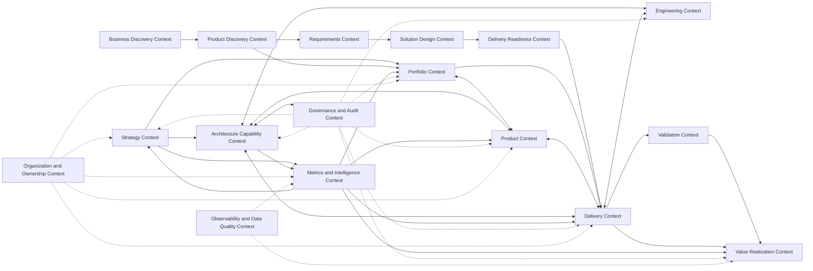

## 3. Entidades

### Strategy Context

| Entidade | Descrição | Identidade |
| --- | --- | --- |
| CorporateStrategy | Direção estratégica válida para um horizonte. | strategyId |
| StrategicTheme | Agrupador de prioridades corporativas. | themeId |
| StrategicObjective | Resultado desejado e mensurável. | objectiveId |
| OKR | Estrutura de objetivo e resultados-chave. | okrId |
| KeyResult | Resultado-chave mensurável dentro de um OKR. | keyResultId |
| StrategicOutcome | Mudança observável esperada. | outcomeId |

### Portfolio Context

| Entidade | Descrição | Identidade |
| --- | --- | --- |
| Portfolio | Carteira de investimentos, iniciativas e capacidade. | portfolioId |
| Investment | Alocação de funding, capacidade ou esforço relevante. | investmentId |
| FundingCycle | Ciclo de planejamento e decisão de funding. | fundingCycleId |
| Idea | Possibilidade inicial ainda não qualificada. | ideaId |
| Opportunity | Hipótese qualificada de valor ou risco. | opportunityId |
| PortfolioDecision | Decisão sobre priorização, funding, pausa ou cancelamento. | decisionId |
| CapacityAllocation | Alocação de capacidade por período e escopo. | allocationId |

### Product Context

| Entidade | Descrição | Identidade |
| --- | --- | --- |
| Product | Empacotamento, experiência, jornada, canal, solução ou proposição de valor formada por uma composição flexível de offers. Product não é Capability, Service ou Offer. | productId |
| ProductCapability | Capacidade interna de produto ou plataforma, usada para organizar roadmap e outcomes de produto; não representa Capability do Architecture Capability Context. | productCapabilityId |
| Roadmap | Plano evolutivo de produto. | roadmapId |
| ProductOutcome | Outcome sob responsabilidade de produto. | productOutcomeId |
| ProductHypothesis | Hipótese de produto ou oportunidade. | hypothesisId |
| RoadmapItem | Item de roadmap que referencia capability, outcome, hipótese ou intenção de entrega. | roadmapItemId |

### Architecture Capability Context

| Entidade | Descrição | Identidade | Ownership | Propósito |
| --- | --- | --- | --- | --- |
| ArchitectureDomain | Domínio arquitetural corporativo que agrupa subdomínios e capabilities relacionadas. | architectureDomainId | Arquiteto Corporativo / Domain Owner | Organizar análise por domínio e permitir heat maps, ownership e rastreabilidade arquitetural. |
| ArchitectureSubDomain | Subdivisão de um ArchitectureDomain com escopo de negócio ou arquitetura mais específico. | architectureSubDomainId | Domain Owner / SubDomain Owner | Estruturar capabilities por subdomínio e reduzir ambiguidade de responsabilidade. |
| BusinessLayer | Camada de negócio dentro de um subdomínio. | businessLayerId | Business Architect / Capability Architect | Agrupar capabilities por camada de negócio e facilitar análise de cobertura. |
| Capability | Capacidade corporativa com owner, propósito, criticidade e rastreabilidade. | capabilityId | Capability Owner / Arquiteto Corporativo | Explicar o que a organização precisa ser capaz de fazer para sustentar estratégia, produto, delivery e valor. |
| BusinessService | Serviço de negócio exposto por uma capability. | businessServiceId | Business Service Owner | Representar serviço de negócio consumível por offers e produtos. |
| TechnologyService | Serviço tecnológico exposto por uma capability. | technologyServiceId | Technology Service Owner / Líder Técnico | Representar sustentação tecnológica, racionalização e modernização de offers. |
| Offer | Oferta consumível por produtos, derivada de BusinessService ou TechnologyService. | offerId | Offer Owner | Conectar services a produtos sem confundir produto com capability ou service. |
| ApplicationService | Serviço de aplicação que implementa ou suporta uma offer. | applicationServiceId | Application Service Owner / Líder Técnico | Representar implementação aplicacional de uma offer e seus riscos. |
| ProductOfferAssociation | Associação governada entre Product e Offer. | productOfferAssociationId | Product Owner / Offer Owner | Registrar composição de produto, vigência, motivo e impacto. |
| ArchitectureAssessment | Avaliação arquitetural de capability, service, offer, application service ou produto. | architectureAssessmentId | Arquiteto Corporativo | Registrar aderência, risco, dívida, recomendação, evidência e decisão. |
| ArchitectureDebt | Dívida arquitetural que afeta capability, service, offer ou application service. | architectureDebtId | Arquiteto Corporativo / Owner da entidade afetada | Tornar explícito custo, risco, severidade e plano de remediação arquitetural. |
| ArchitectureException | Exceção arquitetural temporária com prazo, controles e risco aceito. | architectureExceptionId | Arquiteto Corporativo / Governança | Permitir desvio controlado, auditável e com plano de encerramento. |
| ModernizationPlan | Plano de modernização de capability ou service. | modernizationPlanId | Capability Owner / Service Owner / PMO | Coordenar objetivo, escopo, decisão, evidência e progresso de modernização. |

### Business Discovery Context

| Entidade | Descrição | Identidade | Ownership | Propósito |
| --- | --- | --- | --- | --- |
| BusinessNeed | Necessidade de negócio capturada antes de solução ou oportunidade. | businessNeedId | Business Owner | Preservar origem do fluxo de valor e evitar solução sem problema explícito. |
| PainPoint | Dor observada por cliente, operação, negócio ou stakeholder. | painPointId | Business Owner / Journey Owner | Evidenciar fricção, perda, risco ou ineficiência. |
| StakeholderNeed | Necessidade declarada por stakeholder interno ou externo. | stakeholderNeedId | Stakeholder Owner | Diferenciar demanda de stakeholder de necessidade validada. |
| CustomerNeed | Necessidade de cliente, usuário ou segmento. | customerNeedId | Product Owner / Journey Owner | Conectar jornadas e valor percebido. |
| BusinessProblem | Problema de negócio formulado a partir de necessidade, dor, evidência e impacto. | businessProblemId | Business Owner | Orientar discovery e priorização por problema, não por solução prematura. |
| BusinessConstraint | Restrição de negócio, regulatória, operacional, temporal ou financeira. | businessConstraintId | Business Owner / Compliance quando aplicável | Limitar opções de solução e priorização. |
| BusinessEvidence | Evidência de necessidade, dor, processo, jornada ou impacto. | businessEvidenceId | Owner da evidência | Sustentar decisão, discovery e auditoria. |
| CustomerJourney | Jornada de cliente afetada por dor, necessidade ou oportunidade. | customerJourneyId | Journey Owner | Conectar experiência, produto e outcome. |
| OperationalJourney | Jornada operacional interna afetada por processo, risco ou ineficiência. | operationalJourneyId | Operations Owner | Conectar operação, processo e delivery. |
| BusinessProcess | Processo de negócio afetado ou alvo de melhoria. | businessProcessId | Process Owner | Localizar impacto operacional e controles. |
| BusinessObjective | Objetivo de negócio local, não necessariamente estratégico corporativo. | businessObjectiveId | Business Owner | Explicitar resultado esperado antes de solução. |

### Product Discovery Context

| Entidade | Descrição | Identidade | Ownership | Propósito |
| --- | --- | --- | --- | --- |
| Discovery | Trabalho estruturado para entender problema, oportunidade, usuário, solução e valor. | discoveryId | Product Owner | Organizar hipóteses, experimentos, findings e decisão de avanço. |
| DiscoveryHypothesis | Hipótese validável sobre problema, solução, comportamento, valor ou adoção. | discoveryHypothesisId | Product Owner | Tornar premissas testáveis antes de investimento relevante. |
| DiscoveryExperiment | Experimento ou pesquisa para testar hipótese. | discoveryExperimentId | Product Owner / Research Owner | Produzir evidência para decisão. |
| DiscoveryFinding | Achado derivado de experimento, pesquisa ou análise. | discoveryFindingId | Product Owner | Transformar evidência em aprendizado acionável. |
| DiscoveryOutcome | Resultado do discovery: avançar, pivotar, descartar ou aprofundar. | discoveryOutcomeId | Product Owner / PMO | Condicionar opportunity assessment e priorização. |
| ProblemStatement | Formulação clara de problema, público, impacto e evidência. | problemStatementId | Product Owner / Business Owner | Evitar solução sem problema definido. |
| OpportunityAssessment | Avaliação de oportunidade por valor, risco, evidência, capacidade e alinhamento. | opportunityAssessmentId | Product Owner / PMO | Preparar decisão de portfólio ou roadmap. |
| PrioritizationDecision | Decisão de priorização baseada em evidência, valor, risco e capacidade. | prioritizationDecisionId | Product Owner / PMO | Registrar por que algo avança, pausa ou é descartado. |
| Assumption | Premissa explícita que ainda precisa ser validada ou monitorada. | assumptionId | Owner da entidade associada | Evitar que incertezas virem fatos implícitos. |

### Requirements Context

| Entidade | Descrição | Identidade | Ownership | Propósito |
| --- | --- | --- | --- | --- |
| FunctionalRequirement | Requisito funcional rastreável a problema, oportunidade ou decisão. | functionalRequirementId | Product Owner / Business Analyst | Definir comportamento esperado da solução. |
| NonFunctionalRequirement | Requisito não funcional de qualidade, segurança, dados, resiliência, performance ou compliance. | nonFunctionalRequirementId | Owner especialista | Definir restrições e qualidades obrigatórias. |
| BusinessRule | Regra de negócio que condiciona comportamento ou decisão. | businessRuleId | Business Owner | Preservar semântica de negócio e auditoria. |
| AcceptanceCriterion | Critério verificável de aceite. | acceptanceCriterionId | Product Owner / QA Owner | Permitir validação objetiva de feature, story ou requisito. |
| DefinitionOfReady | Critérios mínimos para entrada em execução. | definitionOfReadyId | Product Owner / Delivery Owner | Impedir início de trabalho sem clareza suficiente. |
| DefinitionOfDone | Critérios mínimos para considerar trabalho concluído. | definitionOfDoneId | Delivery Owner / Quality Owner | Impedir encerramento sem qualidade e evidência. |
| Constraint | Restrição aplicável a requisito, solução ou entrega. | constraintId | Owner da restrição | Explicitar limites não negociáveis. |
| RequirementDependency | Dependência que condiciona requisito, solução ou entrega. | requirementDependencyId | Dependency Owner | Expor bloqueios e aging antes do delivery. |
| RequirementRisk | Risco associado a requisito, regra, dependência ou constraint. | requirementRiskId | Risk Owner | Tornar risco tratável antes de execução. |

### Solution Design Context

| Entidade | Descrição | Identidade | Ownership | Propósito |
| --- | --- | --- | --- | --- |
| SolutionDesign | Desenho da solução proposta para requisitos e constraints. | solutionDesignId | Solution Owner / Arquiteto | Explicitar opção de solução, impacto, riscos e dependências. |
| SolutionRecord | Registro consolidado da solução, decisões, alternativas e evidências. | solutionRecordId | Solution Owner | Preservar racional e histórico. |
| SolutionDecision | Decisão sobre opção de solução, trade-off ou exceção. | solutionDecisionId | Autoridade de solução | Sustentar governança e explainability. |
| ArchitectureReview | Revisão arquitetural da solução. | architectureReviewId | Arquiteto Corporativo | Avaliar aderência, debt, exception e modernization impact. |
| EngineeringReview | Revisão de engenharia da solução. | engineeringReviewId | Líder Técnico | Avaliar viabilidade técnica, esforço, riscos e readiness. |
| SecurityReview | Revisão de segurança. | securityReviewId | Security Specialist | Avaliar controles, riscos e compliance de segurança. |
| DataReview | Revisão de dados, lineage, qualidade e privacidade. | dataReviewId | Data Specialist | Avaliar impacto de dados e evidências. |
| ComplianceReview | Revisão de compliance, política ou regulação. | complianceReviewId | Compliance Specialist | Avaliar aderência normativa. |
| SolutionApproval | Aprovação formal da solução ou de exceção. | solutionApprovalId | Autoridade aprovadora | Condicionar readiness e execução. |
| SolutionEvidence | Evidência usada em revisão, decisão ou aprovação de solução. | solutionEvidenceId | Owner da evidência | Sustentar auditoria e decisão. |

### Delivery Readiness Context

| Entidade | Descrição | Identidade | Ownership | Propósito |
| --- | --- | --- | --- | --- |
| ReadinessAssessment | Avaliação de prontidão para execução. | readinessAssessmentId | Delivery Owner / Scrum Master | Verificar DOR, capacidade, dependências, riscos e aprovações. |
| ReadinessChecklist | Checklist governado de critérios de entrada. | readinessChecklistId | Delivery Owner | Padronizar entrada em delivery sem engessar contextos. |
| DependencyAssessment | Avaliação de dependências abertas ou críticas. | dependencyAssessmentId | Dependency Owner / PMO | Evitar entrada em execução com dependência invisível. |
| RiskAssessment | Avaliação de riscos antes da execução. | riskAssessmentId | Risk Owner | Decidir mitigação, aceite ou bloqueio. |
| CapacityAssessment | Avaliação de capacidade disponível e comprometida. | capacityAssessmentId | Manager / Coordinator | Evitar compromisso além da capacidade. |

### Delivery Context

| Entidade | Descrição | Identidade |
| --- | --- | --- |
| Initiative | Unidade tática de execução. | initiativeId |
| Epic | Bloco relevante de escopo dentro de iniciativa. | epicId |
| Feature | Item de entrega que implementa um RoadmapItem ou escopo técnico/operacional aprovado. | featureId |
| Story | Fatia entregável de valor ou comportamento. | storyId |
| Task | Trabalho operacional necessário à entrega. | taskId |
| FlowStage | Estágio conceitual do fluxo em que trabalho se encontra. | flowStageId |
| Queue | Conjunto de itens aguardando capacidade, decisão, dependência, aprovação ou próximo estágio. | queueId |
| Bottleneck | Restrição persistente ou recorrente que reduz throughput, aumenta espera ou degrada previsibilidade. | bottleneckId |
| Blocker | Impedimento explícito que trava fluxo. | blockerId |
| Release | Conjunto de entregas disponibilizadas. | releaseId |
| Dependency | Relação de dependência entre entidades. | dependencyId |

### Validation Context

| Entidade | Descrição | Identidade | Ownership | Propósito |
| --- | --- | --- | --- | --- |
| Validation | Validação geral de entrega, requisito, outcome ou benefício. | validationId | Validation Owner | Consolidar status de aceite, evidência e resultado. |
| AcceptanceValidation | Validação de critérios de aceite. | acceptanceValidationId | Product Owner / QA Owner | Confirmar que AcceptanceCriteria foram atendidos. |
| BusinessValidation | Validação de aderência ao problema, processo ou regra de negócio. | businessValidationId | Business Owner | Confirmar utilidade e conformidade de negócio. |
| TechnicalValidation | Validação técnica da solução entregue. | technicalValidationId | Líder Técnico / Quality Owner | Confirmar qualidade técnica e readiness. |
| OutcomeValidation | Validação de outcome observado. | outcomeValidationId | Product Owner / Metrics Owner | Confirmar mudança observável ligada à entrega. |
| ValueValidation | Validação de valor ou benefício antes de value realization final. | valueValidationId | Sponsor de valor | Confirmar evidência suficiente para benefício. |

### Engineering Context

| Entidade | Descrição | Identidade |
| --- | --- | --- |
| TechnicalService | Serviço, aplicação ou componente técnico. | serviceId |
| Integration | Relação técnica entre serviços, domínios ou fontes. | integrationId |
| TechnicalDebt | Compromisso técnico pendente que gera risco ou custo. | debtId |
| TechnicalRisk | Risco técnico com impacto em entrega, operação ou valor. | technicalRiskId |
| ReleaseReadinessAssessment | Avaliação de prontidão técnica. | assessmentId |

### Metrics and Intelligence Context

| Entidade | Descrição | Identidade |
| --- | --- | --- |
| KPI | Indicador governado e rastreável. | kpiId |
| MetricDefinition | Definição formal de métrica. | metricDefinitionId |
| MeasurementTarget | Entidade de domínio medida por um KPI. | measurementTargetId |
| HealthScore | Sinal composto de saúde de entidade. | scoreId |
| FlowHealthScore | Sinal composto de saúde do fluxo para stage, queue, squad, iniciativa, portfólio ou enterprise flow. | flowHealthScoreId |
| HeatMap | Projeção de intensidade de gargalos, filas, esperas e desperdícios. | heatMapId |
| Forecast | Projeção explicável de prazo, valor, KPI, KR ou capacidade. | forecastId |
| Alert | Sinal acionável de exceção ou desvio. | alertId |
| AlertCondition | Condição objetiva que disparou o alerta e que deve ser removida, mitigada ou formalmente aceita para encerramento. | alertConditionId |
| AlertAction | Ação registrada para tratar a causa ou condição de um alerta. | alertActionId |
| AlertEvidence | Evidência de execução, mitigação, decisão ou remoção da condição original. | alertEvidenceId |
| AlertValidation | Validação de que a condição original do alerta deixou de existir ou foi formalmente aceita. | alertValidationId |
| AlertResolution | Encerramento auditável de alerta após ação, evidência e validação. | alertResolutionId |

### Value Realization Context

| Entidade | Descrição | Identidade |
| --- | --- | --- |
| ValueCase | Caso de valor com hipótese, baseline, target e evidência esperada. | valueCaseId |
| BenefitHypothesis | Hipótese específica de benefício. | benefitHypothesisId |
| RealizedBenefit | Benefício medido em período. | benefitId |
| BenefitValidation | Validação ou rejeição de benefício realizado. | validationId |

### Governance and Audit Context

| Entidade | Descrição | Identidade |
| --- | --- | --- |
| Decision | Decisão relevante de domínio. | decisionId |
| DecisionGate | Ponto formal de avaliação que condiciona avanço de entidade ou processo. | gateId |
| Approval | Aprovação formal associada a decisão ou entidade. | approvalId |
| Evidence | Artefato verificável. | evidenceId |
| Control | Obrigação verificável derivada de política ou risco. | controlId |
| Exception | Desvio aceito temporariamente. | exceptionId |
| AuditTrailEntry | Registro auditável de ação ou decisão. | auditEntryId |

### Case Management Context

| Entidade | Descrição | Identidade |
| --- | --- | --- |
| Case | Agrupador governado de problemas, alertas, investigações, decisões, action plans, evidências, validações e aprendizados relacionados a um mesmo assunto corporativo relevante. | caseId |
| CaseType | Classificação do case por natureza corporativa. | caseTypeId |
| CaseStatus | Estado do ciclo de vida do case. | caseStatusId |
| CaseSeverity | Severidade baseada em risco, impacto, valor, criticidade regulatória ou recorrência. | caseSeverityId |
| CaseAssignment | Atribuição de owner, accountable, participantes, reviewers e escalation target. | caseAssignmentId |
| CaseTimeline | Histórico completo de eventos, vínculos, decisões, ações, evidências, validações e reaberturas do case. | caseTimelineId |
| CaseClosure | Registro de resolução e encerramento com critérios, evidências e decisão. | caseClosureId |
| CaseReopening | Registro de reabertura por retorno de condição, evidência invalidada ou validação falha. | caseReopeningId |
| CaseRelationship | Relação entre case e alertas, investigations, decisions, action plans, evidence, validations, learnings e entidades afetadas. | caseRelationshipId |

#### Atributos Conceituais de Case

caseId, caseType, title, description, severity, priority, status, owner, accountable, affectedEntities, affectedCapabilities, affectedProducts, affectedPortfolios, affectedValueCases, relatedAlerts, relatedInvestigations, relatedDecisions, relatedActionPlans, relatedEvidence, relatedValidations, relatedLearnings, createdAt, updatedAt, openedAt, closedAt, dueDate, SLA, aging, businessImpact, valueAtRisk, riskAccepted, closureCriteria, closureEvidence e closureDecision.

#### Tipos de Case

| Tipo | Propósito | Gatilhos Típicos | Owners | Artefatos Relacionados |
| --- | --- | --- | --- | --- |
| Operational Case | Coordenar problemas operacionais transversais. | SLA breach, filas críticas, blocker recorrente, falha de validação. | Coordenador / PMO operacional. | Blockers, queues, alerts, action plans, validations. |
| Governance Case | Coordenar problema de decisão, evidência, controle, gate ou auditoria. | Decision SLA excedido, evidência ausente, gate rejeitado, controle não atendido. | Governance Team / PMO. | Decisions, gates, approvals, evidence, controls. |
| Architecture Case | Coordenar risco arquitetural, dívida, exceção ou impacto em Architecture Elevator. | Architecture debt critical, exception expired, review pendente. | Arquiteto Corporativo / Capability Owner. | Capability, service, offer, architecture debt, modernization plan. |
| Value Leakage Case | Coordenar perda de valor planejado, forecast ou validado. | ValueLeakageDetected, BenefitRejected, ROI abaixo do esperado. | Sponsor de valor / Product Owner / Financeiro. | ValueCase, benefit, KPI, evidence, decisions. |
| Capability Degradation Case | Coordenar degradação de capability crítica. | CapabilityHealthDegraded, capability traceability critical, service degraded. | Capability Owner / Arquiteto Corporativo. | Capability, service, offer, product, initiative, value case. |
| Delivery Blockage Case | Coordenar bloqueios de delivery recorrentes ou sistêmicos. | Blocker recorrente, QueueThresholdBreached, feature crítica bloqueada. | Gerente / Coordenador / PMO. | Initiative, feature, story, blocker, dependency, action plan. |
| Compliance Case | Coordenar risco regulatório, política ou controle. | Compliance review rejected, control evidence missing, regulatory critical alert. | Compliance Owner / Risk Owner. | Controls, evidence, exceptions, decisions, validations. |
| Data Quality Case | Coordenar problema de frescor, lineage, divergência ou cálculo. | DataConfidenceDegraded, SourceDivergenceDetected, CalculationErrorDetected. | Data Owner / Data Steward. | KPI, source, lineage, metric observations, evidence. |
| Strategic Risk Case | Coordenar risco estratégico transversal. | Objective at risk, KR forecast critical, investment at risk. | Diretor / Superintendente / PMO. | Objective, OKR, portfolio, investment, value case. |
| Incident Case | Coordenar incidente relevante com impacto corporativo. | Incidente crítico, falha operacional, impacto em cliente ou controle. | Incident Owner / Operations Owner. | Incidents, alerts, evidence, decisions, action plans. |
| Modernization Case | Coordenar modernização de capability, service, offer ou aplicação. | Modernization delayed, architecture debt, technology rationalization risk. | Capability Owner / Service Owner / PMO. | ModernizationPlan, architecture debt, initiatives, decisions. |

#### Lifecycle de Case

```text
Created -> Triaged -> Assigned -> Investigating -> ActionPlanning -> Remediating -> Validating -> Resolved -> Closed -> Reopened
```

Regras de lifecycle:

- Case não pode ser fechado sem owner.
- Case não pode ser fechado sem critério de encerramento.
- Case crítico não pode ser fechado sem evidência.
- Case crítico não pode ser fechado sem decisão de encerramento.
- Case pode ser reaberto se a condição retornar, evidência for invalidada ou validação falhar.
- Case pode conter múltiplos alertas, múltiplas investigations e múltiplos action plans.
- Case deve preservar timeline completa.

#### Relações de Case

| Relação | Cardinalidade | Regra |
| --- | --- | --- |
| Case -> Alert | 1:N | Alert pode existir sem Case inicialmente; alert crítico, recorrente ou sistêmico deve gerar ou associar-se a um Case. |
| Case -> Investigation | 1:N | Investigation pode ser aberta dentro de Case; Case pode iniciar Investigation; Investigation pode recomendar criação de Case quando o problema for sistêmico. |
| Case -> ActionPlan | 1:N | Case coordena múltiplos planos de ação sem substituir ActionPlan. |
| Case -> Decision | 1:N | Case pode exigir decisões de priorização, aceite de risco, encerramento ou escalonamento. |
| Case -> Evidence | 1:N | Case agrega evidências de abertura, investigação, ação, validação e fechamento. |
| Case -> Learning | 1:N | Case resolvido pode gerar learnings e padrões reutilizáveis. |
| Case -> Affected Entity | N:M | Case pode afetar capabilities, products, portfolios, value cases, initiatives, features, controls ou métricas. |

### Organization and Ownership Context

| Entidade | Descrição | Identidade |
| --- | --- | --- |
| Owner | Responsável por entidade, métrica, decisão ou ação. | ownerId |
| RoleAssignment | Associação entre pessoa/time e papel. | roleAssignmentId |
| OrganizationUnit | Unidade organizacional. | orgUnitId |
| Team | Time responsável por execução ou ownership. | teamId |

### Observability and Data Quality Context

| Entidade | Descrição | Identidade |
| --- | --- | --- |
| ObservabilitySignal | Sinal que explica saúde, atraso, falha ou divergência. | signalId |
| DataQualityAssessment | Avaliação de qualidade de dado ou cálculo. | assessmentId |
| SourceSystem | Sistema de origem conceitual. | sourceSystemId |

## 4. Value Objects

| Value Object | Descrição |
| --- | --- |
| Period | Intervalo temporal com início e fim. |
| Horizon | Janela estratégica, anual, trimestral ou operacional. |
| MoneyAmount | Valor financeiro com moeda. |
| Percentage | Percentual normalizado. |
| ConfidenceLevel | Alta, média, baixa ou desconhecida. |
| HealthScoreValue | Valor de score com faixa e interpretação. |
| ForecastScenario | Otimista, provável ou pessimista. |
| MetricFormula | Expressão conceitual de cálculo. |
| BaselineTarget | Par baseline-target de medição. |
| TraceabilityPath | Sequência explícita de vínculos entre entidades. |
| OwnershipScope | Escopo de responsabilidade do owner. |
| RiskRating | Combinação de probabilidade, impacto e severidade. |
| EvidenceReference | Referência verificável a evidência. |
| DecisionRationale | Justificativa formal de decisão. |
| DataFreshness | Atualidade do dado frente à periodicidade esperada. |
| SourceLineage | Origem e transformação conceitual de um dado. |
| CapacityAmount | Capacidade expressa por unidade de planejamento. |
| TimeToValue | Tempo entre entrega e evidência de benefício. |
| QueueTime | Tempo que item permanece em fila sem avanço de estágio. |
| FlowStageType | Intake, Prioritization, Commitment, Discovery, Ready, In Progress, Waiting, Validation, Released ou Value Check. |
| BottleneckSeverity | Severidade de gargalo por impacto, duração, recorrência e escopo afetado. |
| HeatMapCell | Célula de heat map com dimensão, intensidade, entidade e período. |
| Aging | Tempo transcorrido desde a entrada em estado, fila ou etapa. |
| SLAThreshold | Limite acordado para permanência em estado, fila, revisão, decisão ou validação. |
| ReviewOutcome | Approved, Rejected, ChangesRequired, Waived ou Deferred. |
| AlertSeverity | Informational, Warning, Risk, Critical ou Regulatory Critical. |
| RACIAssignment | Responsável, accountable, consultado e informado para entidade, revisão, decisão ou alerta. |

## 5. Agregados

### Strategy Aggregate

Root: `CorporateStrategy`

Entidades internas:

- StrategicTheme
- StrategicObjective
- OKR
- KeyResult
- StrategicOutcome

Invariantes:

- Objetivo estratégico ativo deve pertencer a uma estratégia.
- OKR deve estar associado a objetivo estratégico.
- Key Result deve possuir forma mensurável.
- Outcome deve ter owner ou owner herdado do objetivo.

### Portfolio Aggregate

Root: `Portfolio`

Entidades internas:

- Investment
- FundingCycle
- Idea
- Opportunity
- CapacityAllocation
- PortfolioDecision

Invariantes:

- Investimento deve possuir owner e ciclo.
- Iniciativa financiada deve estar vinculada a investimento.
- Ideia qualificada deve gerar oportunidade ou descarte justificado.
- Oportunidade aprovada deve gerar iniciativa, experimento ou decisão de descarte.
- Decisão de portfólio deve possuir justificativa.

### Product Aggregate

Root: `Product`

Entidades internas:

- ProductCapability
- Roadmap
- ProductOutcome
- ProductHypothesis
- RoadmapItem
- ProductOfferAssociation

Invariantes:

- Roadmap deve pertencer a produto.
- RoadmapItem deve estar ligado a ProductCapability interna de produto, outcome ou hipótese.
- Outcome de produto deve possuir KPI associado ou justificativa.
- Product não é Capability, Service ou Offer.
- Product é uma composição flexível de N Offers.
- ProductOfferAssociation deve possuir owner, motivo e período de vigência.
- ProductCapability é conceito interno do Product Context e não substitui Capability do Architecture Capability Context.

### ArchitectureDomain Aggregate

Root: `ArchitectureDomain`

Entidades internas:

- ArchitectureSubDomain
- BusinessLayer
- Capability

Invariantes:

- ArchitectureDomain deve possuir owner.
- ArchitectureSubDomain deve pertencer a um ArchitectureDomain.
- BusinessLayer deve pertencer a um ArchitectureSubDomain.
- Capability deve pertencer a uma BusinessLayer.
- Capability deve possuir owner, propósito e criticidade.
- Toda Capability crítica deve permitir rastreabilidade até objetivos, produtos, iniciativas, métricas, value cases ou justificativa formal.

### Service Aggregate

Root: `Capability`

Entidades internas:

- BusinessService
- TechnologyService
- Offer
- ApplicationService

Invariantes:

- BusinessService deve pertencer a uma Capability.
- TechnologyService deve pertencer a uma Capability.
- Offer deve estar associada a pelo menos um BusinessService ou TechnologyService.
- Offer pode ser composta por N ApplicationServices.
- ApplicationService não é Product.
- Capability não é Product.
- Service não é Product.

### Product Composition Aggregate

Root: `Product`

Entidades internas:

- ProductOfferAssociation

Invariantes:

- Product pode associar-se a N Offers.
- Offer pode compor N Products.
- Toda associação Product-Offer deve possuir owner, motivo e período de vigência.
- ProductOfferAssociation deve preservar histórico de inclusão, remoção, vigência e substituição de offer.

### Architecture Governance Aggregate

Root: `ArchitectureAssessment`

Entidades internas:

- ArchitectureDebt
- ArchitectureException
- ModernizationPlan

Invariantes:

- ArchitectureAssessment deve declarar escopo, entidade avaliada, resultado, evidências, recomendação e decisão associada quando aplicável.
- ArchitectureDebt deve possuir owner, severidade, entidade afetada e plano de tratamento ou aceite formal de risco.
- ArchitectureException deve possuir owner, prazo, justificativa, controles compensatórios e plano de encerramento.
- Toda modernização de Capability ou Service deve possuir owner, objetivo, escopo, decisão e evidência.

### Business Discovery Aggregate

Root: `BusinessNeed`

Entidades internas:

- PainPoint
- StakeholderNeed
- CustomerNeed
- BusinessProblem
- BusinessConstraint
- BusinessEvidence
- CustomerJourney
- OperationalJourney
- BusinessProcess
- BusinessObjective

Invariantes:

- BusinessNeed deve possuir owner, origem, evidência mínima e estado.
- PainPoint deve possuir evidência ou justificativa de investigação pendente.
- BusinessProblem deve estar ligado a necessidade, dor, jornada, processo ou constraint.
- BusinessEvidence deve declarar fonte, validade e owner.
- BusinessNeed aceita ou priorizada deve possuir caminho rastreável para discovery, oportunidade ou decisão de descarte.

### Product Discovery Aggregate

Root: `Discovery`

Entidades internas:

- DiscoveryHypothesis
- DiscoveryExperiment
- DiscoveryFinding
- DiscoveryOutcome
- ProblemStatement
- OpportunityAssessment
- PrioritizationDecision
- Assumption

Invariantes:

- Discovery deve possuir problema ou necessidade de origem.
- DiscoveryHypothesis deve ser validável, falseável ou explicitamente marcada como premissa.
- DiscoveryOutcome deve registrar avançar, pivotar, descartar ou aprofundar.
- OpportunityAssessment deve possuir evidência, valor esperado, risco, owner e decisão.
- PrioritizationDecision deve possuir racional, owner, data e impacto esperado.

### Requirements Aggregate

Root: `FunctionalRequirement`

Entidades internas:

- NonFunctionalRequirement
- BusinessRule
- AcceptanceCriterion
- DefinitionOfReady
- DefinitionOfDone
- Constraint
- RequirementDependency
- RequirementRisk
- Assumption

Invariantes:

- Todo requisito deve possuir origem rastreável para BusinessNeed, ProblemStatement, Opportunity ou decisão formal.
- FunctionalRequirement deve possuir owner e critério de aceite.
- NonFunctionalRequirement deve possuir owner especialista quando for crítico.
- AcceptanceCriterion deve ser verificável.
- DefinitionOfReady e DefinitionOfDone devem possuir owner e versão conceitual.
- Constraint, Dependency, Risk e Assumption devem ser classificados de forma distinta.

### Solution Design Aggregate

Root: `SolutionDesign`

Entidades internas:

- SolutionRecord
- SolutionDecision
- ArchitectureReview
- EngineeringReview
- SecurityReview
- DataReview
- ComplianceReview
- SolutionApproval
- SolutionEvidence

Invariantes:

- SolutionDesign deve possuir requisitos de origem, owner, escopo, decisões e evidências.
- Revisões obrigatórias devem declarar reviewer, resultado, pendências, SLA e evidência.
- SolutionApproval deve depender de revisões obrigatórias aprovadas ou exceção formal.
- SolutionDecision deve registrar alternativas consideradas e racional.

### Delivery Readiness Aggregate

Root: `ReadinessAssessment`

Entidades internas:

- ReadinessChecklist
- DependencyAssessment
- RiskAssessment
- CapacityAssessment

Invariantes:

- ReadinessAssessment deve declarar entidade avaliada, owner, critérios de entrada e saída.
- Item não deve avançar para delivery sem DOR atendido ou exceção formal.
- Dependências críticas devem possuir owner, prazo e plano.
- CapacityAssessment deve indicar capacidade disponível, demanda e risco de sobrecarga.

### Initiative Aggregate

Root: `Initiative`

Entidades internas:

- Epic
- Dependency

Invariantes:

- Épico deve estar vinculado a iniciativa.
- Initiative deve possuir owner, status e vínculo com portfólio, investimento ou exceção formal.
- Dependência crítica deve possuir owner, severidade e prazo.

### Feature Aggregate

Root: `Feature`

Entidades internas:

- Story
- Task
- Blocker

Invariantes:

- Feature deve estar vinculada a exatamente um épico.
- Feature pode implementar um RoadmapItem ou representar escopo técnico/operacional aprovado.
- Story deve estar vinculada a Feature ou herdar vínculo por regra explícita.
- Task deve estar vinculada a Story.
- Blocker deve possuir owner, causa e impacto.

### Flow Intelligence Aggregate

Root: `Queue`

Entidades internas:

- FlowStage
- Bottleneck

Invariantes:

- Queue deve declarar flow stage, entidade associada, owner, período e critério de entrada.
- Bottleneck deve estar associado a queue, flow stage ou entidade afetada.
- Bottleneck deve possuir severidade, causa provável, duração e impacto.
- FlowStage deve ser usado como classificação conceitual de fluxo, não como substituto dos estados específicos das entidades.

### Release Aggregate

Root: `Release`

Entidades internas:

- Feature

Invariantes:

- Release deve declarar escopo de features.
- Release crítica deve possuir evidência de prontidão ou DecisionGate aplicável.

### Engineering Aggregate

Root: `TechnicalService`

Entidades internas:

- Integration
- TechnicalDebt
- TechnicalRisk
- ReleaseReadinessAssessment

Invariantes:

- Débito técnico deve ter impacto, owner e plano ou justificativa.
- Risco técnico crítico deve estar vinculado a iniciativa, serviço ou release.
- Release readiness deve declarar critérios avaliados.

### KPI Aggregate

Root: `KPI`

Entidades internas:

- MetricDefinition

Invariantes:

- KPI deve possuir owner, fórmula, fonte, baseline, target, periodicidade e confiança.
- KPI deve medir pelo menos um MeasurementTarget.
- KPI não é elo estrutural obrigatório entre estratégia, portfólio e delivery.

### Health Score Aggregate

Root: `HealthScore`

Entidades internas:

- MeasurementTarget
- FlowHealthScore

Invariantes:

- Health score deve possuir componentes explicáveis.
- Health score deve declarar entidade medida e período.
- FlowHealthScore deve decompor queue time, bottleneck severity, WIP, aging, throughput e flow efficiency.

### Heat Map Aggregate

Root: `HeatMap`

Entidades internas:

- FlowHealthScore
- Queue
- Bottleneck

Invariantes:

- HeatMap deve declarar nível de análise: enterprise, portfolio, delivery ou squad.
- HeatMap deve permitir drill-down até queues, bottlenecks e work items causadores.
- HeatMap deve permitir drill-up até objetivo, portfólio ou iniciativa impactada.

### Forecast Aggregate

Root: `Forecast`

Entidades internas:

- MeasurementTarget

Invariantes:

- Forecast deve possuir horizonte, premissas, cenário, drivers e confiança.
- Forecast usado em decisão executiva deve ser auditável.

### Alert Aggregate

Root: `Alert`

Entidades internas:

- MeasurementTarget
- AlertCondition
- AlertAction
- AlertEvidence
- AlertValidation
- AlertResolution

Invariantes:

- Alerta deve possuir owner, severidade, causa provável e ação sugerida.
- Alerta deve referenciar entidade afetada.
- Alerta deve possuir pelo menos uma AlertCondition mensurável ou verificável.
- AlertCondition deve declarar métrica, evento, threshold, estado esperado ou evidência necessária para demonstrar que deixou de existir.
- Alerta deve permanecer aberto até possuir ação registrada, evidência de execução e validação de que a condição original deixou de existir.
- AlertAction deve possuir owner, prazo, status e resultado esperado.
- AlertEvidence deve demonstrar execução da ação, decisão formal ou remoção da condição original.
- AlertValidation deve verificar a AlertCondition original, não apenas registrar comentário ou aceite informal.
- AlertResolution só pode existir quando AlertAction, AlertEvidence e AlertValidation estiverem completos; aceite de risco deve ser registrado como decisão formal auditável.

### Value Realization Aggregate

Root: `ValueCase`

Entidades internas:

- BenefitHypothesis
- RealizedBenefit
- BenefitValidation

Invariantes:

- Value case deve possuir hipótese, baseline, target e método de comprovação.
- Benefício realizado deve possuir período, fonte e evidência.
- Benefício validado deve possuir validador e critério de aceite.

### Governance Aggregate

Root: `Decision`

Entidades internas:

- DecisionGate
- Approval
- Evidence
- Control
- Exception
- AuditTrailEntry

Invariantes:

- Decisão crítica deve possuir evidência ou exceção formal.
- DecisionGate deve declarar critério de entrada, critério de saída, escopo e autoridade responsável.
- Aprovação deve registrar solicitante e aprovador.
- Exceção deve possuir owner, prazo e plano de encerramento.
- Controle deve declarar evidência esperada.

## 6. Relacionamentos

| Origem | Relação | Destino |
| --- | --- | --- |
| CorporateStrategy | contém | StrategicTheme |
| StrategicTheme | orienta | StrategicObjective |
| StrategicObjective | possui | OKR |
| OKR | possui | KeyResult |
| StrategicObjective | espera | StrategicOutcome |
| KPI | mede | StrategicObjective, KeyResult, StrategicOutcome, Product, Initiative ou ValueCase |
| Portfolio | alinha-se a | StrategicTheme |
| Portfolio | contribui para | StrategicObjective |
| Portfolio | organiza | Investment |
| Portfolio | prioriza | Initiative |
| Investment | financia | Initiative |
| Idea | pode evoluir para | Opportunity |
| Opportunity | pode originar | Initiative |
| Product | possui | ProductCapability interna de produto |
| Product | possui | Roadmap |
| Product | é composto por | Offer |
| Offer | compõe | Product |
| Roadmap | planeja | RoadmapItem |
| RoadmapItem | referencia | ProductCapability interna de produto |
| ArchitectureDomain | contém | ArchitectureSubDomain |
| ArchitectureSubDomain | contém | BusinessLayer |
| BusinessLayer | contém | Capability |
| Capability | expõe | BusinessService |
| Capability | expõe | TechnologyService |
| BusinessService | oferece | Offer |
| TechnologyService | oferece | Offer |
| Offer | é implementada por | ApplicationService |
| ApplicationService | implementa | Offer |
| Capability | suporta | StrategicObjective |
| Capability | suporta | Initiative |
| Capability | suporta | ValueCase |
| Capability | impacta | KPI |
| Offer | suporta | ProductOutcome |
| ArchitectureDebt | afeta | Capability, BusinessService, TechnologyService, Offer ou ApplicationService |
| ModernizationPlan | moderniza | Capability, BusinessService ou TechnologyService |
| BusinessNeed | evidencia-se por | BusinessEvidence |
| BusinessNeed | expressa | StakeholderNeed ou CustomerNeed |
| BusinessNeed | pode revelar | PainPoint |
| PainPoint | ocorre em | CustomerJourney ou OperationalJourney |
| CustomerJourney ou OperationalJourney | atravessa | BusinessProcess |
| BusinessProcess | contém ou evidencia | BusinessProblem |
| BusinessProblem | condicionado por | BusinessConstraint |
| BusinessProblem | descrito por | ProblemStatement |
| ProblemStatement | orienta | Discovery |
| Discovery | testa | DiscoveryHypothesis |
| DiscoveryHypothesis | testada por | DiscoveryExperiment |
| DiscoveryExperiment | produz | DiscoveryFinding |
| Discovery | conclui | DiscoveryOutcome |
| DiscoveryOutcome | alimenta | OpportunityAssessment |
| OpportunityAssessment | sustenta | PrioritizationDecision |
| PrioritizationDecision | pode originar | Opportunity, RoadmapItem ou FunctionalRequirement |
| FunctionalRequirement | deriva de | Opportunity, ProblemStatement ou PrioritizationDecision |
| NonFunctionalRequirement | complementa | FunctionalRequirement ou SolutionDesign |
| BusinessRule | condiciona | FunctionalRequirement |
| AcceptanceCriterion | valida | FunctionalRequirement, Feature ou Story |
| DefinitionOfReady | condiciona entrada de | Feature ou Story |
| DefinitionOfDone | condiciona conclusão de | Feature ou Story |
| Constraint | limita | Requirement, SolutionDesign ou Delivery |
| RequirementDependency | bloqueia ou condiciona | Requirement, SolutionDesign ou Feature |
| RequirementRisk | afeta | Requirement, SolutionDesign ou Delivery |
| SolutionDesign | atende | FunctionalRequirement e NonFunctionalRequirement |
| SolutionDesign | avaliado por | ArchitectureReview, EngineeringReview, SecurityReview, DataReview ou ComplianceReview |
| SolutionDecision | decide | SolutionDesign |
| SolutionApproval | aprova | SolutionDesign |
| SolutionEvidence | sustenta | SolutionDesign, Review ou SolutionApproval |
| ReadinessAssessment | avalia | Feature, Story, Initiative ou SolutionDesign |
| ReadinessChecklist | verifica | DefinitionOfReady |
| DependencyAssessment | avalia | RequirementDependency ou Dependency |
| RiskAssessment | avalia | RequirementRisk, TechnicalRisk ou Delivery Risk |
| CapacityAssessment | avalia | Team, Squad, Initiative ou Feature |
| Initiative | decompõe-se em | Epic |
| Epic | decompõe-se em | Feature |
| RoadmapItem | pode ser implementado por | Feature |
| Feature | decompõe-se em | Story |
| Story | decompõe-se em | Task |
| Feature, Story ou Task | posiciona-se em | FlowStage |
| Queue | agrupa | Feature, Story ou Task |
| Bottleneck | afeta | Queue, FlowStage, Initiative, Portfolio ou Team |
| Feature | entregue em | Release |
| Validation | avalia | Release, Feature, Story, Requirement, Outcome ou ValueCase |
| AcceptanceValidation | verifica | AcceptanceCriterion |
| BusinessValidation | verifica | BusinessRule, BusinessProcess ou BusinessObjective |
| TechnicalValidation | verifica | NonFunctionalRequirement, SolutionDesign ou Release |
| OutcomeValidation | verifica | ProductOutcome ou StrategicOutcome |
| ValueValidation | verifica | ValueCase ou RealizedBenefit |
| Initiative | associado a | ValueCase |
| Initiative | contribui para | StrategicOutcome |
| ValueCase | mede valor de | StrategicOutcome |
| ValueCase | medido por | KPI |
| ValueCase | possui | BenefitHypothesis |
| ValueCase | comprova | RealizedBenefit |
| RealizedBenefit | validado por | BenefitValidation |
| KPI | possui | MetricDefinition |
| KPI | possui | MeasurementTarget |
| KPI | recebe | Forecast |
| Entidade de domínio | pode possuir | HealthScore |
| Queue, Bottleneck ou FlowStage | pode possuir | FlowHealthScore |
| HeatMap | agrega | Queue, Bottleneck e FlowHealthScore |
| Entidade de domínio | pode disparar | Alert |
| Alert | possui | AlertCondition |
| Alert | exige | AlertAction |
| AlertAction | sustentada por | AlertEvidence |
| AlertResolution | depende de | AlertValidation |
| AlertValidation | verifica | AlertCondition |
| Entidade crítica | sustentada por | Evidence |
| Decision | pode exigir | Approval |
| DecisionGate | avalia | Entidade de domínio |
| Control | exige | Evidence |
| Owner | responsabiliza-se por | Entidade de domínio |
| ObservabilitySignal | afeta | KPI ou Dashboard conceitual |

## 7. Cardinalidades

| Relação | Cardinalidade |
| --- | --- |
| CorporateStrategy -> StrategicTheme | 1:N |
| StrategicTheme -> StrategicObjective | 1:N |
| StrategicObjective -> OKR | 1:N |
| OKR -> KeyResult | 1:N |
| StrategicObjective -> StrategicOutcome | 1:N |
| KPI -> MeasurementTarget | N:M |
| KPI -> StrategicObjective | N:M |
| KPI -> KeyResult | N:M |
| KPI -> StrategicOutcome | N:M |
| KPI -> Product | N:M |
| KPI -> Initiative | N:M |
| KPI -> ValueCase | N:M |
| StrategicOutcome -> Portfolio | N:M |
| StrategicObjective -> Portfolio | N:M |
| Portfolio -> Initiative | N:M |
| Portfolio -> Investment | 1:N |
| Investment -> Initiative | N:M |
| Idea -> Opportunity | 0..1 |
| Opportunity -> Initiative | 0:N |
| Product -> ProductCapability | 0:N |
| Product -> Roadmap | 1:N |
| Product -> Offer | N:M |
| Offer -> Product | N:M |
| BusinessNeed -> PainPoint | 0:N |
| BusinessNeed -> BusinessEvidence | 1:N |
| BusinessNeed -> StakeholderNeed | 0:N |
| BusinessNeed -> CustomerNeed | 0:N |
| PainPoint -> Journey | N:M |
| Journey -> BusinessProcess | N:M |
| BusinessProcess -> BusinessProblem | 0:N |
| BusinessProblem -> ProblemStatement | 1:1 |
| ProblemStatement -> Discovery | 0:N |
| Discovery -> DiscoveryHypothesis | 1:N |
| DiscoveryHypothesis -> DiscoveryExperiment | 0:N |
| DiscoveryExperiment -> DiscoveryFinding | 0:N |
| Discovery -> DiscoveryOutcome | 0:N |
| DiscoveryOutcome -> OpportunityAssessment | 0:N |
| OpportunityAssessment -> PrioritizationDecision | 0:N |
| PrioritizationDecision -> FunctionalRequirement | 0:N |
| FunctionalRequirement -> NonFunctionalRequirement | N:M |
| FunctionalRequirement -> BusinessRule | N:M |
| FunctionalRequirement -> AcceptanceCriterion | 1:N |
| FunctionalRequirement -> SolutionDesign | N:M |
| SolutionDesign -> Review | 1:N |
| Review -> SolutionApproval | 0..1:1 |
| SolutionDesign -> ReadinessAssessment | 0:N |
| ReadinessAssessment -> Feature | 0:N |
| AcceptanceCriterion -> AcceptanceValidation | 0:N |
| Feature -> Validation | 0:N |
| Story -> Validation | 0:N |
| Validation -> Outcome | 0:N |
| Validation -> ValueCase | 0:N |
| ArchitectureDomain -> ArchitectureSubDomain | 1:N |
| ArchitectureSubDomain -> BusinessLayer | 1:N |
| BusinessLayer -> Capability | 1:N |
| Capability -> BusinessService | 1:N |
| Capability -> TechnologyService | 1:N |
| BusinessService -> Offer | 1:N |
| TechnologyService -> Offer | 1:N |
| Offer -> ApplicationService | 1:N |
| Capability -> StrategicObjective | N:M |
| Capability -> Initiative | N:M |
| Capability -> KPI | N:M |
| Capability -> ValueCase | N:M |
| Roadmap -> RoadmapItem | 1:N |
| RoadmapItem -> ProductCapability | N:0..1 |
| Initiative -> Epic | 1:N |
| Epic -> Feature | 1:N |
| RoadmapItem -> Feature | 0..1:N |
| Feature -> Story | 1:N |
| Story -> Task | 1:N |
| WorkItem -> FlowStage | N:1 temporal |
| Queue -> WorkItem | 1:N temporal |
| Bottleneck -> Queue | N:M |
| Bottleneck -> FlowStage | N:M |
| HeatMap -> FlowHealthScore | 1:N |
| HeatMap -> Queue | 1:N |
| HeatMap -> Bottleneck | 0:N |
| Feature -> Release | N:M |
| Initiative -> StrategicOutcome | N:M |
| Initiative -> ValueCase | N:M |
| ValueCase -> StrategicOutcome | N:M |
| ValueCase -> KPI | N:M |
| ValueCase -> BenefitHypothesis | 1:N |
| ValueCase -> RealizedBenefit | 0:N |
| RealizedBenefit -> BenefitValidation | 0..1:1 |
| KPI -> Forecast | 0:N |
| Forecast -> MeasurementTarget | N:M |
| KPI -> MetricDefinition | 1:1 |
| Entidade -> Evidence | 0:N |
| Entidade -> Owner | N:1 |
| Decision -> Approval | 0:N |
| DecisionGate -> Decision | 0:N |
| DecisionGate -> Approval | 0:N |
| Control -> Evidence | 0:N |
| Entity -> HealthScore | 0:N temporal |
| Entity -> Alert | 0:N |
| Alert -> AlertCondition | 1:N |
| Alert -> AlertAction | 1:N |
| AlertAction -> AlertEvidence | 1:N |
| Alert -> AlertValidation | 0:N |
| Alert -> AlertResolution | 0..1:1 |

## 8. Regras de Negócio

### Rastreabilidade

- Toda iniciativa estratégica deve possuir vínculo explícito com portfólio, investimento, owner, outcome esperado e KPI impactado.
- Todo épico deve estar vinculado a exatamente uma iniciativa.
- Toda Feature deve estar vinculada a exatamente um épico.
- RoadmapItem e Feature são conceitos distintos; RoadmapItem expressa intenção de produto/roadmap, Feature expressa item executável de entrega no Delivery Context.
- Story deve estar vinculada a uma Feature, salvo exceção transitória formal.
- Task deve estar vinculada a uma story.
- Rastreabilidade não pode ser inferida apenas por texto, nomenclatura ou proximidade organizacional.

### Métricas

- Todo KPI deve possuir owner, fórmula, fonte, baseline, target, periodicidade e confiança.
- KPI deve medir explicitamente um ou mais alvos: objetivo, key result, outcome, produto, iniciativa ou value case.
- KPI não deve ser modelado como etapa obrigatória entre outcome e portfólio.
- Métrica sem owner não pode ser usada como base de decisão crítica.
- KPI com fonte atrasada deve sinalizar redução de confiança.
- Forecast usado em decisão executiva deve preservar versão, premissas e drivers.

### Portfólio

- Investimento aprovado deve possuir ciclo de funding.
- Ideia qualificada deve virar oportunidade ou ser descartada com justificativa.
- Iniciativa financiada deve estar vinculada a investimento.
- Oportunidade descartada deve possuir justificativa.
- Portfólio crítico deve possuir owner e plano de ação.
- Capacidade alocada acima de limite definido deve gerar risco ou alerta.

### Value Realization

- Value case deve declarar hipótese, baseline, target, método de comprovação e owner.
- Benefício realizado deve possuir período, fonte, método de cálculo e evidência.
- Benefício só pode ser considerado validado após validação explícita.
- Benefício rejeitado deve registrar motivo e responsável pela rejeição.

### Governança Bancária

- Decisão crítica deve possuir justificativa e evidência.
- DecisionGate deve declarar critérios de entrada, critérios de saída, autoridade responsável e entidades avaliadas.
- Exceção deve possuir owner, prazo e plano de encerramento.
- Aprovação deve respeitar segregação de funções.
- Controle deve possuir evidência esperada.
- Auditoria deve conseguir reconstruir quem decidiu, quando, por quê e com qual evidência.

### Observabilidade e Qualidade de Dados

- Ausência de dado, dado atrasado, dado inconsistente e resultado real são estados semanticamente diferentes.
- Falha de fonte que impacta KPI deve afetar confiança do KPI.
- Divergência entre fonte e projeção deve gerar avaliação de qualidade.

### Flow Intelligence

- Todo work item relevante deve poder ser classificado em um FlowStage conceitual.
- Queue deve ser visível quando itens aguardam capacidade, decisão, dependência, aprovação, validação ou próximo estágio.
- Queue sem owner deve gerar alerta de fluxo.
- Bottleneck deve ser registrado quando fila, espera ou restrição persistente degrada throughput, previsibilidade ou valor.
- Flow Health Score deve decompor seus drivers: queue time, bottleneck severity, aging WIP, WIP, throughput e flow efficiency.
- Enterprise Heat Map, Portfolio Heat Map, Delivery Heat Map e Squad Heat Map são projeções analíticas de fluxo, não novos níveis de domínio.
- Heat maps devem permitir drill-down até work items causadores e drill-up até objetivo, portfólio ou iniciativa afetada.

### Operating Model Rules

- Toda BusinessNeed deve possuir owner, data de entrada, estado, evidência ou justificativa de investigação pendente.
- Toda dor relevante deve possuir BusinessEvidence ou ser marcada como hipótese a validar.
- Toda hipótese deve ser validável, possuir owner e declarar como será aceita, rejeitada ou revisada.
- Todo requisito deve possuir origem rastreável para BusinessNeed, ProblemStatement, Opportunity, PrioritizationDecision ou decisão formal.
- Todo SolutionDesign deve possuir requisitos de origem, revisões aplicáveis, evidências e decisão de aprovação, rejeição ou ajuste.
- Toda revisão deve possuir reviewer, accountable, resultado, SLA, pendências e evidência.
- Feature ou Story não deve avançar para execução sem DefinitionOfReady atendida ou exceção formal auditável.
- Feature ou Story não deve ser concluída sem DefinitionOfDone, AcceptanceCriterion ou exceção formal auditável.
- Validation deve registrar critério, evidência, validador, resultado e impacto em outcome ou value case quando aplicável.
- Fila operacional sem owner, SLA ou capacidade definida deve gerar alerta de governança ou fluxo.

### Alert Closure Rules

- Alerta somente pode ser encerrado quando existe AlertAction registrada.
- Alerta somente pode ser encerrado quando existe AlertEvidence comprovando execução, decisão formal ou remoção da condição original.
- Alerta somente pode ser encerrado quando AlertValidation confirma que a condição original que disparou o alerta deixou de existir ou foi aceita formalmente por autoridade definida.
- Comentário, mudança manual de status ou ausência temporária de dado não encerram alerta.
- Aceite de risco encerra tratamento apenas quando registrado como Decision, Evidence e, quando aplicável, Exception.
- Alerta reaberto deve preservar resolução anterior, causa da reabertura e novo owner de ação.

### Concept Taxonomy Rules

- Need representa necessidade antes de solução; Opportunity representa possibilidade qualificada de gerar valor; Requirement representa condição a ser satisfeita; Feature representa entrega executável.
- Hypothesis é afirmação testável; Assumption é premissa ainda não validada; Constraint é limite imposto; Risk é incerteza com impacto; Issue é problema ocorrido ou identificado; Evidence é artefato verificável.
- BusinessEvidence, SolutionEvidence e AlertEvidence são especializações conceituais de Evidence usadas em contextos diferentes, sem alterar a semântica central de evidência.
- Dependency no Delivery Context representa dependência de execução; RequirementDependency representa dependência que condiciona requisitos ou solução antes do delivery.
- Capability, ProductCapability, BusinessService, TechnologyService, Offer e Product não podem ser usados como sinônimos.
- TechnicalDebt representa dívida localizada em implementação, código, teste, integração, release, operação técnica ou componente técnico sob ownership de engenharia.
- ArchitectureDebt representa dívida estrutural de capability, service, offer, application service, padrão, tecnologia, integração corporativa ou decisão arquitetural com impacto em produto, estratégia, risco ou modernização.
- Uma dívida pode ter efeitos técnicos e arquiteturais, mas deve possuir classificação primária, owner primário e relação explícita quando uma gera ou agrava a outra.

### Ownership and RACI Rules

- Entidades críticas devem declarar owner e accountable; revisões devem declarar reviewer; decisões devem declarar approver.
- Owner responde pela atualização e ação; accountable responde pelo resultado; reviewer responde pela avaliação; approver responde pela decisão.
- A mesma pessoa ou papel pode acumular owner e accountable apenas quando segregação de funções não for exigida por governança.
- Decisão, aprovação, validação, exceção e encerramento de alerta devem registrar autoridade responsável.

### Architecture Capability Rules

- ArchitectureDomain deve possuir owner e escopo explícito.
- ArchitectureSubDomain deve pertencer a exatamente um ArchitectureDomain.
- BusinessLayer deve pertencer a exatamente um ArchitectureSubDomain.
- Capability deve pertencer a exatamente uma BusinessLayer.
- Capability deve possuir owner, propósito e criticidade.
- Capability crítica deve possuir rastreabilidade até StrategicObjective, Product, Initiative, KPI, ValueCase ou justificativa formal.
- Capability não é Product.
- BusinessService e TechnologyService devem pertencer a uma Capability.
- Service, quando usado neste contexto, significa BusinessService ou TechnologyService.
- Service não é Product.
- Offer deve estar associada a pelo menos um BusinessService ou TechnologyService.
- Offer pode ser implementada por N ApplicationServices.
- ApplicationService não é Product.
- Product não é Capability, Service ou Offer.
- Product representa empacotamento, experiência, jornada, canal, solução ou proposição de valor formada por offers.
- Product pode associar-se a N Offers.
- Offer pode compor N Products.
- Toda ProductOfferAssociation deve possuir owner, motivo, período de vigência, status e evidência quando crítica.
- Rastreabilidade Offer-Product deve permitir identificar quais products são afetados por aposentadoria, degradação, dívida ou exceção de uma offer.
- Rastreabilidade Capability-Strategy deve permitir identificar quais strategic objectives, KPIs, value cases e initiatives são afetados por capability crítica.
- ModernizationPlan de Capability ou Service deve possuir owner, objetivo, escopo, decisão, evidência, prazo e critério de conclusão.
- ArchitectureDebt deve declarar entidade afetada, severidade, causa, owner, impacto e plano de remediação ou aceite formal de risco.
- ArchitectureAssessment deve registrar escopo, entidade avaliada, resultado, evidências, recomendações e decisão associada quando aplicável.
- Aposentadoria de Capability, Service ou Offer deve registrar motivo, substituto esperado, produtos afetados, iniciativas afetadas, decisão e plano de transição.
- CapabilityRetired ou OfferRetired deve gerar análise de impacto em Product, Initiative, KPI, ValueCase e ProductOutcome.
- ProductOfferAssociation removida deve preservar histórico e alternativa de substituição quando aplicável.

## 9. Máquinas de Estado

### Idea

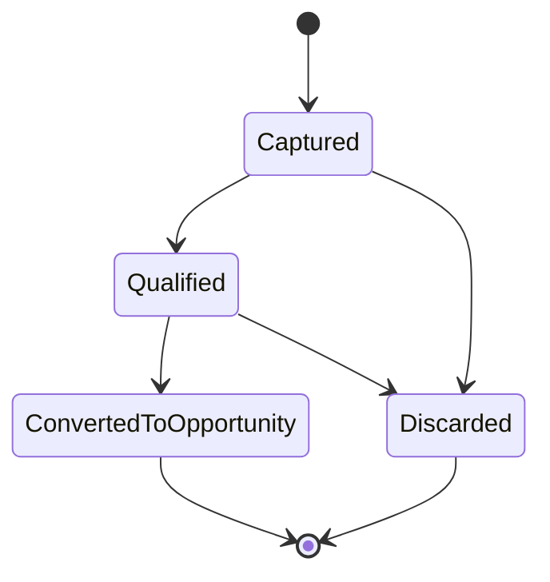

### Opportunity

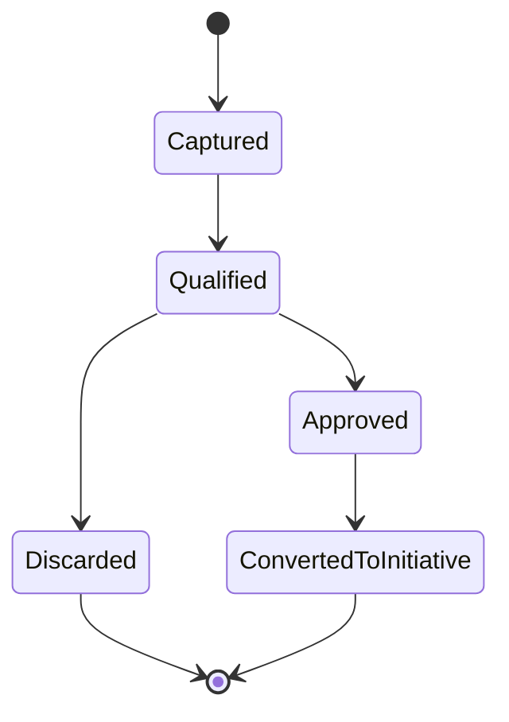

### Investment

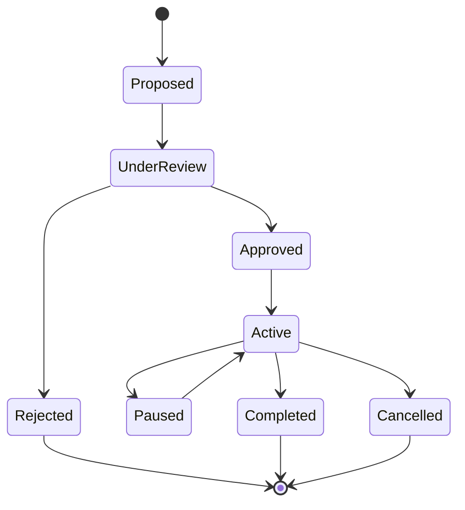

### Initiative

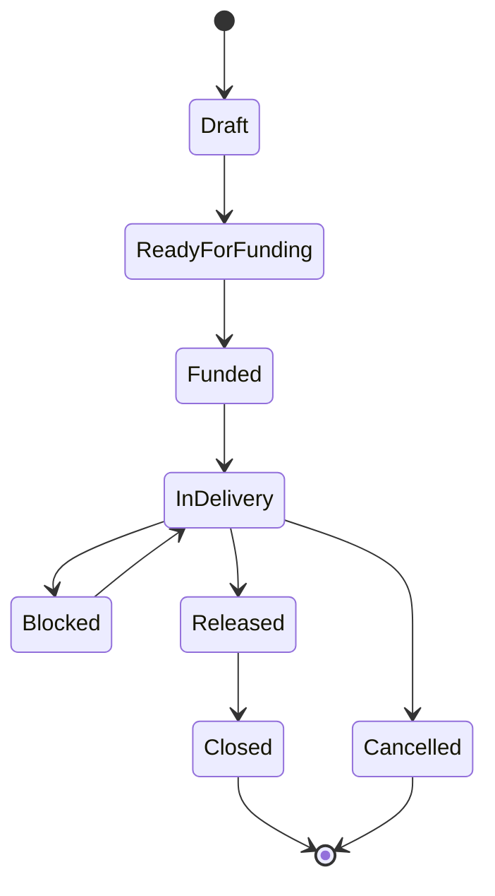

### Feature

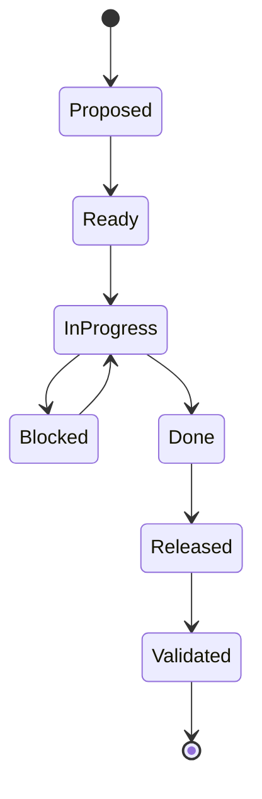

### KPI

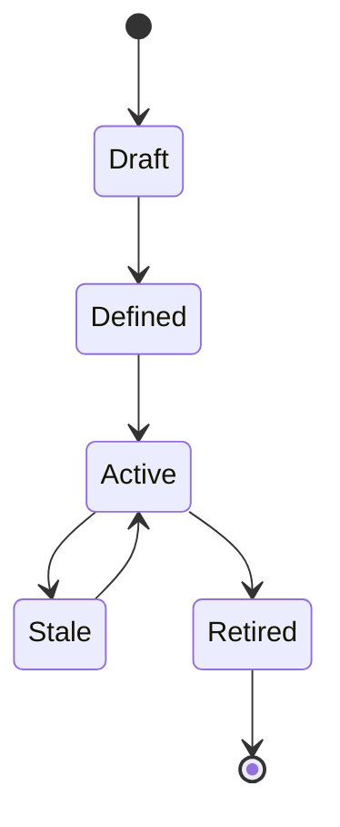

### Value Case

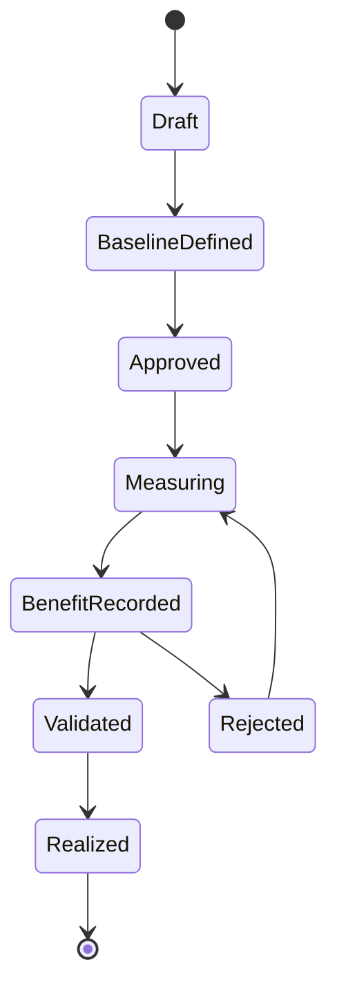

### Alert

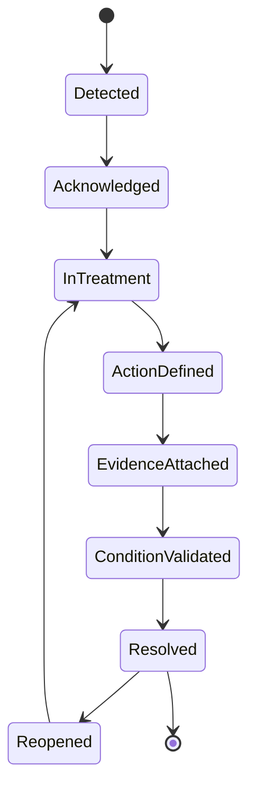

### Need to Value Operating Flow

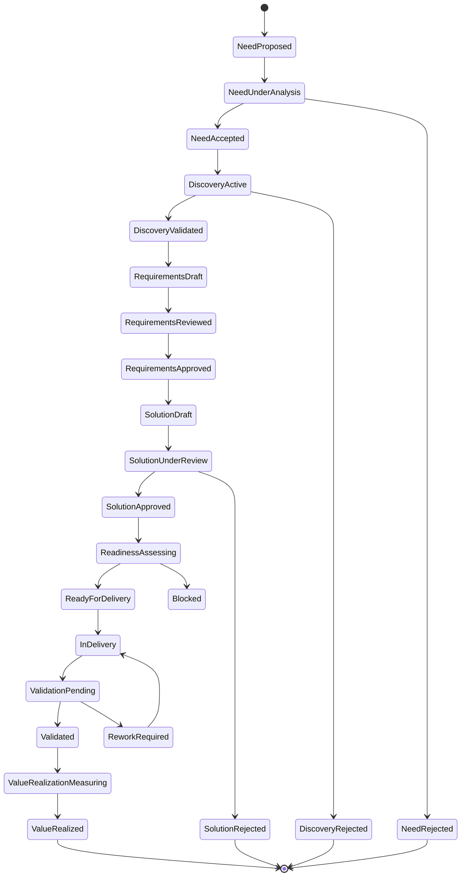

### Decision Gate

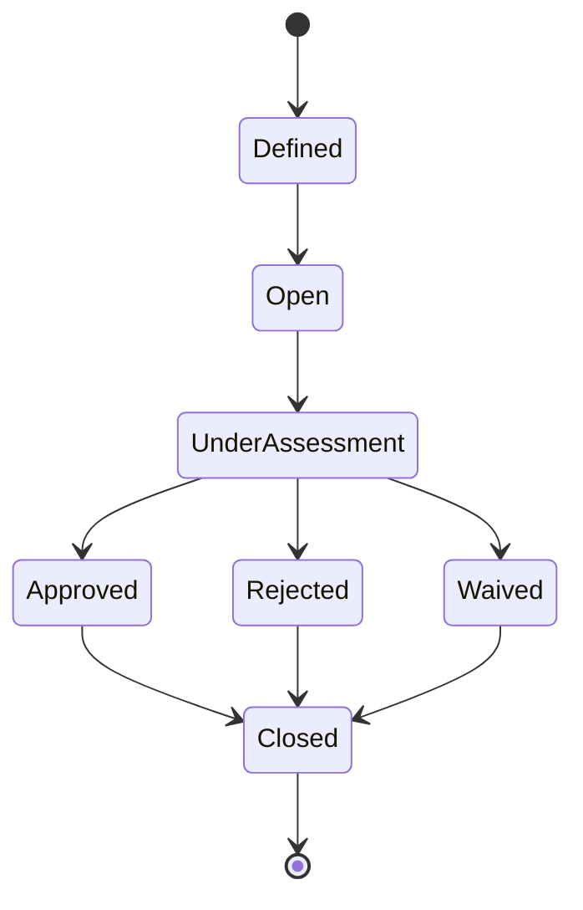

## 10. Eventos de Domínio

### Strategy Events

| Evento | Fato |
| --- | --- |
| CorporateStrategyDefined | Estratégia corporativa foi definida. |
| StrategicThemeCreated | Tema estratégico foi criado. |
| StrategicObjectiveActivated | Objetivo estratégico foi ativado. |
| OKRDefined | OKR foi definido. |
| KeyResultUpdated | Resultado-chave foi atualizado. |
| StrategicOutcomeLinked | Outcome foi vinculado a objetivo. |

### Portfolio Events

| Evento | Fato |
| --- | --- |
| IdeaCaptured | Ideia foi capturada. |
| IdeaQualified | Ideia foi qualificada. |
| IdeaDiscarded | Ideia foi descartada. |
| OpportunityQualified | Oportunidade foi qualificada. |
| InvestmentProposed | Investimento foi proposto. |
| InvestmentApproved | Investimento foi aprovado. |
| FundingAllocated | Funding foi alocado. |
| PortfolioDecisionRecorded | Decisão de portfólio foi registrada. |
| CapacityAllocated | Capacidade foi alocada. |
| InitiativePrioritized | Iniciativa foi priorizada. |

### Product Events

| Evento | Fato |
| --- | --- |
| ProductOutcomeDefined | Outcome de produto foi definido. |
| RoadmapPublished | Roadmap foi publicado. |
| RoadmapItemPrioritized | RoadmapItem foi priorizado. |
| ProductHypothesisValidated | Hipótese de produto foi validada. |

### Delivery Events

| Evento | Fato |
| --- | --- |
| InitiativeCreated | Iniciativa foi criada. |
| InitiativeFunded | Iniciativa recebeu funding. |
| EpicCreated | Épico foi criado. |
| FeatureLinkedToEpic | Feature foi vinculada ao épico. |
| RoadmapItemMappedToFeature | RoadmapItem foi mapeado para Feature. |
| WorkItemBlocked | Item de trabalho foi bloqueado. |
| DependencyRaised | Dependência foi registrada. |
| ReleaseCompleted | Release foi concluída. |
| FlowStageChanged | Item mudou de flow stage. |
| QueueThresholdBreached | Queue ultrapassou limite definido. |
| BottleneckDetected | Gargalo foi detectado. |
| BottleneckResolved | Gargalo foi resolvido. |

### Operating Model Events

| Evento | Fato |
| --- | --- |
| BusinessNeedCaptured | Necessidade de negócio foi capturada. |
| PainPointRegistered | Dor foi registrada com owner e evidência ou hipótese de evidência. |
| BusinessEvidenceAttached | Evidência de negócio foi anexada. |
| BusinessProblemDefined | Problema de negócio foi definido. |
| ProblemStatementCreated | Problem statement foi criado. |
| DiscoveryStarted | Discovery foi iniciado. |
| DiscoveryHypothesisDefined | Hipótese de discovery foi definida. |
| DiscoveryExperimentCompleted | Experimento de discovery foi concluído. |
| DiscoveryFindingRegistered | Finding de discovery foi registrado. |
| DiscoveryOutcomeDecided | Resultado de discovery foi decidido. |
| OpportunityAssessmentCompleted | Assessment de oportunidade foi concluído. |
| PrioritizationDecisionRecorded | Decisão de priorização foi registrada. |
| FunctionalRequirementCreated | Requisito funcional foi criado. |
| NonFunctionalRequirementCreated | Requisito não funcional foi criado. |
| RequirementReviewed | Requisito foi revisado. |
| RequirementApproved | Requisito foi aprovado. |
| RequirementRejected | Requisito foi rejeitado. |
| AcceptanceCriterionDefined | Critério de aceite foi definido. |
| DefinitionOfReadyDefined | Definition of Ready foi definida ou atualizada. |
| DefinitionOfDoneDefined | Definition of Done foi definida ou atualizada. |
| SolutionDesignCreated | Desenho de solução foi criado. |
| SolutionReviewRequested | Revisão de solução foi solicitada. |
| ArchitectureReviewCompleted | Revisão de arquitetura foi concluída. |
| EngineeringReviewCompleted | Revisão de engenharia foi concluída. |
| SecurityReviewCompleted | Revisão de segurança foi concluída. |
| DataReviewCompleted | Revisão de dados foi concluída. |
| ComplianceReviewCompleted | Revisão de compliance foi concluída. |
| SolutionApproved | Solução foi aprovada. |
| SolutionRejected | Solução foi rejeitada. |
| ReadinessAssessmentStarted | Assessment de readiness foi iniciado. |
| ReadinessApproved | Readiness foi aprovado. |
| ReadinessRejected | Readiness foi rejeitado. |
| BlockerCreated | Bloqueador foi criado. |
| BlockerResolved | Bloqueador foi resolvido com evidência. |
| ValidationStarted | Validação foi iniciada. |
| AcceptanceValidationCompleted | Validação de aceite foi concluída. |
| BusinessValidationCompleted | Validação de negócio foi concluída. |
| TechnicalValidationCompleted | Validação técnica foi concluída. |
| OutcomeValidationCompleted | Validação de outcome foi concluída. |
| ValueValidationCompleted | Validação de valor foi concluída. |

### Engineering Events

| Evento | Fato |
| --- | --- |
| TechnicalDebtRegistered | Débito técnico foi registrado. |
| TechnicalRiskRaised | Risco técnico foi levantado. |
| ReleaseReadinessAssessed | Prontidão de release foi avaliada. |
| IntegrationRiskDetected | Risco de integração foi detectado. |

### Architecture Capability Events

| Evento | Fato |
| --- | --- |
| DomainCreated | ArchitectureDomain foi criado. |
| SubDomainCreated | ArchitectureSubDomain foi criado. |
| CapabilityCreated | Capability foi criada. |
| CapabilityUpdated | Capability foi atualizada. |
| CapabilityRetired | Capability foi aposentada. |
| BusinessServiceCreated | BusinessService foi criado. |
| TechnologyServiceCreated | TechnologyService foi criado. |
| OfferCreated | Offer foi criada. |
| OfferRetired | Offer foi aposentada. |
| ProductOfferAssociated | Product foi associado a Offer. |
| ProductOfferRemoved | Associação Product-Offer foi removida. |
| ArchitectureAssessmentRequested | Assessment arquitetural foi solicitado. |
| ArchitectureAssessmentCompleted | Assessment arquitetural foi concluído. |
| ArchitectureDebtRegistered | Dívida arquitetural foi registrada. |
| ArchitectureDebtResolved | Dívida arquitetural foi resolvida. |
| ArchitectureExceptionGranted | Exceção arquitetural foi concedida. |
| ArchitectureExceptionExpired | Exceção arquitetural expirou. |
| CapabilityModernizationStarted | Modernização de capability foi iniciada. |
| CapabilityModernizationCompleted | Modernização de capability foi concluída. |
| ServiceModernizationStarted | Modernização de service foi iniciada. |
| ServiceModernizationCompleted | Modernização de service foi concluída. |

### Metrics and Intelligence Events

| Evento | Fato |
| --- | --- |
| KPIDefined | KPI foi definido. |
| KPIBecameStale | KPI ficou desatualizado. |
| HealthScoreChanged | Health score mudou de forma relevante. |
| FlowHealthScoreChanged | Flow health score mudou de forma relevante. |
| HeatMapGenerated | Heat map foi gerado. |
| ForecastGenerated | Forecast foi gerado. |
| ForecastConfidenceChanged | Confiança do forecast mudou. |
| AlertDetected | Alerta foi detectado. |
| AlertActionRegistered | Ação de tratamento de alerta foi registrada. |
| AlertEvidenceAttached | Evidência de tratamento de alerta foi anexada. |
| AlertConditionValidated | Condição original do alerta foi validada como removida ou formalmente aceita. |
| AlertResolved | Alerta foi encerrado após ação, evidência e validação. |
| AlertReopened | Alerta foi reaberto por retorno da condição ou evidência insuficiente. |

### Value Realization Events

| Evento | Fato |
| --- | --- |
| ValueCaseCreated | Caso de valor foi criado. |
| BenefitHypothesisDefined | Hipótese de benefício foi definida. |
| BenefitRecorded | Benefício foi registrado. |
| BenefitValidated | Benefício foi validado. |
| BenefitRejected | Benefício foi rejeitado. |

### Governance and Audit Events

| Evento | Fato |
| --- | --- |
| DecisionRecorded | Decisão foi registrada. |
| DecisionGateOpened | DecisionGate foi aberto. |
| DecisionGatePassed | DecisionGate foi aprovado. |
| DecisionGateRejected | DecisionGate foi rejeitado. |
| ApprovalGranted | Aprovação foi concedida. |
| ApprovalRejected | Aprovação foi rejeitada. |
| EvidenceAttached | Evidência foi anexada. |
| ControlAssessmentCompleted | Avaliação de controle foi concluída. |
| ExceptionAccepted | Exceção foi aceita. |
| AuditTrailRecorded | Registro auditável foi produzido. |

### Case Management Events

| Evento | Fato |
| --- | --- |
| CaseCreated | Case foi criado para agrupar problema corporativo relevante. |
| CaseTriaged | Case foi classificado por tipo, severidade, prioridade e escopo. |
| CaseAssigned | Case recebeu owner, accountable e responsáveis. |
| CaseEscalated | Case foi escalado por severidade, SLA, valor em risco ou decisão pendente. |
| CaseLinkedToAlert | Alerta foi associado ao case. |
| CaseLinkedToInvestigation | Investigation foi associada ao case. |
| CaseLinkedToDecision | Decision foi associada ao case. |
| CaseLinkedToActionPlan | ActionPlan foi associado ao case. |
| CaseEvidenceAttached | Evidência foi associada ao case. |
| CaseActionRegistered | Ação de tratamento do case foi registrada. |
| CaseValidationStarted | Validação de resolução do case foi iniciada. |
| CaseResolved | Case foi resolvido conforme critérios definidos. |
| CaseClosed | Case foi encerrado com evidência e decisão quando aplicável. |
| CaseReopened | Case foi reaberto por retorno de condição, evidência invalidada ou validação falha. |
| CaseSLAExceeded | SLA do case foi excedido. |
| CaseSeverityChanged | Severidade do case foi alterada. |
| CaseOwnerChanged | Owner do case foi alterado. |

### Observability and Data Quality Events

| Evento | Fato |
| --- | --- |
| DataFreshnessBreached | Frescor esperado do dado foi violado. |
| SourceDivergenceDetected | Divergência de fonte foi detectada. |
| CalculationErrorDetected | Erro de cálculo foi detectado. |
| DataConfidenceChanged | Confiança do dado mudou. |

## 11. Ownership

| Objeto de Domínio | Owner Obrigatório | Observação |
| --- | --- | --- |
| CorporateStrategy | Diretor ou comitê executivo | Responsável por direção. |
| StrategicObjective | Diretor ou superintendente | Responsável por resultado. |
| OKR | Owner executivo ou tático | Responsável por ciclo. |
| KPI | Owner de métrica | Responsável por definição e confiança. |
| Portfolio | Superintendente ou PMO responsável | Responsável por carteira. |
| Investment | Sponsor ou owner de portfólio | Responsável por funding e retorno. |
| Idea | Originador ou owner de triagem | Responsável por qualificação inicial. |
| Opportunity | Product Owner, PMO ou owner de portfólio | Responsável por hipótese e decisão de conversão. |
| BusinessNeed | Business Owner | Responsável por origem, evidência inicial, triagem e decisão de avanço. |
| PainPoint | Business Owner ou Journey Owner | Responsável por evidência, impacto e contexto da dor. |
| BusinessProblem | Business Owner | Responsável por formulação e impacto do problema. |
| BusinessEvidence | Owner da evidência | Responsável por validade, fonte e atualização. |
| Discovery | Product Owner | Responsável por hipóteses, experimentos, findings e outcome de discovery. |
| DiscoveryHypothesis | Product Owner | Responsável por validação, rejeição ou revisão da hipótese. |
| OpportunityAssessment | Product Owner / PMO | Responsável por avaliação de valor, risco e evidência. |
| FunctionalRequirement | Product Owner / Business Analyst | Responsável por origem, clareza, critério e aprovação. |
| NonFunctionalRequirement | Especialista responsável | Responsável por qualidade, controle e restrição técnica, dados, segurança ou compliance. |
| AcceptanceCriterion | Product Owner / Quality Owner | Responsável por verificabilidade e aceite. |
| SolutionDesign | Solution Owner / Arquiteto | Responsável por solução, decisões, revisões e evidências. |
| ArchitectureReview | Arquiteto Corporativo | Responsável por avaliação arquitetural. |
| EngineeringReview | Líder Técnico | Responsável por avaliação de viabilidade técnica. |
| SecurityReview | Security Specialist | Responsável por riscos e controles de segurança. |
| DataReview | Data Specialist | Responsável por dados, lineage, privacidade e qualidade. |
| ComplianceReview | Compliance Specialist | Responsável por aderência regulatória e política. |
| SolutionApproval | Autoridade definida | Responsável por decisão de aprovação ou rejeição. |
| ReadinessAssessment | Delivery Owner / Scrum Master | Responsável por DOR, dependências, riscos e capacidade. |
| CapacityAssessment | Gerente ou Coordenador | Responsável por capacidade disponível e risco de sobrecarga. |
| Initiative | Gerente ou accountable tático | Responsável por execução e status. |
| Epic | Product Owner ou gerente | Responsável por escopo. |
| RoadmapItem | Product Owner | Responsável por valor e aceite de produto. |
| Feature | Product Owner, gerente ou líder técnico | Responsável por entrega e rastreabilidade operacional. |
| Story | Time ou responsável operacional | Responsável por entrega. |
| Queue | Owner do flow stage ou entidade associada | Responsável por ação sobre espera. |
| Bottleneck | Owner da restrição ou área causadora | Responsável por mitigação. |
| FlowHealthScore | Owner do domínio medido | Responsável por interpretação e ação. |
| HeatMap | PMO, Scrum Master ou owner executivo conforme nível | Responsável por leitura e ação. |
| ArchitectureDomain | Arquiteto Corporativo ou Domain Owner | Responsável por escopo, taxonomia e ownership do domínio. |
| ArchitectureSubDomain | Domain Owner ou SubDomain Owner | Responsável por coerência do subdomínio. |
| BusinessLayer | Business Architect ou Capability Architect | Responsável por classificação e organização das capabilities. |
| Capability | Capability Owner ou Arquiteto Corporativo | Responsável por propósito, criticidade, rastreabilidade e evolução. |
| BusinessService | Business Service Owner | Responsável por serviço de negócio e relação com offers. |
| TechnologyService | Technology Service Owner ou Líder Técnico | Responsável por sustentação tecnológica e modernização. |
| Offer | Offer Owner | Responsável por oferta, vigência, adoção e impacto em produtos. |
| ApplicationService | Application Service Owner ou Líder Técnico | Responsável por implementação, operação e riscos da aplicação. |
| ProductOfferAssociation | Product Owner e Offer Owner | Responsáveis por motivo, vigência, impacto e remoção da associação. |
| ArchitectureAssessment | Arquiteto Corporativo | Responsável por avaliação, recomendação, evidências e decisão. |
| ArchitectureDebt | Arquiteto Corporativo ou owner da entidade afetada | Responsável por plano de remediação ou aceite formal. |
| ArchitectureException | Arquiteto Corporativo, risco ou governança | Responsável por prazo, controles e encerramento da exceção. |
| Case | Case Owner definido conforme tipo e severidade | Responsável por coordenação, SLA, timeline, evidências, escalonamento, resolução e encerramento governado. |
| CaseClosure | Case Owner e accountable | Responsáveis por critérios de encerramento, evidência de fechamento e decisão de closure quando aplicável. |
| CaseReopening | Case Owner ou autoridade de governança | Responsável por reabrir quando condição retorna, evidência é invalidada ou validação falha. |
| ModernizationPlan | Capability Owner, Service Owner ou PMO | Responsável por objetivo, escopo, execução, evidência e conclusão. |
| TechnicalDebt | Líder Técnico | Responsável por plano de tratamento. |
| ValueCase | Sponsor de valor | Responsável por hipótese e comprovação. |
| RealizedBenefit | Owner de valor e validador | Responsável por evidência e validação. |
| Control | Especialista, risco ou compliance | Responsável por aderência. |
| Evidence | Owner da entidade evidenciada | Responsável por validade. |
| DecisionGate | Autoridade definida pelo gate | Responsável por avaliação e decisão. |
| Alert | Owner da entidade afetada | Responsável por ação. |
| AlertCondition | Owner do alerta ou owner da métrica/evento causador | Responsável por definir condição original, threshold, evidência esperada e critério de remoção. |
| AlertAction | Owner do alerta ou owner delegado | Responsável por executar tratamento. |
| AlertEvidence | Owner da ação | Responsável por comprovar execução ou decisão. |
| AlertValidation | Reviewer ou autoridade definida | Responsável por confirmar remoção da condição original. |
| AlertResolution | Owner do alerta e accountable | Responsáveis por encerramento auditável. |

### RACI Conceitual Por Domínio

| Escopo | Responsible | Accountable | Consulted | Informed | Observação |
| --- | --- | --- | --- | --- | --- |
| Strategy | Owner do objetivo / OKR | Diretor ou comitê executivo | PMO, Metrics Owner | Portfólio, Produto, Auditoria | Accountable responde por target, prioridade e decisão estratégica. |
| Portfolio | PMO / Portfolio Owner | Superintendente | Financeiro, Product Owner, Arquitetura | Diretores, Gerentes | Funding, capacidade e priorização exigem evidência. |
| Business Discovery | Business Owner | Sponsor de negócio | Product Owner, Journey Owner, Process Owner | PMO, Arquitetura | Necessidade sem owner ou evidência não deve avançar. |
| Product Discovery | Product Owner | Product Manager / Sponsor de produto | Business Owner, Dados, UX, PMO | Portfólio, Delivery | Hipóteses devem ser validáveis e rastreáveis. |
| Requirements | Product Owner / Business Analyst | Product Owner | Especialistas, Arquitetura, Engenharia, Segurança, Dados, Compliance | Delivery, PMO | Requisitos críticos exigem reviewer e approver definidos. |
| Solution Design | Solution Owner | Arquiteto ou autoridade de solução definida | Engenharia, Segurança, Dados, Compliance, Product Owner | PMO, Gerente | Reviews devem declarar reviewer, SLA, resultado e evidência. |
| Delivery Readiness | Scrum Master / Delivery Owner | Gerente ou Coordenador | Product Owner, Líder Técnico, PMO | Portfólio | Entrada em delivery exige DOR ou exceção formal. |
| Delivery Execution | Time / Líder Técnico | Gerente / Coordenador | Product Owner, Arquitetura, PMO | Stakeholders impactados | Execução deve preservar rastreabilidade e blockers. |
| Validation | Validation Owner / Product Owner | Business Owner ou Sponsor de valor | QA, Líder Técnico, Dados, Métricas | PMO, Auditoria | Validação deve declarar critério, evidência e resultado. |
| Value Realization | Sponsor de valor | Diretor / Superintendente | Financeiro, Product Owner, Metrics Owner | Auditoria, Portfólio | Benefício validado exige método e evidência. |
| Architecture Capability | Capability Owner / Arquiteto | Arquiteto Corporativo | Product Owner, Service Owner, Segurança, Dados | PMO, Diretores | Capability, service e offer exigem ownership explícito. |
| Governance and Audit | PMO / Governance Owner | Autoridade de governança | Auditoria, Risco, Compliance, Jurídico quando aplicável | Owners afetados | Decisão crítica exige evidência e segregação. |
| Alert Resolution | Alert Owner / Action Owner | Owner da entidade afetada ou autoridade definida | PMO, Reviewer, especialistas necessários | Stakeholders impactados | Encerramento exige AlertCondition, ação, evidência e validação. |

## 12. Auditabilidade

### Requisitos de Auditoria de Domínio

- Decisões críticas devem preservar decisão, justificativa, owner, data, evidência e escopo.
- Alterações em KPI devem preservar versão da fórmula, fonte, owner e motivo.
- Alterações em forecast devem preservar premissas, data, drivers e nível de confiança.
- Alterações em health score devem preservar componentes e dados de entrada.
- Benefícios realizados devem preservar período, método de cálculo, evidência e validação.
- Exceções devem preservar prazo, owner, razão e plano de encerramento.
- Mudanças de rastreabilidade devem preservar relação anterior e nova relação.
- DecisionGates devem preservar critérios, avaliadores, resultado, evidência e decisão associada.
- BusinessNeed, PainPoint e BusinessProblem devem preservar origem, owner, evidências e decisão de avanço ou descarte.
- Discovery deve preservar hipóteses, experimentos, findings, outcomes e decisões de priorização.
- Requirements devem preservar origem, owner, revisão, aprovação e critérios de aceite.
- SolutionDesign deve preservar decisões, revisões, evidências, aprovações, rejeições e exceções.
- ReadinessAssessment deve preservar DOR, capacidade, dependências, riscos, owner e decisão.
- Validation deve preservar critérios, evidências, validador, resultado e impacto em outcome ou value case.
- AlertResolution deve preservar ação, evidência, validação da condição original, owner, data e decisão de aceite quando aplicável.
- AlertCondition deve preservar condição original, regra de disparo, threshold, fonte, entidade afetada e critério de remoção.
- ProductOfferAssociation deve preservar owner, motivo, vigência, status, evidência e histórico de remoção.
- CapabilityRetired e OfferRetired devem preservar decisão, impacto, substituto, produtos afetados e plano de transição.
- ArchitectureAssessment deve preservar escopo, entidade avaliada, resultado, evidências, recomendações e decisão associada.
- ArchitectureDebt deve preservar severidade, causa, impacto, owner, plano de remediação e aceite de risco quando aplicável.
- ArchitectureException deve preservar aprovador, prazo, justificativa, controles compensatórios, risco aceito e encerramento.
- ModernizationPlan deve preservar objetivo, escopo, owner, decisão, evidências, progresso e critério de conclusão.

### Entidades Auditáveis

| Entidade | Auditoria Obrigatória |
| --- | --- |
| StrategicObjective | Sim |
| OKR | Sim |
| KPI | Sim |
| Portfolio | Sim |
| Investment | Sim |
| BusinessNeed | Sim |
| PainPoint | Sim quando crítico ou usado em decisão |
| BusinessProblem | Sim |
| BusinessEvidence | Sim |
| Discovery | Sim quando gera oportunidade, requisito ou descarte relevante |
| DiscoveryHypothesis | Sim quando usada em decisão |
| OpportunityAssessment | Sim |
| PrioritizationDecision | Sim |
| FunctionalRequirement | Sim |
| NonFunctionalRequirement | Sim quando crítico |
| SolutionDesign | Sim |
| ArchitectureReview | Sim |
| EngineeringReview | Sim |
| SecurityReview | Sim |
| DataReview | Sim |
| ComplianceReview | Sim |
| SolutionApproval | Sim |
| ReadinessAssessment | Sim |
| Validation | Sim |
| AlertAction | Sim |
| AlertCondition | Sim |
| AlertEvidence | Sim |
| AlertValidation | Sim |
| AlertResolution | Sim |
| Case | Sim |
| CaseAssignment | Sim |
| CaseTimeline | Sim |
| CaseClosure | Sim |
| CaseReopening | Sim |
| Initiative | Sim |
| RoadmapItem | Sim quando crítica ou vinculada a KPI |
| Feature | Sim quando crítica ou vinculada a KPI |
| Queue | Sim quando crítica ou vencida |
| Bottleneck | Sim |
| FlowHealthScore | Sim quando crítico |
| HeatMap | Sim quando usado em comitê |
| ProductOfferAssociation | Sim |
| ArchitectureDomain | Sim quando crítico ou usado em decisão executiva |
| ArchitectureSubDomain | Sim quando crítico ou usado em decisão executiva |
| BusinessLayer | Sim quando crítico ou usado em decisão executiva |
| Capability | Sim |
| BusinessService | Sim quando crítico |
| TechnologyService | Sim quando crítico |
| Offer | Sim |
| ApplicationService | Sim quando crítico |
| CapabilityRetired | Sim |
| OfferRetired | Sim |
| ArchitectureAssessment | Sim |
| ArchitectureDebt | Sim |
| ArchitectureException | Sim |
| ModernizationPlan | Sim |
| ValueCase | Sim |
| RealizedBenefit | Sim |
| Decision | Sim |
| Approval | Sim |
| Evidence | Sim |
| Control | Sim |
| Exception | Sim |
| DecisionGate | Sim |
| Forecast | Sim quando usado em decisão |
| HealthScore | Sim quando crítico |

## 13. Diagramas Mermaid

### Cadeia de Rastreabilidade

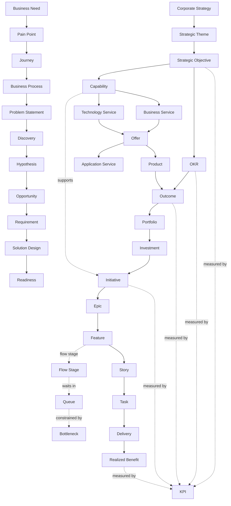

### Need to Value Operating Traceability

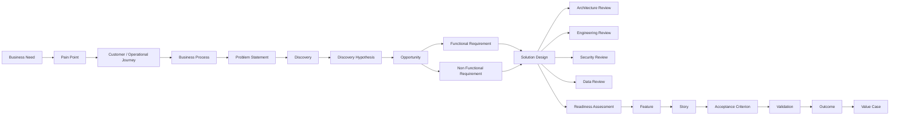

### Alert Closure Governance

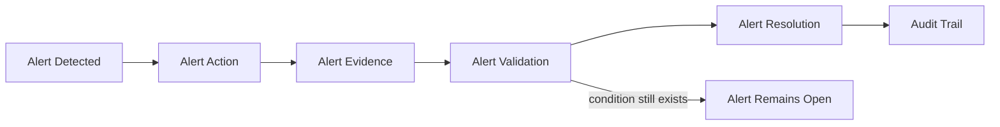

### Case Management Governance

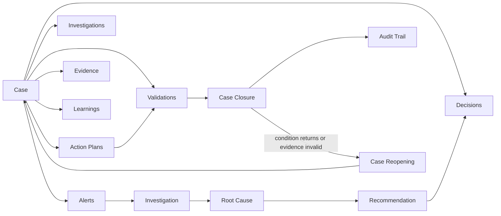

### Agregados Principais

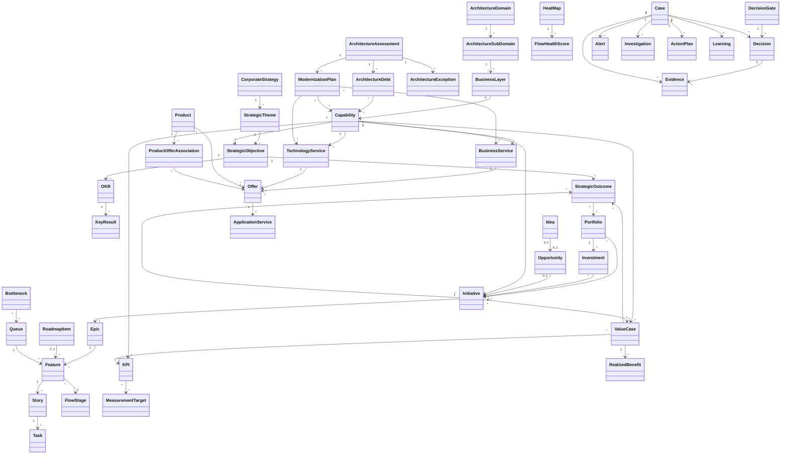

### Architecture Elevator

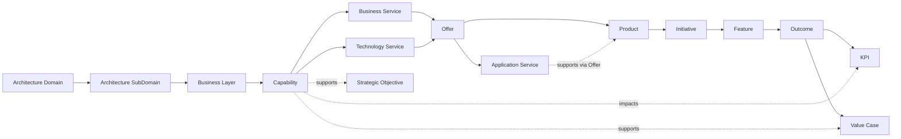

### Value Realization

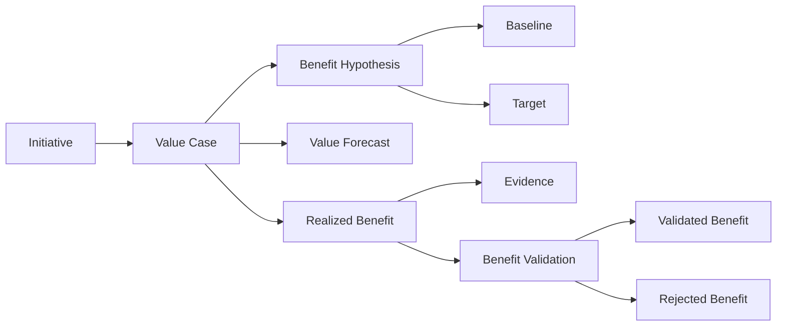

### Governança e Auditoria

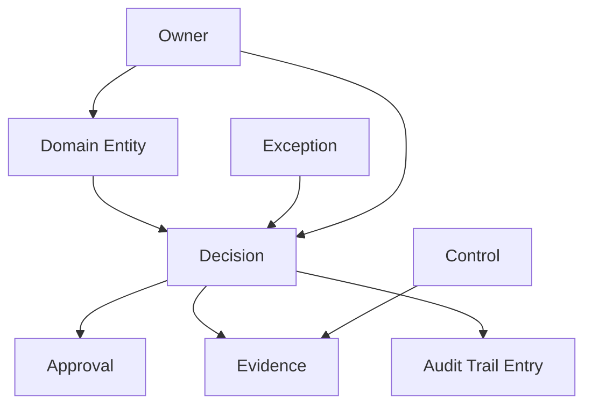

### Flow Intelligence

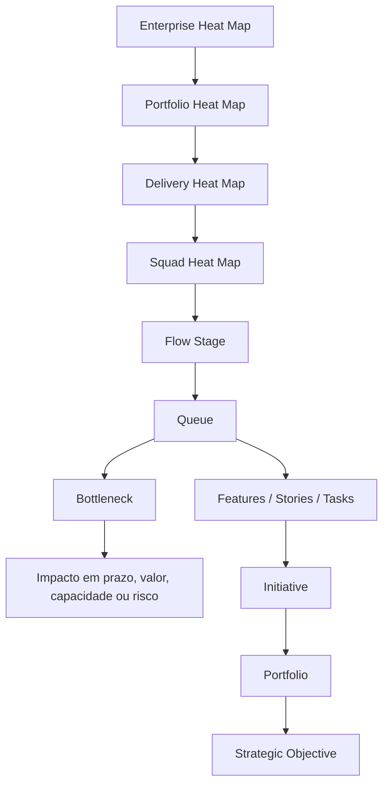

## 14. Glossário Formal

| Termo | Definição |
| --- | --- |
| Estratégia Corporativa | Direção de longo prazo da organização. |
| Tema Estratégico | Agrupamento de prioridades estratégicas. |
| Objetivo Estratégico | Resultado desejado e mensurável. |
| OKR | Estrutura de objetivo e resultados-chave. |
| Key Result | Resultado mensurável de um OKR. |
| Outcome | Mudança observável em negócio, cliente, risco, eficiência, operação ou experiência. |
| KPI | Indicador governado usado para medir progresso, resultado ou saúde. |
| Portfólio | Carteira que organiza temas, investimentos, iniciativas, capacidade, riscos e decisões. |
| Investimento | Alocação de funding, capacidade ou esforço relevante. |
| Funding | Envelope, ciclo ou decisão de financiamento. |
| Ideia | Possibilidade inicial ainda não qualificada. |
| Oportunidade | Hipótese qualificada de valor, risco, eficiência ou crescimento. |
| Business Need | Necessidade de negócio capturada antes de solução, oportunidade ou requisito. |
| Pain Point | Dor observada com impacto potencial em cliente, operação, risco, custo ou experiência. |
| Business Problem | Formulação rastreável de problema baseada em necessidade, dor, processo, jornada e evidência. |
| Business Evidence | Evidência que sustenta necessidade, dor, problema, jornada ou processo. |
| Discovery | Trabalho estruturado para validar problema, hipótese, oportunidade, solução ou valor. |
| Discovery Hypothesis | Hipótese testável e verificável antes de compromisso relevante de capacidade. |
| Discovery Finding | Achado produzido por experimento, pesquisa ou análise. |
| Problem Statement | Declaração clara de problema, público, impacto, evidência e restrição conhecida. |
| Functional Requirement | Condição funcional que a solução deve satisfazer, com origem rastreável. |
| Non Functional Requirement | Condição de qualidade, segurança, dados, resiliência, performance, compliance ou arquitetura. |
| Acceptance Criterion | Critério verificável usado para aceitar requisito, story, feature ou entrega. |
| Definition of Ready | Critérios mínimos para entrada em execução. |
| Definition of Done | Critérios mínimos para conclusão de trabalho. |
| Assumption | Premissa explicitada que ainda precisa ser validada ou monitorada. |
| Constraint | Limite imposto por negócio, tecnologia, regulação, tempo, capacidade ou política. |
| Risk | Incerteza com impacto potencial e owner de tratamento. |
| Solution Design | Desenho de solução que atende requisitos, constraints, decisões e revisões aplicáveis. |
| Solution Review | Revisão formal de solução por arquitetura, engenharia, segurança, dados ou compliance. |
| Readiness Assessment | Avaliação de prontidão para entrada em execução. |
| Validation | Verificação formal de entrega, requisito, outcome ou valor contra critérios definidos. |
| Alert Action | Ação registrada para tratar alerta e sua condição original. |
| Alert Evidence | Evidência que comprova ação, mitigação, decisão ou remoção da condição original de alerta. |
| Alert Validation | Confirmação de que a condição original do alerta deixou de existir ou foi formalmente aceita. |
| Alert Resolution | Encerramento auditável de alerta condicionado a ação, evidência e validação. |
| Architecture Domain | Domínio arquitetural corporativo que agrupa subdomínios, business layers e capabilities relacionadas. |
| Architecture SubDomain | Subdivisão de um Architecture Domain com escopo de negócio ou arquitetura mais específico. |
| Business Layer | Camada de negócio que organiza capabilities dentro de um subdomínio. |
| Capability | Capacidade corporativa com owner, propósito, criticidade e rastreabilidade para estratégia, produto, delivery, métricas ou valor. |
| Business Service | Serviço de negócio exposto por uma capability e consumível por offers. |
| Technology Service | Serviço tecnológico exposto por uma capability e consumível por offers. |
| Offer | Oferta consumível por products, derivada de BusinessService ou TechnologyService. |
| Application Service | Serviço de aplicação que implementa ou suporta uma offer. |
| Product Offer Association | Associação governada entre Product e Offer, com owner, motivo, vigência e histórico. |
| Architecture Assessment | Avaliação arquitetural de capability, service, offer, application service ou product. |
| Architecture Debt | Dívida arquitetural que afeta capability, service, offer ou application service. |
| Architecture Exception | Exceção arquitetural temporária, auditável e controlada. |
| Modernization Plan | Plano de modernização de capability ou service com owner, escopo, decisão, evidência e critério de conclusão. |
| Iniciativa | Unidade tática de execução conectada a portfólio, investimento, outcome ou KPI. |
| Épico | Bloco relevante de escopo dentro de uma iniciativa. |
| RoadmapItem | Item de roadmap priorizado por valor, outcome, hipótese ou intenção de evolução de produto. |
| Feature | Item executável de entrega que implementa um RoadmapItem ou escopo técnico/operacional aprovado. |
| Story | Fatia entregável de valor ou comportamento. |
| Task | Trabalho operacional necessário para concluir uma story ou feature. |
| Release | Conjunto de entregas disponibilizadas. |
| Flow Intelligence | Capacidade de observar fluxo, filas, esperas, gargalos e desperdícios em múltiplos níveis corporativos. |
| Flow Stage | Estágio conceitual do fluxo em que trabalho se encontra. |
| Queue | Conjunto de itens aguardando capacidade, decisão, dependência, aprovação, validação ou próximo estágio. |
| Bottleneck | Restrição persistente ou recorrente que reduz throughput, aumenta espera ou degrada previsibilidade. |
| Flow Health Score | Score que mede saúde do fluxo por queue time, bottleneck severity, WIP, aging, throughput e flow efficiency. |
| Enterprise Heat Map | Projeção corporativa de gargalos, filas, esperas e desperdícios. |
| Portfolio Heat Map | Projeção de fluxo por portfólio, investimento, capacidade e dependências. |
| Delivery Heat Map | Projeção de fluxo por iniciativa, épico, feature e release. |
| Squad Heat Map | Projeção de fluxo por squad, story, task, owner e flow stage. |
| Owner | Responsável por entidade, métrica, decisão ou ação. |
| Evidência | Artefato verificável que sustenta status, decisão, métrica, controle ou valor. |
| Value Case | Caso de valor com hipótese, baseline, target e evidência esperada. |
| Benefício Realizado | Valor medido em período e associado a evidência. |
| Benefício Validado | Benefício aceito após validação formal. |
| Controle | Obrigação verificável derivada de política, risco, arquitetura, segurança, compliance ou auditoria. |
| DecisionGate | Ponto formal de avaliação que condiciona avanço de entidade ou processo. |
| Exceção | Desvio aceito temporariamente com owner, prazo e justificativa. |
| Health Score | Sinal composto e explicável de saúde de entidade. |
| Forecast | Projeção explicável de prazo, valor, KPI, KR ou capacidade. |
| Case | Agrupador governado de problemas, alertas, investigações, decisões, ações, evidências, validações e aprendizados relacionados a um mesmo assunto corporativo relevante. |
| Alert | Sinal acionável de exceção, risco ou desvio. |
| Alert Condition | Condição objetiva que disparou alerta e que deve ser removida, mitigada ou formalmente aceita para encerramento. |
| Traceability Path | Sequência explícita e auditável de vínculos entre entidades. |
| Measurement Target | Entidade de domínio medida por KPI, score ou forecast. |
| Data Confidence | Grau de confiança de dado, métrica ou cálculo. |
| Observability Signal | Sinal que explica saúde, comportamento, falha, atraso, risco ou tendência. |

## 15. Change Log

### Evolução do Architecture Capability Context

- Adicionado formalmente o Architecture Capability Context como bounded context da EDIP.
- Incorporado o Architecture Elevator: ArchitectureDomain -> ArchitectureSubDomain -> BusinessLayer -> Capability -> BusinessService / TechnologyService -> Offer -> ApplicationService.
- Adicionadas entidades de domínio para ArchitectureDomain, ArchitectureSubDomain, BusinessLayer, Capability, BusinessService, TechnologyService, Offer, ApplicationService, ProductOfferAssociation, ArchitectureAssessment, ArchitectureDebt, ArchitectureException e ModernizationPlan.
- Adicionados agregados ArchitectureDomain Aggregate, Service Aggregate, Product Composition Aggregate e Architecture Governance Aggregate.

### Correção Semântica de Product

- Corrigida a definição de Product para remover qualquer sugestão de equivalência com Capability.
- Explicitado que Product não é Capability, Product não é Service e Product não é Offer.
- Definido Product como composição flexível de N Offers.
- Mantido ProductCapability apenas como conceito interno do Product Context, sem equivalência com Capability do Architecture Capability Context.

### Rastreabilidade e Relacionamentos

- Adicionadas relações entre Strategy e Architecture Capability para objetivos suportados por capabilities.
- Adicionadas relações entre Product e Offer por ProductOfferAssociation.
- Adicionadas relações entre Capability, StrategicObjective, Initiative, KPI e ValueCase.
- Adicionadas relações de ArchitectureDebt e ModernizationPlan com Capability, Service, Offer e ApplicationService.
- Atualizadas cardinalidades do Architecture Elevator e de Product -> Offer como N:M.

### Governança, Eventos e Auditoria

- Adicionadas Architecture Capability Rules para composição Product-Offer, rastreabilidade, modernização, dívida, assessment, aposentadoria e impacto.
- Adicionada referência aos eventos de Architecture Capability já previstos no EVENT_CATALOG.
- Atualizados owners obrigatórios para entidades arquiteturais.
- Atualizada auditabilidade obrigatória para ProductOfferAssociation, CapabilityRetired, OfferRetired, ArchitectureAssessment, ArchitectureDebt, ArchitectureException e ModernizationPlan.

### Diagramas

- Atualizado Context Map para incluir Architecture Capability Context.
- Atualizada Cadeia de Rastreabilidade com capability, services, offers, application services e product composition.
- Atualizado diagrama de Agregados Principais com entidades e relações arquiteturais.
- Adicionado diagrama Architecture Elevator.

### Harmonização Cross-Artifact Pós-Assessment

- Adicionados Business Discovery Context, Product Discovery Context, Requirements Context, Solution Design Context, Delivery Readiness Context e Validation Context ao domínio formal.
- Incorporada a cadeia operacional Need -> Discovery -> Solution -> Delivery -> Validation -> Value Realization ao Context Map, relacionamentos, cardinalidades e diagramas.
- Adicionados agregados Business Discovery, Product Discovery, Requirements, Solution Design e Delivery Readiness.
- Fortalecida a governança de alertas com AlertAction, AlertEvidence, AlertValidation e AlertResolution.
- Formalizada AlertCondition como entidade conceitual obrigatória para explicar, validar e auditar a condição original de um alerta.
- Adicionadas regras de encerramento de alerta exigindo ação, evidência e validação da condição original.
- Adicionadas regras de taxonomia conceitual para Need, Opportunity, Requirement, Feature, Hypothesis, Assumption, Constraint, Risk, Issue e Evidence.
- Adicionadas regras de fronteira entre TechnicalDebt e ArchitectureDebt para evitar ambiguidade de ownership, governança e impacto.
- Adicionadas regras de ownership e RACI para owners, accountables, reviewers e approvers.
- Adicionados eventos operacionais de necessidade, discovery, requisito, solução, review, readiness, blocker, validação e resolução de alertas.
- Atualizados ownership, auditabilidade, glossário e diagramas para eliminar entidades operacionais órfãs.

### Case Management

- Adicionado Case Management Context como bounded context próprio em parceria com Governance and Audit.
- Definido Case como agregador governado, sem substituir Alert, Investigation, Decision, ActionPlan, Evidence, Validation ou Learning.
- Adicionados Case, CaseType, CaseStatus, CaseSeverity, CaseAssignment, CaseTimeline, CaseClosure, CaseReopening e CaseRelationship.
- Definidos tipos de Case: Operational, Governance, Architecture, Value Leakage, Capability Degradation, Delivery Blockage, Compliance, Data Quality, Strategic Risk, Incident e Modernization.
- Definido lifecycle Created -> Triaged -> Assigned -> Investigating -> ActionPlanning -> Remediating -> Validating -> Resolved -> Closed -> Reopened.
- Adicionadas regras de encerramento, reabertura, cardinalidades, ownership, auditabilidade, glossário, eventos conceituais e diagrama de governança de Case Management.
