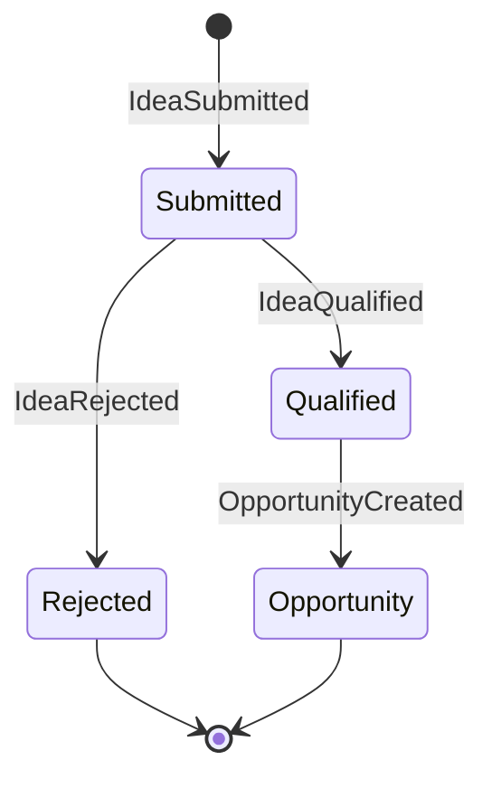
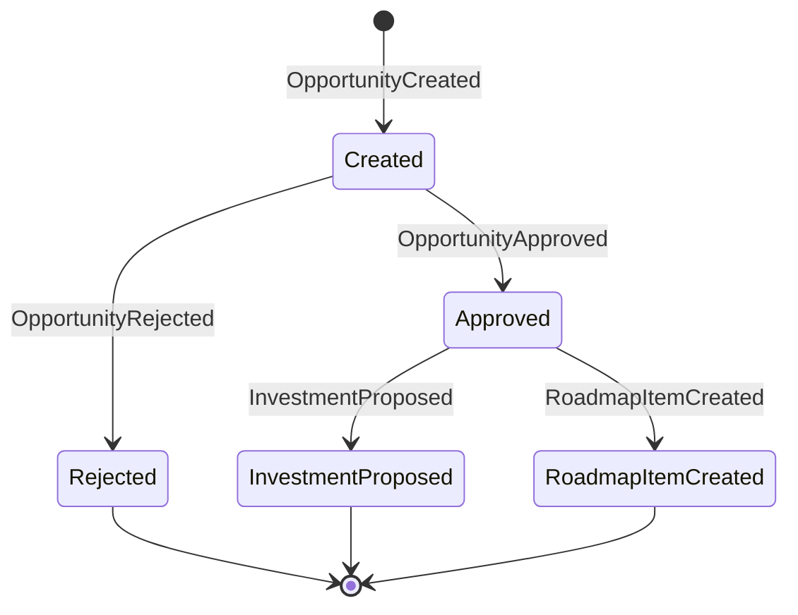
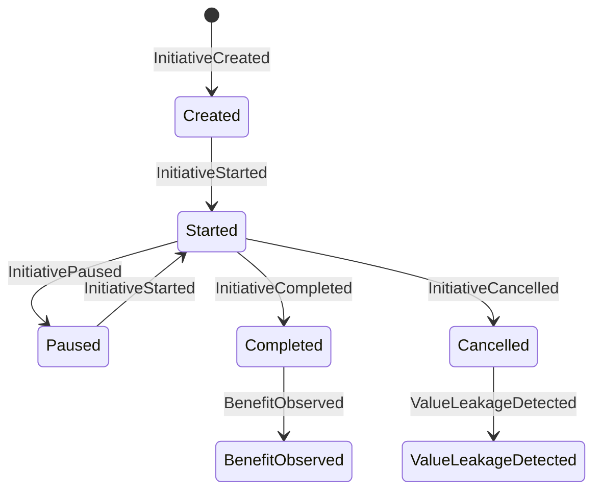
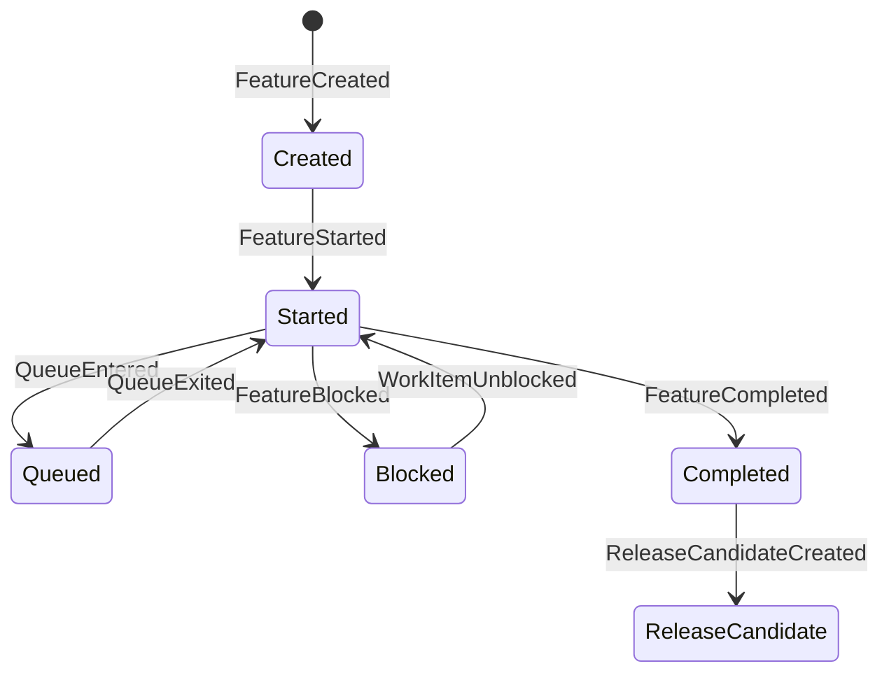
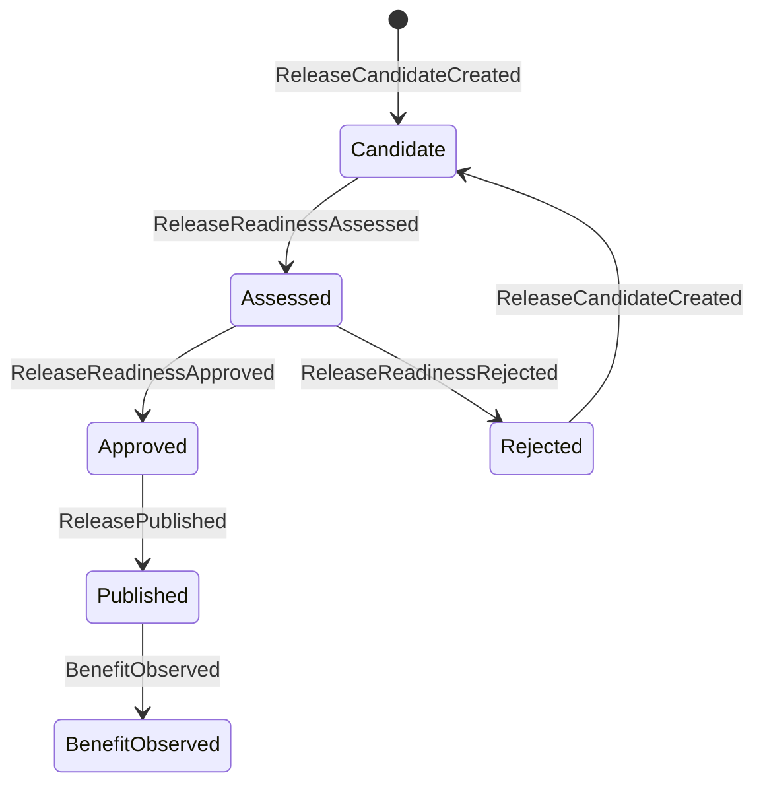
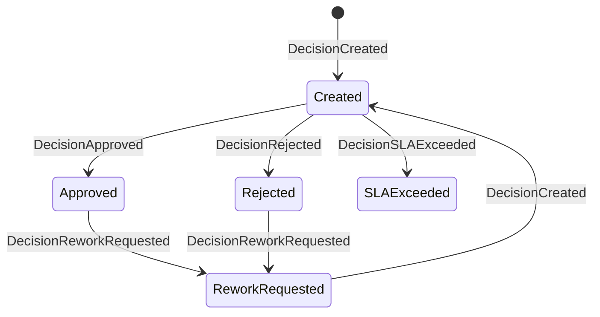
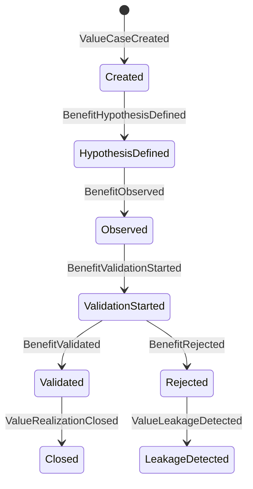

# Event Catalog - Enterprise Delivery Intelligence Platform (EDIP)

## 1. Objetivo

Este documento define o catálogo conceitual de eventos de domínio da Enterprise Delivery Intelligence Platform.

Um Domain Event na EDIP é um fato de negócio relevante que já aconteceu dentro de um contexto de domínio e que pode ser usado para rastreabilidade, auditoria, analytics, alertas, health scores, forecasting, value realization e explainability.

Eventos não são comandos, estados ou métricas:

| Conceito | Definição | Exemplo |
| --- | --- | --- |
| Evento | Fato consumado, histórico e imutável. | `FeatureCompleted`, `BenefitValidated`, `BottleneckDetected`. |
| Comando | Intenção de executar uma ação, ainda sujeita a regra, validação ou autorização. | Aprovar investimento, iniciar iniciativa, publicar release. |
| Estado | Condição atual de uma entidade após um ou mais eventos. | Initiative em andamento, Feature bloqueada, KPI fora do target. |
| Métrica | Medida derivada de eventos, estados ou fontes governadas. | Lead Time, Flow Health Score, Cost of Delay. |

Eventos são fundamentais porque preservam a história causal da EDIP. Eles permitem reconstruir como uma ideia virou oportunidade, como uma oportunidade virou iniciativa, como uma iniciativa gerou entrega, como a entrega impactou KPI, como o benefício foi validado e por que decisões foram tomadas.

Eventos são a base futura para arquitetura orientada a eventos, integração corporativa, analytics, observabilidade, alertas, forecasting, health scores, auditoria e explicabilidade.

## 2. Princípios de Eventos

- Eventos representam fatos consumados, nunca intenções.
- Eventos devem ser nomeados no passado.
- Eventos são imutáveis.
- Eventos possuem timestamp de ocorrência e timestamp de registro quando esses momentos forem diferentes.
- Eventos possuem owner conceitual.
- Eventos devem indicar contexto de domínio e entidade principal.
- Eventos críticos devem possuir correlação com decisão, evidência, owner ou justificativa.
- Eventos podem originar métricas.
- Eventos podem originar alertas.
- Eventos podem influenciar forecasts.
- Eventos podem alterar health scores.
- Eventos podem gerar evidências.
- Eventos devem preservar rastreabilidade top-down e bottom-up.
- Eventos relevantes para funding, decisão, aprovação, benefício, KPI, forecast ou auditoria devem possuir trilha auditável permanente.
- Eventos devem ser compreensíveis por negócio, produto, arquitetura, engenharia, dados, risco e auditoria.
- Eventos não devem representar detalhes acidentais de implementação.

## 3. Convenções Formais

### Severidade Conceitual

| Severidade | Definição |
| --- | --- |
| Informational | Fato relevante para histórico, navegação ou analytics, sem risco imediato. |
| Business | Fato que altera planejamento, prioridade, valor, escopo ou execução. |
| Control | Fato que envolve decisão, aprovação, evidência, gate, controle ou auditoria. |
| Risk | Fato que pode degradar prazo, capacidade, qualidade, valor, compliance ou forecast. |
| Critical | Fato que exige ação executiva, escalonamento ou resposta formal. |

### Envelope Conceitual Comum

Todo evento deve possuir, conceitualmente:

- eventId.
- eventName.
- eventTimestamp.
- recordedTimestamp.
- contextName.
- primaryEntityId.
- primaryEntityType.
- ownerId.
- actorId quando houver ação humana.
- correlationId.
- causationEventId quando aplicável.
- sourceSystem.
- evidenceId quando aplicável.
- reasonCode quando aplicável.
- confidenceLevel quando aplicável.
- dataQualityLevel quando aplicável.

O payload conceitual listado nas seções seguintes representa campos específicos de negócio, além do envelope comum.

## 4. Event Taxonomy

| Categoria | Propósito |
| --- | --- |
| Strategy Events | Registrar mudanças em estratégia, temas, objetivos, OKRs, KRs e outcomes estratégicos. |
| Portfolio Events | Registrar evolução de ideias, oportunidades, investimentos, funding, capacidade e priorização. |
| Product Events | Registrar evolução de produtos, capabilities, roadmap, hipóteses, outcomes e discovery. |
| Delivery Events | Registrar execução de iniciativas, épicos, features, stories, releases, bloqueios e dependências. |
| Flow Intelligence Events | Registrar filas, esperas, gargalos, WIP, flow stages, flow health e heat maps. |
| Engineering Events | Registrar riscos técnicos, débitos, readiness, exceções arquiteturais e integrações críticas. |
| Architecture Events | Registrar fatos do Architecture Capability Context, incluindo domains, subdomains, capabilities, services, offers, product-offer associations, modernização, dívida e exceções arquiteturais. |
| Metrics Events | Registrar criação, alteração, stale, cálculo e mudança relevante de KPIs e health scores. |
| Forecast Events | Registrar geração, atualização, mudança de confiança e medição de accuracy de forecasts. |
| Value Realization Events | Registrar value cases, hipóteses, benefícios observados, validados, rejeitados e vazamento de valor. |
| Economics Events | Registrar fatos econômicos derivados de atraso, fila, gargalo, valor em risco e performance de investimento. |
| Governance Events | Registrar decisões, gates, aprovações, evidências, controles, exceções e auditoria. |
| Organization Events | Registrar mudanças de owner, time, capacidade, papel e estrutura organizacional relevante. |
| Observability Events | Registrar frescor, divergência, confiança, erro de cálculo, lineage e qualidade de dados. |

## 4.1 Event Classification

Esta classificação define a responsabilidade conceitual de cada tipo de evento. Um mesmo evento pode ser usado por vários consumidores, mas deve possuir uma classificação primária para governança, ownership e evolução.

| Classificação | Definição | Responsabilidade | Exemplos |
| --- | --- | --- | --- |
| Source Event | Evento originado em sistema externo e reconhecido pela EDIP como fato relevante. | Preservar identificação da fonte, horário de origem, qualidade de dado e correlação com entidades EDIP. | FeatureCompleted, StoryCompleted, ReleasePublished, TechnicalDebtRegistered. |
| Domain Event | Evento nativo do domínio EDIP, registrado a partir de regra, decisão ou transição conceitual da plataforma. | Preservar semântica de negócio, owner, entidade principal e impacto na cadeia de rastreabilidade. | InitiativeCreated, OpportunityApproved, DecisionApproved, ValueCaseCreated. |
| Governance Event | Evento que envolve decisão, aprovação, gate, evidência, controle, exceção ou auditoria. | Preservar autoridade, justificativa, evidência, segregação de funções e trilha auditável. | GateApproved, EvidenceAttached, ApprovalGranted, ExceptionGranted. |
| Derived Event | Evento derivado por regra, correlação, threshold ou inferência governada a partir de outros eventos. | Declarar eventos causadores, regra conceitual, confiança, owner e explicabilidade. | BottleneckDetected, ValueLeakageDetected, ForecastAccuracyDegraded, DecisionSLAExceeded. |
| Analytical Event | Evento produzido por cálculo analítico, score, forecast, heat map ou agregação temporal. | Declarar drivers, período, versão de cálculo, confiança e limitações de uso. | FlowHealthCalculated, HealthScoreCalculated, HeatMapGenerated, ForecastGenerated. |

Classificação não substitui contexto. Por exemplo, `FeatureCompleted` pertence ao Delivery Context e pode ser Source Event quando vem de Jira ou Azure DevOps; `FlowHealthCalculated` pertence a Flow Intelligence e é Analytical Event; `GateApproved` pertence a Governance and Audit e é Governance Event.

## 4.2 Event Producers and Consumers

### Event Producers

| Categoria | Produtores Conceituais Esperados |
| --- | --- |
| Strategy Events | EDIP, ferramentas de OKR, sistemas de planejamento estratégico, Confluence. |
| Portfolio Events | EDIP, ferramentas de portfólio, SAP, sistemas financeiros, ServiceNow, Confluence. |
| Product Events | EDIP, Jira, Azure DevOps, Confluence, ferramentas de analytics de produto, pesquisas e experimentação. |
| Delivery Events | Jira, Azure DevOps, GitHub, GitLab, Jenkins, EDIP. |
| Flow Intelligence Events | EDIP, Jira, Azure DevOps, GitHub, GitLab, ServiceNow, Flow Intelligence Engine. |
| Engineering Events | GitHub, GitLab, Jenkins, SonarQube, ServiceNow, ferramentas de arquitetura, EDIP. |
| Architecture Events | EDIP, repositórios de arquitetura corporativa, CMDB, ServiceNow, ferramentas de capability mapping, catálogos de aplicação, Confluence. |
| Metrics Events | EDIP, Metrics Engine, catálogos de dados, plataformas analíticas, fontes governadas de KPI. |
| Forecast Events | Forecast Engine, EDIP, plataformas analíticas, fontes de delivery, portfolio e value realization. |
| Value Realization Events | EDIP, SAP, sistemas financeiros, analytics de produto, fontes de KPI, governança de benefícios. |
| Economics Events | Economics Engine, Metrics Engine, Flow Intelligence Engine, EDIP, SAP, Value Realization sources. |
| Governance Events | EDIP, ServiceNow, OneTrust, Confluence, ferramentas de GRC, sistemas de workflow corporativo. |
| Organization Events | EDIP, sistemas de RH, gestão de identidade, gestão de capacidade, ferramentas de times. |
| Observability Events | Observability platform, Data Quality platform, pipelines analíticos, EDIP, source monitors. |

### Event Consumers

| Consumidor | Papel Conceitual |
| --- | --- |
| Metrics Engine | Transforma eventos em métricas governadas, séries históricas e agregações por entidade. |
| Forecast Engine | Usa eventos históricos e recentes para recalcular forecasts de prazo, capacidade, valor, KPI e KR. |
| Flow Intelligence Engine | Correlaciona eventos de flow stage, queue, WIP, blockers e bottlenecks. |
| Health Score Engine | Calcula scores, drivers, tendências e degradações explicáveis. |
| Economics Engine | Calcula cost of delay, cost of queue, cost of bottleneck, delay impact e value at risk. |
| Governance Engine | Avalia decisões, gates, aprovações, evidências, controles, exceções e SLAs. |
| Alert Engine | Detecta condições acionáveis, severidade, owner, recomendação e escalonamento. |
| Executive Dashboards | Apresenta visão executiva de estratégia, valor, risco, gargalos e decisões. |
| Portfolio Dashboards | Apresenta saúde de portfólio, funding, capacidade, dependências, economics e forecast. |
| Heat Maps | Agrega eventos por dimensão de flow, capacity, value, risk, governance, data quality e strategic alignment. |
| Copilot | Responde perguntas em linguagem natural com base em eventos, métricas, correlações, evidências e decisões. |
| Audit and Compliance | Reconstrói decisões, aprovações, evidências, métricas, forecasts e benefícios para auditoria. |

## 5. Domain Events Por Contexto

### 5.1 Strategy Events

| Nome | Descrição | Severidade | Entidade Principal | Evento Pai | Evento Filho | Owner Conceitual | Disparador | Condições de Geração | Impacto Esperado | Payload Conceitual |
| --- | --- | --- | --- | --- | --- | --- | --- | --- | --- | --- |
| StrategyCreated | Estratégia corporativa foi criada. | Control | CorporateStrategy | Nenhum | StrategicThemeCreated | Diretor / Estratégia | Aprovação de nova estratégia. | Estratégia possui owner, horizonte, escopo e evidência de aprovação. | Inicia rastreabilidade estratégica. | strategyId, strategyName, horizon, ownerId, approvalDecisionId, effectiveDate. |
| StrategyUpdated | Estratégia corporativa foi atualizada. | Control | CorporateStrategy | StrategyCreated | StrategicObjectiveCreated | Diretor / Estratégia | Revisão estratégica formal. | Mudança aprovada em escopo, horizonte, prioridade ou tese estratégica. | Pode afetar alinhamento, portfólio e OKRs. | strategyId, changedAttributes, previousVersion, newVersion, decisionId, effectiveDate. |
| StrategicThemeCreated | Tema estratégico foi criado. | Business | StrategicTheme | StrategyCreated | StrategicObjectiveCreated | Diretor | Definição de tema. | Tema possui estratégia, owner, escopo e justificativa. | Permite agrupar objetivos, portfólios e investimentos. | themeId, strategyId, themeName, ownerId, rationale. |
| StrategicThemeRetired | Tema estratégico foi encerrado. | Business | StrategicTheme | StrategicThemeCreated | ObjectiveRetired | Diretor | Revisão de estratégia. | Tema sem validade futura ou substituído. | Pode exigir revisão de objetivos, portfólios e iniciativas. | themeId, retirementReason, effectiveDate, decisionId. |
| ObjectiveCreated | Objetivo estratégico foi criado. | Business | StrategicObjective | StrategicThemeCreated | OKRCreated | Diretor / Owner do objetivo | Criação de objetivo. | Objetivo possui tema, owner, horizonte e resultado esperado. | Abre alvo de rastreabilidade e medição. | objectiveId, themeId, ownerId, horizon, expectedOutcome. |
| ObjectiveUpdated | Objetivo estratégico foi atualizado. | Business | StrategicObjective | ObjectiveCreated | KRTargetChanged | Owner do objetivo | Revisão de objetivo. | Mudança relevante de escopo, owner, target ou horizonte. | Pode alterar OKRs, KPIs e portfólios relacionados. | objectiveId, changedAttributes, previousValue, newValue, reasonCode. |
| ObjectiveRetired | Objetivo estratégico foi retirado. | Control | StrategicObjective | ObjectiveCreated | PortfolioReprioritized | Diretor / Owner do objetivo | Decisão de encerramento. | Objetivo possui justificativa, data efetiva e decisão formal. | Pode encerrar OKRs, funding e iniciativas sem justificativa vigente. | objectiveId, retirementReason, decisionId, effectiveDate. |
| OKRCreated | OKR foi criado. | Business | OKR | ObjectiveCreated | KRTargetChanged | Owner do OKR | Definição de ciclo OKR. | OKR possui objetivo, ciclo, owner e KRs. | Ativa acompanhamento de progresso e forecast de KR. | okrId, objectiveId, cycleId, ownerId, keyResultIds. |
| KRTargetChanged | Target de KR foi alterado. | Control | KeyResult | OKRCreated | ForecastUpdated | Owner do KR | Revisão aprovada de target. | Mudança possui justificativa e versão. | Afeta OKR Achievement Forecast e KPI Forecast Accuracy. | keyResultId, previousTarget, newTarget, reasonCode, decisionId. |
| KeyResultProgressUpdated | Progresso de KR foi atualizado. | Business | KeyResult | OKRCreated, KPIUpdated | ForecastUpdated | Owner do KR | Atualização de progresso. | KR possui valor observado, período e fonte governada ou evidência. | Atualiza forecast de KR e strategic health. | keyResultId, previousProgress, newProgress, period, sourceSystem, evidenceId. |
| OutcomeDefined | Outcome estratégico foi definido. | Business | StrategicOutcome | ObjectiveCreated | KPIAssignedToOutcome | Owner do outcome | Definição de resultado esperado. | Outcome possui objetivo, baseline, target ou evidência esperada. | Conecta estratégia a KPI, produto, iniciativa e value case. | outcomeId, objectiveId, ownerId, baseline, target, evidenceCriteria. |
| KPIAssignedToOutcome | KPI foi associado como medida de outcome. | Control | KPI | OutcomeDefined | KPIUpdated | Owner da métrica | Governança de métrica. | KPI possui owner, fórmula, fonte, periodicidade e target. | Habilita medição e explicação de progresso. | kpiId, outcomeId, metricOwnerId, target, baseline, confidenceLevel. |

### 5.2 Portfolio Events

| Nome | Descrição | Severidade | Entidade Principal | Evento Pai | Evento Filho | Owner Conceitual | Disparador | Condições de Geração | Impacto Esperado | Payload Conceitual |
| --- | --- | --- | --- | --- | --- | --- | --- | --- | --- | --- |
| IdeaSubmitted | Ideia foi submetida. | Informational | Idea | Nenhum | IdeaQualified, IdeaRejected | Product Owner / PMO | Registro de ideia. | Ideia possui proponente, descrição, domínio e owner inicial. | Inicia funil de oportunidade. | ideaId, submitterId, ownerId, domain, summary, submittedDate. |
| IdeaQualified | Ideia foi qualificada. | Business | Idea | IdeaSubmitted | OpportunityCreated | Product Owner / PMO | Qualificação inicial. | Ideia possui problema, hipótese de valor e alinhamento preliminar. | Pode originar oportunidade. | ideaId, qualificationCriteria, valueHypothesis, strategicLinkId, ownerId. |
| IdeaRejected | Ideia foi rejeitada. | Business | Idea | IdeaSubmitted | Nenhum | Product Owner / PMO | Avaliação da ideia. | Rejeição possui motivo e evidência mínima. | Encerra fluxo da ideia com trilha histórica. | ideaId, rejectionReason, decisionId, evidenceId. |
| OpportunityCreated | Oportunidade foi criada. | Business | Opportunity | IdeaQualified | OpportunityApproved, OpportunityRejected | Product Owner | Conversão de ideia qualificada. | Oportunidade possui hipótese, owner, escopo e valor esperado. | Alimenta discovery, roadmap e portfólio. | opportunityId, ideaId, ownerId, valueHypothesis, expectedOutcomeId. |
| OpportunityApproved | Oportunidade foi aprovada para avanço. | Control | Opportunity | OpportunityCreated | InvestmentProposed, RoadmapItemCreated | Product Owner / PMO | Gate de oportunidade. | Evidência, hipótese e alinhamento suficientes. | Pode gerar roadmap item, investimento ou iniciativa. | opportunityId, decisionId, evidenceIds, approvedScope, ownerId. |
| OpportunityRejected | Oportunidade foi rejeitada. | Control | Opportunity | OpportunityCreated | Nenhum | Product Owner / PMO | Gate de oportunidade. | Rejeição possui motivo e evidência. | Evita consumo de capacidade sem valor suficiente. | opportunityId, rejectionReason, decisionId, evidenceId. |
| InvestmentProposed | Investimento foi proposto. | Control | Investment | OpportunityApproved | InvestmentApproved, InvestmentRejected | PMO / Financeiro | Submissão de funding. | Proposta possui value case, owner, valor, capacidade e objetivo. | Inicia governança de funding. | investmentId, opportunityId, valueCaseId, requestedAmount, capacityNeed, objectiveId. |
| InvestmentApproved | Investimento foi aprovado. | Control | Investment | InvestmentProposed | FundingAllocated | Financeiro / Comitê | Decisão de investimento. | Aprovação possui autoridade, valor, período e evidência. | Habilita funding e execução. | investmentId, approvedAmount, decisionId, approverId, fundingCycleId. |
| InvestmentRejected | Investimento foi rejeitado. | Control | Investment | InvestmentProposed | Nenhum | Financeiro / Comitê | Decisão de investimento. | Rejeição possui motivo e evidência. | Encerra ou replaneja oportunidade. | investmentId, rejectionReason, decisionId, evidenceId. |
| FundingAllocated | Funding foi alocado. | Control | Funding | InvestmentApproved | InitiativeCreated | PMO / Financeiro | Alocação de envelope. | Funding possui investimento, período, owner e restrições. | Permite criação ou continuidade de iniciativa. | fundingId, investmentId, portfolioId, allocatedAmount, period, ownerId. |
| CapacityAllocated | Capacidade foi alocada. | Business | CapacityAllocation | FundingAllocated | InitiativeStarted | Superintendente / PMO | Planejamento de capacidade. | Capacidade possui squad, período, iniciativa e prioridade. | Afeta forecast de capacidade e execução. | allocationId, teamId, initiativeId, capacityAmount, period, priority. |
| PortfolioReprioritized | Portfólio foi repriorizado. | Control | Portfolio | ObjectiveRetired, BottleneckDetected, ForecastUpdated | InitiativePrioritized | Superintendente / PMO | Comitê ou revisão de portfólio. | Mudança possui critério, decisão e impacto. | Reordena funding, capacidade e execução. | portfolioId, previousPrioritySet, newPrioritySet, decisionId, rationale. |
| InitiativePrioritized | Iniciativa foi priorizada no portfólio. | Business | Initiative | PortfolioReprioritized | InitiativeStarted | PMO / Owner do portfólio | Priorização formal. | Iniciativa possui ranking, owner e vínculo estratégico. | Afeta sequenciamento, capacidade e heat maps. | initiativeId, portfolioId, priorityRank, objectiveId, decisionId. |

### 5.3 Product Events

| Nome | Descrição | Severidade | Entidade Principal | Evento Pai | Evento Filho | Owner Conceitual | Disparador | Condições de Geração | Impacto Esperado | Payload Conceitual |
| --- | --- | --- | --- | --- | --- | --- | --- | --- | --- | --- |
| ProductCreated | Produto foi criado. | Business | Product | Nenhum | ProductCapabilityCreated | Product Owner | Definição de produto. | Produto possui owner, domínio, escopo e propósito. | Inicia gestão de outcomes, roadmap e valor. | productId, productName, ownerId, domain, purpose. |
| ProductCapabilityCreated | Capability de produto foi criada. | Business | ProductCapability | ProductCreated | RoadmapItemCreated | Product Owner | Modelagem de capability. | Capability possui produto, outcome esperado e owner. | Estrutura roadmap e rastreabilidade de produto. | capabilityId, productId, ownerId, outcomeId, description. |
| RoadmapItemCreated | Roadmap item foi criado. | Business | RoadmapItem | OpportunityApproved, ProductCapabilityCreated | RoadmapCommitted | Product Owner | Planejamento de roadmap. | Item possui capability, hipótese, prioridade e owner. | Conecta discovery a delivery. | roadmapItemId, productId, capabilityId, opportunityId, ownerId, priority. |
| HypothesisDefined | Hipótese de produto foi definida. | Business | ProductHypothesis | OpportunityCreated | HypothesisValidated, HypothesisInvalidated | Product Owner | Discovery. | Hipótese possui premissa, critério de validação e evidência esperada. | Alimenta Discovery Quality Score e value realization. | hypothesisId, opportunityId, assumption, validationCriteria, expectedBenefit. |
| EvidenceCollected | Evidência de discovery foi coletada. | Informational | Evidence | HypothesisDefined | HypothesisValidated | Product Owner / Especialista | Pesquisa, experimento ou análise. | Evidência possui fonte, data, método e entidade associada. | Aumenta qualidade de discovery. | evidenceId, hypothesisId, source, method, collectedDate, confidenceLevel. |
| HypothesisValidated | Hipótese foi validada. | Business | ProductHypothesis | EvidenceCollected | OutcomeAssigned | Product Owner | Avaliação de evidência. | Evidência atende critério de validação. | Pode aumentar readiness e priorização. | hypothesisId, validationEvidenceId, validatedDate, confidenceLevel. |
| HypothesisInvalidated | Hipótese foi invalidada. | Business | ProductHypothesis | EvidenceCollected | DiscoveryReworkStarted | Product Owner | Avaliação de evidência. | Evidência contradiz hipótese ou premissa. | Pode evitar investimento sem valor. | hypothesisId, invalidationReason, evidenceId, decisionId. |
| OutcomeAssigned | Outcome foi associado a produto ou roadmap item. | Business | ProductOutcome | HypothesisValidated | RoadmapCommitted | Product Owner | Definição de outcome. | Outcome possui KPI, target, owner e evidência esperada. | Conecta produto a estratégia e métricas. | outcomeId, productId, roadmapItemId, kpiId, target, ownerId. |
| RoadmapCommitted | Roadmap foi comprometido. | Control | Roadmap | RoadmapItemCreated, OutcomeAssigned | FeatureCreated | Product Owner / Comitê | Compromisso de roadmap. | Itens possuem prioridade, capacidade esperada e decisão. | Habilita mapeamento para delivery. | roadmapId, productId, committedItems, decisionId, period. |
| DiscoveryReworkStarted | Item retornou ao discovery. | Risk | RoadmapItem | HypothesisInvalidated, DecisionReworkRequested | HypothesisDefined | Product Owner | Reabertura de discovery. | Existe lacuna de evidência, premissa inválida ou decisão revisada. | Impacta Discovery Rework Rate e forecast. | roadmapItemId, reasonCode, previousDecisionId, ownerId. |

### 5.4 Delivery Events

| Nome | Descrição | Severidade | Entidade Principal | Evento Pai | Evento Filho | Owner Conceitual | Disparador | Condições de Geração | Impacto Esperado | Payload Conceitual |
| --- | --- | --- | --- | --- | --- | --- | --- | --- | --- | --- |
| InitiativeCreated | Iniciativa foi criada. | Business | Initiative | FundingAllocated, OpportunityApproved | InitiativeStarted | Gerente / PMO | Criação de iniciativa. | Iniciativa possui owner, portfólio, objetivo, value case ou justificativa formal. | Inicia execução tática e rastreabilidade. | initiativeId, portfolioId, investmentId, ownerId, objectiveId, valueCaseId. |
| InitiativeStarted | Iniciativa foi iniciada. | Business | Initiative | InitiativeCreated, CapacityAllocated | EpicCreated | Gerente | Início formal. | Iniciativa possui funding, capacidade, baseline e status aprovado. | Inicia medição de lead time, forecast e health. | initiativeId, startDate, teamIds, baselineScope, ownerId. |
| InitiativePaused | Iniciativa foi pausada. | Risk | Initiative | InitiativeStarted | PortfolioReprioritized | Gerente / PMO | Decisão de pausa. | Pausa possui motivo, owner, impacto e decisão. | Afeta forecast, cost of delay e value realization. | initiativeId, pauseDate, reasonCode, decisionId, expectedResumeDate. |
| InitiativeCompleted | Iniciativa foi concluída. | Business | Initiative | ReleasePublished | BenefitObserved | Gerente | Encerramento formal. | Critérios de conclusão e evidências atendidos. | Inicia avaliação de outcome e benefício. | initiativeId, completionDate, releaseIds, evidenceIds, ownerId. |
| InitiativeCancelled | Iniciativa foi cancelada. | Control | Initiative | InitiativeStarted | ValueLeakageDetected | PMO / Comitê | Decisão de cancelamento. | Cancelamento possui motivo, impacto e autoridade. | Afeta portfólio, valor e auditoria. | initiativeId, cancellationReason, decisionId, financialImpact, ownerId. |
| EpicCreated | Épico foi criado. | Business | Epic | InitiativeStarted | FeatureCreated | Gerente / Product Owner | Planejamento tático. | Épico possui iniciativa, owner e escopo. | Estrutura execução e rastreabilidade. | epicId, initiativeId, ownerId, scopeSummary, priority. |
| FeatureCreated | Feature foi criada. | Business | Feature | EpicCreated, RoadmapCommitted | FeatureStarted | Product Owner / Gerente | Decomposição de escopo. | Feature possui épico, owner, valor esperado e critérios. | Alimenta backlog, flow e forecast. | featureId, epicId, initiativeId, ownerId, expectedValue, acceptanceCriteria. |
| FeatureStarted | Feature foi iniciada. | Business | Feature | FeatureCreated | QueueEntered, FeatureCompleted | Scrum Master / Líder Técnico | Entrada em execução. | Feature possui owner, squad e critérios mínimos. | Inicia cycle time, WIP e flow tracking. | featureId, startDate, teamId, ownerId, flowStage. |
| FeatureBlocked | Feature foi bloqueada. | Risk | Feature | FeatureStarted | WorkItemUnblocked, BottleneckDetected | Scrum Master | Registro de blocker. | Bloqueio possui causa, owner e severidade. | Afeta Blocked Time, Flow Health Score e forecast. | featureId, blockerId, reasonCode, severity, ownerId, blockedDate. |
| WorkItemUnblocked | Item de trabalho foi desbloqueado. | Business | Feature, Story, Task | FeatureBlocked, StoryBlocked | FeatureCompleted, StoryCompleted | Scrum Master / Owner do blocker | Remoção de bloqueio. | Bloqueio foi resolvido ou mitigado. | Encerra contagem de blocked time. | workItemId, blockerId, resolutionDate, resolutionEvidenceId. |
| FeatureCompleted | Feature foi concluída. | Business | Feature | FeatureStarted, WorkItemUnblocked | ReleaseCandidateCreated | Product Owner / Scrum Master | Aceite de feature. | Critérios de aceite e evidências atendidos. | Impacta throughput, lead time, flow efficiency e delivery health. | featureId, epicId, initiativeId, ownerId, teamId, releaseId, completionDate. |
| StoryCreated | Story foi criada. | Informational | Story | FeatureCreated | StoryStarted | Product Owner / Scrum Master | Decomposição de feature. | Story possui feature, owner e critério de aceite. | Permite acompanhamento operacional. | storyId, featureId, ownerId, acceptanceCriteria, priority. |
| StoryStarted | Story foi iniciada. | Business | Story | StoryCreated | StoryCompleted, StoryBlocked | Scrum Master | Entrada em execução. | Story possui owner e squad. | Inicia cycle time e WIP operacional. | storyId, featureId, teamId, ownerId, startDate. |
| StoryBlocked | Story foi bloqueada. | Risk | Story | StoryStarted | WorkItemUnblocked | Scrum Master | Registro de bloqueio. | Bloqueio possui causa, owner e severidade. | Afeta blocked time, aging WIP e flow health. | storyId, blockerId, reasonCode, severity, blockedDate. |
| StoryCompleted | Story foi concluída. | Business | Story | StoryStarted | FeatureCompleted | Scrum Master | Aceite de story. | Critérios de aceite atendidos. | Impacta throughput, cycle time e commitment reliability. | storyId, featureId, teamId, ownerId, completionDate. |
| TaskCompleted | Task foi concluída. | Informational | Task | StoryStarted | StoryCompleted | Desenvolvedor / Líder Técnico | Conclusão operacional. | Task possui story e owner. | Alimenta progresso operacional e touch time. | taskId, storyId, ownerId, completionDate. |
| DependencyRaised | Dependência foi registrada. | Risk | Dependency | InitiativeStarted, FeatureStarted | DependencyResolved, BottleneckDetected | Gerente / PMO | Identificação de dependência. | Dependência possui owner, área, prazo e impacto. | Afeta dependency aging, forecast e heat maps. | dependencyId, entityId, ownerId, dependentArea, dueDate, impactDescription. |
| DependencyResolved | Dependência foi resolvida. | Business | Dependency | DependencyRaised | FeatureCompleted | Owner da dependência | Resolução de dependência. | Evidência de resolução foi registrada. | Melhora forecast e flow health. | dependencyId, resolutionDate, evidenceId, ownerId. |
| ReleaseCandidateCreated | Release candidate foi criada. | Business | Release | FeatureCompleted | ReleaseReadinessApproved | Líder Técnico | Agrupamento para release. | Escopo de release possui features completas e critérios técnicos. | Inicia readiness e governança de release. | releaseId, featureIds, initiativeId, productId, candidateDate. |
| ReleasePublished | Release foi publicada. | Business | Release | ReleaseReadinessApproved | BenefitObserved | Líder Técnico / Product Owner | Publicação de release. | Release possui readiness, aprovação e evidência. | Inicia release lead time final e time to value. | releaseId, productId, initiativeId, publishedDate, environment, evidenceId. |

### 5.5 Flow Intelligence Events

| Nome | Descrição | Severidade | Entidade Principal | Evento Pai | Evento Filho | Owner Conceitual | Disparador | Condições de Geração | Impacto Esperado | Payload Conceitual |
| --- | --- | --- | --- | --- | --- | --- | --- | --- | --- | --- |
| FlowStageChanged | Item mudou de flow stage. | Informational | FlowStage, WorkItem | FeatureStarted, StoryStarted | QueueEntered, QueueExited | Scrum Master | Mudança de estágio. | Item possui stage anterior, novo stage e timestamp. | Alimenta lead time, cycle time, WIP by flow stage e aging. | workItemId, entityType, previousStage, newStage, changedDate, ownerId. |
| QueueEntered | Item entrou em queue. | Business | Queue | FlowStageChanged | QueueExited, QueueThresholdBreached | Owner do flow stage | Entrada em espera. | Item aguarda capacidade, decisão, dependência, aprovação, validação ou próximo estágio. | Inicia medição de queue time e wait time. | queueId, workItemId, flowStage, queueReason, ownerId, enteredAt. |
| QueueExited | Item saiu de queue. | Business | Queue | QueueEntered | FlowStageChanged | Owner do flow stage | Saída de fila. | Item avançou, foi cancelado ou teve causa removida. | Encerra queue time e contribui para flow efficiency. | queueId, workItemId, exitedAt, exitReason, nextStage. |
| QueueThresholdBreached | Queue ultrapassou limite definido. | Risk | Queue | QueueEntered | BottleneckDetected | Scrum Master / PMO | Regra de threshold. | Idade, volume ou criticidade excede limite. | Gera alerta e investigação de gargalo. | queueId, thresholdType, actualValue, thresholdValue, affectedItems, ownerId. |
| WIPThresholdBreached | WIP ultrapassou limite por flow stage, squad ou iniciativa. | Risk | FlowStage, Team | FlowStageChanged | FlowHealthDegraded | Scrum Master | Regra de WIP. | Contagem ativa excede limite definido. | Afeta flow health e capacidade. | flowStage, teamId, initiativeId, wipCount, thresholdValue, breachedAt. |
| BottleneckDetected | Gargalo foi detectado. | Risk | Bottleneck | QueueThresholdBreached, DependencyRaised | BottleneckSeverityIncreased, BottleneckResolved | Owner da restrição | Detecção por fila, recorrência, duração ou impacto. | Gargalo possui causa provável, owner, escopo e severidade. | Alimenta heat maps, alerts, cost of bottleneck e forecasts. | bottleneckId, queueId, flowStage, cause, severity, affectedEntityIds, detectedAt. |
| BottleneckSeverityIncreased | Severidade do gargalo aumentou. | Critical | Bottleneck | BottleneckDetected | FlowHealthDegraded | Owner da restrição / PMO | Reavaliação de severidade. | Duração, impacto, recorrência ou escopo aumentou. | Exige escalonamento ou plano de ação. | bottleneckId, previousSeverity, newSeverity, impactDescription, changedAt. |
| BottleneckResolved | Gargalo foi resolvido. | Business | Bottleneck | BottleneckDetected | FlowHealthRecovered | Owner da restrição | Resolução de causa. | Evidência de mitigação ou remoção da restrição. | Melhora flow health e forecast. | bottleneckId, resolutionDate, resolutionEvidenceId, ownerId. |
| FlowHealthCalculated | Flow Health Score foi calculado. | Informational | FlowHealthScore | QueueExited, BottleneckDetected, WIPThresholdBreached | FlowHealthDegraded, FlowHealthRecovered | Owner de Flow Intelligence | Cálculo periódico ou evento relevante. | Drivers de fluxo disponíveis. | Atualiza score e heat maps. | scoreId, scopeType, scopeId, scoreValue, drivers, calculatedAt. |
| FlowHealthDegraded | Flow Health Score degradou de forma relevante. | Risk | FlowHealthScore | FlowHealthCalculated | AlertDetected | Owner de Flow Intelligence | Queda abaixo de threshold ou tendência negativa. | Variação supera limite definido. | Gera alerta e investigação em heat map. | scoreId, scopeType, scopeId, previousScore, newScore, dominantDrivers. |
| FlowHealthRecovered | Flow Health Score recuperou. | Business | FlowHealthScore | FlowHealthCalculated, BottleneckResolved | Nenhum | Owner de Flow Intelligence | Recuperação de score. | Score retorna a faixa aceitável. | Encerra ou reduz severidade de alerta. | scoreId, scopeType, scopeId, previousScore, newScore, recoveredAt. |
| HeatMapGenerated | Heat map foi gerado. | Informational | HeatMap | FlowHealthCalculated | AlertDetected | Owner de Metrics / Analytics | Atualização analítica. | Dados suficientes para nível e dimensão. | Suporta navegação enterprise, portfolio, delivery e squad. | heatMapId, level, dimension, period, generatedAt, driverSummary. |

### 5.6 Engineering Events

| Nome | Descrição | Severidade | Entidade Principal | Evento Pai | Evento Filho | Owner Conceitual | Disparador | Condições de Geração | Impacto Esperado | Payload Conceitual |
| --- | --- | --- | --- | --- | --- | --- | --- | --- | --- | --- |
| TechnicalRiskCreated | Risco técnico foi criado. | Risk | TechnicalRisk | FeatureStarted, ReleaseCandidateCreated | IntegrationRiskDetected | Líder Técnico / Arquiteto | Identificação de risco. | Risco possui severidade, impacto e owner. | Afeta technical delivery health e forecast. | riskId, entityId, serviceId, severity, ownerId, impactDescription. |
| TechnicalDebtRegistered | Débito técnico foi registrado. | Risk | TechnicalDebt | TechnicalRiskCreated | TechnicalDebtResolved | Líder Técnico | Registro de débito. | Débito possui causa, impacto, owner e plano. | Afeta technical debt exposure e release readiness. | debtId, serviceId, featureId, severity, ownerId, remediationPlan. |
| TechnicalDebtResolved | Débito técnico foi resolvido. | Business | TechnicalDebt | TechnicalDebtRegistered | ReleaseReadinessApproved | Líder Técnico | Remediação. | Evidência de resolução registrada. | Melhora technical delivery health. | debtId, resolutionDate, evidenceId, ownerId. |
| IntegrationRiskDetected | Risco de integração foi detectado. | Risk | Integration | TechnicalRiskCreated | BottleneckDetected | Arquiteto Corporativo | Avaliação técnica ou incidente. | Integração possui criticidade, dependência e impacto. | Pode virar gargalo ou risco de release. | integrationId, serviceId, dependencyId, severity, detectedAt. |
| ReleaseReadinessAssessed | Prontidão de release foi avaliada. | Control | Release | ReleaseCandidateCreated | ReleaseReadinessApproved, ReleaseReadinessRejected | Líder Técnico | Avaliação de release. | Critérios técnicos e controles avaliados. | Alimenta release readiness e governança. | releaseId, criteriaResults, assessorId, assessedAt, evidenceIds. |
| ReleaseReadinessApproved | Prontidão de release foi aprovada. | Control | Release | ReleaseReadinessAssessed | ReleasePublished | Líder Técnico / Gate | Aprovação técnica. | Critérios obrigatórios atendidos ou exceção aprovada. | Habilita publicação da release. | releaseId, approvalId, approverId, evidenceIds, approvedAt. |
| ReleaseReadinessRejected | Prontidão de release foi rejeitada. | Risk | Release | ReleaseReadinessAssessed | TechnicalRiskCreated | Líder Técnico / Gate | Reprovação técnica. | Critérios obrigatórios não atendidos. | Bloqueia release e afeta forecast. | releaseId, rejectionReasons, requiredActions, decisionId. |
| ArchitectureExceptionGranted | Exceção arquitetural foi concedida. | Control | Exception | TechnicalRiskCreated | ExceptionExpired | Arquiteto Corporativo | Decisão de exceção. | Exceção possui escopo, prazo, risco aceito e owner. | Permite avanço com risco controlado. | exceptionId, entityId, approverId, expirationDate, rationale, controls. |

### 5.7 Architecture Events

| Nome | Descrição | Severidade | Entidade Principal | Evento Pai | Evento Filho | Owner Conceitual | Disparador | Condições de Geração | Impacto Esperado | Payload Conceitual |
| --- | --- | --- | --- | --- | --- | --- | --- | --- | --- | --- |
| DomainCreated | Domínio de arquitetura foi criado. | Control | Domain | Nenhum | SubDomainCreated | Arquiteto Corporativo | Registro ou aprovação de novo domínio. | Domínio possui owner, escopo, taxonomia e vínculo organizacional. | Habilita navegação e heat maps por domínio. | domainId, domainName, ownerId, scope, effectiveDate, decisionId. |
| SubDomainCreated | Subdomínio foi criado. | Control | SubDomain | DomainCreated | CapabilityCreated | Arquiteto Corporativo / Domain Owner | Registro de subdomínio. | Subdomínio pertence a um domain e possui owner. | Estrutura capability mapping e rastreabilidade arquitetural. | subDomainId, domainId, subDomainName, ownerId, effectiveDate. |
| CapabilityCreated | Capability foi criada. | Business | Capability | SubDomainCreated | BusinessServiceCreated, TechnologyServiceCreated | Capability Owner / Arquiteto Corporativo | Registro ou aprovação de capability. | Capability possui business layer, owner, propósito e escopo. | Habilita rastreabilidade de objetivos, produtos, serviços e iniciativas. | capabilityId, subDomainId, businessLayerId, capabilityName, ownerId, purpose. |
| CapabilityUpdated | Capability foi atualizada. | Business | Capability | CapabilityCreated | ArchitectureAssessmentRequested | Capability Owner | Revisão de escopo, owner, criticidade ou relacionamento. | Mudança possui justificativa e impacto. | Atualiza heat maps, métricas de cobertura e rastreabilidade. | capabilityId, changedAttributes, previousVersion, newVersion, reasonCode, updatedAt. |
| CapabilityRetired | Capability foi aposentada. | Control | Capability | CapabilityUpdated | ProductOfferRemoved, OfferRetired | Arquiteto Corporativo / Capability Owner | Decisão de aposentadoria. | Capability não é mais válida ou foi substituída. | Exige revisão de services, offers, products e iniciativas associadas. | capabilityId, retirementReason, replacementCapabilityId, decisionId, effectiveDate. |
| BusinessServiceCreated | Business service foi criado. | Business | BusinessService | CapabilityCreated | OfferCreated | Capability Owner / Business Owner | Registro de serviço de negócio. | Serviço possui capability, owner, contrato conceitual e propósito. | Conecta capability a offers e produtos. | businessServiceId, capabilityId, ownerId, serviceName, purpose, criticality. |
| TechnologyServiceCreated | Technology service foi criado. | Business | TechnologyService | CapabilityCreated | OfferCreated | Arquiteto / Service Owner | Registro de serviço tecnológico. | Serviço possui capability, owner, tecnologia e criticidade. | Conecta capability à implementação e modernização. | technologyServiceId, capabilityId, ownerId, serviceName, technologyStack, criticality. |
| OfferCreated | Offer foi criada. | Business | Offer | BusinessServiceCreated, TechnologyServiceCreated | ProductOfferAssociated | Offer Owner | Criação de oferta que compõe produtos. | Offer possui business service ou technology service, owner e escopo. | Permite compor produtos por ofertas sem confundir produto com capability ou serviço. | offerId, serviceId, serviceType, ownerId, offerName, effectiveDate. |
| OfferRetired | Offer foi aposentada. | Control | Offer | CapabilityRetired, ArchitectureAssessmentCompleted | ProductOfferRemoved | Offer Owner / Arquiteto | Decisão de aposentadoria de oferta. | Offer possui substituição, impacto e decisão. | Exige revisão de produtos e iniciativas associadas. | offerId, retirementReason, replacementOfferId, decisionId, effectiveDate. |
| ProductOfferAssociated | Produto foi associado a uma offer. | Business | Product, Offer | OfferCreated, ProductCreated | HealthScoreCalculated | Product Owner / Offer Owner | Composição ou revisão de produto. | Product e Offer estão ativos e associação possui owner. | Atualiza rastreabilidade produto-oferta-capability. | productId, offerId, associationReason, ownerId, effectiveDate. |
| ProductOfferRemoved | Associação entre produto e offer foi removida. | Control | Product, Offer | OfferRetired, CapabilityRetired | HealthScoreCalculated | Product Owner / Offer Owner | Remoção de composição de produto. | Remoção possui motivo, impacto e alternativa quando aplicável. | Pode afetar product health, offer adoption e rastreabilidade. | productId, offerId, removalReason, replacementOfferId, effectiveDate. |
| CapabilityModernizationStarted | Modernização de capability foi iniciada. | Business | Capability | ArchitectureAssessmentCompleted | CapabilityModernizationCompleted | Capability Owner / Arquiteto Corporativo | Decisão de modernização. | Capability possui assessment, drivers, escopo e plano. | Inicia acompanhamento de modernization score e riscos. | modernizationId, capabilityId, driverSummary, ownerId, startDate, targetDate. |
| CapabilityModernizationCompleted | Modernização de capability foi concluída. | Control | Capability | CapabilityModernizationStarted | HealthScoreCalculated | Capability Owner / Arquiteto Corporativo | Encerramento de modernização. | Evidência de conclusão e critérios atendidos. | Atualiza capability health e modernization score. | modernizationId, capabilityId, completedAt, evidenceIds, outcomeSummary. |
| ServiceModernizationStarted | Modernização de service foi iniciada. | Business | BusinessService, TechnologyService | ArchitectureAssessmentCompleted | ServiceModernizationCompleted | Service Owner / Arquiteto | Decisão de modernização de serviço. | Serviço possui assessment, risco ou dívida a tratar. | Inicia acompanhamento de service modernization e architecture debt. | modernizationId, serviceId, serviceType, ownerId, startDate, driverSummary. |
| ServiceModernizationCompleted | Modernização de service foi concluída. | Control | BusinessService, TechnologyService | ServiceModernizationStarted | HealthScoreCalculated | Service Owner / Arquiteto | Encerramento de modernização de serviço. | Evidência e critérios de modernização atendidos. | Melhora service health, rationalization e debt score. | modernizationId, serviceId, serviceType, completedAt, evidenceIds, outcomeSummary. |
| ArchitectureAssessmentRequested | Assessment arquitetural foi solicitado. | Control | Capability, Service, Offer, Product | CapabilityUpdated, OfferCreated, ProductOfferAssociated | ArchitectureAssessmentCompleted | Arquiteto Corporativo / PMO | Solicitação de avaliação arquitetural. | Entidade possui escopo, owner e motivo de avaliação. | Inicia avaliação de aderência, dívida, exceção ou modernização. | assessmentId, entityId, entityType, requestedBy, reasonCode, requestedAt. |
| ArchitectureAssessmentCompleted | Assessment arquitetural foi concluído. | Control | Capability, Service, Offer, Product | ArchitectureAssessmentRequested | CapabilityModernizationStarted, ServiceModernizationStarted, ArchitectureDebtRegistered, ArchitectureExceptionGranted | Arquiteto Corporativo | Conclusão de avaliação. | Assessment possui resultado, riscos, recomendações e evidências. | Alimenta metrics, decisions e modernization views. | assessmentId, entityId, result, riskLevel, recommendationSummary, evidenceIds, completedAt. |
| ArchitectureDebtRegistered | Dívida arquitetural foi registrada. | Risk | Capability, Service, Offer, Product | ArchitectureAssessmentCompleted | ArchitectureDebtResolved, ArchitectureExceptionGranted | Arquiteto Corporativo / Service Owner | Identificação de dívida arquitetural. | Dívida possui causa, severidade, entidade afetada, owner e plano. | Afeta architecture debt score, modernization e risk heat map. | architectureDebtId, entityId, entityType, severity, cause, ownerId, remediationPlan. |
| ArchitectureDebtResolved | Dívida arquitetural foi resolvida. | Business | Capability, Service, Offer, Product | ArchitectureDebtRegistered | HealthScoreCalculated | Arquiteto Corporativo / Owner da dívida | Resolução de dívida. | Evidência de resolução foi registrada. | Melhora health, modernization e rationalization scores. | architectureDebtId, resolvedAt, evidenceIds, resolutionSummary, ownerId. |
| ArchitectureExceptionGranted | Exceção arquitetural do Architecture Capability Context foi concedida. | Control | Capability, Service, Offer, Product | ArchitectureAssessmentCompleted, ArchitectureDebtRegistered | ArchitectureExceptionExpired | Arquiteto Corporativo / Governança | Aprovação de exceção. | Exceção possui escopo, prazo, risco aceito, controles e autoridade. | Permite continuidade com risco controlado e auditável. | exceptionId, entityId, entityType, approverId, expirationDate, rationale, controls. |
| ArchitectureExceptionExpired | Exceção arquitetural expirou. | Risk | Capability, Service, Offer, Product | ArchitectureExceptionGranted | AlertDetected, ArchitectureAssessmentRequested | Arquiteto Corporativo / Owner da exceção | Vencimento da exceção. | Data de expiração atingida sem encerramento ou renovação. | Gera alerta de governança e revisão arquitetural. | exceptionId, entityId, entityType, expiredAt, ownerId, riskLevel. |

### 5.8 Metrics Events

| Nome | Descrição | Severidade | Entidade Principal | Evento Pai | Evento Filho | Owner Conceitual | Disparador | Condições de Geração | Impacto Esperado | Payload Conceitual |
| --- | --- | --- | --- | --- | --- | --- | --- | --- | --- | --- |
| KPICreated | KPI foi criado. | Control | KPI | OutcomeDefined | TargetChanged | Owner da métrica | Governança de KPI. | KPI possui owner, fórmula, fonte, periodicidade, baseline e target. | Habilita medição governada. | kpiId, metricName, ownerId, formulaDefinition, sourceSystem, baseline, target. |
| KPIUpdated | KPI foi atualizado. | Control | KPI | KPICreated | HealthScoreCalculated | Owner da métrica | Revisão de métrica. | Mudança aprovada de fórmula, fonte, owner, target ou periodicidade. | Pode afetar dashboards e forecasts. | kpiId, changedAttributes, previousVersion, newVersion, decisionId. |
| TargetChanged | Target de métrica foi alterado. | Control | KPI | KPICreated, KPIUpdated | ForecastUpdated | Owner da métrica | Alteração de target. | Alteração possui justificativa e versão. | Afeta target deviation e forecast accuracy. | kpiId, previousTarget, newTarget, reasonCode, effectiveDate. |
| KPIBecameStale | KPI ficou desatualizado. | Risk | KPI | KPICreated | DataConfidenceDegraded | Owner da métrica | Falha de atualização ou fonte atrasada. | Dados ultrapassam periodicidade esperada. | Afeta data confidence e decisões. | kpiId, expectedFreshness, lastUpdatedAt, staleSince. |
| HealthScoreCalculated | Health score foi calculado. | Informational | HealthScore | FeatureCompleted, KPIUpdated, BenefitValidated | HealthScoreDegraded, HealthScoreRecovered | Owner do score | Cálculo periódico ou evento relevante. | Drivers e fontes disponíveis. | Atualiza dashboards e heat maps. | scoreId, scoreType, entityId, scoreValue, drivers, calculatedAt. |
| HealthScoreDegraded | Health score degradou de forma relevante. | Risk | HealthScore | HealthScoreCalculated | AlertDetected | Owner do score | Queda de score. | Variação ou threshold relevante. | Gera investigação e alerta. | scoreId, scoreType, entityId, previousScore, newScore, dominantDrivers. |
| HealthScoreRecovered | Health score recuperou. | Business | HealthScore | HealthScoreCalculated | Nenhum | Owner do score | Recuperação de score. | Score retorna a faixa aceitável. | Reduz risco e pode encerrar alerta. | scoreId, scoreType, entityId, previousScore, newScore, recoveredAt. |
| MetricDefinitionApproved | Definição de métrica foi aprovada. | Control | MetricDefinition | KPICreated | KPIUpdated | Owner de métricas / Governança | Aprovação de métrica. | Fórmula, fonte, owner e periodicidade revisados. | Permite uso em decisão crítica. | metricDefinitionId, kpiId, approverId, approvedAt, evidenceId. |
| AlertDetected | Alerta conceitual foi detectado. | Risk | Alert | HealthScoreDegraded, BottleneckDetected, ForecastAccuracyDegraded, DataConfidenceDegraded | DecisionCreated, AlertResolved | Owner do alerta | Regra de alerta ou evento crítico. | Condição acionável possui owner, entidade afetada, severidade e ação esperada. | Cria sinal acionável para investigação e decisão. | alertId, alertType, affectedEntityId, severity, ownerId, detectedAt, triggeringEventId. |
| AlertResolved | Alerta conceitual foi resolvido. | Business | Alert | AlertDetected | Nenhum | Owner do alerta | Correção, mitigação ou decisão formal. | Alerta possui evidência de resolução ou decisão de aceite. | Encerra ou reduz risco associado. | alertId, resolutionDate, resolutionReason, evidenceId, ownerId. |

### 5.9 Forecast Events

| Nome | Descrição | Severidade | Entidade Principal | Evento Pai | Evento Filho | Owner Conceitual | Disparador | Condições de Geração | Impacto Esperado | Payload Conceitual |
| --- | --- | --- | --- | --- | --- | --- | --- | --- | --- | --- |
| ForecastGenerated | Forecast foi gerado. | Informational | Forecast | InitiativeStarted, KPICreated, ValueCaseCreated | ForecastUpdated | Owner do forecast | Geração periódica ou sob demanda. | Horizonte, drivers, cenário e fontes disponíveis. | Alimenta prazo, capacidade, valor, KPI e KR. | forecastId, forecastType, targetEntityId, horizon, scenario, generatedAt, driverSummary. |
| ForecastUpdated | Forecast foi atualizado. | Business | Forecast | ForecastGenerated, FeatureBlocked, BenefitObserved | ForecastConfidenceChanged | Owner do forecast | Novo dado ou evento relevante. | Mudança material em drivers, premissas ou resultado previsto. | Afeta decisões e dashboards. | forecastId, previousVersion, newVersion, changedDrivers, updatedAt. |
| ForecastConfidenceChanged | Confiança do forecast mudou. | Risk | Forecast | ForecastUpdated | AlertDetected | Owner do forecast | Reavaliação de confiança. | Qualidade de dados, estabilidade ou drivers mudaram. | Pode limitar uso executivo do forecast. | forecastId, previousConfidence, newConfidence, reasonCode, changedAt. |
| ForecastAccuracyMeasured | Acurácia do forecast foi medida. | Business | Forecast | ForecastGenerated | ForecastAccuracyDegraded | Owner do forecast / Dados | Comparação com resultado observado. | Resultado real disponível para comparação com forecast anterior. | Alimenta Forecast Quality Metrics. | forecastId, forecastType, predictedValue, actualValue, accuracyValue, measuredAt. |
| ForecastAccuracyDegraded | Acurácia do forecast degradou. | Risk | Forecast | ForecastAccuracyMeasured | AlertDetected | Owner do forecast | Acurácia abaixo de threshold. | Erro histórico supera limite. | Gera alerta e revisão de premissas. | forecastId, forecastType, previousAccuracy, newAccuracy, errorDrivers. |

### 5.10 Value Realization Events

| Nome | Descrição | Severidade | Entidade Principal | Evento Pai | Evento Filho | Owner Conceitual | Disparador | Condições de Geração | Impacto Esperado | Payload Conceitual |
| --- | --- | --- | --- | --- | --- | --- | --- | --- | --- | --- |
| ValueCaseCreated | Value case foi criado. | Control | ValueCase | OpportunityApproved, InvestmentProposed | BenefitHypothesisDefined | Sponsor de valor | Definição de caso de valor. | Possui baseline, hipótese, target, owner e método de medição. | Inicia governança de valor. | valueCaseId, initiativeId, ownerId, baseline, targetValue, measurementMethod. |
| BenefitHypothesisDefined | Hipótese de benefício foi definida. | Business | BenefitHypothesis | ValueCaseCreated | BenefitObserved | Sponsor de valor / Product Owner | Modelagem de benefício. | Hipótese possui premissas e evidência esperada. | Alimenta forecast de valor e discovery quality. | benefitHypothesisId, valueCaseId, expectedBenefit, assumptions, evidenceCriteria. |
| BenefitObserved | Benefício foi observado. | Business | RealizedBenefit | ReleasePublished, InitiativeCompleted | BenefitValidationStarted | Product Owner / Owner de valor | Medição inicial. | Dado de benefício disponível com fonte e período. | Inicia validação de benefício. | benefitId, valueCaseId, observedValue, period, sourceSystem, evidenceId. |
| BenefitValidationStarted | Validação de benefício foi iniciada. | Control | BenefitValidation | BenefitObserved | BenefitValidated, BenefitRejected | Validador de benefício | Abertura de validação. | Benefício observado possui evidência suficiente para avaliação. | Inicia trilha auditável de valor. | validationId, benefitId, validatorId, startedAt, evidenceIds. |
| BenefitValidated | Benefício foi validado. | Control | BenefitValidation | BenefitValidationStarted | HealthScoreCalculated | Validador de benefício | Aprovação de benefício. | Evidência, método e autoridade suficientes. | Atualiza realized value, ROI e value realization score. | benefitId, validationId, validatedValue, validatorId, validatedAt. |
| BenefitRejected | Benefício foi rejeitado. | Control | BenefitValidation | BenefitValidationStarted | ValueLeakageDetected | Validador de benefício | Rejeição de benefício. | Evidência insuficiente, método inválido ou atribuição rejeitada. | Afeta value realization score e auditoria. | benefitId, rejectionReason, validatorId, rejectedAt, evidenceId. |
| ValueLeakageDetected | Vazamento de valor foi detectado. | Risk | ValueCase | BenefitRejected, InitiativeCancelled, KPIUpdated | AlertDetected | Sponsor de valor | Desvio material de valor. | Valor planejado ou forecast não capturado por atraso, cancelamento, baixa adoção ou outcome degradado. | Gera alerta executivo e revisão de plano. | valueCaseId, expectedValue, realizedValue, leakageAmount, causeCode, detectedAt. |
| ValueRealizationClosed | Realização de valor foi encerrada. | Control | ValueCase | BenefitValidated, BenefitRejected | Nenhum | Sponsor de valor | Encerramento do ciclo de valor. | Ciclo possui benefícios avaliados, evidências e decisão. | Fecha período de avaliação e auditoria. | valueCaseId, closingDate, finalValue, validationSummary, decisionId. |

### 5.11 Economics Events

| Nome | Descrição | Severidade | Entidade Principal | Evento Pai | Evento Filho | Owner Conceitual | Disparador | Condições de Geração | Impacto Esperado | Payload Conceitual |
| --- | --- | --- | --- | --- | --- | --- | --- | --- | --- | --- |
| CostOfDelayCalculated | Cost of Delay foi calculado. | Informational | Initiative, Feature, Release, ValueCase | ForecastUpdated, ReleasePublished, ValueCaseCreated | CostOfDelayThresholdBreached | Sponsor de valor / Financeiro | Cálculo periódico ou evento de atraso. | Existe valor esperado, unidade de tempo e entidade atrasada. | Quantifica custo econômico de atraso. | calculationId, entityId, entityType, valueCaseId, delayDuration, costOfDelayAmount, calculatedAt. |
| CostOfDelayThresholdBreached | Cost of Delay ultrapassou threshold. | Critical | Initiative, Feature, Release, ValueCase | CostOfDelayCalculated | AlertDetected, DecisionCreated | Sponsor de valor / PMO | Threshold econômico violado. | Custo de atraso supera limite por valor, criticidade ou tempo. | Exige decisão de aceleração, descopo, repriorização ou escalonamento. | eventId, entityId, thresholdValue, actualValue, exceededBy, ownerId, detectedAt. |
| CostOfQueueCalculated | Custo econômico de queue foi calculado. | Informational | Queue, FlowStage, Initiative | QueueEntered, QueueExited | CostOfDelayThresholdBreached | Owner de Flow Intelligence / PMO | Cálculo de fila. | Queue possui tempo, owner, entidade e valor ou custo de capacidade associado. | Expõe custo de capacidade e valor parado. | calculationId, queueId, flowStage, queueTime, affectedValue, costOfQueueAmount, calculatedAt. |
| CostOfBottleneckCalculated | Custo econômico de bottleneck foi calculado. | Business | Bottleneck | BottleneckDetected, BottleneckSeverityIncreased | CostOfDelayThresholdBreached | Owner da restrição / PMO | Cálculo por gargalo ativo. | Gargalo possui severidade, duração, impacto e escopo afetado. | Quantifica impacto econômico de gargalos persistentes. | calculationId, bottleneckId, severity, duration, affectedInvestment, costAmount, calculatedAt. |
| DelayImpactScoreCalculated | Delay Impact Score foi calculado. | Business | Initiative, Release, ValueCase | CostOfDelayCalculated, ForecastUpdated | AlertDetected | PMO / Sponsor de valor | Cálculo de impacto de atraso. | Valor esperado, criticidade estratégica, dependências, prazo e exposição financeira disponíveis. | Prioriza atrasos por impacto estratégico, operacional e econômico. | scoreId, entityId, scoreValue, drivers, financialExposure, calculatedAt. |
| ValueAtRiskCalculated | Valor em risco foi calculado. | Business | Portfolio, Investment, ValueCase | ForecastUpdated, BottleneckDetected, ValueLeakageDetected | ValueAtRiskIncreased | Diretor / Sponsor de valor | Reavaliação de risco econômico. | Existe valor esperado associado a risco, atraso, forecast ou gargalo. | Alimenta Executive Overview e Portfolio Command Center. | calculationId, scopeType, scopeId, valueAtRiskAmount, drivers, calculatedAt. |
| ValueAtRiskIncreased | Valor em risco aumentou. | Risk | Portfolio, Investment, ValueCase | ValueAtRiskCalculated | AlertDetected, DecisionCreated | Diretor / PMO | Aumento material do valor em risco. | Valor em risco cresce além de limite ou tendência definida. | Exige revisão de prioridade, funding, capacidade ou mitigação. | eventId, scopeType, scopeId, previousAmount, newAmount, driverSummary, detectedAt. |
| InvestmentUnderperformingDetected | Investimento não está performando conforme esperado. | Risk | Investment | BenefitObserved, ForecastAccuracyMeasured, ValueAtRiskCalculated | PortfolioReprioritized, AlertDetected | Owner do portfólio / Financeiro | Desvio de performance de investimento. | Benefício, ROI, forecast ou KPI ficam abaixo do esperado. | Aciona revisão de investimento, continuidade ou repriorização. | investmentId, portfolioId, expectedReturn, observedReturn, variance, causeCode, detectedAt. |
| PortfolioValueLeakageDetected | Vazamento de valor foi detectado em nível de portfólio. | Critical | Portfolio | ValueLeakageDetected, InvestmentUnderperformingDetected | AlertDetected, PortfolioReprioritized | Diretor / Superintendente | Agregação de value leakage. | Múltiplos value cases ou investimentos apresentam perda material. | Aciona intervenção executiva no portfólio. | portfolioId, leakageAmount, affectedValueCases, affectedInvestments, dominantCauses, detectedAt. |

### 5.12 Governance Events

| Nome | Descrição | Severidade | Entidade Principal | Evento Pai | Evento Filho | Owner Conceitual | Disparador | Condições de Geração | Impacto Esperado | Payload Conceitual |
| --- | --- | --- | --- | --- | --- | --- | --- | --- | --- | --- |
| IssueIdentified | Problema, risco, desvio ou necessidade decisória foi identificado. | Risk | Issue | AlertDetected, BottleneckDetected, ForecastAccuracyDegraded | DecisionCreated | PMO / Owner da entidade | Detecção manual, alerta ou evento crítico. | Situação possui entidade afetada, impacto, owner e necessidade de decisão. | Inicia linha causal de decision latency e explainability. | issueId, issueType, affectedEntityId, detectedAt, ownerId, impactDescription. |
| DecisionCreated | Decisão foi criada para avaliação. | Control | Decision | IssueIdentified, DecisionGateOpened | DecisionApproved, DecisionRejected | PMO / Autoridade do gate | Necessidade decisória. | Decisão possui problema, owner, escopo e prazo. | Inicia Decision Latency e governança. | decisionId, decisionType, problemStatement, ownerId, dueDate, entityId. |
| DecisionApproved | Decisão foi aprovada. | Control | Decision | DecisionCreated | GateApproved, InvestmentApproved | Autoridade decisória | Aprovação formal. | Autoridade, justificativa e evidência registradas. | Altera estado de entidade e trilha auditável. | decisionId, approverId, approvedAt, rationale, evidenceIds. |
| DecisionRejected | Decisão foi rejeitada. | Control | Decision | DecisionCreated | GateRejected | Autoridade decisória | Rejeição formal. | Motivo e evidência registrados. | Pode encerrar fluxo ou exigir rework. | decisionId, rejectorId, rejectedAt, rejectionReason, evidenceIds. |
| DecisionReworkRequested | Retrabalho de decisão foi solicitado. | Risk | Decision | DecisionApproved, DecisionRejected | DecisionCreated | PMO / Autoridade | Revisão ou inconsistência. | Decisão precisa ser refeita, revertida ou reavaliada. | Alimenta Decision Rework Rate. | decisionId, reworkReason, requestedBy, requestedAt, impactedEntityId. |
| DecisionSLAExceeded | SLA de decisão foi excedido. | Risk | Decision | DecisionCreated | AlertDetected | PMO | Prazo vencido. | Decisão aberta ultrapassou SLA. | Gera alerta de governança e impacta decision latency. | decisionId, dueDate, exceededBy, ownerId, impactedEntityId. |
| DecisionGateOpened | Decision gate foi aberto. | Control | DecisionGate | InvestmentProposed, ReleaseCandidateCreated | GateApproved, GateRejected | Autoridade do gate | Entrada em gate. | Gate possui critérios, autoridade, escopo e evidência esperada. | Inicia aging de aprovação e governança. | gateId, gateType, entityId, openedAt, authorityId, requiredEvidence. |
| GateApproved | Gate foi aprovado. | Control | DecisionGate | DecisionGateOpened, DecisionApproved | InitiativeStarted, ReleasePublished | Autoridade do gate | Aprovação de gate. | Critérios de saída atendidos. | Permite avanço da entidade. | gateId, entityId, approvedAt, approverId, evidenceIds. |
| GateRejected | Gate foi rejeitado. | Control | DecisionGate | DecisionGateOpened, DecisionRejected | DiscoveryReworkStarted, ReleaseReadinessRejected | Autoridade do gate | Rejeição de gate. | Critérios de saída não atendidos. | Bloqueia avanço e pode gerar retrabalho. | gateId, entityId, rejectedAt, rejectionReason, evidenceIds. |
| EvidenceAttached | Evidência foi anexada. | Control | Evidence | DecisionCreated, KPICreated, BenefitObserved | DecisionApproved, BenefitValidated | Owner da entidade | Anexo ou vinculação de evidência. | Evidência possui fonte, owner, entidade e finalidade. | Sustenta auditoria e confiança. | evidenceId, entityId, entityType, evidenceType, source, attachedBy, attachedAt. |
| ApprovalGranted | Aprovação foi concedida. | Control | Approval | DecisionCreated | GateApproved | Autoridade aprovadora | Aprovação. | Aprovação possui escopo, aprovador e evidência. | Permite avanço e encerra approval aging. | approvalId, entityId, approverId, approvedAt, decisionId. |
| ApprovalRejected | Aprovação foi rejeitada. | Control | Approval | DecisionCreated | GateRejected | Autoridade aprovadora | Rejeição. | Rejeição possui motivo. | Bloqueia avanço e pode gerar rework. | approvalId, entityId, rejectorId, rejectedAt, rejectionReason. |
| ExceptionGranted | Exceção foi concedida. | Control | Exception | ControlAssessmentCompleted | ExceptionExpired | Risco / Compliance / Arquitetura | Aceite de exceção. | Exceção possui prazo, owner, risco aceito e controles compensatórios. | Permite avanço sob controle. | exceptionId, entityId, exceptionType, approverId, expirationDate, controls. |
| ExceptionExpired | Exceção expirou. | Risk | Exception | ExceptionGranted | AlertDetected | Owner da exceção | Vencimento. | Data de expiração atingida sem renovação ou encerramento. | Gera alerta de governança. | exceptionId, entityId, expiredAt, ownerId, riskLevel. |
| ControlAssessmentCompleted | Avaliação de controle foi concluída. | Control | Control | EvidenceAttached | ExceptionGranted | Risco / Compliance | Avaliação periódica ou gate. | Controle possui resultado, evidência e avaliador. | Afeta compliance e readiness. | controlId, entityId, assessmentResult, assessorId, assessedAt, evidenceIds. |
| AuditTrailRecorded | Registro auditável foi produzido. | Control | AuditTrailEntry | Qualquer evento crítico | Nenhum | Auditoria / Plataforma | Registro de fato auditável. | Evento exige retenção e trilha. | Preserva reconstrução histórica. | auditEntryId, relatedEventId, entityId, actorId, recordedAt, auditCategory. |

### 5.13 Organization Events

| Nome | Descrição | Severidade | Entidade Principal | Evento Pai | Evento Filho | Owner Conceitual | Disparador | Condições de Geração | Impacto Esperado | Payload Conceitual |
| --- | --- | --- | --- | --- | --- | --- | --- | --- | --- | --- |
| OrganizationUnitCreated | Unidade organizacional foi criada ou reconhecida. | Informational | OrganizationUnit | Nenhum | TeamCreated | RH / Governança Organizacional | Atualização organizacional. | Unidade possui owner e hierarquia. | Permite agregações por unidade. | organizationUnitId, parentUnitId, ownerId, effectiveDate. |
| TeamCreated | Time ou squad foi criado. | Informational | Team | OrganizationUnitCreated | TeamCapacityChanged | Gestor da unidade | Criação de time. | Time possui unidade, owner e escopo. | Habilita capacidade, delivery e heat maps. | teamId, organizationUnitId, ownerId, teamType, effectiveDate. |
| TeamCapacityChanged | Capacidade do time mudou. | Business | Team, CapacityAllocation | TeamCreated | ForecastUpdated | Coordenador / PMO | Mudança de capacidade. | Mudança possui período, motivo e owner. | Afeta capacity forecast e portfolio health. | teamId, previousCapacity, newCapacity, period, reasonCode. |
| OwnerAssigned | Owner foi atribuído a entidade. | Control | Ownership | Qualquer evento de criação | HealthScoreCalculated | Owner da entidade / PMO | Atribuição de responsabilidade. | Entidade crítica sem owner ou mudança formal de owner. | Melhora governança e rastreabilidade. | entityId, entityType, previousOwnerId, newOwnerId, effectiveDate. |
| RoleChanged | Papel de pessoa ou grupo mudou. | Control | RoleAssignment | OwnerAssigned | Nenhum | Governança de Acesso / RH | Mudança organizacional. | Papel possui escopo, validade e autoridade. | Afeta permissões e segregação de funções. | actorId, previousRole, newRole, scope, effectiveDate. |

### 5.14 Observability Events

| Nome | Descrição | Severidade | Entidade Principal | Evento Pai | Evento Filho | Owner Conceitual | Disparador | Condições de Geração | Impacto Esperado | Payload Conceitual |
| --- | --- | --- | --- | --- | --- | --- | --- | --- | --- | --- |
| DataFreshnessBreached | Frescor esperado do dado foi violado. | Risk | SourceSystem, KPI | KPIBecameStale | DataConfidenceDegraded | Dados / Analytics | Monitoramento de frescor. | Fonte ou métrica ultrapassa periodicidade esperada. | Afeta data confidence e uso decisório. | sourceSystem, kpiId, expectedFreshness, lastUpdatedAt, breachedAt. |
| SourceDivergenceDetected | Divergência entre fonte e projeção foi detectada. | Risk | SourceSystem, MeasurementTarget | ForecastGenerated, KPIUpdated | DataConfidenceDegraded | Dados / Analytics | Reconciliação. | Divergência supera threshold. | Afeta confiança, score e auditoria. | sourceSystem, targetId, sourceValue, projectedValue, divergenceValue, detectedAt. |
| CalculationErrorDetected | Erro de cálculo foi detectado. | Risk | MetricDefinition, Forecast, HealthScore | HealthScoreCalculated, ForecastGenerated | DataConfidenceDegraded | Dados / Analytics | Validação de cálculo. | Cálculo falha ou produz resultado inválido. | Pode invalidar score, forecast ou métrica. | calculationId, metricId, errorReason, affectedEntityId, detectedAt. |
| DataConfidenceDegraded | Confiança do dado degradou. | Risk | DataConfidenceScore | DataFreshnessBreached, SourceDivergenceDetected, CalculationErrorDetected | AlertDetected | Dados / Analytics | Reavaliação de confiança. | Frescor, lineage, divergência ou erro degradou. | Limita uso de dashboards e forecasts. | confidenceScoreId, entityId, previousLevel, newLevel, drivers. |
| DataConfidenceRecovered | Confiança do dado recuperou. | Business | DataConfidenceScore | DataConfidenceDegraded | HealthScoreCalculated | Dados / Analytics | Correção de fonte ou cálculo. | Dados retornam a nível aceitável. | Reabilita uso decisório. | confidenceScoreId, entityId, previousLevel, newLevel, recoveredAt. |
| LineageUpdated | Lineage de métrica ou fonte foi atualizado. | Control | Lineage | MetricDefinitionApproved | DataConfidenceRecovered | Dados / Analytics | Governança de dados. | Fonte, transformação ou relação de cálculo mudou. | Melhora auditabilidade e confiança. | lineageId, metricId, sourceSystem, changedAttributes, updatedAt. |

## 6. Event Lifecycle

### Idea Lifecycle

### Opportunity Lifecycle

### Initiative Lifecycle

### Feature Lifecycle

### Release Lifecycle

### Decision Lifecycle

### Value Case Lifecycle

## 7. Event Relationships

| Evento Origem | Evento Destino | Relação Conceitual |
| --- | --- | --- |
| IdeaQualified | OpportunityCreated | Ideia qualificada pode originar oportunidade. |
| OpportunityApproved | RoadmapItemCreated | Oportunidade aprovada pode entrar em roadmap. |
| OpportunityApproved | InvestmentProposed | Oportunidade aprovada pode demandar investimento. |
| InvestmentApproved | FundingAllocated | Investimento aprovado permite alocação de funding. |
| FundingAllocated | InitiativeCreated | Funding alocado pode originar iniciativa. |
| CapacityAllocated | InitiativeStarted | Capacidade alocada permite início de execução. |
| RoadmapCommitted | FeatureCreated | Compromisso de roadmap pode ser materializado em feature. |
| FeatureCompleted | ReleaseCandidateCreated | Feature concluída pode entrar em release candidate. |
| ReleaseReadinessApproved | ReleasePublished | Readiness aprovado habilita publicação. |
| ReleasePublished | BenefitObserved | Release publicada pode originar observação de benefício. |
| BenefitObserved | BenefitValidationStarted | Benefício observado inicia validação. |
| BenefitValidated | HealthScoreCalculated | Benefício validado recalcula score de valor. |
| BenefitRejected | ValueLeakageDetected | Rejeição pode indicar vazamento de valor. |
| QueueEntered | QueueThresholdBreached | Queue envelhecida ou volumosa pode violar threshold. |
| QueueThresholdBreached | BottleneckDetected | Fila persistente pode indicar gargalo. |
| BottleneckDetected | FlowHealthDegraded | Gargalo pode degradar saúde de fluxo. |
| BottleneckResolved | FlowHealthRecovered | Resolução pode recuperar saúde de fluxo. |
| DecisionSLAExceeded | AlertDetected | Decisão vencida pode gerar alerta de governança. |
| ForecastAccuracyMeasured | ForecastAccuracyDegraded | Baixa precisão histórica pode gerar degradação de forecast. |
| DataFreshnessBreached | DataConfidenceDegraded | Dado atrasado degrada confiança. |

## 8. Event to Metric Mapping

| Evento | Métricas Impactadas |
| --- | --- |
| StrategyCreated, StrategyUpdated, ObjectiveCreated, ObjectiveRetired | Strategic Health Score, Strategic Alignment Coverage, Objective Funding Coverage. |
| OKRCreated, KRTargetChanged | OKR Achievement Forecast, Key Result Progress, KR Forecast Probability. |
| KPIAssignedToOutcome, KPICreated, KPIUpdated, TargetChanged | KPI Target Deviation, KPI Forecast Deviation, KPI Forecast Accuracy, Metric Ownership Coverage. |
| IdeaSubmitted, IdeaQualified, IdeaRejected | Opportunity Conversion Rate, Discovery Quality Score. |
| OpportunityCreated, OpportunityApproved, OpportunityRejected | Opportunity Conversion Rate, Discovery Lead Time, Discovery Quality Score. |
| InvestmentProposed, InvestmentApproved, FundingAllocated | Funding Lead Time, Funding Variance, Objective Funding Coverage. |
| CapacityAllocated, TeamCapacityChanged | Capacity Allocation Fit, Capacity Forecast Risk, Capacity Forecast Accuracy. |
| PortfolioReprioritized, InitiativePrioritized | Portfolio Health Score, Initiative Risk Exposure, Delay Impact Score. |
| HypothesisDefined, EvidenceCollected, HypothesisValidated, HypothesisInvalidated | Discovery Quality Score, Hypothesis Validation Accuracy, Discovery Rework Rate. |
| InitiativeCreated, InitiativeStarted, InitiativePaused, InitiativeCompleted, InitiativeCancelled | Initiative Health Score, Schedule Forecast Confidence, Cost of Delay, Delay Impact Score. |
| FeatureStarted, FeatureCompleted | Lead Time, Cycle Time, Throughput, Flow Efficiency, Delivery Health Score. |
| StoryCompleted, TaskCompleted | Throughput, Cycle Time, Touch Time, Commitment Reliability. |
| FeatureBlocked, StoryBlocked, WorkItemUnblocked | Blocked Work Count, Blocked Time, Blocker Resolution Time, Aging WIP. |
| DependencyRaised, DependencyResolved | Dependency Aging, Bottleneck Count, Schedule Forecast Confidence. |
| QueueEntered, QueueExited | Queue Time, Wait Time, Flow Efficiency, Flow Health Score. |
| QueueThresholdBreached, WIPThresholdBreached | WIP by Flow Stage, Aging WIP, Flow Health Score, Cost of Queue. |
| BottleneckDetected, BottleneckSeverityIncreased, BottleneckResolved | Bottleneck Count, Bottleneck Severity, Cost of Bottleneck, Flow Health Score. |
| FlowHealthCalculated, FlowHealthDegraded, FlowHealthRecovered | Flow Health Score, Portfolio Health Score, Initiative Health Score. |
| ReleaseCandidateCreated, ReleasePublished | Release Lead Time, Time to Value, Release Readiness. |
| TechnicalRiskCreated, TechnicalDebtRegistered, IntegrationRiskDetected | Technical Delivery Health, Technical Debt Exposure, Integration Risk Score. |
| ReleaseReadinessAssessed, ReleaseReadinessApproved, ReleaseReadinessRejected | Release Readiness, Technical Delivery Health, Release Lead Time. |
| DomainCreated, SubDomainCreated, CapabilityCreated, CapabilityUpdated, CapabilityRetired | Capability Coverage, Capability Health Score, Objective to Capability Coverage, Capability Traceability Health. |
| BusinessServiceCreated, TechnologyServiceCreated | Service Health Score, Service Modernization Score, Technology Rationalization Score, Capability to Initiative Coverage. |
| OfferCreated, OfferRetired, ProductOfferAssociated, ProductOfferRemoved | Offer Health Score, Offer Adoption Score, Offer Traceability Health, Product Health Score. |
| CapabilityModernizationStarted, CapabilityModernizationCompleted | Capability Modernization Score, Capability Health Score, Architecture Debt Score. |
| ServiceModernizationStarted, ServiceModernizationCompleted | Service Modernization Score, Service Health Score, Technology Rationalization Score, Architecture Debt Score. |
| ArchitectureAssessmentRequested, ArchitectureAssessmentCompleted | Architecture Debt Score, Capability Health Score, Service Health Score, Offer Health Score. |
| ArchitectureDebtRegistered, ArchitectureDebtResolved | Architecture Debt Score, Capability Modernization Score, Service Modernization Score, Technology Rationalization Score. |
| ArchitectureExceptionGranted, ArchitectureExceptionExpired | Architecture Exception Rate, Architecture Debt Score, Governance Health, Capability Health Score. |
| ForecastGenerated, ForecastUpdated, ForecastConfidenceChanged | Schedule Forecast Confidence, Value Forecast Confidence, KR Forecast Probability, Capacity Forecast Risk. |
| ForecastAccuracyMeasured, ForecastAccuracyDegraded | Schedule Forecast Accuracy, Value Forecast Accuracy, KPI Forecast Accuracy, Capacity Forecast Accuracy. |
| ValueCaseCreated, BenefitHypothesisDefined | Planned Value, Forecast Value, Value Forecast Confidence. |
| BenefitObserved, BenefitValidated, BenefitRejected | Realized Benefit, Validated Benefit, Benefit Variance, ROI, Value Realization Score. |
| ValueLeakageDetected | Value Leakage, Cost of Delay, Value Realization Score. |
| CostOfDelayCalculated, CostOfDelayThresholdBreached | Cost of Delay, Delay Impact Score, Investment At Risk. |
| CostOfQueueCalculated | Cost of Queue, Queue Time, Flow Health Score, Portfolio Health Score. |
| CostOfBottleneckCalculated | Cost of Bottleneck, Bottleneck Severity, Flow Health Score, Investment At Risk. |
| DelayImpactScoreCalculated | Delay Impact Score, Cost of Delay, Schedule Forecast Confidence. |
| ValueAtRiskCalculated, ValueAtRiskIncreased | Investment At Risk, Portfolio Health Score, Value Forecast Confidence. |
| InvestmentUnderperformingDetected, PortfolioValueLeakageDetected | Value Leakage, ROI, Benefit Variance, Portfolio Health Score, Value Realization Score. |
| DecisionCreated, DecisionApproved, DecisionRejected, DecisionSLAExceeded | Decision Latency, Decision Throughput, Decision SLA, Approval Aging. |
| DecisionReworkRequested | Decision Rework Rate, Discovery Rework Rate when product decision is affected. |
| EvidenceAttached, ControlAssessmentCompleted | Evidence Coverage, Control Adherence Rate, Committee Readiness. |
| ExceptionGranted, ExceptionExpired | Standard Exception Aging, Control Adherence Rate, Technical Delivery Health. |
| DataFreshnessBreached, SourceDivergenceDetected, CalculationErrorDetected | Data Freshness, Source Divergence, Calculation Error Rate, Data Confidence Score. |
| DataConfidenceDegraded, DataConfidenceRecovered, LineageUpdated | Data Confidence Score, Lineage Completeness, Natural Language Answer Confidence. |

## 9. Event to Alert Mapping

| Evento | Alertas Potenciais |
| --- | --- |
| QueueThresholdBreached | Queue Threshold Breached, Waiting Stage Aging Breached. |
| BottleneckDetected | Bottleneck Detected. |
| BottleneckSeverityIncreased | Bottleneck Severity Increased, Cost of Delay Critical. |
| FlowHealthDegraded | Flow Health Degraded. |
| WIPThresholdBreached | Queue Threshold Breached, Flow Health Degraded. |
| FeatureBlocked, StoryBlocked | Work Item Stale, Flow Health Degraded. |
| DecisionSLAExceeded | Decision Latency Critical, Approval Aging Breached. |
| ExceptionExpired | Governance Alert, Control Not Adhered. |
| ForecastConfidenceChanged | Forecast Confidence Degraded. |
| ForecastAccuracyDegraded | Forecast Accuracy Degraded. |
| ValueLeakageDetected | Value Leakage Detected. |
| CostOfDelayThresholdBreached | Cost of Delay Critical. |
| ValueAtRiskIncreased | Investment At Risk, Cost of Delay Critical. |
| InvestmentUnderperformingDetected | Investment Underperforming Alert, Value Leakage Detected. |
| PortfolioValueLeakageDetected | Value Leakage Detected, Portfolio Critical Alert. |
| BenefitRejected | Value Leakage Detected, Benefit Validation Alert. |
| KPIBecameStale | KPI Stale, Data Confidence Degraded. |
| DataFreshnessBreached | Data Freshness Breached. |
| SourceDivergenceDetected | Source Divergence Alert. |
| DataConfidenceDegraded | Data Confidence Degraded. |
| HypothesisInvalidated, DiscoveryReworkStarted | Discovery Quality Degraded. |
| HealthScoreDegraded | Health Score Degraded. |
| TargetChanged | KPI Governance Alert when target changes without adequate evidence. |

## 10. Event to Health Score Mapping

| Health Score | Eventos que Influenciam | Impacto Conceitual |
| --- | --- | --- |
| Strategic Health Score | StrategyUpdated, ObjectiveCreated, ObjectiveRetired, OKRCreated, KRTargetChanged, KeyResultProgressUpdated, KPIAssignedToOutcome, OwnerAssigned, EvidenceAttached. | Atualiza alinhamento, progresso, risco estratégico e qualidade da rastreabilidade. |
| Portfolio Health Score | InvestmentApproved, FundingAllocated, CapacityAllocated, PortfolioReprioritized, InitiativePrioritized, BottleneckDetected, ForecastAccuracyDegraded, ValueAtRiskIncreased, InvestmentUnderperformingDetected, PortfolioValueLeakageDetected. | Atualiza valor, capacidade, risco, dependências, economics of flow e forecast. |
| Initiative Health Score | InitiativeStarted, InitiativePaused, FeatureBlocked, DependencyRaised, ReleasePublished, CostOfDelayThresholdBreached, DelayImpactScoreCalculated, DecisionSLAExceeded. | Atualiza progresso, previsibilidade, risco, valor, dependências e governança da iniciativa. |
| Delivery Health Score | EpicCreated, FeatureStarted, FeatureCompleted, StoryCompleted, ReleaseReadinessApproved, ReleasePublished. | Atualiza execução, milestone, commitment reliability, readiness e impedimentos. |
| Flow Health Score | FlowStageChanged, QueueEntered, QueueExited, QueueThresholdBreached, BottleneckDetected, BottleneckResolved, WIPThresholdBreached, CostOfQueueCalculated, CostOfBottleneckCalculated. | Atualiza fluidez, espera, gargalo, WIP, throughput, eficiência e impacto econômico do fluxo. |
| Product Health Score | ProductCreated, RoadmapItemCreated, HypothesisValidated, HypothesisInvalidated, OutcomeAssigned, RoadmapCommitted. | Atualiza outcome, roadmap confidence, discovery quality, adoção e valor. |
| Technical Delivery Health | TechnicalRiskCreated, TechnicalDebtRegistered, TechnicalDebtResolved, ReleaseReadinessAssessed, IntegrationRiskDetected, ArchitectureExceptionGranted. | Atualiza risco técnico, prontidão, débito, integração e exceções. |
| Value Realization Score | ValueCaseCreated, BenefitObserved, BenefitValidated, BenefitRejected, ValueLeakageDetected, ValueRealizationClosed, InvestmentUnderperformingDetected, PortfolioValueLeakageDetected. | Atualiza benefício planejado, forecast, realizado, validado, vazamento, performance de investimento e evidência. |
| Data Confidence Score | DataFreshnessBreached, SourceDivergenceDetected, CalculationErrorDetected, DataConfidenceDegraded, DataConfidenceRecovered, LineageUpdated. | Atualiza confiança de dado, frescor, lineage, divergência e erro de cálculo. |

## 11. Event to Forecast Mapping

| Forecast | Eventos Alimentadores | Contribuição Conceitual |
| --- | --- | --- |
| Forecast de prazo | InitiativeStarted, FeatureStarted, FeatureCompleted, FeatureBlocked, DependencyRaised, QueueEntered, BottleneckDetected, ReleasePublished, DelayImpactScoreCalculated. | Atualiza distribuição de lead time, bloqueios, dependências, gargalos, release lead time e tendência de conclusão. |
| Forecast de capacidade | CapacityAllocated, TeamCapacityChanged, WIPThresholdBreached, Throughput-related completion events, QueueThresholdBreached, CostOfQueueCalculated. | Atualiza capacidade disponível, capacidade consumida, WIP, throughput, custo de fila e sobrecarga futura. |
| Forecast de valor | ValueCaseCreated, BenefitHypothesisDefined, ReleasePublished, BenefitObserved, BenefitValidated, BenefitRejected, ValueLeakageDetected, ValueAtRiskIncreased, InvestmentUnderperformingDetected. | Atualiza valor esperado, valor observado, confiança de realização, perda, valor em risco e timing de benefício. |
| Forecast de KPI | KPIUpdated, TargetChanged, KPIAssignedToOutcome, ReleasePublished, BenefitObserved, DataConfidenceDegraded. | Atualiza tendência de KPI, target, drivers de outcome, qualidade da fonte e impacto de entregas. |
| Forecast de KR | OKRCreated, KRTargetChanged, KeyResultProgressUpdated, KPIUpdated, InitiativeCompleted, BenefitValidated, ValueLeakageDetected. | Atualiza probabilidade de cumprimento de KR com base em progresso, KPI, iniciativas e valor. |

Forecasts usados em decisão executiva devem preservar versão, premissas, drivers, data de geração, confiança, acurácia histórica e eventos causadores de mudança.

## 12. Event Correlation

Eventos devem ser correlacionáveis por entidades e por cadeias de causalidade.

| Correlação | Chaves Conceituais | Uso |
| --- | --- | --- |
| Todos os eventos de uma Initiative | initiativeId, portfolioId, investmentId, valueCaseId, objectiveId. | Investigar atraso, custo de delay, decisões, dependências, releases e valor. |
| Todos os eventos de uma Feature | featureId, epicId, initiativeId, teamId, releaseId. | Explicar lead time, bloqueios, queue time, flow efficiency e release impact. |
| Todos os eventos de um Value Case | valueCaseId, initiativeId, benefitId, kpiId, forecastId. | Explicar valor planejado, forecast, observado, validado, rejeitado ou perdido. |
| Todos os eventos de um KPI | kpiId, outcomeId, objectiveId, metricDefinitionId, sourceSystem. | Explicar target, fórmula, fonte, stale, forecast, desvio e confiança. |
| Todos os eventos de uma Decision | decisionId, gateId, approvalId, evidenceId, entityId. | Reconstruir quem decidiu, quando, por quê e com qual evidência. |
| Todos os eventos de um Bottleneck | bottleneckId, queueId, flowStage, initiativeId, teamId. | Explicar gargalo, severidade, impacto econômico e plano de ação. |
| Todos os eventos de um Forecast | forecastId, targetEntityId, forecastType, driverEventIds. | Explicar mudança de previsão, confiança e acurácia histórica. |

Correlação suporta investigação e explainability porque permite sair de um sintoma para seus eventos causadores. Um health score degradado deve apontar para eventos como `BottleneckDetected`, `ForecastAccuracyDegraded`, `BenefitRejected`, `DecisionSLAExceeded` ou `DataConfidenceDegraded`, não apenas para um número final.

## 13. Persona Question Mapping

### Diretor

| Pergunta | Eventos | Métricas | Dashboards | Possíveis Decisões |
| --- | --- | --- | --- | --- |
| Quando entregaremos? | ForecastGenerated, ForecastUpdated, ReleasePublished, BottleneckDetected, DependencyRaised. | Schedule Forecast Confidence, Schedule Forecast Accuracy, Release Lead Time. | Executive Overview, Portfolio Command Center. | Repriorizar portfólio, escalar dependência, ajustar expectativa executiva. |
| Qual valor está em risco? | ValueAtRiskCalculated, ValueAtRiskIncreased, CostOfDelayThresholdBreached, ValueLeakageDetected. | Investment At Risk, Cost of Delay, Value Leakage, Delay Impact Score. | Executive Overview, Value Realization Dashboard. | Acelerar iniciativa, pausar investimento, reforçar funding, reordenar prioridades. |
| Quais objetivos estão ameaçados? | ObjectiveUpdated, KRTargetChanged, KPIUpdated, ForecastUpdated, HealthScoreDegraded. | Strategic Health Score, OKR Achievement Forecast, KPI Target Deviation. | Executive Overview, Strategic Alignment Dashboard. | Revisar OKR, ajustar funding, criar decisão executiva. |
| Quais investimentos não estão performando? | InvestmentUnderperformingDetected, BenefitRejected, ValueLeakageDetected, ForecastAccuracyDegraded. | ROI, Benefit Variance, Value Forecast Accuracy, Value Realization Score. | Executive Overview, Portfolio Command Center. | Continuar, pausar, cancelar ou redesenhar investimento. |
| Onde está o maior gargalo corporativo? | HeatMapGenerated, BottleneckDetected, BottleneckSeverityIncreased, CostOfBottleneckCalculated. | Bottleneck Severity, Cost of Bottleneck, Flow Health Score. | Executive Overview, Enterprise Heat Map. | Escalar owner, criar plano de ação, realocar capacidade. |

### Superintendente

| Pergunta | Eventos | Métricas | Dashboards | Possíveis Decisões |
| --- | --- | --- | --- | --- |
| Qual KR está em risco? | KRTargetChanged, ForecastUpdated, KPIUpdated, HealthScoreDegraded. | KR Forecast Probability, Key Result Progress, KPI Forecast Deviation. | Executive Overview, Strategic Alignment Dashboard. | Repriorizar iniciativas, ajustar capacidade, escalar owner. |
| Qual portfólio exige intervenção? | PortfolioReprioritized, ValueAtRiskIncreased, BottleneckDetected, ForecastAccuracyDegraded. | Portfolio Health Score, Investment At Risk, Flow Health Score. | Portfolio Command Center, Portfolio Heat Map. | Intervir no portfólio, alterar funding, reduzir WIP. |
| Onde devemos alocar capacidade? | CapacityAllocated, TeamCapacityChanged, WIPThresholdBreached, QueueThresholdBreached. | Capacity Allocation Fit, Capacity Forecast Risk, WIP by Flow Stage. | Portfolio Command Center, Flow Intelligence Dashboard. | Realocar squads, limitar WIP, mudar prioridade. |
| Qual forecast está degradando? | ForecastConfidenceChanged, ForecastAccuracyDegraded, DataConfidenceDegraded. | Schedule Forecast Confidence, Forecast Accuracy metrics, Data Confidence Score. | Portfolio Command Center, Observability Dashboard. | Revisar premissas, melhorar dados, reduzir dependência crítica. |

### Gerente

| Pergunta | Eventos | Métricas | Dashboards | Possíveis Decisões |
| --- | --- | --- | --- | --- |
| Por que a iniciativa está atrasada? | InitiativeStarted, FeatureBlocked, DependencyRaised, BottleneckDetected, DecisionSLAExceeded. | Initiative Health Score, Lead Time, Queue Time, Delay Impact Score. | Initiative Workspace, Delivery Heat Map. | Remover impedimento, escalar decisão, replanejar milestone. |
| Onde estão os bloqueios? | FeatureBlocked, StoryBlocked, WorkItemUnblocked, TechnicalRiskCreated. | Blocked Work Count, Blocked Time, Technical Blocker Aging. | Initiative Workspace, Delivery Flow Dashboard. | Atribuir owner, remover blocker, negociar dependência. |
| Quais dependências estão envelhecendo? | DependencyRaised, DependencyResolved, QueueThresholdBreached. | Dependency Aging, Queue Time, Bottleneck Count. | Initiative Workspace, Portfolio Command Center. | Escalar dependência, renegociar prazo, alterar sequenciamento. |
| Quais squads estão sobrecarregadas? | WIPThresholdBreached, TeamCapacityChanged, QueueEntered, FlowHealthDegraded. | WIP by Flow Stage, Capacity Forecast Risk, Flow Health Score. | Delivery Heat Map, Squad Heat Map. | Rebalancear trabalho, limitar entrada, ajustar capacidade. |

### Coordenador

| Pergunta | Eventos | Métricas | Dashboards | Possíveis Decisões |
| --- | --- | --- | --- | --- |
| Qual o principal gargalo operacional? | QueueThresholdBreached, BottleneckDetected, BottleneckSeverityIncreased. | Bottleneck Severity, Queue Time, Flow Health Score. | Flow Intelligence Dashboard, Squad Heat Map. | Criar plano de ação, reduzir WIP, escalar owner. |
| Onde o fluxo está ineficiente? | QueueEntered, QueueExited, WIPThresholdBreached, FlowHealthCalculated. | Flow Efficiency, Wait Time, Touch Time, Aging WIP. | Delivery Flow Dashboard. | Ajustar políticas de fluxo, remover filas, redistribuir trabalho. |
| Qual squad possui pior Flow Health? | FlowHealthCalculated, FlowHealthDegraded, HeatMapGenerated. | Flow Health Score, Throughput, WIP by Flow Stage. | Squad Heat Map. | Atuar na squad, revisar capacidade, remover bloqueios. |
| Onde estão os maiores riscos técnicos? | TechnicalRiskCreated, TechnicalDebtRegistered, IntegrationRiskDetected. | Technical Delivery Health, Technical Debt Exposure, Integration Risk Score. | Technical Leadership Dashboard. | Escalar líder técnico, priorizar dívida, revisar release. |

### Product Manager

| Pergunta | Eventos | Métricas | Dashboards | Possíveis Decisões |
| --- | --- | --- | --- | --- |
| Discovery está produzindo valor? | HypothesisDefined, EvidenceCollected, HypothesisValidated, BenefitObserved. | Discovery Quality Score, Hypothesis Validation Accuracy, Time to Outcome. | Product Value Dashboard. | Continuar discovery, pivotar hipótese, priorizar oportunidade. |
| Quais hipóteses falharam? | HypothesisInvalidated, DiscoveryReworkStarted, BenefitRejected. | Discovery Rework Rate, Hypothesis Validation Accuracy, Value Leakage. | Product Value Dashboard, Value Realization Dashboard. | Reformular hipótese, rejeitar oportunidade, ajustar roadmap. |
| Qual outcome está degradando? | OutcomeAssigned, KPIUpdated, BenefitObserved, ValueLeakageDetected. | Product Outcome Progress, KPI Target Deviation, Value Realization Score. | Product Value Dashboard. | Repriorizar roadmap, ajustar target, reforçar adoção. |

### Líder Técnico

| Pergunta | Eventos | Métricas | Dashboards | Possíveis Decisões |
| --- | --- | --- | --- | --- |
| Onde está a dívida técnica? | TechnicalDebtRegistered, TechnicalDebtResolved, ArchitectureExceptionGranted. | Technical Debt Exposure, Standard Exception Aging. | Technical Leadership Dashboard. | Priorizar remediação, propor exceção, bloquear release. |
| O que está ameaçando a release? | ReleaseReadinessRejected, TechnicalRiskCreated, IntegrationRiskDetected, FeatureBlocked. | Release Readiness, Release Lead Time, Technical Delivery Health. | Technical Leadership Dashboard, Initiative Workspace. | Corrigir risco, reduzir escopo, adiar release com evidência. |
| Qual integração é mais arriscada? | IntegrationRiskDetected, DependencyRaised, SourceDivergenceDetected. | Integration Risk Score, Dependency Aging, Data Confidence Score. | Technical Leadership Dashboard. | Escalar integração, criar mitigação, revisar arquitetura. |

### Auditoria

| Pergunta | Eventos | Métricas | Dashboards | Possíveis Decisões |
| --- | --- | --- | --- | --- |
| Quem aprovou? | DecisionApproved, ApprovalGranted, GateApproved, AuditTrailRecorded. | Evidence Coverage, Control Adherence Rate. | Governance and Evidence Dashboard. | Validar autoridade, solicitar evidência, abrir apontamento. |
| Quando aprovou? | DecisionApproved, ApprovalGranted, GateApproved. | Approval Cycle Time, Decision SLA, Decision Latency. | Governance and Evidence Dashboard. | Verificar SLA, avaliar exceção, solicitar trilha. |
| Qual evidência foi usada? | EvidenceAttached, BenefitValidationStarted, ControlAssessmentCompleted. | Evidence Coverage, Lineage Completeness. | Governance and Evidence Dashboard. | Aceitar evidência, rejeitar evidência, exigir complemento. |
| Qual decisão originou esta execução? | DecisionCreated, DecisionApproved, InvestmentApproved, FundingAllocated, InitiativeCreated. | Traceability Health Score, Strategic Alignment Coverage. | Governance and Evidence Dashboard, Strategic Alignment Dashboard. | Validar rastreabilidade, apontar lacuna, solicitar correção. |

## 14. Event Escalation Model

Escalonamento ocorre quando um evento deixa de ser apenas um fato local e passa a afetar prazo, valor, KR, KPI, risco, governança ou capacidade em outro nível organizacional.

| Evento Base | Impacto Local | Escala para Gerente | Escala para Superintendente | Escala para Diretor | Escala para Product Manager |
| --- | --- | --- | --- | --- | --- |
| FeatureBlocked | Squad atua no blocker. | Após limite de dias, blocker sem owner ou impacto em milestone. | Quando afeta iniciativa prioritária, dependência cross-squad ou forecast. | Quando afeta KR, KPI, release crítica ou valor. | Quando compromete outcome, adoção ou hipótese de produto. |
| QueueThresholdBreached | Squad ou flow stage revisa fila. | Quando queue impacta feature ou release da iniciativa. | Quando queue se repete entre squads ou portfólios. | Quando queue gera Cost of Queue material ou ameaça objetivo. | Quando fila atrasa roadmap item ou discovery. |
| BottleneckDetected | Coordenador define plano de ação local. | Quando gargalo afeta milestone, release ou dependência crítica. | Quando gargalo é transversal ou degrada portfolio health. | Quando gera Cost of Bottleneck, Value at Risk ou KPI crítico. | Quando gargalo impede validação de outcome. |
| DecisionSLAExceeded | Owner do gate é acionado. | Quando decisão bloqueia iniciativa. | Quando decisão bloqueia portfólio, funding ou capacidade. | Quando decisão bloqueia valor, KR, KPI ou controle crítico. | Quando decisão bloqueia roadmap ou discovery. |
| ForecastAccuracyDegraded | Owner do forecast revisa premissas. | Quando forecast da iniciativa perde confiabilidade. | Quando forecast de portfólio degrada. | Quando forecast sustenta decisão executiva ou funding. | Quando forecast afeta outcome ou roadmap. |
| ValueLeakageDetected | Owner de valor investiga causa. | Quando iniciativa perde benefício esperado. | Quando múltiplas iniciativas do portfólio perdem valor. | Quando há perda material de valor estratégico ou financeiro. | Quando produto precisa revisar adoção, hipótese ou roadmap. |
| DataConfidenceDegraded | Data owner corrige fonte ou cálculo. | Quando afeta dashboard de iniciativa. | Quando afeta portfólio ou forecast. | Quando afeta KPI executivo, benefício ou decisão regulatória. | Quando afeta outcome, adoção ou experimento. |

## 15. Recommended Actions for Risk and Critical Events

Eventos classificados como Risk ou Critical devem carregar, conceitualmente, `recommendedAction`, `actionOwnerId`, `targetResolutionDate` e `escalationLevel` quando exigirem resposta operacional, tática, executiva ou regulatória.

| Evento | Recommended Action |
| --- | --- |
| FeatureBlocked, StoryBlocked | Definir owner do bloqueio, registrar causa, remover impedimento ou escalar dependência. |
| DependencyRaised | Confirmar owner externo, prazo, impacto e plano de resolução. |
| QueueThresholdBreached | Revisar fila, reduzir WIP, remover espera ou escalar decisão. |
| WIPThresholdBreached | Congelar entrada, redistribuir trabalho e revisar capacidade. |
| BottleneckDetected | Criar plano de ação, definir owner, reavaliar capacidade e prazo. |
| BottleneckSeverityIncreased | Escalar para portfólio ou executivo, revisar valor em risco e priorização. |
| FlowHealthDegraded | Abrir investigação no heat map, priorizar gargalos e revisar políticas de fluxo. |
| TechnicalRiskCreated | Avaliar impacto, registrar mitigação e decidir se bloqueia release. |
| TechnicalDebtRegistered | Priorizar remediação conforme risco, criticidade e impacto em release. |
| IntegrationRiskDetected | Acionar arquitetura, owner de integração e plano de mitigação. |
| ReleaseReadinessRejected | Corrigir critérios obrigatórios, revisar exceções e reavaliar release. |
| KPIBecameStale | Acionar owner da métrica e corrigir atualização ou fonte. |
| HealthScoreDegraded | Decompor drivers, identificar eventos causadores e definir ação de recuperação. |
| ForecastConfidenceChanged | Revisar premissas, drivers, dados e uso permitido do forecast. |
| ForecastAccuracyDegraded | Revisar premissas, modelo conceitual, qualidade dos dados e baseline histórico. |
| BenefitRejected | Revisar método, evidência, atribuição e hipótese de benefício. |
| ValueLeakageDetected | Revisar hipótese de valor, adoção, priorização e plano de realização. |
| CostOfDelayThresholdBreached | Escalar autoridade, revisar aceleração, descopo, funding ou prioridade. |
| ValueAtRiskIncreased | Revisar exposição financeira, mitigação, continuidade e governança executiva. |
| InvestmentUnderperformingDetected | Revisar tese de investimento, ROI, forecast, funding e decisão de continuidade. |
| PortfolioValueLeakageDetected | Acionar intervenção executiva, reordenar portfólio e revisar plano de valor. |
| DecisionSLAExceeded | Escalar autoridade decisória e formalizar impedimento ou decisão. |
| DecisionReworkRequested | Revisar justificativa, evidência, impacto e autoridade original. |
| ExceptionExpired | Renovar, encerrar ou mitigar exceção com evidência. |
| DataFreshnessBreached | Corrigir ingestão, fonte ou periodicidade; sinalizar dashboards afetados. |
| SourceDivergenceDetected | Reconciliar fonte e projeção antes de decisão crítica. |
| CalculationErrorDetected | Corrigir cálculo, registrar impacto e recalcular métricas afetadas. |
| DataConfidenceDegraded | Restringir uso decisório, corrigir drivers e comunicar confiança reduzida. |

## 16. Auditabilidade

| Categoria | Retenção Conceitual | Evidência Obrigatória | Criticidade Regulatória | Trilha de Auditoria |
| --- | --- | --- | --- | --- |
| Strategy Events | Longo prazo corporativo. | Obrigatória para criação, atualização e retirada de objetivos. | Média. | Necessária para justificar mudanças de direção e funding. |
| Portfolio Events | Longo prazo para funding, investimento e priorização. | Obrigatória para investment, funding e repriorização. | Alta. | Deve reconstruir decisão, valor, capacidade e autoridade. |
| Product Events | Enquanto produto, outcome ou value case estiver ativo e por período de auditoria aplicável. | Obrigatória para hipóteses críticas, outcome e roadmap comprometido. | Média. | Deve explicar decisões de produto e consumo de capacidade. |
| Delivery Events | Período histórico suficiente para métricas, forecasts e auditoria de execução. | Obrigatória para release, bloqueio crítico e cancelamento. | Média. | Deve reconstruir status, owner, escopo, dependência e entrega. |
| Flow Intelligence Events | Histórico analítico para tendência e forecast. | Obrigatória para gargalos críticos e flow health degradado. | Média. | Deve explicar filas, esperas, gargalos e impactos. |
| Engineering Events | Conforme criticidade técnica, risco e controle aplicável. | Obrigatória para readiness, exceções, riscos e débitos críticos. | Alta quando envolve segurança, resiliência, arquitetura ou produção. | Deve reconstruir risco aceito, readiness e exceções. |
| Architecture Events | Enquanto capabilities, services, offers, products ou decisões arquiteturais permanecerem relevantes, com retenção longa para exceções e dívida. | Obrigatória para assessment, dívida, exceção, aposentadoria, modernização e associação product-offer crítica. | Alta quando afeta produto crítico, resiliência, compliance, risco tecnológico ou modernização. | Deve reconstruir domínio, capability, service, offer, product, assessment, dívida, exceção e decisão associada. |
| Metrics Events | Permanente para métricas usadas em decisão crítica. | Obrigatória para KPI, fórmula, target e health score crítico. | Alta. | Deve preservar owner, fonte, fórmula, versão e lineage. |
| Forecast Events | Permanente quando usado em decisão executiva. | Obrigatória para forecast executivo, premissas, drivers e mudança relevante. | Alta. | Deve preservar versão, acurácia, confiança e eventos causadores. |
| Value Realization Events | Longo prazo financeiro e corporativo. | Obrigatória para benefit validated, rejected e value leakage. | Alta. | Deve preservar método, evidência, validador e atribuição. |
| Economics Events | Longo prazo financeiro e executivo. | Obrigatória para cost of delay crítico, value at risk, investment underperformance e portfolio value leakage. | Alta. | Deve preservar cálculo, premissas, valor afetado, owner, evento causador e decisão associada. |
| Governance Events | Permanente ou conforme política bancária aplicável. | Obrigatória para decisão, aprovação, gate, controle e exceção. | Alta. | Deve preservar segregação de funções, autoridade, data, motivo e evidência. |
| Organization Events | Enquanto afetarem ownership, autorização ou segregação. | Obrigatória para mudança de owner e role crítico. | Média a alta. | Deve explicar responsabilidade vigente no momento do fato. |
| Observability Events | Conforme política de dados e auditoria de métricas. | Obrigatória quando afeta KPI, forecast, score ou decisão. | Alta para dados usados em decisão crítica. | Deve preservar origem, divergência, erro, frescor e correção. |

Eventos de funding, decisões, aprovações, benefícios, KPIs e forecasts possuem criticidade especial. Eles devem permitir reconstrução de contexto, autoridade, justificativa, evidência, versão, impacto e consequência.

## 17. Explainability

Eventos permitem responder perguntas corporativas com narrativa causal.

| Pergunta | Eventos Usados | Explicação Esperada |
| --- | --- | --- |
| Por que esta iniciativa está atrasada? | InitiativeStarted, FeatureBlocked, DependencyRaised, QueueThresholdBreached, BottleneckDetected, DecisionSLAExceeded, ForecastUpdated. | Mostrar linha do tempo de filas, dependências, bloqueios, decisões pendentes, forecast e impacto econômico. |
| Por que este KPI está fora do target? | KPIUpdated, TargetChanged, KPIAssignedToOutcome, ReleasePublished, BenefitObserved, DataConfidenceDegraded, ForecastUpdated. | Mostrar target vigente, fonte, qualidade de dado, entregas relacionadas, outcomes e drivers de desvio. |
| Por que este forecast mudou? | ForecastUpdated, ForecastConfidenceChanged, BottleneckDetected, FeatureCompleted, DataFreshnessBreached, TeamCapacityChanged. | Mostrar drivers novos, premissas alteradas, qualidade de dados e eventos causadores. |
| Por que este benefício foi rejeitado? | BenefitObserved, BenefitValidationStarted, BenefitRejected, EvidenceAttached, SourceDivergenceDetected. | Mostrar evidência, método, validador, motivo de rejeição e impacto no value case. |
| Por que este health score caiu? | HealthScoreCalculated, HealthScoreDegraded, BottleneckDetected, KPIBecameStale, BenefitRejected, DecisionSLAExceeded. | Mostrar componentes do score, eventos dominantes, qualidade de dados e ação recomendada. |
| Onde está o maior gargalo do portfólio? | HeatMapGenerated, QueueThresholdBreached, BottleneckDetected, BottleneckSeverityIncreased, Cost of Bottleneck. | Mostrar heat map, queue afetada, flow stage, severidade, impacto e owner. |
| Por que houve vazamento de valor? | ValueLeakageDetected, BenefitRejected, ReleasePublished, BenefitObserved, CostOfDelayThresholdBreached, ValueAtRiskIncreased. | Mostrar diferença entre valor previsto e validado, causas, atraso, adoção e evidências. |

Nenhuma explicação crítica deve depender apenas de texto livre. A explicação deve apontar para eventos, entidades, métricas, evidências e decisões.

## 18. Event Versioning and Governance

Eventos evoluem sem quebrar rastreabilidade histórica quando possuem governança explícita de versão, compatibilidade e stewardship.

| Campo / Política | Definição Conceitual |
| --- | --- |
| eventVersion | Versão semântica do evento como fato de domínio. Muda quando o significado do evento evolui. |
| schemaVersion | Versão do contrato conceitual de payload. Muda quando campos são adicionados, descontinuados ou reinterpretados. |
| deprecatedAt | Data a partir da qual o evento não deve ser usado em novos produtores. Eventos históricos permanecem válidos. |
| replacementEvent | Evento sucessor recomendado quando um evento é descontinuado. |
| compatibilityPolicy | Política que define mudanças compatíveis, como adicionar campo opcional, ampliar vocabulário controlado ou enriquecer payload sem mudar semântica. |
| breakingChangePolicy | Política para mudanças incompatíveis. Deve exigir novo evento, migração analítica planejada, comunicação aos consumidores e preservação histórica. |
| ownershipPolicy | Todo evento deve possuir owner conceitual responsável por significado, geração, documentação e qualidade. |
| stewardshipPolicy | Eventos críticos devem possuir steward de dados responsável por lineage, qualidade, retenção, classificação e uso analítico. |

Regras de evolução:

- Não reutilizar nome de evento para fato conceitualmente diferente.
- Não remover significado histórico de payload já publicado.
- Não alterar severidade ou entidade principal sem análise de impacto em métricas, alertas, scores, forecasts, auditoria e Copilot.
- Eventos derivados devem documentar eventos causadores e regra conceitual.
- Eventos analíticos devem documentar período, drivers, versão de cálculo e nível de confiança.
- Eventos de governança, funding, KPI, forecast e value realization devem manter compatibilidade histórica mesmo quando houver substituição por evento novo.

## 19. Event Explainability Framework

Este framework transforma eventos em respostas auditáveis. Cada explicação deve combinar fatos, métricas, scores, alertas, evidências e decisões.

| Pergunta | Eventos | Métricas | Scores | Alertas | Evidências | Decisões |
| --- | --- | --- | --- | --- | --- | --- |
| Por que estamos atrasados? | InitiativeStarted, FeatureBlocked, QueueThresholdBreached, BottleneckDetected, DependencyRaised, DecisionSLAExceeded, ForecastUpdated. | Lead Time, Queue Time, Blocked Time, Dependency Aging, Schedule Forecast Accuracy, Cost of Delay. | Initiative Health Score, Delivery Health Score, Flow Health Score. | Flow Health Degraded, Bottleneck Detected, Decision Latency Critical. | Blocker evidence, dependency evidence, forecast drivers, gate records. | Repriorização, escalonamento de dependência, ajuste de escopo, aceleração. |
| Por que o KPI caiu? | KPIUpdated, TargetChanged, ReleasePublished, BenefitObserved, DataConfidenceDegraded, SourceDivergenceDetected. | KPI Target Deviation, KPI Forecast Accuracy, Data Confidence Score. | Strategic Health Score, Product Health Score, Data Confidence Score. | KPI crítico fora do target, Data Confidence Degraded. | Lineage, fonte do KPI, evidência de benefício, histórico de target. | Revisar target, corrigir fonte, ajustar iniciativa, priorizar melhoria. |
| Por que o forecast mudou? | ForecastUpdated, ForecastConfidenceChanged, ForecastAccuracyMeasured, BottleneckDetected, TeamCapacityChanged, DataFreshnessBreached. | Schedule Forecast Confidence, Forecast Accuracy metrics, Capacity Forecast Risk. | Portfolio Health Score, Initiative Health Score, Data Confidence Score. | Forecast Accuracy Degraded, Data Freshness Breached. | Forecast version, driver summary, source freshness, model assumptions. | Revisar premissas, replanejar prazo, ajustar capacidade. |
| Por que o valor não foi realizado? | BenefitObserved, BenefitRejected, ValueLeakageDetected, InvestmentUnderperformingDetected, ReleasePublished. | Benefit Variance, ROI, Time to Value, Value Leakage, Value Forecast Accuracy. | Value Realization Score, Portfolio Health Score. | Value Leakage Detected, Investment Underperforming Alert. | Value case, evidência de benefício, validação, premissas. | Pivotar produto, cancelar investimento, reforçar adoção, revisar value case. |
| Por que o Flow Health degradou? | QueueEntered, QueueThresholdBreached, WIPThresholdBreached, BottleneckDetected, FlowHealthDegraded. | Queue Time, Wait Time, WIP by Flow Stage, Bottleneck Severity, Flow Efficiency. | Flow Health Score, Delivery Health Score. | Flow Health Degraded, Queue Threshold Breached, Bottleneck Detected. | Heat map, queue history, bottleneck record, owner action plan. | Reduzir WIP, remover bottleneck, realocar capacidade. |
| Por que este portfólio ficou vermelho? | PortfolioReprioritized, ValueAtRiskIncreased, BottleneckDetected, ForecastAccuracyDegraded, InvestmentUnderperformingDetected. | Portfolio Health Score drivers, Investment At Risk, Cost of Bottleneck, Value Leakage. | Portfolio Health Score, Flow Health Score, Value Realization Score. | Portfolio Critical Alert, Cost of Delay Critical. | Portfolio decision, investment evidence, heat map, forecast drivers. | Intervenção executiva, ajuste de funding, pausa ou aceleração. |
| Por que esta squad está congestionada? | WIPThresholdBreached, QueueEntered, FeatureBlocked, StoryBlocked, FlowHealthDegraded. | WIP by Flow Stage, Aging WIP, Wait Time, Throughput, Blocked Time. | Flow Health Score, Delivery Health Score. | Work Item Stale, Flow Health Degraded. | Squad heat map, work item history, blocker evidence. | Limitar entrada, redistribuir trabalho, remover bloqueios. |

## 20. Event-to-Copilot Mapping

O Copilot corporativo da EDIP deve responder perguntas apenas quando conseguir apontar eventos, métricas, correlações e evidências suficientes. Quando houver lacuna de dado ou confiança baixa, a resposta deve declarar a limitação.

| Pergunta do Copilot | Eventos Necessários | Métricas Necessárias | Correlações Necessárias | Explicação Esperada |
| --- | --- | --- | --- | --- |
| Por que esta iniciativa está atrasada? | InitiativeStarted, FeatureBlocked, QueueThresholdBreached, BottleneckDetected, DependencyRaised, ForecastUpdated, DecisionSLAExceeded. | Lead Time, Queue Time, Blocked Time, Dependency Aging, Schedule Forecast Confidence, Cost of Delay. | initiativeId, featureId, dependencyId, bottleneckId, decisionId, forecastId. | Linha do tempo causal com blockers, filas, decisões pendentes, forecast e impacto econômico. |
| Qual o principal gargalo do trimestre? | HeatMapGenerated, BottleneckDetected, BottleneckSeverityIncreased, CostOfBottleneckCalculated. | Bottleneck Severity, Cost of Bottleneck, Flow Health Score, Queue Time. | bottleneckId, queueId, portfolioId, initiativeId, teamId, quarter. | Ranking de gargalos por severidade, duração, valor afetado e owner. |
| Quais investimentos estão em risco? | InvestmentApproved, ValueAtRiskCalculated, ValueAtRiskIncreased, InvestmentUnderperformingDetected, ValueLeakageDetected. | Investment At Risk, ROI, Benefit Variance, Value Leakage, Value Forecast Accuracy. | investmentId, portfolioId, valueCaseId, benefitId, forecastId. | Lista de investimentos em risco com causa, valor exposto, tendência e decisão sugerida. |
| Qual decisão está bloqueando mais valor? | DecisionCreated, DecisionSLAExceeded, ApprovalGranted, ApprovalRejected, CostOfDelayCalculated, ValueAtRiskIncreased. | Decision Latency, Approval Aging, Cost of Delay, Value at Risk. | decisionId, gateId, initiativeId, valueCaseId, ownerId. | Decisão pendente ou retrabalhada que possui maior impacto econômico e caminho de escalonamento. |
| O que mudou desde o último comitê? | PortfolioReprioritized, ForecastUpdated, HealthScoreDegraded, ValueAtRiskIncreased, BenefitValidated, DecisionApproved. | Portfolio Health Score, Forecast Accuracy, Investment At Risk, Validated Benefit. | portfolioId, decisionId, forecastId, valueCaseId, period. | Diferenças relevantes em prioridade, risco, valor, forecast e decisões desde a data de referência. |
| Qual evidência sustenta este benefício? | BenefitObserved, BenefitValidationStarted, BenefitValidated, EvidenceAttached, SourceDivergenceDetected. | Realized Benefit, Validated Benefit, Data Confidence Score, Lineage Completeness. | benefitId, valueCaseId, evidenceId, sourceSystem, validatorId. | Evidências, método, fonte, validador, confiança e eventuais divergências. |

## 21. Event Causality Model

A EDIP deve diferenciar causalidade comprovada, contribuição, correlação, dependência e inferência. Essa distinção evita explicações falsas, melhora forecasting e permite que Copilot e análise de causa raiz indiquem grau de confiança.

| Relação Causal | Definição | Exemplo | Uso em Explainability | Uso em Forecasting | Uso em Copilot | Uso em Root Cause Analysis |
| --- | --- | --- | --- | --- | --- | --- |
| Direct Cause | Evento A produziu diretamente Evento B conforme regra de domínio ou transição formal. | `OpportunityApproved` -> `InvestmentProposed`. | Pode ser apresentado como causa direta. | Pode ser usado como sequência determinística. | Pode responder com linguagem assertiva. | Entra na cadeia causal principal. |
| Contributing Cause | Evento contribuiu para resultado, mas não foi causa única nem suficiente isoladamente. | `TechnicalDebtRegistered` -> `FlowHealthDegraded`. | Deve ser apresentado como fator contribuinte. | Ajusta probabilidade, risco ou confiança. | Deve usar linguagem probabilística. | Entra como fator de contribuição. |
| Correlation | Eventos relacionados por tempo, entidade, escopo ou tendência, sem causalidade comprovada. | KPI drop relacionado a Team Capacity Reduction. | Deve ser apresentado como correlação, não causa. | Pode sugerir investigação, não alterar forecast sozinho. | Deve explicitar que não há causalidade confirmada. | Gera hipótese de investigação. |
| Dependency | Evento depende da ocorrência de outro para ser válido. | `ReleasePublished` depende de `ReleaseReadinessApproved`. | Explica pré-condições e bloqueios. | Ajuda a projetar caminhos críticos. | Permite apontar etapa bloqueante. | Identifica ausência de evento necessário. |
| Inference | Evento inferido por regra analítica, threshold, modelo ou agregação. | `ValueLeakageDetected`. | Deve declarar regra, dados e confiança. | Pode alimentar cenários com nível de confiança. | Deve citar drivers e limitações. | Precisa de validação por eventos causadores. |

Regras:

- Causalidade direta deve ser baseada em regra de domínio, workflow ou decisão formal.
- Eventos derivados devem declarar eventos causadores e se a relação é direta, contribuinte ou inferida.
- Correlação não deve ser apresentada como causa em narrativa executiva.
- Dependências ausentes devem gerar explicação de bloqueio, não conclusão de falha.
- Inference deve preservar drivers, confidenceLevel e dataQualityLevel.

## 22. Event-to-Decision Mapping

Eventos críticos devem ser traduzidos em decisões possíveis, papel responsável, horizonte esperado e consequência da inação.

| Evento | Possíveis Decisões | Papel Responsável | Horizonte Esperado | Consequências da Inação |
| --- | --- | --- | --- | --- |
| BottleneckDetected | Aumentar capacidade, repriorizar backlog, dividir iniciativa, eliminar dependência, mudar política de WIP. | Coordenador, Gerente, Superintendente. | 1 a 5 dias úteis conforme severidade. | Aumento de queue time, degradação de Flow Health, atraso de release, Cost of Bottleneck. |
| BottleneckSeverityIncreased | Escalar para portfólio, criar plano executivo, pausar trabalho de menor valor, reforçar capacidade. | Superintendente, Diretor. | Imediato a 2 dias úteis. | Perda de valor, forecast degradado, impacto em KR ou KPI. |
| DecisionSLAExceeded | Escalar autoridade, convocar comitê, aprovar exceção, registrar impedimento formal. | PMO, autoridade do gate, Diretor quando crítico. | Mesmo dia para decisão crítica; até 3 dias para decisão tática. | Decision latency, approval aging, bloqueio de funding, atraso de execução. |
| ValueLeakageDetected | Reavaliar hipótese, interromper investimento, redefinir outcome, reforçar adoção, ajustar value case. | Sponsor de valor, Product Manager, Diretor. | Próximo ciclo de governança ou imediato se material. | Perda financeira, ROI degradado, benefício rejeitado recorrente. |
| ForecastAccuracyDegraded | Revisar premissas, revisar modelo, revisar qualidade dos dados, restringir uso executivo. | Owner do forecast, Dados, PMO. | Próximo ciclo de forecast; imediato se usado em comitê. | Decisões baseadas em previsão frágil, surpresa executiva, perda de confiança. |
| ValueAtRiskIncreased | Revisar funding, acelerar entrega, reduzir escopo, aceitar risco formalmente, cancelar iniciativa. | Diretor, Superintendente, PMO. | Imediato a 5 dias úteis. | Aumento de investimento em risco e value leakage. |
| InvestmentUnderperformingDetected | Revalidar tese, pausar investimento, replanejar outcome, encerrar iniciativa, trocar owner. | Diretor, Financeiro, Sponsor. | Próximo comitê ou imediato se perda material. | Continuidade de gasto sem retorno, portfólio vermelho, auditoria de benefício. |
| DataConfidenceDegraded | Corrigir fonte, reconciliar divergência, suspender decisão, recalcular métrica. | Data Owner, Especialista, PMO. | Antes da próxima decisão crítica. | Decisão executiva com dado frágil, forecast inválido, auditoria comprometida. |
| GateRejected | Corrigir evidência, reabrir discovery, aprovar exceção, interromper avanço. | Autoridade do gate, PMO, Product Manager. | Conforme gate, tipicamente 1 a 10 dias úteis. | Trabalho avançando sem controle ou valor, risco regulatório. |
| ExceptionExpired | Encerrar exceção, renovar com justificativa, mitigar risco, bloquear release. | Arquiteto, Risco, Compliance. | Antes do vencimento ou imediatamente após expiração. | Risco aceito sem validade, não conformidade, exposição de auditoria. |
| CapabilityRetired | Remapear produtos e offers afetadas, substituir capability ou interromper iniciativas dependentes. | Arquiteto Corporativo, Capability Owner, Product Owner. | Antes da data efetiva de aposentadoria. | Produtos sem suporte arquitetural, iniciativas desalinhadas e lacunas de rastreabilidade. |
| OfferRetired | Remover associação de produtos, substituir offer ou criar plano de transição. | Offer Owner, Product Owner, Arquiteto Corporativo. | Antes da aposentadoria ou no próximo ciclo de roadmap. | Produtos consumindo oferta aposentada, risco operacional e degradação de product health. |
| ArchitectureAssessmentCompleted | Aprovar modernização, registrar dívida, conceder exceção ou exigir remediação. | Arquiteto Corporativo, PMO, Owner da entidade. | Próximo gate ou comitê aplicável. | Dívida não tratada, modernização sem prioridade ou decisão sem evidência arquitetural. |
| ArchitectureDebtRegistered | Priorizar remediação, associar iniciativa, aceitar risco ou ajustar roadmap de modernização. | Arquiteto Corporativo, Service Owner, PMO. | 1 a 10 dias úteis conforme severidade. | Aumento de Architecture Debt Score, risco de obsolescência e impacto em offers/produtos. |
| ArchitectureExceptionExpired | Renovar, encerrar, mitigar risco ou bloquear evolução dependente. | Arquiteto Corporativo, Risco, Compliance, Owner da exceção. | Imediato após expiração. | Risco aceito sem validade, não conformidade e exposição de auditoria. |
| ProductOfferRemoved | Reavaliar composição do produto, substituir offer ou revisar roadmap e iniciativas afetadas. | Product Owner, Offer Owner, Arquiteto Corporativo. | Próximo ciclo de produto ou imediato se offer crítica. | Produto perde suporte de capability, queda de Offer Adoption Score ou lacuna de valor. |

## 23. Executive Narrative Framework

Narrativas executivas são fatos governados derivados de eventos, métricas, scores, evidências e decisões. Elas não substituem os eventos causadores; elas registram a síntese explicável usada em comitês, dashboards executivos e Copilot.

| Evento Especializado | Descrição | Severidade | Owner Conceitual | Disparador | Impacto | Payload Conceitual |
| --- | --- | --- | --- | --- | --- | --- |
| NarrativeGenerated | Narrativa executiva foi gerada para explicar status, risco, valor, forecast ou decisão. | Informational | PMO / Product Owner da plataforma | Solicitação executiva, comitê, alerta crítico ou dashboard. | Suporta Copilot, explainability e prestação de contas. | narrativeId, scopeType, scopeId, period, sourceEventIds, metricIds, scoreIds, generatedAt, confidenceLevel. |
| RootCauseIdentified | Causa raiz foi identificada formalmente. | Control | Owner da investigação | Conclusão de análise causal. | Sustenta decisão, plano corretivo e auditoria. | rootCauseId, affectedEntityId, primaryCauseEventId, contributingEventIds, correlationEventIds, evidenceIds, confidenceLevel. |
| RemediationPlanCreated | Plano corretivo foi criado. | Control | Owner do plano | Alerta crítico, causa raiz ou decisão executiva. | Define ação, owner, prazo e resultado esperado. | remediationPlanId, triggeringEventId, ownerId, actions, targetDate, expectedOutcome, decisionId. |
| RemediationPlanCompleted | Plano corretivo foi concluído. | Control | Owner do plano | Conclusão de ações corretivas. | Permite avaliar recuperação de score, forecast ou valor. | remediationPlanId, completedAt, evidenceIds, outcomeSummary, residualRisk. |
| RiskAccepted | Risco foi aceito explicitamente. | Control | Autoridade de risco / Diretor | Decisão de aceitar risco residual. | Preserva governança, segregação e responsabilidade. | riskAcceptanceId, riskId, acceptedBy, acceptedAt, expirationDate, rationale, controls, evidenceIds. |

Esses eventos suportam:

- Copilot: fornecem sínteses auditáveis com links para eventos causadores.
- Explainability: separam narrativa executiva de evidência causal.
- Auditoria: preservam causa raiz, decisão, plano, risco aceito e evidências.
- Governança: tornam explícito quem aceitou risco, quem criou plano e quais ações foram concluídas.

### Event to Narrative Mapping

| Eventos | Narrativa Gerada | Objetivo da Narrativa |
| --- | --- | --- |
| CapabilityCreated, CapabilityUpdated, CapabilityRetired | Capability Landscape Narrative | Explicar mudanças relevantes no mapa de capabilities, impacto estratégico e lacunas de cobertura. |
| BusinessServiceCreated, TechnologyServiceCreated, ArchitectureAssessmentCompleted | Service Landscape Narrative | Explicar saúde, criticidade, ownership e aderência dos serviços que implementam capabilities. |
| OfferCreated, OfferRetired, ProductOfferAssociated, ProductOfferRemoved | Offer and Product Composition Narrative | Explicar como offers sustentam produtos, quais produtos foram impactados e quais substituições são necessárias. |
| CapabilityModernizationStarted, CapabilityModernizationCompleted, ServiceModernizationStarted, ServiceModernizationCompleted | Modernization Narrative | Explicar progresso de modernização, impacto esperado, riscos mitigados e próximos marcos. |
| ArchitectureDebtRegistered, ArchitectureDebtResolved, ArchitectureExceptionGranted, ArchitectureExceptionExpired | Architecture Risk and Debt Narrative | Explicar dívida arquitetural, exceções, riscos aceitos, vencimentos e decisões necessárias. |

## 24. Event-to-HeatMap Mapping

Heat maps são projeções analíticas alimentadas por eventos classificados por dimensão. Cada dimensão deve preservar drill-down para eventos causadores e drill-up para portfólio, objetivo ou unidade executiva.

| Dimensão | Eventos que Alimentam | Métricas / Scores Derivados | Uso no Heat Map |
| --- | --- | --- | --- |
| Flow Dimension | QueueEntered, QueueExited, BottleneckDetected, FlowHealthDegraded, WIPThresholdBreached. | Queue Time, Wait Time, Bottleneck Severity, Flow Health Score, WIP by Flow Stage. | Identificar filas, gargalos, WIP excessivo e degradação de fluxo. |
| Capacity Dimension | CapacityAllocated, TeamCapacityChanged, InitiativeStarted. | Capacity Allocation Fit, Capacity Forecast Risk, Capacity Forecast Accuracy. | Mostrar sobrecarga, falta de capacidade e desalinhamento de alocação. |
| Value Dimension | BenefitObserved, BenefitValidated, ValueLeakageDetected, ValueAtRiskIncreased. | Value Realization Score, Value Leakage, Investment At Risk, ROI. | Mostrar valor realizado, valor em risco e vazamento por portfólio ou iniciativa. |
| Risk Dimension | TechnicalRiskCreated, DependencyRaised, ForecastAccuracyDegraded. | Initiative Risk Exposure, Integration Risk Score, Schedule Forecast Accuracy. | Expor riscos técnicos, dependências e fragilidade de forecast. |
| Governance Dimension | DecisionSLAExceeded, GateRejected, ExceptionExpired. | Decision Latency, Approval Aging, Control Adherence Rate. | Mostrar decisões atrasadas, gates rejeitados e exceções vencidas. |
| Data Quality Dimension | DataFreshnessBreached, SourceDivergenceDetected, DataConfidenceDegraded. | Data Freshness, Source Divergence, Data Confidence Score. | Indicar onde leituras executivas ou analíticas têm confiança reduzida. |
| Strategic Alignment Dimension | ObjectiveRetired, PortfolioReprioritized, KPIAssignedToOutcome. | Strategic Alignment Coverage, Traceability Health Score, Objective Funding Coverage. | Mostrar desalinhamento estratégico, mudança de prioridade e lacunas de KPI. |
| Architecture Capability Dimension | DomainCreated, SubDomainCreated, CapabilityCreated, CapabilityUpdated, CapabilityRetired. | Capability Health Score, Capability Coverage, Objective to Capability Coverage, Capability Traceability Health. | Mostrar saúde, cobertura e rastreabilidade por domínio, subdomínio e capability. |
| Architecture Service Dimension | BusinessServiceCreated, TechnologyServiceCreated, ArchitectureAssessmentCompleted, ServiceModernizationStarted, ServiceModernizationCompleted. | Service Health Score, Service Modernization Score, Technology Rationalization Score. | Mostrar serviços críticos, modernização, racionalização tecnológica e dívida associada. |
| Architecture Offer Dimension | OfferCreated, OfferRetired, ProductOfferAssociated, ProductOfferRemoved. | Offer Health Score, Offer Adoption Score, Offer Traceability Health, Product Health Score. | Mostrar offers que sustentam produtos, adoção, aposentadoria e impacto na composição de produtos. |
| Architecture Modernization Dimension | CapabilityModernizationStarted, CapabilityModernizationCompleted, ServiceModernizationStarted, ServiceModernizationCompleted, ArchitectureDebtRegistered, ArchitectureDebtResolved. | Capability Modernization Score, Service Modernization Score, Architecture Debt Score, Architecture Exception Rate. | Mostrar modernização, dívida, exceções e progresso por capability, service, offer e product. |

## 25. Event Retention and Auditability Policy

Esta política define retenção conceitual. A retenção física, mídia, particionamento, arquivamento e descarte serão definidos futuramente na arquitetura técnica e políticas corporativas do banco.

| Classe | Exemplos | Retenção Conceitual | Requisitos de Auditoria |
| --- | --- | --- | --- |
| Regulatory Critical | DecisionApproved, FundingAllocated, InvestmentApproved, BenefitValidated, RiskAccepted. | 10 anos ou conforme política regulatória aplicável. | Evidência obrigatória, autoridade, segregação de funções, justificativa e trilha completa. |
| Governance Critical | GateApproved, GateRejected, ExceptionGranted, ExceptionExpired, EvidenceAttached. | 5 a 10 anos. | Evidência, owner, escopo, data, autoridade e controles associados. |
| Architecture Critical | ArchitectureAssessmentCompleted, ArchitectureDebtRegistered, ArchitectureExceptionGranted, ArchitectureExceptionExpired, CapabilityRetired, OfferRetired. | 5 a 10 anos, ou mais quando vinculado a produto crítico, risco regulatório ou decisão executiva. | Preservar assessment, owner, decisão, evidência, entidade afetada, plano de mitigação e impacto em produto/oferta. |
| Operational | FeatureStarted, StoryCompleted, QueueEntered, QueueExited, FeatureBlocked. | 2 a 5 anos. | Retenção suficiente para métricas, forecast, auditoria operacional e investigação. |
| Analytical | HeatMapGenerated, FlowHealthCalculated, HealthScoreCalculated, ForecastGenerated. | Conforme política analítica, criticidade e uso em decisão. | Preservar período, drivers, versão de cálculo, fontes e confidenceLevel. |
| Executive Narrative | NarrativeGenerated, RootCauseIdentified, RemediationPlanCreated, RemediationPlanCompleted. | 5 a 10 anos quando usado em comitê ou decisão executiva. | Preservar eventos causadores, evidências, owner e decisão associada. |

## 26. Decision Intelligence Model

A camada de Decision Intelligence transforma eventos em alternativas de decisão, preservando evidência e consequência.

| Evento | Métrica | Health Score | Alerta | Decisão |
| --- | --- | --- | --- | --- |
| QueueThresholdBreached | Queue Time | Flow Health Score | Bottleneck Alert | Rebalancear capacidade, reduzir WIP ou escalar owner. |
| ValueAtRiskIncreased | Investment At Risk | Portfolio Health Score | Executive Alert | Revisar funding, acelerar entrega ou aceitar risco formalmente. |
| DecisionSLAExceeded | Decision Latency | Governance Health | Governance Alert | Escalonar autoridade, convocar comitê ou aprovar exceção. |
| BottleneckDetected | Bottleneck Severity | Flow Health Score | Bottleneck Detected | Criar plano de ação, eliminar dependência ou dividir iniciativa. |
| ForecastAccuracyDegraded | Forecast Accuracy | Portfolio Health Score | Forecast Accuracy Degraded | Revisar premissas, modelo e qualidade dos dados. |
| ValueLeakageDetected | Value Leakage | Value Realization Score | Value Leakage Detected | Reavaliar hipótese, adoção, priorização ou continuidade. |
| DataConfidenceDegraded | Data Confidence Score | Data Confidence Score | Data Confidence Degraded | Suspender decisão crítica até correção ou registrar ressalva formal. |
| InvestmentUnderperformingDetected | ROI, Benefit Variance | Portfolio Health Score | Investment Underperforming Alert | Revalidar tese, pausar, cancelar ou redesenhar investimento. |
| CapabilityRetired | Capability Coverage | Capability Health Score | Architecture Impact Alert | Remapear produtos, offers, iniciativas e objetivos afetados. |
| OfferRetired | Offer Health Score | Product Health Score | Offer Retirement Alert | Substituir offer, revisar composição de produto e plano de transição. |
| ArchitectureDebtRegistered | Architecture Debt Score | Capability Health Score | Architecture Debt Alert | Priorizar remediação, associar iniciativa ou aceitar risco formalmente. |
| ArchitectureExceptionExpired | Architecture Exception Rate | Governance Health | Architecture Exception Expired | Renovar, encerrar ou mitigar exceção antes de nova evolução. |

## 27. Explainability Chains

| Cadeia | Causa Raiz | Fatores Contribuintes | Eventos Correlacionados | Decisão Recomendada |
| --- | --- | --- | --- | --- |
| KR vermelho -> KPI abaixo do target -> Forecast degradado -> Bottleneck detectado -> Dependency aging elevado -> Capacity shortage -> Decision SLA excedido | DecisionSLAExceeded ou DependencyRaised sem resolução dentro do prazo. | BottleneckDetected, TeamCapacityChanged, QueueThresholdBreached, ForecastAccuracyDegraded. | KPIUpdated, KRTargetChanged, DataConfidenceDegraded. | Escalar decisão, resolver dependência, realocar capacidade e revisar forecast. |
| Value Realization abaixo do esperado -> BenefitRejected -> HypothesisInvalidated -> Discovery Quality baixa -> ValueLeakageDetected | Hipótese de valor inválida ou evidência insuficiente. | DiscoveryReworkStarted, BenefitRejected, Low adoption signals, ForecastAccuracyDegraded. | ReleasePublished, BenefitObserved, SourceDivergenceDetected. | Reavaliar hipótese, ajustar outcome, reforçar adoção ou interromper investimento. |
| Flow Health degradado -> Queue Time elevado -> WIP excedido -> Bottleneck ativo -> Dependency não resolvida | BottleneckDetected causado por dependência não resolvida. | WIPThresholdBreached, QueueThresholdBreached, FeatureBlocked, DependencyRaised. | TeamCapacityChanged, TechnicalDebtRegistered. | Reduzir WIP, resolver dependência, criar plano de ação e ajustar capacidade. |
| Portfólio vermelho -> Value at Risk aumentado -> Investimento subperformando -> Forecast de valor degradado -> Benefício rejeitado | InvestmentUnderperformingDetected. | ValueAtRiskIncreased, BenefitRejected, ValueLeakageDetected, ForecastAccuracyDegraded. | PortfolioReprioritized, DecisionSLAExceeded. | Revisar funding, repriorizar portfólio, aceitar risco ou cancelar iniciativa. |
| Forecast mudou -> Data confidence degradou -> Source divergence detectada -> Calculation error detectado | SourceDivergenceDetected ou CalculationErrorDetected. | DataFreshnessBreached, LineageUpdated ausente, KPIBecameStale. | ForecastConfidenceChanged, ForecastAccuracyMeasured. | Corrigir fonte, recalcular forecast e restringir uso decisório até validação. |

## 28. Copilot Reasoning Model

| Pergunta | Eventos Necessários | Métricas Necessárias | Scores Necessários | Evidências Necessárias | Resposta Esperada |
| --- | --- | --- | --- | --- | --- |
| Por que estamos atrasados? | InitiativeStarted, FeatureBlocked, QueueThresholdBreached, BottleneckDetected, DependencyRaised, DecisionSLAExceeded, ForecastUpdated. | Lead Time, Queue Time, Blocked Time, Dependency Aging, Cost of Delay. | Initiative Health Score, Flow Health Score, Delivery Health Score. | Blocker, dependency, forecast drivers, decisões pendentes. | Narrativa causal com causa raiz, fatores contribuintes, decisão bloqueante e ação recomendada. |
| Onde está o principal gargalo? | HeatMapGenerated, BottleneckDetected, BottleneckSeverityIncreased, QueueThresholdBreached. | Bottleneck Severity, Queue Time, Cost of Bottleneck. | Flow Health Score, Portfolio Health Score. | Heat map, queue history, owner, plano de ação. | Ranking do gargalo por severidade, escopo afetado, valor impactado e owner. |
| Qual investimento está em risco? | InvestmentApproved, ValueAtRiskIncreased, InvestmentUnderperformingDetected, ValueLeakageDetected. | Investment At Risk, ROI, Benefit Variance, Value Leakage. | Portfolio Health Score, Value Realization Score. | Value case, forecast, benefício observado, decisões de funding. | Lista de investimentos em risco com causa, valor exposto e decisão sugerida. |
| Qual decisão está bloqueando mais valor? | DecisionCreated, DecisionSLAExceeded, ApprovalRejected, CostOfDelayCalculated, ValueAtRiskIncreased. | Decision Latency, Approval Aging, Cost of Delay, Investment At Risk. | Portfolio Health Score, Governance Health. | Decision gate, autoridade, evidência pendente, value case. | Decisão pendente com maior impacto econômico e caminho de escalonamento. |
| Por que o KPI caiu? | KPIUpdated, TargetChanged, KPIAssignedToOutcome, BenefitObserved, DataConfidenceDegraded, ForecastUpdated. | KPI Target Deviation, KPI Forecast Accuracy, Data Confidence Score. | Strategic Health Score, Product Health Score, Data Confidence Score. | Fonte do KPI, lineage, target, benefício e releases relacionadas. | Explicação do desvio com separação entre causa operacional, valor e qualidade de dado. |
| O que devemos fazer agora? | AlertDetected, RootCauseIdentified, RemediationPlanCreated, DecisionSLAExceeded, ValueAtRiskIncreased. | Métricas associadas ao alerta dominante. | Score degradado dominante. | Evidências do alerta, causa raiz, owner, decisões abertas. | Próxima melhor ação, papel responsável, horizonte, consequência da inação e confiança da recomendação. |

## 29. Change Log

### Categorias Criadas

- Strategy Events.
- Portfolio Events.
- Product Events.
- Delivery Events.
- Flow Intelligence Events.
- Engineering Events.
- Architecture Events.
- Metrics Events.
- Forecast Events.
- Value Realization Events.
- Economics Events.
- Governance Events.
- Organization Events.
- Observability Events.
- Event Classification.
- Event Producers and Consumers.
- Persona Question Mapping.
- Event Escalation Model.
- Recommended Actions for Risk and Critical Events.
- Event Versioning and Governance.
- Event Explainability Framework.
- Event-to-Copilot Mapping.
- Event Causality Model.
- Event-to-Decision Mapping.
- Executive Narrative Framework.
- Event-to-HeatMap Mapping.
- Event Retention and Auditability Policy.
- Decision Intelligence Model.
- Explainability Chains.
- Copilot Reasoning Model.

### Eventos Definidos

- Eventos de estratégia, objetivos, OKRs, KRs e outcomes.
- Eventos de ideia, oportunidade, investimento, funding, capacidade e priorização.
- Eventos de produto, capability, roadmap, discovery, hipóteses e outcomes.
- Eventos de iniciativa, épico, feature, story, task, dependência, blocker e release.
- Eventos de flow stage, queue, WIP, bottleneck, flow health e heat map.
- Eventos técnicos de risco, débito, integração, readiness e exceção arquitetural.
- Eventos de architecture capability, incluindo domain, subdomain, capability, business service, technology service, offer, product-offer association, modernização, assessment, dívida e exceção arquitetural.
- Eventos de KPI, target, health score, métrica e definição governada.
- Eventos de forecast, confidence e accuracy.
- Eventos de value case, benefício, validação, rejeição e value leakage.
- Eventos econômicos de cost of delay, cost of queue, cost of bottleneck, delay impact, value at risk, investment underperformance e portfolio value leakage.
- Eventos de narrativa executiva, causa raiz, plano corretivo e aceite formal de risco.
- Eventos de decisão, gate, aprovação, evidência, controle, exceção e auditoria.
- Eventos organizacionais de unidade, time, capacidade, owner e papel.
- Eventos de observabilidade, frescor, divergência, erro, confiança e lineage.

### Relacionamentos Relevantes

- `IdeaQualified` -> `OpportunityCreated`.
- `OpportunityApproved` -> `InvestmentProposed`.
- `InvestmentApproved` -> `FundingAllocated`.
- `FundingAllocated` -> `InitiativeCreated`.
- `RoadmapCommitted` -> `FeatureCreated`.
- `FeatureCompleted` -> `ReleaseCandidateCreated`.
- `ReleasePublished` -> `BenefitObserved`.
- `BenefitObserved` -> `BenefitValidationStarted`.
- `BenefitRejected` -> `ValueLeakageDetected`.
- `CostOfDelayCalculated` -> `CostOfDelayThresholdBreached`.
- `ValueAtRiskCalculated` -> `ValueAtRiskIncreased`.
- `InvestmentUnderperformingDetected` -> `PortfolioValueLeakageDetected`.
- `DomainCreated` -> `SubDomainCreated`.
- `SubDomainCreated` -> `CapabilityCreated`.
- `CapabilityCreated` -> `BusinessServiceCreated` e `TechnologyServiceCreated`.
- `BusinessServiceCreated` ou `TechnologyServiceCreated` -> `OfferCreated`.
- `OfferCreated` -> `ProductOfferAssociated`.
- `CapabilityRetired` -> `OfferRetired` e `ProductOfferRemoved`.
- `ArchitectureAssessmentCompleted` -> `ArchitectureDebtRegistered`, `CapabilityModernizationStarted`, `ServiceModernizationStarted` ou `ArchitectureExceptionGranted`.
- `ArchitectureDebtRegistered` -> `ArchitectureDebtResolved` ou `ArchitectureExceptionGranted`.
- `QueueThresholdBreached` -> `BottleneckDetected`.
- `BottleneckDetected` -> `FlowHealthDegraded`.
- `ForecastAccuracyMeasured` -> `ForecastAccuracyDegraded`.
- `DataFreshnessBreached` -> `DataConfidenceDegraded`.
- Relações causais classificadas como Direct Cause, Contributing Cause, Correlation, Dependency e Inference.
- Cadeias explicativas para KR vermelho, value realization abaixo do esperado, Flow Health degradado, portfólio vermelho e forecast alterado.

### Impactos em Métricas

- Eventos de flow alimentam Queue Time, Wait Time, Flow Efficiency, WIP by Flow Stage, Bottleneck Severity e Flow Health Score.
- Eventos de execution economics alimentam Cost of Delay, Cost of Queue, Cost of Bottleneck, Delay Impact Score e Value Leakage.
- Eventos de discovery alimentam Discovery Quality Score, Discovery Rework Rate e Hypothesis Validation Accuracy.
- Eventos de traceability e ownership alimentam Traceability Health Score e Strategic Alignment Coverage.
- Eventos de forecast alimentam Forecast Confidence e Forecast Accuracy.
- Eventos de value realization alimentam ROI, Time to Value, Benefit Variance e Value Realization Score.
- Eventos econômicos alimentam Cost of Delay, Cost of Queue, Cost of Bottleneck, Delay Impact Score, Value at Risk, Investment At Risk e Value Leakage.
- Eventos de arquitetura alimentam Capability Health Score, Capability Coverage, Service Health Score, Offer Health Score, Product Health Score, modernization scores, Architecture Debt Score, Architecture Exception Rate, Technology Rationalization Score, Offer Adoption Score e métricas de rastreabilidade capability/offer.

### Impactos em Health Scores

- Strategic Health Score passa a ser explicado por eventos de objetivo, OKR, KPI, rastreabilidade, decisão e valor.
- Portfolio Health Score passa a ser explicado por eventos de funding, capacidade, forecast, gargalos e economics.
- Initiative Health Score passa a ser explicado por eventos de execução, flow, decisão, release e valor.
- Flow Health Score passa a ser explicado por eventos de queue, WIP, bottleneck e flow stage.
- Value Realization Score passa a ser explicado por eventos de benefit observed, validated, rejected e value leakage.
- Data Confidence Score passa a ser explicado por eventos de frescor, divergência, erro de cálculo e lineage.
- Eventos econômicos passam a explicar degradação de Portfolio Health Score, Initiative Health Score, Flow Health Score e Value Realization Score.
- Eventos de arquitetura passam a explicar Capability Health Score, Service Health Score, Offer Health Score, Product Health Score e riscos de modernização.

### Impactos em Forecasting

- Forecast de prazo recebe eventos de execução, bloqueio, dependência, queue, bottleneck e release.
- Forecast de capacidade recebe eventos de capacidade, WIP, throughput e filas.
- Forecast de valor recebe eventos de value case, release, benefício e value leakage.
- Forecast de KPI recebe eventos de KPI, target, release, benefício e qualidade de dados.
- Forecast de KR recebe eventos de OKR, KR, KPI, iniciativas e valor realizado.
- Forecasts passam a considerar eventos econômicos como CostOfDelayThresholdBreached, ValueAtRiskIncreased e InvestmentUnderperformingDetected.
- Forecasts e narratives de modernização podem considerar ArchitectureDebtRegistered, ArchitectureExceptionExpired, CapabilityModernizationStarted e ServiceModernizationStarted como drivers de risco.

### Novos Mapeamentos de Decisão

- BottleneckDetected -> decisões de capacidade, backlog, divisão de iniciativa e dependências.
- DecisionSLAExceeded -> decisões de escalonamento, comitê e exceção.
- ValueLeakageDetected -> decisões de hipótese, investimento e outcome.
- ForecastAccuracyDegraded -> decisões de premissa, modelo e qualidade de dados.
- ValueAtRiskIncreased -> decisões de funding, aceleração, escopo e risco aceito.
- DataConfidenceDegraded -> decisões de suspensão, correção ou ressalva formal.
- CapabilityRetired -> decisões de substituição de capability, remapeamento de offers/produtos e revisão de iniciativas impactadas.
- OfferRetired -> decisões de substituição de offer, revisão de composição de produto e plano de transição.
- ArchitectureDebtRegistered -> decisões de remediação, iniciativa de modernização ou aceite formal de risco.
- ArchitectureExceptionExpired -> decisões de renovação, encerramento, mitigação ou bloqueio de evolução dependente.

### Novos Mapeamentos de Narrativas

- Capability Landscape Narrative.
- Service Landscape Narrative.
- Offer and Product Composition Narrative.
- Modernization Narrative.
- Architecture Risk and Debt Narrative.

### Novos Mapeamentos de Heat Maps

- Flow Dimension.
- Capacity Dimension.
- Value Dimension.
- Risk Dimension.
- Governance Dimension.
- Data Quality Dimension.
- Strategic Alignment Dimension.
- Architecture Capability Dimension.
- Architecture Service Dimension.
- Architecture Offer Dimension.
- Architecture Modernization Dimension.

### Novas Políticas de Retenção

- Regulatory Critical.
- Governance Critical.
- Operational.
- Analytical.
- Executive Narrative.

### Novos Componentes de Explainability

- Event Causality Model.
- Executive Narrative Framework.
- Event Explainability Framework expandido.
- Explainability Chains.
- Copilot Reasoning Model.

### Classificações Adicionadas

- Source Event.
- Domain Event.
- Governance Event.
- Derived Event.
- Analytical Event.

### Mapeamentos de Persona Adicionados

- Diretor: entrega, valor em risco, objetivos ameaçados, investimentos sem performance e gargalos corporativos.
- Superintendente: KRs em risco, portfólios que exigem intervenção, alocação de capacidade e forecast degradado.
- Gerente: atraso de iniciativa, bloqueios, dependências envelhecidas e squads sobrecarregadas.
- Coordenador: gargalos operacionais, fluxo ineficiente, pior Flow Health e riscos técnicos.
- Product Manager: qualidade de discovery, hipóteses falhas e outcomes degradados.
- Líder Técnico: dívida técnica, ameaça à release e integrações arriscadas.
- Auditoria: aprovações, evidências, decisão de origem e trilha auditável.

### Mapeamentos de Explainability Adicionados

- Por que estamos atrasados.
- Por que o KPI caiu.
- Por que o forecast mudou.
- Por que o valor não foi realizado.
- Por que o Flow Health degradou.
- Por que este portfólio ficou vermelho.
- Por que esta squad está congestionada.

### Mapeamentos para Copilot Adicionados

- Por que esta iniciativa está atrasada.
- Qual o principal gargalo do trimestre.
- Quais investimentos estão em risco.
- Qual decisão está bloqueando mais valor.
- O que mudou desde o último comitê.
- Qual evidência sustenta este benefício.

### Governança de Eventos Adicionada

- eventVersion.
- schemaVersion.
- deprecatedAt.
- replacementEvent.
- compatibilityPolicy.
- breakingChangePolicy.
- ownershipPolicy.
- stewardshipPolicy.
