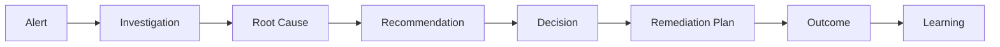
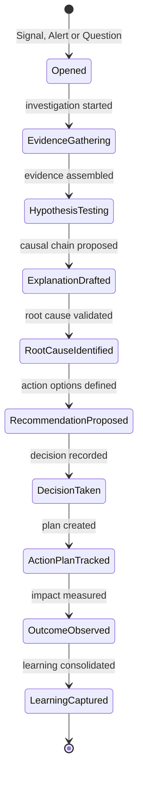
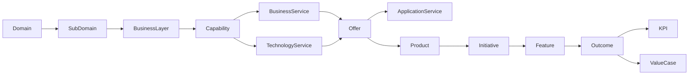
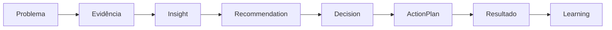

# Intelligence Model - Enterprise Delivery Intelligence Platform (EDIP)

## 1. Missão da Camada de Inteligência

A camada de inteligência da EDIP existe para transformar observabilidade corporativa em decisão baseada em evidências.

Ela conecta dados, eventos, métricas, health scores, forecasts, heat maps, insights, explicações, recomendações, decisões, planos de ação e aprendizado organizacional em uma cadeia governada e auditável.

A cadeia conceitual da inteligência é:

Dados -> Eventos -> Métricas -> Health Scores -> Forecasts -> Heat Maps -> Insights -> Explicações -> Recomendações -> Decisões -> Planos de Ação -> Aprendizado Organizacional.

| Conceito | Definição | Exemplo na EDIP |
| --- | --- | --- |
| Dado | Registro bruto ou observação capturada de fonte corporativa. | Data de conclusão de uma feature, valor observado de KPI, aprovação registrada. |
| Evento | Fato consumado, imutável e auditável. | `FeatureCompleted`, `BottleneckDetected`, `ArchitectureDebtRegistered`. |
| Métrica | Medida governada derivada de eventos, estados ou fontes. | Queue Time, Cost of Delay, Capability Coverage. |
| Health Score | Sinal composto e explicável de saúde de uma entidade ou dimensão. | Flow Health Score, Portfolio Health Score, Capability Health Score. |
| Forecast | Projeção explicável sobre prazo, capacidade, valor, KPI, KR ou modernização. | Schedule forecast, value forecast, capacity forecast. |
| Heat Map | Projeção analítica por dimensão, escopo e severidade. | Enterprise Heat Map, Portfolio Heat Map, Architecture Capability Dimension. |
| Insight | Descoberta contextualizada que exige atenção, investigação ou decisão. | Gargalo recorrente em homologação afeta objetivo estratégico crítico. |
| Explicação | Resposta estruturada baseada em eventos, métricas, causalidade e evidências. | O KR ficou vermelho por atraso de decision gate e degradação de Flow Health. |
| Recomendação | Ação sugerida com impacto, owner, urgência e evidência. | Rebalancear capacidade, escalar decisão, iniciar modernização. |
| Decisão | Escolha formal tomada por autoridade humana, papel ou comitê. | Aprovar funding, aceitar risco, repriorizar portfólio. |
| Plano de Ação | Conjunto de ações derivadas de recomendação ou decisão. | Plano de remediação de gargalo ou dívida arquitetural. |
| Aprendizado | Conhecimento consolidado a partir do resultado de decisões e ações. | Padrão recorrente de atraso por aprovação tardia em funding. |

A inteligência complementa métricas e eventos porque eventos dizem o que aconteceu, métricas quantificam o fenômeno e a inteligência explica por que importa, quem deve agir, qual decisão é necessária e que aprendizado deve ser preservado.

A camada reduz reuniões, relatórios manuais e ambiguidades ao substituir narrativas subjetivas por cadeias rastreáveis de evidência, causalidade, impacto, owner e próxima ação.

Transformar observabilidade em decisão significa que um alerta, score ou heat map não termina em visualização; ele deve conduzir investigação, explicação, recomendação, decisão, plano de ação e medição de resultado.

## 2. Escopo Conceitual da Inteligência

A EDIP deve produzir inteligência sobre:

- Estratégia: temas, objetivos, OKRs, KRs, outcomes e KPIs.
- Portfólio: investimentos, funding, capacidade, dependências, riscos e priorização.
- Produto: produto, roadmap, discovery, hipóteses, outcomes e adoção.
- Delivery: iniciativas, épicos, features, stories, tasks, releases e dependências.
- Flow Intelligence: flow stages, queues, wait time, touch time, bottlenecks, WIP e desperdícios.
- Engenharia: risco técnico, dívida técnica, readiness, integração, qualidade e release.
- Governança: decisões, gates, aprovações, evidências, controles e exceções.
- Métricas: ownership, fórmulas, fontes, confiança, lineage e uso em decisão.
- Forecasting: prazo, capacidade, valor, KPI, KR, confidence e accuracy.
- Value Realization: value cases, benefícios esperados, observados, validados, rejeitados e leakage.
- Observabilidade e qualidade de dados: frescor, divergência, completude, lineage, confiança e erro de cálculo.
- Economics: cost of delay, cost of queue, cost of bottleneck, delay impact, value at risk e value leakage.
- Architecture Capability Model: domains, subdomains, business layers, capabilities, services, offers, application services e composição de produto.
- Operating Model Need-to-Value: necessidades, dores, discovery, requisitos, solução, readiness, delivery, validação e value realization.
- Alert and Blocker Resolution: ações, evidências, validação da condição original, resolução efetiva e reabertura.

### Architecture Elevator

O elevador de arquitetura usado pela EDIP é:

Domain -> SubDomain -> BusinessLayer -> Capability -> BusinessService / TechnologyService -> Offer -> ApplicationService.

Esse modelo permite navegar de estratégia para arquitetura e de arquitetura para execução, sem confundir conceitos.

Regras conceituais obrigatórias:

- Product não é Capability.
- Product não é Service.
- Product não é Offer.
- Product representa uma composição flexível de N ofertas.
- Offer é a unidade que conecta serviços de negócio ou tecnologia à composição de produto.
- Capability representa uma capacidade de negócio ou arquitetura que pode sustentar objetivos, ofertas, produtos, iniciativas e valor.

## 3. Taxonomia da Inteligência

### Signal

Signal é uma observação básica derivada de dado, evento, métrica, health score, forecast ou heat map.

Exemplos:

- KPI caiu.
- Queue aumentou.
- Forecast mudou.
- Capability Health degradou.
- Offer entrou em risco.
- Service Modernization atrasou.

### Insight

Insight é uma descoberta relevante e contextualizada que merece investigação, decisão ou ação.

Exemplos:

- Gargalo recorrente em homologação.
- Crescimento anormal de filas.
- Capability crítica com degradação simultânea de Flow Health e Technical Health.
- Offer com alto valor em risco e baixa modernização.

### Explanation

Explanation é uma explicação estruturada baseada em eventos, métricas, evidências e relações causais.

Exemplo:

O KR está vermelho porque a capability que suporta as ofertas críticas do produto possui alto Queue Time, dependências vencidas e decisão arquitetural atrasada.

### Root Cause

Root Cause é a causa raiz identificada por investigação governada, análise causal ou validação humana.

Exemplos:

- Dependência externa.
- Aprovação atrasada.
- Falta de capacidade.
- Fragilidade arquitetural.
- Baixa maturidade de capability.
- Oferta dependente de serviço legado.

### Recommendation

Recommendation é uma ação sugerida com impacto esperado, owner, urgência, horizonte e evidências.

Exemplos:

- Rebalancear capacidade.
- Dividir iniciativa.
- Escalar decisão.
- Modernizar serviço tecnológico.
- Reduzir escopo da oferta.
- Priorizar capability crítica.

### Decision

Decision é uma decisão tomada por autoridade humana, papel organizacional ou comitê. A EDIP pode recomendar decisões, mas decisões críticas devem preservar responsabilidade humana, justificativa, evidência e trilha de auditoria.

### ActionPlan

ActionPlan é um plano de ação decorrente de recomendação, decisão ou root cause validada.

### Outcome

Outcome é o resultado observado após ação, decisão, entrega, mudança de priorização, modernização, release ou validação de benefício.

### Learning

Learning é aprendizado organizacional consolidado e reutilizável, derivado de outcomes, decision outcomes, root causes e evidence chains.

## 4. Entidades de Inteligência

| Entidade | Propósito | Atributos Conceituais | Relacionamentos | Ownership | Ciclo de Vida | Relação com Sinais e Evidências |
| --- | --- | --- | --- | --- | --- | --- |
| Signal | Registrar observação relevante. | signalId, sourceType, sourceId, scope, severity, confidenceLevel, observedAt. | Deriva de evento, métrica, score, forecast ou heat map; pode originar Insight. | Owner do domínio observado. | Detected, Acknowledged, Promoted, Dismissed, Expired. | Deve apontar para origem, período, qualidade e entidade afetada. |
| Insight | Representar descoberta contextualizada. | insightId, type, summary, impactHypothesis, scope, confidenceLevel, detectedAt. | Agrupa signals, eventos, métricas, scores, forecasts e heat maps. | Owner do domínio, PMO ou Product Owner da plataforma. | Detected, Triaged, Investigating, Explained, Actioned, Archived. | Deve possuir sinais causadores e limitação conhecida. |
| Explanation | Explicar fenômeno de forma rastreável. | explanationId, question, answerSummary, causalChain, limitations, confidenceLevel. | Usa EvidenceChain, CausalChain, RootCause, métricas, scores, forecasts e decisões. | Owner da pergunta ou domínio afetado. | Drafted, Reviewed, Approved, Superseded, Archived. | Deve separar causa, correlação, inferência e evidência. |
| RootCause | Registrar causa raiz provável ou validada. | rootCauseId, category, causalType, description, confidenceLevel, identifiedAt. | Relaciona Investigation, EvidenceChain, CausalChain e ActionPlan. | Owner da investigação. | Proposed, Validated, Rejected, Resolved, Reopened. | Deve preservar evidência e método de identificação. |
| Recommendation | Sugerir ação acionável. | recommendationId, action, urgency, expectedImpact, suggestedOwner, horizon, riskOfInaction. | Deriva de Insight, RootCause, evento crítico, score degradado ou forecast. | Owner do domínio afetado. | Proposed, Accepted, Rejected, Expired, ConvertedToDecision. | Deve apontar evidências necessárias e consequências da inação. |
| Narrative | Produzir explicação executiva. | narrativeId, type, period, audience, executiveSummary, riskSummary, actionSummary. | Usa Explanation, Recommendation, Decision, EvidenceChain, metrics e heat maps. | PMO, Product Owner da plataforma ou owner executivo. | Generated, Reviewed, Approved, Published, Superseded. | Deve preservar eventos causadores, métricas e decisões citadas. |
| ActionPlan | Registrar plano corretivo ou mitigador. | actionPlanId, objective, actions, ownerId, dueDate, status, expectedOutcome. | Deriva de Recommendation, Decision ou RootCause; produz DecisionOutcome. | Owner do plano. | Created, InProgress, Blocked, Completed, Cancelled, Reopened. | Deve apontar evidências de execução e resultado. |
| DecisionOutcome | Medir resultado de decisão. | decisionOutcomeId, decisionId, outcomeStatus, observedImpact, measuredAt, evidenceId. | Relaciona Decision, ActionPlan, Outcome, métricas e Learning. | Owner da decisão. | Pending, Observed, Validated, Rejected, Learned. | Deve comparar impacto esperado e impacto observado. |
| Learning | Consolidar aprendizado organizacional. | learningId, learningType, summary, context, applicability, confidenceLevel. | Deriva de DecisionOutcome, RootCause, EvidenceChain e patterns. | Knowledge steward / PMO. | Proposed, Validated, Published, Reused, Retired. | Deve conter contexto de validade e evidências. |
| KnowledgeAsset | Ativo de conhecimento governado. | assetId, title, type, domain, ownerId, validity, usageCount. | Agrupa Learnings, patterns, anti-patterns, practices e decision patterns. | Knowledge steward. | Draft, Approved, Published, Deprecated, Retired. | Deve possuir curadoria e validade temporal. |
| KnowledgeGraph | Rede conceitual de relações explicáveis. | graphId, scope, nodeTypes, relationshipTypes, stewardshipPolicy. | Conecta Strategy, Portfolio, Architecture, Product, Delivery, Metrics, Events, Insights, Decisions e Learnings. | Enterprise Data Architect / Knowledge Architect. | Curated, Enriched, Validated, Audited. | Deve preservar lineage e semântica de relação. |
| Investigation | Processo de apuração. | investigationId, trigger, scope, status, ownerId, openedAt, closedAt. | Inicia por Signal, Alert, Insight ou pergunta; produz Explanation, RootCause e Recommendation. | Owner da investigação. | Opened, EvidenceGathering, Analyzing, Explained, Decided, Closed. | Deve guardar hipóteses, evidências aceitas e descartadas. |
| EvidenceChain | Cadeia de evidências. | evidenceChainId, evidenceIds, sourceEvents, metricSnapshots, decisionIds, lineageStatus. | Sustenta Explanation, RootCause, Narrative, Recommendation e Decision. | Governança / Auditoria / Data Owner. | Assembled, Validated, Challenged, Approved, Archived. | Deve ser suficiente para auditoria e contestação. |
| CausalChain | Cadeia causal explícita. | causalChainId, rootEventId, relationshipTypes, confidenceLevel, limitations. | Relaciona eventos, métricas, scores, forecasts, heat maps e root causes. | Owner da investigação. | Proposed, Validated, Rejected, Superseded. | Deve classificar direct cause, contributing cause, dependency, inference e correlation. |
| DecisionPattern | Padrão reutilizável de decisão. | patternId, context, trigger, decisionOptions, observedOutcomes, applicability. | Deriva de decisions e decision outcomes recorrentes. | PMO / Knowledge steward. | Proposed, Validated, Reused, Retired. | Deve indicar condições de uso e riscos. |
| ArchitectureInsight | Insight sobre architecture elevator. | insightId, architectureScope, affectedEntities, riskLevel, modernizationImpact. | Usa Architecture Events, architecture metrics, heat maps e assessments. | Arquiteto Corporativo. | Detected, Investigating, Recommended, Actioned, Archived. | Deve conectar domain, capability, service, offer, product e iniciativa. |
| CapabilityInsight | Insight sobre capability. | insightId, capabilityId, healthDrivers, strategicImpact, affectedProducts. | Relaciona objectives, capabilities, services, offers, products e initiatives. | Capability Owner / Arquiteto Corporativo. | Detected, Validated, Actioned, Learned. | Deve apontar coverage, debt, modernization e value impact. |
| ProductInsight | Insight sobre produto e composição. | insightId, productId, affectedOffers, outcomeImpact, valueImpact. | Relaciona Product, Offer, RoadmapItem, Outcome, KPI e ValueCase. | Product Owner / Product Manager. | Detected, Investigating, Actioned, Learned. | Deve distinguir problema de produto de problema de offer ou service. |
| FlowInsight | Insight sobre filas, espera e gargalo. | insightId, flowScope, dominantStage, bottleneckSeverity, economicImpact. | Relaciona queues, work items, initiatives, teams, heat maps e cost metrics. | Scrum Master / Coordenador / Flow Owner. | Detected, Investigating, Mitigating, Recovered. | Deve preservar queue history e heat map. |
| ValueInsight | Insight sobre realização de valor. | insightId, valueCaseId, valueGap, leakageDrivers, confidenceLevel. | Relaciona ValueCase, Benefit, KPI, Outcome, Product e Initiative. | Sponsor de valor / Product Manager. | Detected, Validated, Actioned, Learned. | Deve diferenciar valor esperado, forecast, realizado e validado. |
| RiskInsight | Insight sobre risco material. | insightId, riskCategory, severity, exposure, affectedScope. | Relaciona technical risk, dependency, governance, data, architecture e value. | Risk Owner / PMO. | Detected, Escalated, Accepted, Mitigated, Closed. | Deve apontar risco de inação e evidência. |
| GovernanceInsight | Insight sobre decisão, gate, controle ou evidência. | insightId, governanceScope, decisionLatency, evidenceGap, complianceImpact. | Relaciona decisions, gates, approvals, controls e evidence chains. | PMO / Auditoria / Compliance. | Detected, Escalated, Resolved, Audited. | Deve preservar segregação de funções e trilha de auditoria. |
| CaseInsight | Insight sobre case, recorrência, aging, risco, valor em risco, evidência, decisão e resolução. | insightId, caseId, caseType, severity, aging, systemicPattern, valueAtRisk, confidenceLevel. | Relaciona Case, Alerts, Investigations, RootCauses, Recommendations, Decisions, ActionPlans, Evidence, Validations e Learnings. | Case Owner / PMO / Governance. | Detected, Investigating, Recommended, Escalated, Resolved, Learned. | Deve preservar distinção entre Case, Alert, Investigation, Decision, ActionPlan, Evidence e Learning. |
| OperatingInsight | Insight sobre o fluxo Need-to-Value. | insightId, stage, blockedEntityId, ownerId, aging, nextRequiredEvent. | Relaciona BusinessNeed, Discovery, Requirement, SolutionDesign, Readiness, Delivery, Validation, ValueCase, alerts e blockers. | PMO / Operating Model Owner. | Detected, Investigating, ActionDefined, Resolved, Learned. | Deve responder onde está parado, quem deveria agir e qual evidência falta. |
| QueueInsight | Insight sobre fila operacional ou de fluxo. | insightId, queueId, stage, aging, capacitySignal, ownerId. | Usa Queue, FlowStage, Queue Time, WIP, Bottleneck events e operating events. | Scrum Master / PMO. | Detected, Investigating, ActionDefined, Resolved. | Deve distinguir espera legítima de fila sem owner. |
| BlockerInsight | Insight sobre bloqueador, causa, severidade e resolução. | insightId, blockerId, blockerType, severity, ownerId, resolutionStatus. | Usa BlockerCreated, BlockerResolved, Blocked Time e Blocker Resolution Health. | Blocker Owner / Coordenador. | Detected, Assigned, Resolving, Validated, Closed. | Deve exigir evidência de resolução quando crítico. |
| ReviewInsight | Insight sobre revisão pendente, envelhecida ou rejeitada. | insightId, reviewType, solutionDesignId, reviewerId, slaStatus. | Usa SolutionReviewRequested, ReviewCompleted, Review Time, Approval Time e review health scores. | Arquiteto / Líder Técnico / Especialista. | Detected, Assigned, Reviewed, Escalated, Closed. | Deve indicar reviewer, pendência e impacto em readiness. |
| AlertResolutionInsight | Insight sobre alerta aberto, encerrado indevidamente ou reaberto. | insightId, alertId, actionId, evidenceId, validationId, resolutionStatus. | Usa AlertActionRegistered, AlertEvidenceAttached, AlertConditionValidated, AlertResolved e AlertReopened. | Alert Owner / PMO. | Detected, ActionRequired, EvidenceRequired, ValidationRequired, Resolved, Reopened. | Não pode recomendar encerramento sem ação, evidência e validação da condição original. |

## 5. Intelligence Lifecycle

O ciclo principal transforma observação em decisão e aprendizado:

```mermaid
flowchart LR
  Data[Dado] --> Event[Evento]
  Event --> Metric[Métrica]
  Metric --> Score[Health Score]
  Score --> Forecast[Forecast]
  Forecast --> HeatMap[Heat Map]
  HeatMap --> Signal[Signal]
  Signal --> Insight[Insight]
  Insight --> Investigation[Investigation]
  Investigation --> Explanation[Explanation]
  Explanation --> RootCause[Root Cause]
  RootCause --> Recommendation[Recommendation]
  Recommendation --> Decision[Decision]
  Decision --> ActionPlan[ActionPlan]
  ActionPlan --> Outcome[Outcome]
  Outcome --> Learning[Learning]
  Learning --> KnowledgeAsset[Knowledge Asset]
```



O ciclo alternativo parte de um alerta:



### Estados de Investigation



## 6. Architecture Capability Intelligence

Architecture Capability Intelligence aplica a camada de inteligência ao Architecture Elevator. Ela permite entender como domínios, capabilities, services, offers e application services sustentam produtos, iniciativas, outcomes, KPIs e valor.

Perguntas que a EDIP deve responder:

- Quais domains concentram maior risco?
- Quais subdomains concentram maior atraso?
- Quais business layers concentram maior cost of delay?
- Quais capabilities sustentam objetivos estratégicos críticos?
- Quais capabilities possuem maior dívida técnica ou arquitetural?
- Quais business services e technology services sustentam ofertas críticas?
- Quais offers compõem determinado produto?
- Quais application services implementam determinada offer?
- Quais ofertas estão associadas a KRs vermelhos?
- Quais services ou offers deveriam ser modernizados primeiro?

### Cadeia de Rastreabilidade Arquitetural



### Tipos de Inteligência Arquitetural

| Tipo | Escopo | Eventos | Métricas / Scores | Decisões Suportadas |
| --- | --- | --- | --- | --- |
| Domain Intelligence | Domain e subdomains. | DomainCreated, SubDomainCreated, CapabilityUpdated. | Capability Coverage, Capability Health Score, Enterprise Heat Map. | Priorizar domínios críticos, ajustar ownership e concentrar modernização. |
| SubDomain Intelligence | Subdomain e business layer. | SubDomainCreated, CapabilityCreated, CapabilityRetired. | Objective to Capability Coverage, Capability Traceability Health. | Corrigir lacunas de capacidade e rastreabilidade. |
| Capability Intelligence | Capability e sua relação com estratégia, produto e delivery. | CapabilityCreated, CapabilityUpdated, CapabilityRetired, ArchitectureDebtRegistered. | Capability Health Score, Capability Modernization Score, Architecture Debt Score. | Modernizar, substituir, remapear iniciativas ou aceitar risco. |
| Service Intelligence | BusinessService e TechnologyService. | BusinessServiceCreated, TechnologyServiceCreated, ServiceModernizationStarted. | Service Health Score, Service Modernization Score, Technology Rationalization Score. | Modernizar service, racionalizar tecnologia ou tratar dívida. |
| Offer Intelligence | Offer e composição de produto. | OfferCreated, OfferRetired, ProductOfferAssociated, ProductOfferRemoved. | Offer Health Score, Offer Adoption Score, Offer Traceability Health. | Substituir offer, rever composição de produto ou plano de transição. |
| Application Service Intelligence | Application services que implementam offers. | ArchitectureAssessmentCompleted, ArchitectureDebtRegistered, ArchitectureExceptionExpired. | Architecture Debt Score, Service Health Score, Data Confidence quando aplicável. | Mitigar risco de aplicação, priorizar assessment ou remediação. |
| Product Composition Intelligence | Produto como composição flexível de offers. | ProductOfferAssociated, ProductOfferRemoved, OfferRetired. | Product Health Score, Offer Adoption Score, Time to Value, Value Realization Score. | Rever composição, roadmap, dependências e valor. |
| Modernization Intelligence | Modernização de capabilities e services. | CapabilityModernizationStarted, CapabilityModernizationCompleted, ServiceModernizationStarted, ServiceModernizationCompleted. | Capability Modernization Score, Service Modernization Score, Architecture Debt Score. | Priorizar modernização, escalar decisão e medir benefício técnico/econômico. |

## 7. Insight Model

| Tipo de Insight | Origem | Eventos Utilizados | Métricas Utilizadas | Health Scores | Forecasts | Heat Maps | Personas | Decisões Suportadas |
| --- | --- | --- | --- | --- | --- | --- | --- | --- |
| Estratégico | Objetivos, OKRs, KRs, outcomes e KPIs. | ObjectiveCreated, ObjectiveRetired, OKRCreated, KRTargetChanged, KPIUpdated. | Strategic Alignment Coverage, KPI Target Deviation, OKR Achievement Forecast. | Strategic Health Score. | KR Forecast, KPI Forecast. | Enterprise Heat Map, Strategic Alignment Dimension. | Diretor, Superintendente. | Repriorizar objetivos, revisar target, ajustar investimento. |
| Portfólio | Funding, capacidade, investimentos e riscos. | InvestmentApproved, FundingAllocated, PortfolioReprioritized, ValueAtRiskIncreased. | Investment At Risk, Funding Variance, Capacity Allocation Fit, Cost of Delay. | Portfolio Health Score. | Capacity Forecast, Value Forecast. | Portfolio Heat Map. | Diretor, Superintendente, PMO. | Rebalancear funding, capacidade e prioridade. |
| Produto | Product, roadmap, discovery, outcomes e adoção. | ProductCreated, RoadmapCommitted, HypothesisValidated, OutcomeAssigned. | Discovery Quality Score, Product Outcome Progress, Adoption Trend. | Product Health Score. | KPI Forecast, Value Forecast. | Product Value views. | Product Manager, Product Owner. | Rever roadmap, hipótese, adoção e composição. |
| Delivery | Iniciativas, épicos, features, releases e dependências. | InitiativeStarted, FeatureBlocked, FeatureCompleted, ReleasePublished. | Lead Time, Release Lead Time, Dependency Aging, Commitment Reliability. | Initiative Health Score, Delivery Health Score. | Schedule Forecast. | Delivery Heat Map. | Gerente, Coordenador, Scrum Master. | Replanejar, dividir iniciativa, remover dependência. |
| Fluxo | Queues, WIP, bottlenecks e flow stages. | QueueEntered, QueueExited, BottleneckDetected, WIPThresholdBreached. | Queue Time, Wait Time, Flow Efficiency, Bottleneck Severity. | Flow Health Score. | Schedule Forecast, Capacity Forecast. | Enterprise, Portfolio, Delivery e Squad Heat Maps. | Scrum Master, Coordenador, Gerente. | Reduzir WIP, rebalancear capacidade, remover gargalo. |
| Engenharia | Risco técnico, dívida, readiness e integração. | TechnicalRiskCreated, TechnicalDebtRegistered, ReleaseReadinessRejected. | Technical Debt Exposure, Integration Risk Score, Release Readiness. | Technical Delivery Health. | Schedule Forecast. | Risk Dimension. | Líder Técnico, Desenvolvedor, Arquiteto. | Remediar dívida, ajustar release, mitigar integração. |
| Governança | Decisões, gates, controles, evidências e exceções. | DecisionSLAExceeded, GateRejected, EvidenceAttached, ExceptionExpired. | Decision Latency, Approval Aging, Evidence Coverage, Control Adherence Rate. | Governance Health Score, Portfolio Health Score. | Forecast de prazo e valor afetados. | Governance Dimension. | PMO, Auditoria, Compliance. | Escalar decisão, exigir evidência, aceitar ou mitigar risco. |
| Case Management | Cases, alertas relacionados, investigations, actions, evidências, validações, decisões e learnings. | CaseCreated, CaseSLAExceeded, CaseEvidenceAttached, CaseResolved, CaseClosed, CaseReopened. | Open Case Count, Critical Case Count, Case Aging, Case SLA Compliance, Case Evidence Coverage, Case Value at Risk, Case Resolution Health. | Case Governance Health, Case Resolution Health. | Forecast de risco, valor ou capacidade afetado quando aplicável. | Case Heat Map, Governance Dimension, Value Dimension. | Diretor, PMO, Governance, Auditoria, Case Owner. | Escalar case, exigir evidência, abrir decisão executiva, reabrir closure ou consolidar learning. |
| Econômico | Atraso, filas, gargalos e valor em risco. | CostOfDelayThresholdBreached, CostOfQueueCalculated, CostOfBottleneckCalculated. | Cost of Delay, Cost of Queue, Cost of Bottleneck, Delay Impact Score. | Portfolio Health Score, Value Realization Score. | Value Forecast. | Value Dimension, Capacity Dimension. | Diretor, Superintendente, Financeiro. | Acelerar, cancelar, pausar, repriorizar ou ajustar funding. |
| Valor | Value cases, benefícios e outcomes observados. | ValueCaseCreated, BenefitObserved, BenefitValidated, BenefitRejected. | Planned Value, Forecast Value, Realized Benefit, Validated Benefit, Value Leakage. | Value Realization Score. | Value Forecast. | Value Dimension. | Diretor, Product Manager, Sponsor. | Validar benefício, rever hipótese, corrigir adoção. |
| Qualidade de Dados | Fontes, lineage, divergência e cálculo. | DataFreshnessBreached, SourceDivergenceDetected, DataConfidenceDegraded. | Data Freshness, Lineage Completeness, Source Divergence, Data Confidence Score. | Data Confidence Score. | Forecast confidence afetado. | Data Quality Dimension. | Data Owner, Especialista, Auditoria. | Bloquear decisão frágil, corrigir fonte, reconciliar dados. |
| Arquitetura | Architecture elevator e assessments. | DomainCreated, CapabilityUpdated, ArchitectureAssessmentCompleted. | Capability Coverage, Architecture Debt Score, Technology Rationalization Score. | Capability Health Score, Service Health Score. | Modernization forecast quando aplicável. | Architecture Capability Dimension. | Arquiteto Corporativo, Diretor, PMO. | Modernizar, racionalizar, aceitar risco, remapear produtos. |
| Capability | Capability e impacto estratégico. | CapabilityCreated, CapabilityRetired, ArchitectureDebtRegistered. | Capability Traceability Health, Objective to Capability Coverage. | Capability Health Score. | Forecast de valor e capacidade afetados. | Architecture Capability Dimension. | Arquiteto Corporativo, Capability Owner. | Priorizar capability crítica, criar iniciativa de modernização. |
| Service | BusinessService e TechnologyService. | BusinessServiceCreated, TechnologyServiceCreated, ServiceModernizationStarted. | Service Health Score, Service Modernization Score. | Service Health Score. | Modernization forecast. | Architecture Service Dimension. | Líder Técnico, Arquiteto, Service Owner. | Modernizar serviço, resolver dívida, substituir tecnologia. |
| Offer | Offer e relação com produto. | OfferCreated, OfferRetired, ProductOfferAssociated, ProductOfferRemoved. | Offer Health Score, Offer Adoption Score, Offer Traceability Health. | Offer Health Score, Product Health Score. | Value Forecast. | Architecture Offer Dimension. | Product Owner, Arquiteto, Offer Owner. | Substituir offer, rever composição do produto. |
| Modernização | Capabilities e services em evolução. | CapabilityModernizationStarted, ServiceModernizationCompleted, ArchitectureDebtResolved. | Capability Modernization Score, Service Modernization Score, Architecture Debt Score. | Capability Health Score, Service Health Score. | Modernization forecast. | Architecture Modernization Dimension. | Arquiteto, PMO, Diretor. | Escalar modernização, ajustar roadmap e funding. |
| Produto-Composição | Product como composição de offers. | ProductOfferAssociated, ProductOfferRemoved, OfferRetired. | Product Health Score, Offer Adoption Score, Time to Value. | Product Health Score, Value Realization Score. | KPI Forecast, Value Forecast. | Offer/Product composition views. | Product Manager, Product Owner, Arquiteto. | Ajustar composição, substituir offer, rever roadmap. |
| Operacional Need-to-Value | Necessidades, requisitos, solução, readiness, validação, blockers e alertas. | BusinessNeedCaptured, RequirementReviewed, SolutionReviewRequested, ReadinessRejected, ValidationStarted, BlockerCreated, AlertReopened. | Business Discovery Health, Requirements Health, Solution Health, Readiness Health, Validation Health, Alert Resolution Health, Blocker Resolution Health. | Operating health scores, Flow Health Score. | Forecast operacional de fluxo. | Business Discovery, Requirements, Review, Readiness, Validation, Blocker e Alert Heat Maps. | PMO, Gerente, Coordenador, Product Owner, Arquiteto. | Atribuir owner, destravar fila, exigir evidência, escalar decisão, impedir encerramento falso de alerta. |

## 8. Case Intelligence

Case Intelligence identifica, explica e prioriza cases como objetos corporativos governados que agregam alertas, investigations, decisões, action plans, evidências, validações e learnings.

Case Intelligence deve responder:

- Quais cases concentram maior risco?
- Quais cases estão envelhecendo?
- Quais cases foram reabertos?
- Quais causas sistêmicas aparecem em múltiplos cases?
- Quais cases ameaçam maior valor?
- Quais cases exigem decisão executiva?
- Quais cases revelam padrão organizacional recorrente?

Relação conceitual:

```text
Case -> Signals -> Insights -> Investigations -> Root Causes -> Recommendations -> Decisions -> Actions -> Outcomes -> Learnings
```

| Pergunta | Eventos Necessários | Métricas Necessárias | Evidências Necessárias | Explicação Esperada | Decisão / Ação Esperada |
| --- | --- | --- | --- | --- | --- |
| Quais cases concentram maior risco? | CaseCreated, CaseSeverityChanged, CaseSLAExceeded, CaseEscalated. | Critical Case Count, Case Business Impact, Case Value at Risk. | Case timeline, affected entities, risk evidence. | Ranking explicável por severidade, valor em risco, aging, escopo afetado e recorrência. | Escalar, priorizar, criar decision gate ou aceitar risco formal. |
| Quais cases estão envelhecendo? | CaseCreated, CaseAssigned, CaseSLAExceeded. | Case Aging, Case SLA Compliance. | Owner, SLA, action history, blockers de resolução. | Identificar estágio parado, owner, próxima ação e consequência da inação. | Reatribuir owner, escalonar, revisar plano. |
| Quais cases foram reabertos? | CaseClosed, CaseReopened. | Case Reopen Rate, Case Resolution Health. | Closure evidence, validation result, reopening reason. | Explicar se closure falhou por evidência, validação, causa raiz incompleta ou condição recorrente. | Reabrir investigation, revisar closure criteria, atualizar learning. |
| Quais causas sistêmicas aparecem em múltiplos cases? | CaseLinkedToInvestigation, RootCauseIdentified, CaseReopened. | Case Recurrence Rate, Root Cause Accuracy. | Evidence chains, causal chains, related cases. | Identificar padrão por capability, product, owner, process, queue ou policy. | Criar modernization, policy change, capability remediation ou governance action. |
| Quais cases ameaçam maior valor? | CaseCreated, ValueAtRiskIncreased, ValueLeakageDetected, CaseSeverityChanged. | Case Value at Risk, Value Leakage, Investment At Risk. | ValueCase, benefit evidence, forecast drivers. | Mostrar caminho causal do case para value case, KPI, portfolio e objective. | Priorizar resolução, revisar funding, acelerar delivery ou aceitar risco. |
| Quais cases exigem decisão executiva? | CaseEscalated, DecisionSLAExceeded, CaseSLAExceeded. | Case Business Impact, Decision Latency, Case Governance Health. | Decision gate, authority, evidence gaps. | Mostrar autoridade necessária, trade-off e risco de não decisão. | Abrir decisão executiva, convocar comitê, aprovar exceção. |
| Quais cases revelam padrão organizacional recorrente? | CaseReopened, CaseClosed, LearningCaptured. | Case Recurrence Rate, Recommendation Outcome Success, Knowledge Reuse Rate. | Learnings, decision outcomes, related cases. | Explicar anti-pattern ou padrão reutilizável. | Publicar learning, ajustar operating model, atualizar controles. |

## 9. Explanation Model

Explicações são construídas pela cadeia:

Eventos -> Métricas -> Scores -> Forecasts -> Heat Maps -> Evidências -> Causalidade -> Explicação.

| Pergunta | Eventos | Métricas / Scores | Forecasts / Heat Maps | Evidências | Explicação Esperada |
| --- | --- | --- | --- | --- | --- |
| Por que o KPI caiu? | KPIUpdated, TargetChanged, BenefitRejected, DataConfidenceDegraded. | KPI Target Deviation, KPI Forecast Accuracy, Data Confidence Score. | KPI Forecast, Strategic Alignment Dimension. | Fonte do KPI, target vigente, lineage e evidências de benefício. | Separar queda real de KPI de problema de fonte, target, atribuição ou benefício. |
| Por que o KR ficou vermelho? | KeyResultProgressUpdated, KPIUpdated, ForecastUpdated, BottleneckDetected. | Key Result Progress, KR Forecast Probability, KPI Target Deviation. | KR Forecast, Enterprise Heat Map. | OKR, KPI, iniciativas, forecast drivers e decisões. | Mostrar se o KR foi afetado por execução, fluxo, capacidade, valor ou governança. |
| Por que o forecast mudou? | ForecastUpdated, ForecastConfidenceChanged, ForecastAccuracyMeasured, TeamCapacityChanged. | Forecast Confidence, Forecast Accuracy, Capacity Forecast Risk. | Schedule, Value, KPI ou Capacity Forecast. | Versão do forecast, premissas, drivers e qualidade de dados. | Mostrar novos drivers, premissas alteradas, eventos recentes e confiança. |
| Por que o valor não foi realizado? | BenefitObserved, BenefitRejected, ValueLeakageDetected, InvestmentUnderperformingDetected. | Benefit Variance, ROI, Value Leakage, Time to Value. | Value Forecast, Value Dimension. | Value case, baseline, target, evidência e validação. | Explicar se a falha foi hipótese, adoção, atraso, atribuição, escopo ou evidência. |
| Por que o Flow Health degradou? | QueueEntered, WIPThresholdBreached, BottleneckDetected, FlowHealthDegraded. | Queue Time, Wait Time, Flow Efficiency, Bottleneck Severity. | Flow Heat Maps. | Histórico de queue, owners, blockers e work items. | Mostrar queue, WIP, bottleneck, dependência e capacidade como cadeia causal. |
| Onde estamos parados? | BusinessNeedCaptured, RequirementReviewed, SolutionReviewRequested, ReadinessRejected, ValidationStarted, BlockerCreated. | Queue Time, Requirements Queue Time, Review Time, Readiness Time, Validation Time, Blocked Time. | Operating Heat Maps e forecast operacional de fluxo. | Need-to-Value path, owner, SLA, blocker, alert e evidência. | Mostrar etapa parada, aging, owner responsável, próximo evento esperado e ação necessária. |
| Qual alerta continua aberta e por quê? | AlertDetected, AlertActionRegistered, AlertEvidenceAttached, AlertConditionValidated, AlertReopened. | Alert Aging, Alert Resolution Health, Evidence Coverage. | Alert Heat Map. | Alerta, ação, evidência, validação, condição original e histórico de reabertura. | Indicar se falta ação, evidência, validação ou remoção da condição original. |
| Por que esta capability está crítica? | CapabilityUpdated, ArchitectureDebtRegistered, ArchitectureExceptionExpired. | Capability Health Score, Architecture Debt Score, Capability Traceability Health. | Architecture Capability Dimension. | Assessment arquitetural, dívida, exceções e produtos afetados. | Explicar risco por estratégia, serviços, offers, produtos, dívida e modernização. |
| Por que esta oferta está em risco? | OfferRetired, ProductOfferRemoved, ArchitectureAssessmentCompleted. | Offer Health Score, Offer Adoption Score, Offer Traceability Health. | Architecture Offer Dimension. | Offers, services, products, decisões e plano de transição. | Mostrar se o risco vem de service legado, aposentadoria, baixa adoção ou perda de suporte. |
| Por que este produto não entrega valor? | ProductOfferAssociated, ProductOfferRemoved, BenefitRejected, ValueLeakageDetected. | Product Health Score, Time to Value, Value Realization Score. | Value Forecast, Offer/Product composition views. | Composição de offers, outcomes, KPIs, value cases e roadmap. | Separar falha de hipótese, composição, delivery, offer, service ou adoção. |
| Por que a modernização está atrasada? | CapabilityModernizationStarted, ServiceModernizationStarted, DecisionSLAExceeded, ArchitectureDebtRegistered. | Capability Modernization Score, Service Modernization Score, Decision Latency. | Modernization forecast, Architecture Modernization Dimension. | Assessment, funding, owners, decisão, dependências técnicas. | Mostrar se o atraso é decisão, capacidade, dívida, dependência ou prioridade. |
| Por que determinado domínio concentra gargalos? | DomainCreated, SubDomainCreated, BottleneckDetected, QueueThresholdBreached. | Flow Health Score, Capability Health Score, Cost of Queue. | Enterprise Heat Map, Architecture Capability Dimension. | Domain map, initiatives, queues, capabilities e portfolios. | Mostrar interação entre arquitetura, capacidade, fluxo e valor em risco. |

## 10. Causality and Root Cause Analysis Model

Root Cause Analysis na EDIP é uma investigação governada que diferencia causalidade comprovada, contribuição, dependência, inferência e correlação.

### Categorias de Causa

| Categoria | Definição | Exemplos |
| --- | --- | --- |
| Estratégia | Mudança, ambiguidade ou desalinhamento estratégico. | Objetivo retirado, KR sem KPI confiável. |
| Portfólio | Funding, priorização, capacidade ou dependência de portfólio. | Funding atrasado, capacidade alocada ao item errado. |
| Produto | Hipótese, discovery, roadmap, outcome ou adoção. | Hipótese inválida, baixa adoção, roadmap desalinhado. |
| Capability | Capacidade crítica sem cobertura, owner ou modernização. | Capability sem serviço saudável ou com dívida severa. |
| Service | Serviço de negócio ou tecnologia frágil. | Technology service legado suportando offer crítica. |
| Offer | Oferta sem suporte, baixa adoção ou aposentadoria mal planejada. | Offer retirada sem substituição. |
| Application Service | Aplicação que implementa offer com risco, dívida ou baixa resiliência. | Application service obsoleto em produto crítico. |
| Processo | Handoff, fila, gate, approval ou política operacional. | Fila em homologação, gate sem SLA. |
| Dependência | Área, fornecedor, integração ou entrega externa. | Dependência vencida, integração indisponível. |
| Capacidade | Falta, excesso ou má alocação de capacidade. | Squad sobrecarregada, WIP excessivo. |
| Tecnologia | Dívida técnica, integração, readiness ou qualidade. | Release readiness rejeitado. |
| Arquitetura | Padrão, exceção, dívida ou racionalização arquitetural. | Exceção expirada, assessment crítico. |
| Modernização | Atraso ou falha em modernizar capability ou service. | Service modernization atrasada. |
| Governança | Decisão, evidência, controle ou segregação de funções. | Decision SLA excedido, evidência ausente. |
| Dados | Fonte, cálculo, lineage, frescor ou confiança. | Source divergence, DataConfidenceDegraded. |
| Valor | Realização de benefício, adoção ou validação. | BenefitRejected, ValueLeakageDetected. |
| Economics | Impacto financeiro de atraso, fila ou gargalo. | Cost of Delay crítico, Cost of Bottleneck elevado. |

### Tipos de Relação Causal

| Tipo | Definição | Uso |
| --- | --- | --- |
| Causa direta | Evento ou condição que produziu diretamente o fenômeno. | Explicação executiva e ação imediata. |
| Causa contribuinte | Fator que elevou probabilidade ou severidade. | Forecasting, priorização e recommendation. |
| Causa sistêmica | Padrão recorrente ou estrutural. | Learning, patterns e melhoria organizacional. |
| Correlação | Eventos relacionados sem causalidade comprovada. | Investigação e hipóteses, nunca decisão isolada. |
| Inferência | Conclusão derivada por regra analítica ou modelo conceitual. | Explainability com confiança e limitação explícita. |
| Dependência | Relação em que um fato depende de outro. | Timelines, gates, release readiness e governança. |
| Causa arquitetural | Relação causal derivada de capability, service, offer ou aplicação. | Architecture Intelligence e modernização. |
| Causa econômica | Relação causal que explica perda ou exposição de valor. | Economics of Delivery e value realization. |
| Causa organizacional | Relação causal derivada de ownership, estrutura decisória ou capacidade. | Decision Intelligence e operating model. |

## 11. Recommendation Model

Recomendações seguem a cadeia:

Evento -> Signal -> Insight -> RootCause -> Recommendation.

| Evento | Signal / Insight | Recomendação | Impacto Esperado | Urgência | Owner Sugerido | Horizonte | Decisão Esperada | Risco de Inação | Evidências Necessárias |
| --- | --- | --- | --- | --- | --- | --- | --- | --- | --- |
| BottleneckDetected | Gargalo ativo degradando fluxo e prazo. | Rebalancear capacidade, reduzir WIP ou eliminar dependência. | Reduzir Queue Time e recuperar Flow Health. | Alta se afeta release, KR ou valor. | Coordenador / Gerente. | 1 a 5 dias úteis. | Repriorizar trabalho ou alocar capacidade. | Atraso, cost of bottleneck e perda de previsibilidade. | Heat map, queue history, owner e work items afetados. |
| DecisionSLAExceeded | Decisão pendente bloqueia valor. | Escalar decisão, convocar comitê ou aprovar exceção. | Reduzir Decision Latency e desbloquear execução. | Alta. | PMO / autoridade do gate. | Mesmo dia a 3 dias úteis. | Aprovar, rejeitar ou formalizar impedimento. | Aging, cost of delay e risco de auditoria. | Gate, decisão pendente, SLA e evidências. |
| ValueLeakageDetected | Valor esperado não capturado. | Revisar hipótese de valor, adoção, priorização ou continuidade. | Reduzir Value Leakage e recuperar Value Realization Score. | Alta quando material. | Sponsor / Product Manager. | Próximo ciclo ou imediato. | Ajustar, pausar, cancelar ou reforçar adoção. | Continuidade de investimento sem valor. | Value case, benefícios, KPI, adoção e evidências. |
| ForecastAccuracyDegraded | Forecast histórico perdeu precisão. | Revisar premissas, drivers e qualidade dos dados. | Aumentar confiabilidade decisória. | Média a alta. | Owner do forecast / Dados / PMO. | Próximo ciclo de forecast. | Ajustar método e premissas. | Decisões executivas com previsão frágil. | Versões do forecast, resultado real, drivers e lineage. |
| CapabilityHealthDegraded | Capability crítica degradou. | Avaliar modernização, redistribuir investimento ou tratar dívida. | Reduzir risco estratégico e operacional. | Alta se sustenta objetivo crítico. | Arquiteto Corporativo / Capability Owner. | 5 a 20 dias úteis. | Priorizar modernização ou aceitar risco. | Produto crítico sem capability saudável. | Assessment, architecture debt, offers e produtos afetados. |
| ArchitectureDebtRegistered | Dívida arquitetural formalizada. | Criar plano de remediação técnica ou associar iniciativa. | Reduzir Architecture Debt Score e risco de obsolescência. | Conforme severidade. | Arquiteto / Service Owner. | 1 a 30 dias úteis. | Remediar, financiar ou aceitar risco. | Exceções, falhas de modernização e risco regulatório. | Debt record, assessment, evidências e plano. |
| OfferHealthDegraded | Offer crítica em risco. | Revisar composição do produto ou dependências de serviço. | Proteger Product Health e valor. | Alta se produto crítico. | Product Owner / Offer Owner. | Próximo ciclo de produto. | Substituir offer ou criar transição. | Produto perde suporte e valor. | Composição do produto, services, adoption e value impact. |
| ServiceModernizationDelayed | Modernização de serviço atrasada. | Escalar decisão arquitetural ou capacidade técnica. | Recuperar modernization score e reduzir debt. | Média a alta. | Arquiteto / Líder Técnico / PMO. | Próximo comitê técnico. | Repriorizar modernização ou ajustar escopo. | Serviço legado continua sustentando offers críticas. | Modernization plan, blockers, capacity e decisions. |
| RequirementRejected | Requisito rejeitado ou recorrente em revisão. | Corrigir origem, critérios, owner ou evidência antes de solution design. | Aumentar Requirements Health e reduzir retrabalho. | Média a alta se bloqueia solução. | Product Owner / Business Analyst. | 1 a 5 dias úteis. | Corrigir, voltar ao discovery ou descartar. | Solution design frágil, retrabalho e atraso. | Origem, review, critérios e evidência. |
| SolutionRejected | Solução rejeitada em review. | Corrigir desenho, registrar exceção ou reduzir escopo. | Recuperar Solution Health e reduzir review time. | Alta se bloqueia iniciativa crítica. | Solution Owner / Arquiteto / Líder Técnico. | 1 a 10 dias úteis. | Aprovar correção, exceção ou mudança de escopo. | Readiness bloqueado e atraso de delivery. | Reviews, requisitos, pendências e evidências. |
| ReadinessRejected | Item não está pronto para execução. | Completar DOR, resolver dependência ou ajustar capacidade. | Evitar WIP improdutivo e recuperar Readiness Health. | Alta se afeta release. | Scrum Master / Delivery Owner. | 1 a 5 dias úteis. | Bloquear entrada ou aprovar exceção formal. | Execução sem prontidão, blockers e cost of delay. | Checklist, capacidade, dependências e riscos. |
| AlertReopened | Alerta reaberto por condição persistente ou evidência insuficiente. | Revisar ação, evidência e validação da condição original. | Recuperar Alert Resolution Health. | Alta se alerta crítico. | Alert Owner / PMO. | Mesmo dia a 3 dias úteis. | Reabrir tratamento ou aceitar risco formalmente. | Falsa resolução, risco recorrente e perda de confiança. | Alert, action, evidence, validation e histórico. |

## 12. Executive Narrative Model

Narrative é uma explicação executiva objetiva, auditável e orientada a decisão.

Toda narrativa deve responder:

- O que aconteceu?
- Por que aconteceu?
- O que está em risco?
- Quais capabilities, offers, services ou products foram afetados?
- Quanto valor está em risco?
- O que deve ser feito?
- Quem deve agir?
- Até quando?

| Tipo de Narrativa | Objetivo | Conteúdo Mínimo | Eventos Base |
| --- | --- | --- | --- |
| Weekly Executive Narrative | Explicar mudanças relevantes da semana. | riscos, variações de score, gargalos, decisões pendentes e ações. | HealthScoreDegraded, BottleneckDetected, DecisionSLAExceeded, ForecastUpdated. |
| Monthly Portfolio Narrative | Explicar saúde e valor do portfólio. | funding, capacidade, value at risk, investimentos críticos e forecast. | PortfolioReprioritized, ValueAtRiskIncreased, InvestmentUnderperformingDetected. |
| Quarterly Strategy Narrative | Explicar progresso estratégico. | OKRs, KRs, KPIs, outcomes, benefícios e riscos estratégicos. | KeyResultProgressUpdated, KPIUpdated, BenefitValidated. |
| Architecture Modernization Narrative | Explicar progresso e risco de modernização. | capabilities, services, debt, exceções, atrasos e decisões. | CapabilityModernizationStarted, ServiceModernizationCompleted, ArchitectureDebtRegistered. |
| Capability Health Narrative | Explicar capabilities críticas. | capability health, coverage, offers, produtos, objetivos e iniciativas afetadas. | CapabilityUpdated, CapabilityRetired, ArchitectureAssessmentCompleted. |
| Product Value Narrative | Explicar valor por produto e composição. | outcomes, KPIs, offers, value cases, adoption e leakage. | ProductOfferAssociated, BenefitRejected, ValueLeakageDetected. |
| Incident Narrative | Explicar degradação severa. | timeline, causa raiz, impacto, owner, plano corretivo. | FlowHealthDegraded, DataConfidenceDegraded, BottleneckSeverityIncreased. |
| Value Realization Narrative | Explicar captura ou perda de valor. | planned, forecast, realized, validated, rejected, leakage. | BenefitObserved, BenefitValidated, BenefitRejected, ValueLeakageDetected. |
| Governance Narrative | Explicar decisões, gates, evidências e exceções. | decisions, aging, SLA, evidências, controles e riscos aceitos. | DecisionSLAExceeded, GateRejected, EvidenceAttached, ExceptionExpired. |

## 13. Decision Intelligence Model

Decision Intelligence conecta:

Problema -> Evidência -> Insight -> Recomendação -> Decisão -> Plano de Ação -> Resultado.



| Tipo de Decisão | Eventos Típicos | Métricas Típicas | Evidências Típicas | Owner Esperado | Impacto Esperado | Consequências da Inação |
| --- | --- | --- | --- | --- | --- | --- |
| Operacional | QueueThresholdBreached, FeatureBlocked, StoryBlocked. | Queue Time, WIP by Flow Stage, Blocked Time. | Work items, blockers, queue history. | Coordenador / Scrum Master. | Reduzir WIP, desbloquear fluxo. | Aging, perda de throughput e atraso. |
| Tática | InitiativePaused, DependencyRaised, ReleaseReadinessRejected. | Initiative Health Score, Dependency Aging, Release Lead Time. | Plano da iniciativa, dependências, readiness. | Gerente / PMO. | Replanejar, dividir escopo ou resolver dependência. | Atraso, risco de release e escalonamento executivo. |
| Executiva | ValueAtRiskIncreased, CostOfDelayThresholdBreached, InvestmentUnderperformingDetected. | Investment At Risk, Cost of Delay, Value Leakage. | Business case, value case, funding e forecast. | Diretor / Superintendente. | Repriorizar investimento e proteger valor. | Perda financeira e desalinhamento estratégico. |
| Estratégica | ObjectiveRetired, KRTargetChanged, KPIUpdated. | Strategic Health Score, OKR Achievement Forecast, KPI Target Deviation. | OKR, KPI lineage, benefícios e estratégia. | Diretor / Comitê Executivo. | Ajustar direção estratégica. | Execução desconectada da estratégia. |
| Arquitetural | ArchitectureAssessmentCompleted, ArchitectureDebtRegistered, ArchitectureExceptionExpired. | Architecture Debt Score, Capability Health Score, Service Health Score. | Assessment, standards, exceções, evidências técnicas. | Arquiteto Corporativo. | Reduzir risco arquitetural e melhorar sustentação. | Risco tecnológico, compliance e obsolescência. |
| Modernização | CapabilityModernizationStarted, ServiceModernizationStarted, ArchitectureDebtResolved. | Capability Modernization Score, Service Modernization Score. | Plano de modernização, debt, roadmap e funding. | Arquiteto / PMO / Sponsor. | Acelerar modernização e reduzir debt. | Services críticos permanecem frágeis. |
| Portfólio | PortfolioReprioritized, FundingAllocated, CapacityAllocated. | Portfolio Health Score, Capacity Allocation Fit, Funding Variance. | Priorização, capacidade, funding e objetivos. | Superintendente / PMO. | Alocar capacidade ao valor mais alto. | Capacidade presa em baixo valor. |
| Produto | ProductOfferRemoved, RoadmapCommitted, HypothesisInvalidated. | Product Health Score, Discovery Quality Score, Time to Value. | Roadmap, offers, outcomes, evidence de discovery. | Product Manager / Product Owner. | Ajustar produto, roadmap e composição. | Produto entrega sem valor ou com offer inadequada. |
| Funding | InvestmentApproved, FundingAllocated, DecisionSLAExceeded. | Funding Lead Time, Objective Funding Coverage, Cost of Delay. | Comitê, business case, decisão, valor esperado. | Diretor / Financeiro / PMO. | Liberar funding ou cancelar hipótese. | Atraso econômico e valor em risco. |
| Risco Aceito | RiskAccepted, ArchitectureExceptionGranted, ExceptionExpired. | Architecture Exception Rate, Risk Exposure, Control Adherence Rate. | Justificativa, controles compensatórios, prazo e autoridade. | Risco / Compliance / Arquiteto. | Formalizar risco e controles. | Risco informal, auditoria frágil e não conformidade. |

## 14. Knowledge Graph Model

O Knowledge Graph conceitual da EDIP conecta entidades de negócio, arquitetura, produto, delivery, eventos, métricas, decisões e aprendizados em uma rede navegável.

### Nós Conceituais

- Strategy, StrategicTheme, StrategicObjective, OKR, KeyResult.
- Portfolio, Investment, Funding, Initiative.
- Architecture Domain, SubDomain, BusinessLayer, Capability.
- BusinessService, TechnologyService, Offer, ApplicationService.
- Product, ProductCapability, RoadmapItem, Outcome.
- BusinessNeed, PainPoint, BusinessProblem, Discovery, Requirement, SolutionDesign, Review, ReadinessAssessment, Validation.
- Epic, Feature, Story, Task, Release.
- KPI, MetricDefinition, HealthScore, Forecast, HeatMap.
- DomainEvent, Signal, Insight, Explanation, RootCause.
- Decision, Approval, DecisionGate, GovernanceGate, Evidence.
- Case, CaseTimeline, CaseClosure, CaseReopening.
- Alert, AlertAction, AlertEvidence, AlertValidation, AlertResolution, Blocker.
- ValueCase, Benefit, DecisionOutcome, Learning, KnowledgeAsset.

### Relações Conceituais

| Relação | Exemplo | Uso |
| --- | --- | --- |
| supports | Capability supports StrategicObjective. | Rastreabilidade estratégica e arquitetural. |
| composes | Product composes Offers. | Product Composition Intelligence. |
| implementedBy | Offer implementedBy ApplicationService. | Análise de impacto e modernização. |
| measuredBy | Outcome measuredBy KPI. | Explicabilidade de KPI e valor. |
| causedBy | FlowHealthDegraded causedBy BottleneckDetected. | Root Cause Analysis. |
| contains | Case contains Alert, Investigation, Decision, ActionPlan, Evidence ou Learning. | Case Intelligence e rastreabilidade de resolução. |
| reopenedBy | Case reopenedBy CaseReopening ou AlertReopened. | Auditoria de closure e recorrência. |
| contributedTo | ArchitectureDebtRegistered contributedTo OfferHealthDegraded. | Causa contribuinte e forecasting. |
| waitsAt | Requirement waitsAt Review Queue. | Operating Intelligence e análise de aging. |
| blockedBy | SolutionDesign blockedBy ComplianceReview. | Explainability de atraso e blocker. |
| requiresEvidence | Alert requiresEvidence AlertEvidence. | Governança de encerramento de alertas. |
| validatedBy | AlertResolution validatedBy AlertValidation. | Evitar falso encerramento e preservar auditoria. |
| evidencedBy | BenefitValidated evidencedBy EvidenceChain. | Auditoria e governança. |
| decidedBy | FundingAllocated decidedBy DecisionApproved. | Decision Intelligence. |
| impactedBy | Product impactedBy OfferRetired. | Análise de impacto. |
| learnedFrom | Learning learnedFrom DecisionOutcome. | Aprendizado organizacional. |

O Knowledge Graph suporta:

- Explainability: navegar de score para eventos, evidências, decisões e root causes.
- Busca corporativa: encontrar entidades por owner, impacto, risco, valor e relação.
- Copilot: responder perguntas com subgrafos causais e evidências.
- Investigação: montar timeline e cadeia causal por iniciativa, KPI, capability, offer ou value case.
- Rastreabilidade arquitetural: conectar strategy, capability, service, offer, product e delivery.
- Análise de impacto: identificar efeitos de retirement, debt, exception, bottleneck e value leakage.
- Modernização: priorizar capabilities e services por risco, valor e dependência.
- Governança bancária: preservar decisões, evidências, ownership e trilha de auditoria.

## 15. Organizational Learning Model

Aprendizados são capturados quando decisões e ações produzem resultados observáveis. A EDIP deve separar opinião, hipótese, insight e aprendizado validado.

| Conceito | Definição | Reutilização Futura |
| --- | --- | --- |
| Lesson Learned | Aprendizado derivado de uma experiência específica. | Orientar iniciativas semelhantes. |
| Proven Practice | Prática com evidência repetida de efetividade. | Recomendar como padrão preferencial. |
| Anti Pattern | Padrão recorrente associado a resultado ruim. | Gerar alerta preventivo ou checklist. |
| Decision Pattern | Tipo de decisão recorrente com contexto, evidência e resultado. | Sugerir decisão em situações semelhantes. |
| Delivery Pattern | Padrão de execução, dependência, release ou bloqueio. | Antecipar risco de prazo. |
| Flow Pattern | Padrão de queue, WIP, bottleneck ou wait time. | Prevenir gargalos recorrentes. |
| Architecture Pattern | Padrão arquitetural que reduz risco, debt ou custo. | Orientar modernização e design target. |
| Capability Pattern | Padrão de evolução ou sustentação de capability. | Priorizar capabilities críticas. |
| Service Modernization Pattern | Padrão para modernização de services legados. | Reutilizar abordagem, controles e evidências. |
| Offer Composition Pattern | Padrão de composição de offers em produtos. | Melhorar product composition e value realization. |
| Product Value Pattern | Padrão de produto que captura ou perde valor. | Orientar roadmap, adoption e discovery. |
| Governance Pattern | Padrão de decisão, gate ou evidência. | Reduzir latency e falhas de auditoria. |

Fluxo de aprendizado:

Outcome -> DecisionOutcome -> Learning -> KnowledgeAsset -> Recommendation Reuse.

## 16. Copilot Intelligence Model

O Copilot corporativo da EDIP deve raciocinar a partir de eventos, métricas, insights, explicações, evidências, recomendações e caminhos no Knowledge Graph. Ele não deve apresentar conclusão como fato quando a cadeia de evidência estiver incompleta.

| Pergunta | Eventos Necessários | Métricas Necessárias | Insights | Explicações | Recomendações | Evidências | Caminho no Knowledge Graph |
| --- | --- | --- | --- | --- | --- | --- | --- |
| Por que estamos atrasados? | InitiativeStarted, FeatureBlocked, QueueThresholdBreached, BottleneckDetected, DecisionSLAExceeded. | Lead Time, Queue Time, Dependency Aging, Schedule Forecast Accuracy. | Gargalo, decisão pendente, dependência crítica. | Cadeia de atraso com causa direta e contribuintes. | Escalar decisão, resolver dependência, reduzir WIP. | Timeline, blockers, queue history, decision gate. | Initiative -> Feature -> Queue -> Decision -> Forecast -> Objective. |
| Onde está o principal gargalo? | HeatMapGenerated, BottleneckDetected, BottleneckSeverityIncreased. | Bottleneck Severity, Queue Time, Flow Health Score, Cost of Bottleneck. | Gargalo dominante por severidade e valor afetado. | Relação stage, owner, flow e impacto. | Criar plano de ação e reavaliar capacidade. | Heat map, flow stage, work items. | Enterprise Heat Map -> Portfolio -> Initiative -> FlowStage -> WorkItem. |
| Qual valor está em risco? | ValueAtRiskIncreased, CostOfDelayThresholdBreached, ValueLeakageDetected. | Investment At Risk, Cost of Delay, Value Leakage, ROI. | Valor materialmente exposto. | Relação atraso, investimento, benefício e forecast. | Acelerar, pausar, cancelar ou ajustar funding. | Value case, forecast, benefit evidence. | Objective -> Portfolio -> Investment -> Initiative -> ValueCase -> KPI. |
| O que devemos fazer agora? | AlertDetected, RootCauseIdentified, DecisionSLAExceeded. | Métrica dominante do alerta, health score afetado. | Próxima ação por severidade. | Causa, consequência, urgência e owner. | Ação com owner e horizonte. | Alert, evidence chain, decision context. | Alert -> Insight -> RootCause -> Recommendation -> Decision. |
| Qual decisão está bloqueando mais valor? | DecisionCreated, DecisionSLAExceeded, CostOfDelayCalculated. | Decision Latency, Approval Aging, Cost of Delay. | Decisão de maior impacto econômico. | Decisão -> atraso -> valor em risco. | Escalar autoridade ou convocar comitê. | Gate, decisão pendente, value impact. | Decision -> Initiative -> ValueCase -> Portfolio -> Objective. |
| Qual squad requer intervenção? | WIPThresholdBreached, QueueEntered, FlowHealthDegraded, FeatureBlocked. | WIP by Flow Stage, Aging WIP, Flow Health Score, Throughput. | Squad congestionada. | Causa de congestionamento e impacto. | Reduzir WIP, redistribuir trabalho. | Work items, flow stage, squad capacity. | Squad -> FlowStage -> WorkItem -> Initiative -> Portfolio. |
| Onde estamos parados? | BusinessNeedCaptured, RequirementReviewed, SolutionReviewRequested, ReadinessRejected, ValidationStarted, BlockerCreated. | Queue Time, Requirements Queue Time, Review Time, Readiness Time, Validation Time, Blocked Time. | OperatingInsight, QueueInsight, BlockerInsight. | Etapa parada, aging, owner e próximo evento esperado. | Ação por etapa e owner responsável. | Need-to-Value path, queue, blocker, evidence. | Need -> Requirement -> Solution -> Readiness -> Delivery -> Validation -> ValueCase. |
| Qual alerta continua aberta? | AlertDetected, AlertActionRegistered, AlertEvidenceAttached, AlertConditionValidated, AlertReopened. | Alert Aging, Alert Resolution Time, Alert Resolution Health. | AlertResolutionInsight. | Se falta ação, evidência, validação ou remoção da condição original. | Registrar ação, anexar evidência, validar condição ou reabrir alerta. | Alert, action, evidence, validation, resolution. | Alert -> Action -> Evidence -> Validation -> Resolution. |
| Qual revisão está pendente? | SolutionReviewRequested, ArchitectureReviewCompleted, EngineeringReviewCompleted, SecurityReviewCompleted, DataReviewCompleted, ComplianceReviewCompleted. | Review Time, Approval Time, Architecture Review Health, Engineering Review Health. | ReviewInsight. | Reviewer pendente, SLA, impacto em readiness e decisão necessária. | Escalar reviewer, aceitar exceção ou corrigir solução. | SolutionDesign, review, reviewer, evidence. | Requirement -> SolutionDesign -> Review -> Readiness. |
| Qual capability está mais crítica? | CapabilityUpdated, ArchitectureDebtRegistered, ArchitectureExceptionExpired. | Capability Health Score, Architecture Debt Score, Capability Traceability Health. | Capability crítica por debt, exception ou valor. | Capability -> services/offers/produtos afetados. | Priorizar modernização ou aceitar risco. | Assessment, debt, exception, impacted products. | Domain -> SubDomain -> Capability -> Service -> Offer -> Product -> Objective. |
| Qual domínio possui mais gargalos? | BottleneckDetected, DomainCreated, CapabilityUpdated. | Flow Health Score, Bottleneck Severity, Capability Health Score. | Domínio com concentração de gargalos. | Interação entre fluxo e arquitetura. | Priorizar intervenção cross-portfolio. | Heat maps por domínio e portfolio. | Domain -> Capability -> Offer -> Product -> Initiative -> FlowStage. |
| Quais ofertas compõem este produto? | ProductOfferAssociated, ProductOfferRemoved. | Offer Adoption Score, Product Health Score. | Composição atual e lacunas. | Produto como composição de offers. | Revisar composição se houver risco. | Histórico de associação e owners. | Product -> Offer -> BusinessService/TechnologyService -> Capability. |
| Quais application services suportam esta oferta? | OfferCreated, ArchitectureAssessmentCompleted. | Service Health Score, Architecture Debt Score. | Application services críticos. | Offer -> application services -> risk/debt. | Avaliar modernização ou resiliência. | Assessment, CMDB/catálogo, evidência técnica. | Offer -> ApplicationService -> TechnologyService -> Capability. |
| Qual serviço deve ser modernizado primeiro? | ArchitectureDebtRegistered, ServiceModernizationStarted, ValueAtRiskIncreased. | Service Modernization Score, Architecture Debt Score, Cost of Delay. | Serviço com maior risco e valor afetado. | Priorização por risco, valor e dependência. | Priorizar modernization plan. | Assessment, debt, products affected. | Service -> Offer -> Product -> ValueCase -> Objective. |
| Quais capabilities sustentam este objetivo estratégico? | ObjectiveCreated, CapabilityCreated, KPIAssignedToOutcome. | Objective to Capability Coverage, Capability Traceability Health. | Capabilities conectadas ao objetivo. | Estratégia -> capability -> produto -> execução. | Corrigir lacunas de rastreabilidade. | Strategy links, owners, coverage. | Objective -> Capability -> Offer -> Product -> Initiative. |
| Que iniciativa impacta esta capability? | InitiativeCreated, CapabilityUpdated, ProductOfferAssociated. | Capability to Initiative Coverage, Initiative Health Score. | Iniciativas que alteram capability. | Iniciativa -> produto/offer -> capability. | Priorizar ou rever escopo. | Initiative links, roadmap, architecture assessment. | Capability -> Offer -> Product -> Initiative -> Feature. |
| Que capability ameaça este KR? | KRTargetChanged, KPIUpdated, ArchitectureDebtRegistered, FlowHealthDegraded. | KR Forecast Probability, Capability Health Score, Flow Health Score. | Capability crítica associada a KR vermelho. | Capability debt/flow -> product/outcome -> KPI/KR. | Modernizar capability ou mitigar risco. | KR, KPI, product, offer, capability evidence. | KR -> KPI -> Outcome -> Product -> Offer -> Capability. |

## 17. Explainability Framework

| Nível | Nome | Conteúdo | Exemplo |
| --- | --- | --- | --- |
| Nível 1 | Resposta simples | Resumo direto. | A iniciativa está atrasada. |
| Nível 2 | Resposta com métricas | Métricas, tendência e período. | Lead Time e Queue Time aumentaram. |
| Nível 3 | Resposta com causalidade | Eventos causais e relações explícitas. | Queue Time aumentou após BottleneckDetected em homologação. |
| Nível 4 | Resposta com evidências | Causalidade sustentada por evidence chain. | O gargalo foi causado por dependência externa vencida e decisão atrasada. |
| Nível 5 | Resposta com recomendação | Ação, owner, prazo e risco de inação. | Escalar decisão e reduzir WIP em até 3 dias. |
| Nível 6 | Resposta com impacto arquitetural e econômico | Mostra capabilities, services, offers, products e valor em risco. | Atraso afeta offer crítica, capability com dívida e Cost of Delay material. |
| Nível 7 | Resposta com aprendizado organizacional reutilizável | Relaciona caso a padrões e aprendizados prévios. | Este padrão já ocorreu em iniciativas com funding tardio e service legado. |

Regras:

- Nível 3 ou superior deve diferenciar causa direta, causa contribuinte, correlação, dependência e inferência.
- Nível 4 deve possuir EvidenceChain.
- Nível 5 deve possuir Recommendation e owner sugerido.
- Nível 6 deve explicitar impacto arquitetural, econômico e estratégico.
- Nível 7 deve apontar Learning ou KnowledgeAsset reutilizável.
- Respostas executivas devem explicitar confiança, limitação e dados ausentes.

## 18. Intelligence Health Model

A própria camada de inteligência deve ser mensurada para evitar recomendações frágeis, narrativas opacas ou aprendizados não reutilizáveis.

| Métrica | Definição Conceitual | Uso |
| --- | --- | --- |
| Insight Accuracy | Insights confirmados por evidência ou outcome / insights avaliados. | Medir precisão da detecção. |
| Recommendation Acceptance Rate | Recomendações aceitas / recomendações propostas. | Medir utilidade percebida. |
| Recommendation Outcome Success | Recomendações executadas com resultado esperado / recomendações executadas. | Medir eficácia real. |
| Root Cause Accuracy | Root causes confirmadas / root causes propostas. | Medir qualidade de RCA. |
| Narrative Quality | Completude, clareza, evidência, causalidade e ação das narrativas. | Medir qualidade executiva. |
| Explainability Coverage | Perguntas críticas com explicação adequada / perguntas críticas totais. | Medir cobertura de explicabilidade. |
| Knowledge Reuse Rate | Learnings reutilizados / knowledge assets disponíveis. | Medir aprendizado organizacional. |
| Decision Impact Accuracy | Impacto previsto de decisão versus impacto observado. | Medir qualidade da decision intelligence. |
| Architecture Insight Accuracy | Insights arquiteturais confirmados por assessment ou outcome. | Medir qualidade da Architecture Intelligence. |
| Capability Insight Accuracy | Insights de capability confirmados por health, value ou delivery outcome. | Medir qualidade de Capability Intelligence. |
| Copilot Answer Confidence | Confiança das respostas baseada em evidência, lineage e completude. | Evitar respostas sem base suficiente. |

## 19. Intelligence Maturity Model

| Nível | Nome | Característica | Capacidade EDIP |
| --- | --- | --- | --- |
| Nível 1 | Observabilidade | Eventos, dados e sinais são visíveis. | EDIP registra eventos, sinais e qualidade de dados. |
| Nível 2 | Medição | Métricas, scores e forecasts governados existem. | EDIP possui catálogo de métricas, health scores, forecasts e heat maps. |
| Nível 3 | Explicação | Causalidade, evidência e narrativas explicam fenômenos. | EDIP define explanation, event causality e evidence chains. |
| Nível 4 | Recomendação | Plataforma sugere ações com impacto, owner e horizonte. | EDIP define recommendation model e decision intelligence. |
| Nível 5 | Aprendizado Organizacional | Resultados de decisões viram conhecimento reutilizável. | EDIP define learning, knowledge assets e patterns. |
| Nível 6 | Inteligência Corporativa | A organização decide com evidência integrada e aprende continuamente. | EDIP ambiciona este nível como capacidade-alvo. |
| Nível 7 | Inteligência Arquitetural e Estratégica | Estratégia, arquitetura, produto, delivery e valor são explicados em conjunto. | EDIP incorpora Architecture Capability Intelligence e Product Composition Intelligence. |

Posicionamento conceitual:

- O domínio, eventos, métricas, scores e heat maps habilitam níveis 1 e 2.
- O Event Catalog e este Intelligence Model habilitam nível 3.
- Recommendation Model e Decision Intelligence Model habilitam nível 4.
- Organizational Learning Model e Knowledge Graph Model habilitam nível 5.
- Copilot, Executive Narratives e Intelligence Health habilitam nível 6.
- Architecture Capability Intelligence, Capability Intelligence, Offer Intelligence e Product Composition Intelligence habilitam nível 7.

## 20. Governance of Intelligence

A camada de inteligência deve ser governada porque influencia decisões executivas, priorização, funding, risco, arquitetura e auditoria.

| Elemento | Regra de Governança |
| --- | --- |
| Owner de insight | Todo insight deve possuir owner do domínio afetado ou steward designado. |
| Owner de recomendação | Toda recomendação deve possuir owner sugerido e autoridade decisória esperada. |
| Owner de narrativa | Narrativas executivas devem ter owner responsável por revisão e publicação. |
| Owner de knowledge asset | Knowledge assets devem possuir steward, validade, escopo e critérios de reutilização. |
| Validação de root cause | Root causes relevantes devem ser validadas por owner da investigação ou comitê aplicável. |
| Validação de recomendação | Recomendações críticas devem indicar evidência, risco de inação e autoridade de decisão. |
| Validade temporal de insights | Insights devem expirar, ser revalidados ou ser arquivados quando o contexto muda. |
| Expiração de recomendações | Recomendações devem ter horizonte; após expiração devem ser reavaliadas. |
| Auditabilidade de explicações | Explicações usadas em decisão crítica devem preservar events, metrics, score snapshots, forecast versions e evidence chains. |
| Uso responsável do Copilot | O Copilot deve declarar confiança, limitações, fontes e lacunas; não deve ocultar baixa qualidade de dados. |
| Segregação de funções | A geração de recomendação não substitui aprovação formal em funding, risco, auditoria ou exceção arquitetural. |
| Contestabilidade | Usuários autorizados devem poder contestar root cause, recommendation ou narrative, gerando nova investigação quando necessário. |

## 21. Change Log

### Entidades Criadas

- Signal.
- Insight.
- Explanation.
- RootCause.
- Recommendation.
- Narrative.
- ActionPlan.
- DecisionOutcome.
- Learning.
- KnowledgeAsset.
- KnowledgeGraph.
- Investigation.
- EvidenceChain.
- CausalChain.
- DecisionPattern.
- ArchitectureInsight.
- CapabilityInsight.
- ProductInsight.
- FlowInsight.
- ValueInsight.
- RiskInsight.
- GovernanceInsight.
- CaseInsight.
- OperatingInsight.
- QueueInsight.
- BlockerInsight.
- ReviewInsight.
- AlertResolutionInsight.

### Relacionamentos Definidos

- Dados -> Eventos -> Métricas -> Health Scores -> Forecasts -> Heat Maps -> Insights -> Explicações -> Recomendações -> Decisões -> Planos de Ação -> Aprendizado Organizacional.
- Signal -> Insight -> Investigation -> Explanation -> RootCause -> Recommendation -> Decision -> ActionPlan -> Outcome -> Learning.
- Alert -> Investigation -> RootCause -> Recommendation -> Decision -> RemediationPlan -> Learning.
- Case -> Signals -> Insights -> Investigations -> Root Causes -> Recommendations -> Decisions -> Actions -> Outcomes -> Learnings.
- EvidenceChain sustenta Explanation, RootCause, Narrative, Recommendation e Decision.
- CausalChain diferencia direct cause, contributing cause, dependency, inference e correlation.
- KnowledgeGraph conecta Strategy, Portfolio, Architecture Domain, Capability, Service, Offer, Product, Delivery, Metrics, Events, Insights, Decisions e Learnings.
- KnowledgeGraph passa a tratar Case como nó obrigatório conectado a alerts, investigations, decisions, action plans, evidence, validations, learnings e entidades afetadas.
- KnowledgeGraph conecta BusinessNeed, PainPoint, Discovery, Requirement, SolutionDesign, Review, Readiness, Validation, AlertAction, AlertEvidence, AlertValidation e AlertResolution ao fluxo Need-to-Value.
- Product é tratado como composição flexível de N offers, sem ser Capability, Service ou Offer.

### Modelos de Inteligência

- Missão e escopo conceitual da inteligência.
- Taxonomia da inteligência.
- Intelligence Lifecycle.
- Architecture Capability Intelligence.
- Insight Model.
- Case Intelligence.
- Decision Intelligence Model.
- Knowledge Graph Model.
- Copilot Intelligence Model.
- Intelligence Health Model.
- Intelligence Maturity Model.
- Governance of Intelligence.
- Operating Intelligence para Need-to-Value, filas, blockers, reviews, readiness, validation e alert resolution.

### Modelos de Explicação

- Explanation Model.
- Causality and Root Cause Analysis Model.
- Explainability Framework em sete níveis.
- Perguntas explicáveis sobre KPI, KR, forecast, value realization, Flow Health, capability, offer, produto, modernização e domínio.
- Perguntas explicáveis sobre onde estamos parados, quem deveria agir, qual revisão está pendente, qual evidência falta e qual alerta continua aberto.

### Modelos de Recomendação

- Recommendation Model por evento, signal, insight, root cause, impacto, urgência, owner, horizonte, decisão esperada, risco de inação e evidências necessárias.
- Recomendações específicas para bottleneck, decisão atrasada, value leakage, forecast accuracy, capability health, architecture debt, offer health e service modernization.
- Recomendações específicas para requirement rejected, solution rejected, readiness rejected e alert reopened.

### Modelos de Aprendizado

- Organizational Learning Model.
- Lesson Learned.
- Proven Practice.
- Anti Pattern.
- Decision Pattern.
- Delivery Pattern.
- Flow Pattern.
- Architecture Pattern.
- Capability Pattern.
- Service Modernization Pattern.
- Offer Composition Pattern.
- Product Value Pattern.
- Governance Pattern.

### Architecture Capability Intelligence

- Incluído o Architecture Elevator: Domain -> SubDomain -> BusinessLayer -> Capability -> BusinessService / TechnologyService -> Offer -> ApplicationService.
- Incluída inteligência sobre Domain, SubDomain, Capability, Service, Offer, Application Service, Product Composition e Modernization.
- Incluídas perguntas executivas e de arquitetura sobre domains, capabilities, services, offers, products, initiatives, features, outcomes, KPIs e value cases.
- Incluído caminho conceitual Architecture Domain -> Product -> Delivery -> Outcome -> KPI -> ValueCase.

### Capability, Service, Offer e Product Composition Intelligence

- Capability Intelligence conecta objectives, capabilities, services, offers, products e initiatives.
- Service Intelligence conecta business services, technology services, modernization, debt e rationalization.
- Offer Intelligence conecta offer health, adoption, retirement, products e value.
- Product Composition Intelligence explicita que produto é composição de ofertas e que problemas de valor podem nascer de offer, service, delivery, discovery ou adoção.
