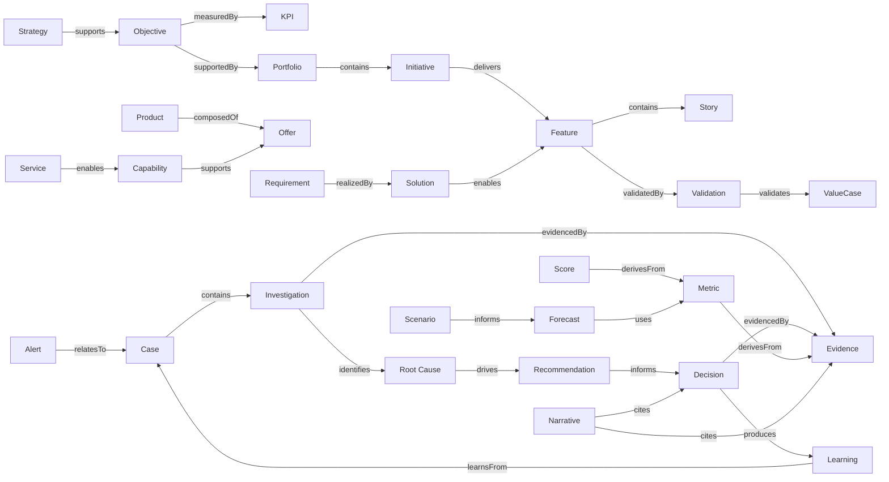

# Knowledge Architecture - Enterprise Delivery Intelligence Platform (EDIP)

## 1. Missão da Knowledge Architecture

A EDIP não existe apenas para observar. A EDIP existe para aprender.

A Knowledge Architecture define como a EDIP transforma dados, eventos, métricas, evidências, decisões, investigações, recomendações, narrativas e resultados em conhecimento corporativo reutilizável, governado, explicável e auditável.

A cadeia de conhecimento da EDIP é:

```text
Data -> Information -> Evidence -> Insight -> Knowledge -> Decision -> Learning -> Wisdom
```

| Conceito | Definição |
| --- | --- |
| Data | Registro bruto, evento, campo, observação ou sinal ainda sem interpretação suficiente. |
| Information | Dado contextualizado por entidade, tempo, owner, fonte, significado e qualidade. |
| Evidence | Informação verificável usada para sustentar status, métrica, decisão, validação, alerta, case ou controle. |
| Insight | Interpretação relevante derivada de dados, métricas, scores, forecasts, heat maps, evidências e relações. |
| Knowledge | Conhecimento governado que conecta contexto, evidência, decisão, padrão, causa, recomendação e aprendizado. |
| Decision | Escolha registrada por autoridade, com contexto, evidência, racional, impacto esperado e consequência. |
| Learning | Aprendizado validado a partir de decisão, investigação, case, outcome ou padrão recorrente. |
| Wisdom | Capacidade organizacional de reutilizar conhecimento confiável para tomar decisões melhores, mais rápidas e mais auditáveis. |

Knowledge na EDIP não é documentação solta. É uma rede semântica de ativos conectados, com ownership, lineage, confidence, validade, governança, evidência e contexto decisório.

Este documento não define tecnologia específica, banco de dados específico, graph database, vetorização, mecanismos de IA ou infraestrutura. Ele define a arquitetura conceitual de conhecimento que sustenta explainability, Copilot, organizational memory, decision intelligence e governança bancária.

## 2. Knowledge Principles

| Princípio | Definição | Implicação Arquitetural |
| --- | --- | --- |
| Knowledge Is a First-Class Asset | Conhecimento é ativo corporativo, não subproduto informal. | Deve possuir owner, steward, ciclo de vida, classificação, qualidade e governança. |
| Knowledge Must Be Traceable | Todo conhecimento deve apontar origem, evidência, eventos e decisões relacionadas. | Nenhum learning ou narrative crítico deve existir sem lineage. |
| Knowledge Must Be Explainable | O usuário deve entender por que uma resposta, recomendação ou decisão existe. | Knowledge graph deve suportar navegação causal e evidencial. |
| Knowledge Must Be Governed | Conhecimento usado em decisão crítica precisa de revisão, aprovação e validade. | Papéis de owner, steward, reviewer e approver são obrigatórios. |
| Knowledge Must Be Reusable | Conhecimento deve reduzir retrabalho e acelerar investigações futuras. | Patterns, lessons, decisions e case learnings devem ser descobríveis. |
| Knowledge Must Survive People | O conhecimento não pode depender apenas de memória individual. | Decisões, rationale, evidências e aprendizados devem persistir como ativos. |
| Knowledge Must Be Discoverable | Usuários e Copilot devem localizar conhecimento relevante por entidade, pergunta, decisão, padrão ou contexto. | Tags, relações, domínios, confidence e lifecycle são necessários. |
| Knowledge Must Be Connected | Conhecimento isolado não sustenta decision intelligence. | Ativos devem se conectar a strategy, portfolio, product, architecture, delivery, value, governance e cases. |
| Knowledge Must Preserve Context | Reuso sem contexto gera decisão errada. | Cada ativo deve preservar escopo, validade, limitações, aplicabilidade e condições. |
| Knowledge Must Preserve Decisions | Decisões críticas devem sobreviver com autoridade, racional, evidência, impacto e resultado. | Decision Graph é obrigatório. |
| Knowledge Must Preserve Evidence | Evidências devem permanecer verificáveis, classificadas e rastreáveis. | Evidence Graph é obrigatório. |
| Knowledge Must Preserve Learning | A organização deve aprender com outcomes, falhas, cases, decisões e recorrências. | Learning Graph e Pattern Library são obrigatórios. |

## 3. Knowledge Domains

| Domínio | Propósito | Ativos Principais | Consumidores | Owners |
| --- | --- | --- | --- | --- |
| Strategic Knowledge | Preservar conhecimento sobre estratégia, objetivos, OKRs, KPIs e outcomes. | Strategic decisions, objective rationale, KPI context, strategic narratives. | Diretores, Superintendentes, PMO, Copilot. | Strategy Owner, PMO, Knowledge Steward. |
| Portfolio Knowledge | Preservar decisões de funding, priorização, capacidade, risco e investimento. | Portfolio decisions, funding rationale, dependency patterns, investment learnings. | Diretores, PMO, Portfolio Owners. | Portfolio Owner, PMO. |
| Discovery Knowledge | Registrar needs, pains, hipóteses, evidências e aprendizados de discovery. | Discovery findings, hypothesis learnings, opportunity patterns. | Product Managers, Product Owners, Business Teams. | Product Owner, Discovery Owner. |
| Requirements Knowledge | Preservar origem, rationale, regras, critérios e decisões de requisitos. | Requirement rationale, business rules, acceptance patterns, anti-patterns. | Product, Engineering, QA, Architecture. | Product Owner, Business Analyst. |
| Solution Knowledge | Registrar decisões, alternativas, reviews e evidências de solution design. | Solution decisions, review findings, exception rationale, solution patterns. | Arquitetos, Engenheiros, Segurança, Dados, Compliance. | Solution Owner, Architecture Owner. |
| Architecture Knowledge | Preservar conhecimento do Architecture Elevator, capabilities, services, offers, debt e modernization. | Architecture rules, capability knowledge, debt rationale, modernization learnings. | Arquitetos, Product Managers, Executivos. | Arquiteto Corporativo, Capability Owner. |
| Delivery Knowledge | Registrar padrões de delivery, blockers, dependencies, releases e previsibilidade. | Delivery patterns, blocker learnings, release rationale, flow patterns. | Gerentes, Coordenadores, Scrum Masters, Engenharia. | Delivery Owner, Flow Owner. |
| Validation Knowledge | Preservar critérios, evidências, aceitações, rejeições e validações de outcome/benefit. | Validation findings, acceptance learnings, benefit validation rationale. | Product, Business, Value Owners, Auditores. | Validation Owner, Value Owner. |
| Value Knowledge | Conectar value cases, benefícios, leakage, ROI, hipóteses e outcomes. | Value narratives, benefit evidence sets, attribution learnings. | Executivos, Sponsors, Financeiro, PMO. | Sponsor de Valor, Financeiro. |
| Governance Knowledge | Preservar decisões, gates, controles, exceções, evidências e segregação. | Governance rules, control evidence, decision rationale, audit findings. | Governance, Risk, Compliance, Auditores. | Governance Owner, Control Owner. |
| Case Knowledge | Preservar cases, timelines, decisões, evidências, validações, recorrência e learning. | Case knowledge assets, case narratives, case patterns. | Case Owners, PMO, Governance, Copilot. | Case Owner, Knowledge Steward. |
| Investigation Knowledge | Preservar hipóteses, evidências, causas raiz, achados e recomendações. | Investigation findings, root causes, evidence sets, investigation patterns. | Investigators, Case Owners, Auditores. | Investigation Owner. |
| Decision Knowledge | Preservar decisões corporativas, rationale, contexto, evidência, outcome e learning. | Decision graph nodes, decision patterns, decision outcomes. | Executivos, PMO, Auditoria, Copilot. | Decision Owner, Approver. |
| Learning Knowledge | Publicar e reutilizar lessons learned, proven practices, anti-patterns e patterns. | Learnings, pattern library, reuse records. | Todas as personas autorizadas. | Knowledge Steward, Domain Owner. |
| Analytics Knowledge | Preservar conhecimento sobre métricas, scores, forecasts, scenarios, costs e confidence. | Metric definitions, scenario knowledge, analytical lineage, cost reasoning. | Data, Analytics, Executivos, Copilot. | Analytics Owner, Metric Owner. |
| Intelligence Knowledge | Preservar insights, explanations, recommendations, narratives e reasoning. | Insight records, recommendation graph, narrative library. | Decision Owners, Copilot, Knowledge Stewards. | Intelligence Owner. |

## 4. Knowledge Asset Model

Knowledge Asset é a unidade conceitual governada de conhecimento reutilizável da EDIP.

| Atributo | Definição |
| --- | --- |
| knowledgeAssetId | Identificador único do ativo. |
| title | Título claro e pesquisável. |
| description | Descrição do conteúdo, escopo, uso e limitações. |
| type | Tipo do ativo de conhecimento. |
| owner | Responsável pelo significado e uso. |
| steward | Responsável por qualidade, atualização, lifecycle e governança. |
| domain | Domínio de conhecimento principal. |
| source | Origem do ativo: decisão, case, investigação, evidência, métrica, narrativa, evento ou fonte externa governada. |
| confidence | Confiança do ativo e motivo de redução quando aplicável. |
| validity | Período, condição ou contexto de validade. |
| lifecycle | Draft, Reviewed, Approved, Published, Superseded, Archived, Retired. |
| tags | Tags semânticas, domínios, entidades, temas, riscos e padrões. |
| lineage | Origem, eventos, evidências, decisões, métricas, versões e transformações. |
| relatedAssets | Ativos relacionados por causalidade, similaridade, dependência ou reuso. |
| createdAt | Data de criação. |
| updatedAt | Data da última atualização. |

### Knowledge Asset Types

| Tipo | Definição |
| --- | --- |
| Decision | Registro de decisão com contexto, autoridade, racional, evidência, impacto e outcome. |
| Learning | Aprendizado validado e reutilizável. |
| Recommendation | Ação sugerida com evidência, owner, impacto esperado e risco da inação. |
| Pattern | Solução, comportamento ou relação recorrente e útil. |
| AntiPattern | Comportamento recorrente prejudicial ou risco conhecido. |
| BestPractice | Prática validada e recomendada para contexto definido. |
| ArchitectureRule | Regra arquitetural ou constraint governada. |
| BusinessRule | Regra de negócio com owner, escopo e validade. |
| InvestigationFinding | Achado de investigação com evidência e confidence. |
| RootCause | Causa raiz proposta, validada ou rejeitada. |
| EvidenceSet | Conjunto de evidências relacionadas a decisão, case, alerta ou validação. |
| Narrative | Narrativa corporativa governada e versionada. |
| Scenario | Cenário avaliado, aprovado, rejeitado ou aposentado. |
| CapabilityKnowledge | Conhecimento sobre capability, service, offer, debt ou modernization. |
| ProductKnowledge | Conhecimento sobre produto, offers, outcomes, roadmap e valor. |
| CaseKnowledge | Conhecimento derivado de case, timeline, closure, recurrence e learning. |

## 5. Knowledge Graph Architecture

Enterprise Knowledge Graph é a rede conceitual que conecta ativos corporativos, entidades de domínio, eventos, evidências, métricas, decisões, recomendações, narrativas, cenários e aprendizados.

Objetivo: permitir que a EDIP explique qualquer decisão, recomendação, alerta, case, score, forecast ou narrativa por meio de relações explícitas, governadas e auditáveis.

### Nós Conceituais

Strategy, Objective, KR, KPI, Portfolio, Initiative, Product, Offer, Capability, Service, Requirement, Solution, Feature, Story, Validation, ValueCase, Alert, Case, Investigation, Decision, Evidence, Recommendation, Learning, Narrative, Scenario, Metric, Score e Forecast.

### Relações Conceituais

supports, blocks, dependsOn, influences, realizes, validates, evidences, recommends, decides, learnsFrom, derivesFrom, relatesTo, contains, impacts, mitigates, escalates e resolves.



Cada nó e relação deve possuir, quando aplicável, owner, confidence, lineage, sensitivity, validity, source e lifecycle.

## 6. Decision Graph Architecture

Decision Graph preserva decisões corporativas e permite reconstruir contexto, evidência, racional, recomendação, owner, outcome e aprendizado.

```text
Decision -> Evidence -> Insight -> Recommendation -> Owner -> Context -> Outcome -> Learning
```

| Elemento | Definição |
| --- | --- |
| Decision | Escolha registrada por autoridade definida. |
| Evidence | Evidências disponíveis no momento da decisão. |
| Insight | Interpretação que motivou ou informou a decisão. |
| Recommendation | Ação sugerida aceita, rejeitada ou modificada. |
| Owner | Responsável pela decisão ou resultado. |
| Context | Escopo, período, entidades afetadas, restrições e alternativas consideradas. |
| Outcome | Resultado observado após a decisão. |
| Learning | Aprendizado derivado da comparação entre decisão esperada e outcome real. |

Decision Graph deve permitir responder:

- Por que decidimos isso?
- Quem decidiu?
- Quais evidências existiam?
- Qual recomendação foi aceita ou rejeitada?
- O resultado foi positivo?
- O que aprendemos?

Decisão crítica sem evidência, owner, rationale e contexto deve aparecer como lacuna de governança.

## 7. Evidence Graph Architecture

Evidence Graph conecta evidências a observações, métricas, eventos, investigações, cases e decisões.

```text
Evidence -> Observation -> Metric -> Event -> Investigation -> Case -> Decision
```

| Conceito | Definição |
| --- | --- |
| Evidence Confidence | Confiança baseada em fonte, validade, owner, classificação, lineage, aprovação e consistência. |
| Evidence Freshness | Atualidade da evidência em relação ao período decisório ou condição validada. |
| Evidence Coverage | Cobertura de evidências esperadas para entidade, decisão, case, alerta, validação ou controle. |
| Evidence Quality | Composição de completude, relevância, validade, frescor, acessibilidade e ausência de contradição. |

Evidence Graph deve distinguir evidência ausente, fraca, expirada, contraditória, rejeitada e validada.

## 8. Learning Architecture

Organizational Learning Architecture transforma outcomes, decisões, cases, investigações, validações e recorrências em aprendizado reutilizável.

```text
Learning -> Origin -> Context -> Evidence -> Outcome -> Reuse
```

| Tipo | Definição |
| --- | --- |
| Lesson Learned | Aprendizado validado a partir de resultado observado. |
| Proven Practice | Prática comprovada como eficaz em contexto definido. |
| Anti Pattern | Padrão recorrente que gera risco, retrabalho, atraso ou baixo valor. |
| Decision Pattern | Padrão de decisão reutilizável para contexto similar. |
| Delivery Pattern | Padrão de execução, fluxo, blocker, release ou dependência. |
| Architecture Pattern | Padrão ou solução arquitetural reutilizável. |
| Investigation Pattern | Padrão de investigação, evidência, hipótese ou root cause. |
| Governance Pattern | Padrão de decisão, gate, controle, evidência ou exceção. |

Learning só deve ser publicado quando possuir contexto de validade, evidências suficientes, owner, confidence e critérios de reuso.

## 9. Pattern Architecture

Pattern Library organiza padrões reutilizáveis e anti-padrões corporativos.

| Tipo | Definição | Reuso |
| --- | --- | --- |
| Pattern | Forma recorrente e útil de resolver ou explicar um problema. | Recomendação, arquitetura, delivery, governance, investigation. |
| AntiPattern | Comportamento recorrente que tende a gerar risco ou desperdício. | Alertas preventivos, recomendações, training, governance. |
| MitigationPattern | Forma validada de mitigar risco, blocker, debt, alert ou case. | Planos de ação e recommendations. |
| DecisionPattern | Estrutura decisória reutilizável por contexto e evidência. | Comitês, gates, funding, risk acceptance. |
| FlowPattern | Padrão de fila, gargalo, WIP, handoff ou bloqueio. | Flow intelligence e operating model. |
| ArchitecturePattern | Padrão de capability, service, offer, integration ou modernization. | Solution design e architecture governance. |
| DeliveryPattern | Padrão de execução, release, dependency ou validation. | Delivery planning e risk mitigation. |
| CasePattern | Padrão de case, recurrence, root cause, evidence e closure. | Case similarity e closure quality. |

Reutilização deve preservar contexto, aplicabilidade, limitações e resultado histórico. Pattern sem evidence ou outcome validado deve permanecer como proposed pattern.

## 10. Case Knowledge Architecture

Case Knowledge integra Case Management ao conhecimento organizacional.

```text
Case -> Investigation -> Evidence -> Root Cause -> Recommendation -> Decision -> Validation -> Learning
```

| Ativo | Definição |
| --- | --- |
| Case Knowledge Asset | Ativo que consolida timeline, entidades afetadas, evidências, decisões, validações, learning e recurrence. |
| Case Narrative | Narrativa governada que explica por que o case existe, seu impacto, ação, decisão, closure e learning. |
| Case Learning | Aprendizado validado após resolução, reabertura ou recorrência. |
| Case Similarity | Sinal de similaridade por tipo, causa, entidade, owner, evidência, impact ou value at risk. |
| Case Reuse | Reuso de padrões, ações, decisões ou learnings de cases anteriores. |

Case crítico não deve gerar learning publicado se closure não possuir critério, evidência, decisão quando aplicável e validação.

## 11. Investigation Knowledge Architecture

Investigation Knowledge preserva a cadeia investigativa e seus achados.

```text
Investigation -> Evidence -> Hypothesis -> Root Cause -> Recommendation -> Learning
```

| Ativo | Definição |
| --- | --- |
| Investigation Graph | Grafo que conecta signal, investigation, evidence, hypothesis, root cause candidate, confirmed root cause, recommendation, decision, validation e learning. |
| Investigation Knowledge Asset | Ativo com achados, evidências aceitas, evidências rejeitadas, hipóteses, causa raiz, confidence e recomendação. |
| Investigation Pattern Library | Biblioteca de padrões de investigação por domínio, causa, evidência, recorrência e decisão. |

Investigation Knowledge deve preservar hipóteses rejeitadas quando elas forem relevantes para explicar por que uma causa foi descartada.

## 12. Narrative Knowledge Architecture

Narrative é ativo corporativo. Ela consolida conhecimento para uma audiência, mas deve preservar lineage, confidence e fontes.

| Tipo | Uso |
| --- | --- |
| Executive Narrative | Estratégia, valor, risco, decisão e prioridade executiva. |
| Portfolio Narrative | Portfolio, funding, capacidade, dependências e forecast. |
| Product Narrative | Produto, outcome, roadmap, discovery, adoção e valor. |
| Capability Narrative | Capability, service, offer, health, debt e modernization. |
| Case Narrative | Timeline, evidências, decisões, resolução e learning de case. |
| Investigation Narrative | Sinal, hipótese, evidência, root cause, recommendation e decisão. |
| Value Narrative | Value case, planned value, forecast, realized, validated, rejected e leakage. |

| Propriedade | Definição |
| --- | --- |
| Narrative Confidence | Confiança composta das fontes, evidências, métricas, insights e aprovação. |
| Narrative Lineage | Cadeia de métricas, scores, forecasts, scenarios, insights, decisions e evidence citados. |
| Narrative Explainability | Capacidade de navegar da narrativa até fatos, evidências e decisões. |
| Narrative Lifecycle | Draft, Generated, Reviewed, Approved, Published, Expired, Superseded, Archived. |

Narrativa não deve alterar significado de métrica, score ou forecast. Ela interpreta com base na Semantic Layer e deve declarar limitações.

## 13. Scenario Knowledge Architecture

Scenario Knowledge preserva cenários avaliados, rejeitados, aprovados e aposentados.

```text
Scenario -> Assumptions -> Drivers -> Forecasts -> Outcomes
```

| Estado | Definição |
| --- | --- |
| Cenário avaliado | Cenário usado para explorar impacto ou alternativa. |
| Cenário rejeitado | Cenário descartado com rationale e evidência. |
| Cenário aprovado | Cenário aceito para forecast, decisão, planejamento ou narrativa. |
| Cenário aposentado | Cenário que perdeu validade por mudança de contexto, decisão ou outcome observado. |

Scenario Knowledge deve preservar versões, premissas, drivers, confidence, decisão suportada, outcome observado e accuracy quando disponível.

## 14. Recommendation Knowledge Architecture

Recommendation Graph permite avaliar aceitação, rejeição, eficácia e reutilização de recomendações.

```text
Recommendation -> Trigger -> Evidence -> Root Cause -> Decision -> Outcome
```

| Elemento | Definição |
| --- | --- |
| Recommendation | Ação sugerida com owner, impacto esperado, urgência e risco da inação. |
| Trigger | Sinal, insight, alert, case, score, forecast ou root cause que originou a recomendação. |
| Evidence | Evidência que sustenta a recomendação. |
| Root Cause | Causa proposta ou confirmada. |
| Decision | Aceitação, rejeição, modificação ou expiração da recomendação. |
| Outcome | Resultado observado após ação ou decisão. |

O grafo deve permitir medir acceptance rate, rejection reason, outcome success, recurrence after recommendation e reuse rate.

## 15. Explainability Architecture

Explainability Graph sustenta respostas auditáveis, navegação causal e Copilot.

Toda resposta deve permitir navegação:

```text
Answer -> Recommendation -> Insight -> Evidence -> Metrics -> Events -> Source
```

| Nível | Nome | Definição |
| --- | --- | --- |
| Level 1 | Answer | Resposta sintética ao usuário. |
| Level 2 | Evidence | Evidências e fontes que sustentam a resposta. |
| Level 3 | Causality | Relações causais, contribuintes, correlações e inferências. |
| Level 4 | Decision Trace | Decisões, owners, rationale e outcomes relacionados. |
| Level 5 | Full Knowledge Lineage | Cadeia completa de source, event, metric, evidence, insight, recommendation, decision, learning e narrative. |

Explainability deve distinguir causa, correlação, inferência e limitação. Resposta de baixa confidence deve declarar restrição de uso decisório.

## 16. Copilot Knowledge Architecture

Copilot Knowledge Layer é a camada conceitual que permite ao Copilot responder com evidência, contexto, lineage, confidence e limites.

O Copilot utiliza:

- Knowledge Graph;
- Decision Graph;
- Evidence Graph;
- Learning Graph;
- Scenario Graph;
- Recommendation Graph;
- Case Graph;
- Investigation Graph;
- Narrative Graph.

Perguntas suportadas:

| Pergunta | Grafos Necessários | Resposta Esperada |
| --- | --- | --- |
| Por que estamos atrasados? | Knowledge, Evidence, Decision, Flow/Case relations. | Causa provável, evidências, decisões bloqueantes, owner e ação recomendada. |
| Qual capability está degradada? | Knowledge, Capability, Evidence, Decision. | Capability, drivers, products/offers afetados, debt, forecast e recomendação. |
| Qual valor está em risco? | Knowledge, Value, Decision, Scenario. | Value cases, benefícios, leakage, confidence e decisões possíveis. |
| Quais decisões causaram este resultado? | Decision Graph, Evidence Graph, Learning Graph. | Decisões, evidências disponíveis, outcomes e learning. |
| Quais casos similares ocorreram? | Case Graph, Investigation Graph, Learning Graph. | Cases similares, root causes, decisões, ações e resultados. |
| O que aprendemos em situações semelhantes? | Learning Graph, Pattern Library. | Learnings reutilizáveis, aplicabilidade, confidence e limitações. |

Copilot não deve inventar relações inexistentes. Quando inferir, deve declarar que é inferência e apontar confidence.

## 17. Knowledge Governance

| Papel | Responsabilidade |
| --- | --- |
| Knowledge Owner | Responsável pelo significado, uso, validade e impacto do ativo. |
| Knowledge Steward | Responsável por qualidade, lineage, tags, relacionamento, ciclo de vida e discoverability. |
| Knowledge Reviewer | Revisa consistência, evidências, contexto, confidence e limitações. |
| Knowledge Approver | Aprova publicação ou uso decisório do ativo. |

### Lifecycle de Conhecimento

| Etapa | Regra |
| --- | --- |
| Criação | Ativo deve declarar owner, domínio, source, tipo, confidence inicial e lineage. |
| Revisão | Reviewer valida evidência, contexto, semântica, duplicidade e sensibilidade. |
| Aprovação | Approver confirma uso permitido, audience, validade e impacto decisório. |
| Arquivamento | Ativo deixa de ser ativo, mas permanece auditável quando usado em decisão. |
| Obsolescência | Ativo é marcado como stale, superseded ou retired com motivo. |
| Reuso | Reuso deve registrar contexto, decisão, outcome e eventual learning. |

Conhecimento crítico usado em decisão, auditoria, case closure, alert closure ou Copilot executivo exige aprovação ou ressalva formal.

## 18. Knowledge Quality

| Métrica | Definição |
| --- | --- |
| Knowledge Coverage | Cobertura de ativos de conhecimento para domínios, decisões, cases, patterns e learnings esperados. |
| Knowledge Freshness | Atualidade do ativo frente ao contexto e fontes citadas. |
| Knowledge Confidence | Confiança composta por evidence, lineage, owner, validation e reuse outcome. |
| Knowledge Reuse Rate | Reuso de ativos em decisões, cases, narratives, recommendations ou Copilot answers. |
| Knowledge Discoverability | Capacidade de localizar ativo por busca, graph traversal, tag, domínio ou entidade. |
| Knowledge Lineage Completeness | Completude da cadeia source -> evidence -> insight -> decision -> learning. |
| Knowledge Explainability Score | Capacidade do ativo explicar resposta, recomendação ou decisão até evidências e eventos. |
| Knowledge Governance Health | Saúde de owner, steward, lifecycle, approval, validity e sensitivity. |

Métrica de conhecimento sem owner ou steward deve gerar lacuna de governança.

## 19. Knowledge Maturity Model

| Nível | Nome | Definição |
| --- | --- | --- |
| Level 1 | Documentation | Conhecimento existe como documentos e registros, com baixa conexão. |
| Level 2 | Traceability | Conhecimento possui relações explícitas com entidades, evidências e decisões. |
| Level 3 | Explainability | Conhecimento explica decisões, recomendações, métricas e outcomes com lineage. |
| Level 4 | Reuse | Conhecimento é reutilizado em cases, decisions, recommendations, narratives e Copilot. |
| Level 5 | Organizational Learning | A organização aprende sistematicamente com outcomes, failures, patterns e anti-patterns. |
| Level 6 | Enterprise Knowledge Intelligence | Conhecimento, analytics, intelligence e Copilot operam como memória corporativa governada. |

A EDIP está conceitualmente posicionada entre Level 4 e Level 5. A arquitetura define traceability, explainability, reuse, learning e graphs necessários; a maturidade plena depende de contratos, segurança, frontend, governança operacional e implementação.

## 20. Integration Matrix

| Artefato | Papel na Knowledge Architecture |
| --- | --- |
| DOMAIN_MODEL | Define entidades, relações, cardinalidades, regras de negócio, auditabilidade e Case Management que alimentam o Knowledge Graph. |
| EVENT_CATALOG | Define fatos, causalidade, eventos analíticos, governança, retention e explainability chains que alimentam graph lineage. |
| METRICS_CATALOG | Define métricas, scores, forecasts, heat maps e confidence usados como knowledge evidence e analytical context. |
| INTELLIGENCE_MODEL | Define signals, insights, explanations, root causes, recommendations, narratives, investigations e learning. |
| ANALYTICS_ARCHITECTURE | Define data products analíticos, semantic layer, scenarios, narratives, cost intelligence, investigation analytics e knowledge readiness. |
| UX_INFORMATION_ARCHITECTURE | Define Knowledge Workspace, Copilot Experience, question-driven navigation, drill paths e consumo por persona. |
| DATA_MODEL | Define Knowledge Store, Evidence Store, lineage, evidence data model, case timeline e graph data model conceitual. |

## 21. Readiness Assessment

| Próxima Etapa | Readiness | Justificativa |
| --- | --- | --- |
| API_CONTRACTS.md | YES WITH ADJUSTMENTS | A arquitetura define assets, graphs, relations, quality e lifecycle; contratos devem definir recursos, filtros, autorização, snapshots, traversal limits e erros conceituais. |
| FRONTEND_ARCHITECTURE.md | YES | Knowledge Workspace, Copilot, narrative, case, investigation, decision and evidence navigation estão conceitualmente definidos. |
| SECURITY_ARCHITECTURE.md | YES WITH ADJUSTMENTS | Knowledge usa evidence, decisions, narratives e sensitivity; segurança deve detalhar autorização, masking, segregation, purpose limitation, audit e retention. |
| IMPLEMENTATION_ROADMAP.md | YES WITH ADJUSTMENTS | A base conceitual está suficiente, mas roadmap deve sequenciar semantic/knowledge foundation antes de Copilot avançado, recommendation reuse e organizational learning. |

## 22. Change Log

### Grafos Criados

- Enterprise Knowledge Graph.
- Decision Graph.
- Evidence Graph.
- Learning Graph.
- Pattern Library.
- Case Graph.
- Investigation Graph.
- Narrative Graph.
- Scenario Graph.
- Recommendation Graph.
- Explainability Graph.

### Ativos de Conhecimento Criados

- Knowledge Asset.
- Decision.
- Learning.
- Recommendation.
- Pattern.
- AntiPattern.
- BestPractice.
- ArchitectureRule.
- BusinessRule.
- InvestigationFinding.
- RootCause.
- EvidenceSet.
- Narrative.
- Scenario.
- CapabilityKnowledge.
- ProductKnowledge.
- CaseKnowledge.

### Modelos de Aprendizado

- Organizational Learning Architecture.
- Lesson Learned.
- Proven Practice.
- Anti Pattern.
- Decision Pattern.
- Delivery Pattern.
- Architecture Pattern.
- Investigation Pattern.
- Governance Pattern.

### Modelos de Explicabilidade

- Explainability Graph.
- Answer -> Recommendation -> Insight -> Evidence -> Metrics -> Events -> Source.
- Níveis de explainability de Answer até Full Knowledge Lineage.

### Modelos de Decisão

- Decision Graph.
- Decision -> Evidence -> Insight -> Recommendation -> Owner -> Context -> Outcome -> Learning.
- Preservação de decisão, rationale, owner, evidence, outcome e learning.

### Modelos de Narrativa

- Narrative Knowledge Architecture.
- Executive Narrative.
- Portfolio Narrative.
- Product Narrative.
- Capability Narrative.
- Case Narrative.
- Investigation Narrative.
- Value Narrative.

### Modelos de Cenário

- Scenario Knowledge Architecture.
- Scenario -> Assumptions -> Drivers -> Forecasts -> Outcomes.
- Cenários avaliados, rejeitados, aprovados e aposentados.

### Modelos de Recomendação

- Recommendation Knowledge Architecture.
- Recommendation -> Trigger -> Evidence -> Root Cause -> Decision -> Outcome.
- Avaliação de aceitação, rejeição, eficácia e reutilização.
